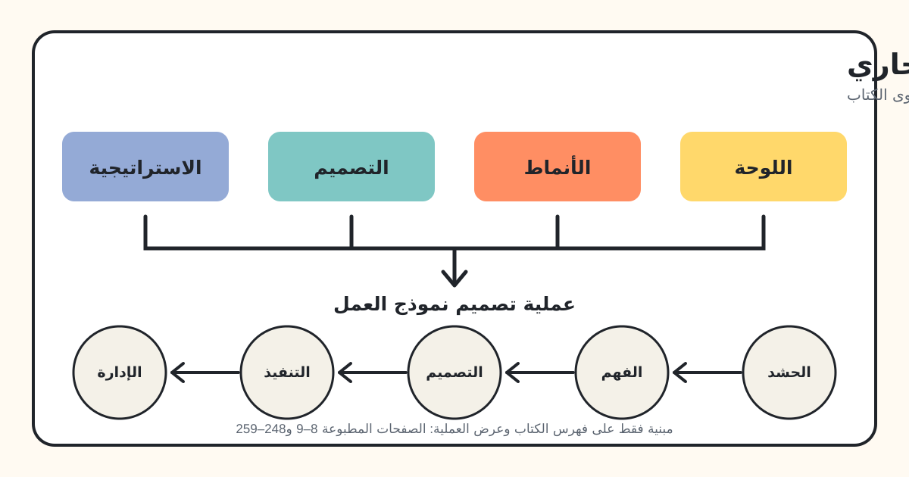

كتاب *Business Model Generation: A Handbook for Visionaries, Game Changers, and Challengers* كتبه Alexander Osterwalder وYves Pigneur، وصممه Alan Smith، وحرره وساهم فيه Tim Clark، وشارك في بنائه 470 ممارسًا من 45 دولة. الكتاب الصادر سنة 2010 دليل بصري لوصف نماذج العمل وتصميمها واختبارها وإدارتها. [صفحات عنوان الكتاب والمقدمة، PDF ص 1–15]

*الكتاب بيربط أجزاءه الأربعة الأساسية—اللوحة والأنماط والتصميم والاستراتيجية—بعملية من خمس مراحل لتطوير نموذج العمل وإدارته. [الصفحات المطبوعة 8–9 و248–259؛ PDF ص 14–15 و254–265]*

## 1. الفكرة الرئيسية وبناء الكتاب

الكتاب بيعرّف نموذج العمل بأنه المنطق اللي المنظمة من خلاله بتنشئ القيمة وتوصلها وتحصل عليها. الهدف هو توفير لغة مشتركة بسيطة بما يكفي للنقاش الجماعي، لكن من غير ما تختزل تعقيد عمل المؤسسة. المؤلفان بيشبّهوا النموذج بمخطط أساسي بيتنفذ من خلال الهياكل والعمليات والأنظمة. [الكتاب ص 14–15 / PDF ص 20–21]

المحتوى ماشي في تسلسل واضح:

1. **اللوحة (Canvas):** لغة واحدة لوصف نموذج العمل.
2. **الأنماط (Patterns):** تكوينات متكررة ظهرت في صناعات مختلفة.
3. **التصميم (Design):** تقنيات لصناعة بدائل والتواصل عنها.
4. **الاستراتيجية (Strategy):** طرق لفحص البيئة ونقاط القوة والتهديدات وابتكار القيمة وإدارة أكتر من نموذج.
5. **العملية (Process):** مسار عام من تجهيز المبادرة لحد الإدارة المستمرة للنموذج.

قسم Outlook بيطرح خمس مساحات للاستكشاف بعد كده، والـAfterword بيشرح إزاي الكتاب نفسه اتبنى بنموذج عمل مبتكر قائم على المشاركة. [الكتاب ص 8–9 / PDF ص 14–15]

## 2. لوحة نموذج العمل التجاري

الـCanvas بتحط تسعة مكونات على سطح واحد علشان الفريق يشوف كل جزء والعلاقات بين الأجزاء. الناحية اليمين بتركز على العميل والقيمة، والشمال على البنية التحتية والكفاءة، والإيرادات والتكاليف بيكملوا المنطق المالي. الكتاب بينصح بطباعة اللوحة بحجم كبير واستخدام ملاحظات قابلة للتحريك؛ لأن النقاش وتحريك الأفكار واستبدالها جزء من عملية الفهم نفسها. [الكتاب ص 42–45 و48–50 / PDF ص 48–51 و54–56]

*من الكتاب: “The Business Model Canvas”، الصفحة المطبوعة 44 / PDF ص 50. تم الاحتفاظ بالتسميات الإنجليزية الأصلية كما هي.*

### المكونات التسعة

| المكوّن | معناه في الكتاب | أهم الفروق والأسئلة |
|---|---|---|
| **شرائح العملاء (Customer Segments)** | مجموعات الأشخاص أو المؤسسات اللي الشركة بتختار توصل لها وتخدمها. | الشريحة بتختلف لما تحتاج عرضًا أو قناة أو علاقة مختلفة، أو يكون لها ربحية أو استعداد للدفع مختلف. الأنواع: سوق واسع، سوق متخصص، شرائح متمايزة، تنويع، وأسواق متعددة الأطراف. [الكتاب ص 20–21 / PDF ص 26–27] |
| **عروض القيمة (Value Propositions)** | حزمة المنتجات والخدمات اللي بتحل مشكلة عميل أو تلبي احتياجه. | القيمة ممكن تيجي من الجِدة أو الأداء أو التخصيص أو إنجاز مهمة أو التصميم أو المكانة أو السعر أو تقليل التكلفة والمخاطر أو الإتاحة أو سهولة الاستخدام. [الكتاب ص 22–25 / PDF ص 28–31] |
| **القنوات (Channels)** | نقاط التواصل والتوزيع والبيع المستخدمة للوصول للعملاء وتسليم القيمة. | القناة ممكن تدعم الوعي والتقييم والشراء والتسليم وخدمة ما بعد البيع. لازم النموذج يوازن بين القنوات المملوكة وقنوات الشركاء، والمباشرة وغير المباشرة. [الكتاب ص 26–27 / PDF ص 32–33] |
| **علاقات العملاء (Customer Relationships)** | نوع العلاقة اللي بتتبني مع كل شريحة. | الكتاب بيذكر المساعدة الشخصية، والمساعدة المخصصة، والخدمة الذاتية، والخدمات الآلية، والمجتمعات، والمشاركة في صناعة القيمة. العلاقة ممكن تستهدف الاكتساب أو الاحتفاظ أو زيادة المبيعات. [الكتاب ص 28–29 / PDF ص 34–35] |
| **تدفقات الإيرادات (Revenue Streams)** | النقد المتولد من كل شريحة قبل مقارنته بالتكاليف. | الإيراد ممكن يكون من معاملة واحدة أو متكررًا: بيع أصل، رسوم استخدام، اشتراك، إعارة/إيجار/تأجير، ترخيص، وساطة، أو إعلان. التسعير ممكن يكون ثابتًا أو ديناميكيًا. [الكتاب ص 30–33 / PDF ص 36–39] |
| **الموارد الرئيسية (Key Resources)** | أهم الأصول المطلوبة لتشغيل النموذج. | الموارد مادية أو فكرية أو بشرية أو مالية، وممكن تكون مملوكة أو مؤجرة أو متاحة من شريك. [الكتاب ص 34–35 / PDF ص 40–41] |
| **الأنشطة الرئيسية (Key Activities)** | أهم الأفعال المطلوبة علشان النموذج يشتغل. | الكتاب بيجمعها في الإنتاج، وحل المشكلات، وأنشطة المنصة/الشبكة. أهميتها بتتغير حسب النموذج. [الكتاب ص 36–37 / PDF ص 42–43] |
| **الشراكات الرئيسية (Key Partnerships)** | الموردون والشركاء اللي بيساعدوا النموذج يشتغل. | الأشكال الأربعة: تحالفات بين غير المنافسين، وتعاون بين منافسين، ومشروعات مشتركة، وعلاقات مشترٍ–مورد. الدوافع تشمل التحسين والحجم وتقليل المخاطر والحصول على موارد أو أنشطة. [الكتاب ص 38–39 / PDF ص 44–45] |
| **هيكل التكاليف (Cost Structure)** | كل تكاليف تشغيل النموذج. | النموذج ممكن يميل لمنطق قائم على خفض التكلفة أو لمنطق قائم على تعظيم القيمة. الخصائص تشمل التكاليف الثابتة والمتغيرة، واقتصاديات الحجم والنطاق. [الكتاب ص 40–41 / PDF ص 46–47] |

مثال Apple iPod/iTunes بيوضح ليه لازم نقرا المكونات كنظام واحد: تجربة متكاملة بين الجهاز والبرنامج والمتجر احتاجت اتفاقات مع شركات التسجيل، بينما معظم إيرادات الموسيقى كانت بتيجي من بيع الأجهزة مش من المتجر وحده. [الكتاب ص 47 / PDF ص 53]

## 3. خمسة أنماط متكررة لنماذج العمل

الكتاب بيستخدم كلمة Pattern علشان يوصف ترتيبات لها خصائص أو سلوك أو مكونات متشابهة. النمط مش إجابة كاملة؛ هو تكوين قابل لإعادة الاستخدام بيساعد الفريق يشوف احتمالات ويجمع أفكارًا. [الكتاب ص 52–53 / PDF ص 58–59]

### 3.1 التفكيك (Unbundling)

الشركة المفككة بتفصل بين ثلاثة أنواع أعمال ممكن اقتصادياتها ومنافستها وثقافتها تتعارض: **إدارة علاقة العميل**، و**ابتكار المنتج**، و**إدارة البنية التحتية**. نشاط العلاقة بيدور على توسيع الحصة من إنفاق العميل، والابتكار بيعتمد على السرعة والمواهب، والبنية التحتية تحتاج حجمًا كبيرًا ومعايير ثابتة واستخدامًا مرتفعًا. مثالا البنوك الخاصة وشركات الاتصالات بيوضحوا ليه جمع الأنواع دي تحت سقف واحد يعمل تنازلات، وليه الفصل أو الاستعانة بجهة خارجية يزود التركيز. [الكتاب ص 56–65 / PDF ص 62–71]

### 3.2 الذيل الطويل (The Long Tail)

النموذج ده بيبيع كميات قليلة نسبيًا من عدد ضخم من المنتجات المتخصصة. مجموع المبيعات الصغيرة ممكن يعادل أو يتجاوز كتالوجًا صغيرًا من المنتجات الأعلى مبيعًا. نجاحه محتاج تكلفة مخزون قليلة، ومنصة قوية، وطريقة رخيصة لتوصيل العرض المتخصص بالمشتري المهتم. الكتاب بيربط ظهوره بإتاحة أدوات الإنتاج، وإتاحة التوزيع، وانخفاض تكلفة البحث. Lulu.com مثال لأنه مكّن المؤلفين من النشر الذاتي والطباعة عند الطلب بدل اختيار الكتب المتوقع لها حد أدنى من المبيعات فقط. [الكتاب ص 66–75 / PDF ص 72–81]

### 3.3 المنصات متعددة الأطراف

المنصة متعددة الأطراف بتوصل مجموعتين أو أكتر من العملاء المختلفين لكن المعتمدين على بعض. القيمة بتيجي من تسهيل التفاعل بينهم، وبتزيد مع زيادة المستخدمين على الأطراف المختلفة. المشكلة المركزية هي “الفرخة والبيضة”: كل طرف ممكن يستنى الطرف التاني. علشان كده التسعير والدعم لطرف معين قرارات هيكلية. أمثلة Google ومنصات الألعاب وانتقال Apple من iPod إلى App Store بتعرض طرقًا مختلفة لجذب الأطراف، وتقديم قيمة مجانية لبعضها، وتحقيق إيراد من أطراف أخرى. [الكتاب ص 76–87 / PDF ص 82–93]

### 3.4 المجاني كنموذج عمل (FREE)

في النموذج المجاني، شريحة كبيرة بتحصل باستمرار على عرض من غير مقابل لأن جزءًا آخر من النموذج بيموله. الكتاب بيعرض ثلاثة منطق أساسية:

- **منصة إعلانية متعددة الأطراف:** محتوى أو خدمة مجانية تجذب جمهورًا يدفع المعلن للوصول له.
- **Freemium:** عدد كبير من المستخدمين المجانيين بتموله قاعدة أصغر من المستخدمين المدفوعين؛ تكلفة الخدمة الهامشية ومعدل التحويل للمدفوع عوامل أساسية.
- **الطُعم والخطاف (Bait and Hook):** عرض أول رخيص أو مجاني يقود لمشتريات متكررة لمنتج أو خدمة مرتبطة.

Flickr وRed Hat بيعرضوا أشكالًا مختلفة للـFreemium، وSkype جمع بين مكالمات برمجية مجانية ومكالمات مدفوعة للهواتف، وGillette بيوضح الرابط المحكم بين المنتج الأول الرخيص والمشتريات التالية الأعلى هامشًا. [الكتاب ص 88–107 / PDF ص 94–113]

### 3.5 نماذج العمل المفتوحة

النماذج المفتوحة بتتعاون بشكل منهجي مع شركاء من خارج المؤسسة. **Outside-in** بيدخل أفكارًا أو تقنية أو ملكية فكرية أو منتجات خارجية للمنظمة. **Inside-out** بيسمح للآخرين باستخدام أفكار أو أصول داخلية غير مستغلة، مثلًا بالترخيص أو المشروعات المشتركة أو الفصل كشركة. جسور P&G في Connect & Develop، ومجمع براءات GlaxoSmithKline، ومنصة الباحثين عن حلول ومقدميها في InnoCentive بيعرضوا أشكالًا مختلفة لعبور المعرفة حدود المؤسسة. [الكتاب ص 108–117 / PDF ص 114–123]

ملخص الأنماط بيأكد إن الأنماط ممكن تتداخل. InnoCentive آلية ابتكار مفتوح ومنصة متعددة الأطراف في الوقت نفسه، والعرض المجاني غالبًا بيحتاج اقتصاديات منصة أو Freemium. الـCanvas بتكشف المكونات اللي بتخلي كل نمط قابلًا للعمل. [الكتاب ص 118–119 / PDF ص 124–125]

## 4. ست تقنيات للتصميم

قسم التصميم بيتعامل مع صناعة نموذج العمل كعملية استكشاف. الفريق بيخلي الأفكار ملموسة، ويستكشف بدائل متعددة، ويؤجل الالتزام شوية لحد ما يتعلم من تكوينات مختلفة. [الكتاب ص 124–125 / PDF ص 130–131]

### 4.1 فهم العميل

التصميم لازم يشمل منظور العميل، مش بس سؤال الشركة: «نقدر نبيع إيه؟». الكتاب بيطلب فهم بيئة العميل وروتينه ومخاوفه وطموحاته، بما فيها العملاء على أطراف السوق الحالي. خريطة التعاطف بتسأل: العميل شايف إيه، سامع إيه، بيفكر ويحس بإيه، بيقول ويعمل إيه، وإيه ألمه ومكاسبه. الملف ده لازم يوجّه عرض القيمة والقنوات والعلاقات والاستعداد للدفع. [الكتاب ص 126–133 / PDF ص 132–139]

*من الكتاب: خريطة التعاطف مع العميل، ومذكور في الكتاب إنها مقتبسة من XPLANE، الصفحة المطبوعة 130 / PDF ص 136. تم الاحتفاظ بالنص الأصلي داخل الرسم.*

### 4.2 توليد الأفكار (Ideation)

الـIdeation فيها حركتان: توليد أكبر عدد من الاحتمالات، ثم تركيبها وتقليلها. البداية ممكن تكون من الموارد أو العرض أو العميل أو التمويل أو أكتر من مركز مع بعض؛ والتغيير في مكوّن غالبًا بيأثر على مكونات أخرى. أسئلة “ماذا لو؟” بتتحدى افتراضات الصناعة. عملية الكتاب من خمس خطوات: تكوين الفريق، والانغماس، والتوسّع، واختيار المعايير، وبناء النماذج الأولية. القواعد تشمل تنوع الفريق، وتأجيل الحكم، ومحادثة واحدة في كل لحظة، والكم، والتفكير البصري، وتشجيع الأفكار الجريئة. [الكتاب ص 134–145 / PDF ص 140–151]

### 4.3 التفكير البصري

الرسومات والمخططات والملاحظات القابلة للتحريك بتحوّل الافتراضات لمعلومات ظاهرة. الـCanvas بتشتغل كلغة بصرية لها مفردات وقواعد: بتحدد نوع المعلومة ومكانها. الشغل البصري بيساعد الفريق يشوف الصورة كاملة والعلاقات، ويبني فهمًا مشتركًا ونقطة مرجعية ثابتة، ويستكشف تغييرات، ويتواصل داخليًا وخارجيًا. الكتاب بينصح بفكرة واحدة على كل ورقة وكلمات قليلة وقلم عريض، وبيعتبر النقاش المؤدي للصورة النهائية مهمًا زي الصورة نفسها. [الكتاب ص 146–159 / PDF ص 152–165]

### 4.4 النماذج الأولية (Prototyping)

Prototype نموذج العمل أداة تفكير، مش وعدًا مبكرًا بالحل النهائي. ممكن يبدأ برسم على منديل، ثم Canvas مفصلة، ثم Business Case مالي، ثم اختبار ميداني. بناء نماذج متعددة بيكشف الهيكل والعلاقات والافتراضات والنتائج. “عقلية التصميم” تقبل الأفكار الخام وتتخلص منها بسرعة وتستكشف بدائل وتتحمل عدم اليقين لحد ما الاتجاه ينضج. [الكتاب ص 160–169 / PDF ص 166–175]

### 4.5 السرد القصصي

القصة بتخلي النموذج غير المألوف ملموسًا، وممكن تقدم فكرة أو تشرك الموظفين أو تجهّز لنقاش مع مستثمر. ممكن موظف يشرح النموذج من داخل المؤسسة، أو عميل يعرض المهمة والمشكلة والقيمة اللي بياخدها واستعداده للدفع. المؤلفان بينصحوا بقصة بسيطة لها بطل واحد وصيغة مناسبة للجمهور: كلام وصورة، فيديو، لعب أدوار، نص وصورة، أو شريط مصور. [الكتاب ص 170–179 / PDF ص 176–185]

### 4.6 السيناريوهات

الكتاب بيستخدم نوعين. **سيناريوهات العملاء** بتوصف سياقًا وسلوكًا ورغبات ومخاوف محددة لاختبار القنوات والعلاقات وعروض القيمة والإيرادات. **سيناريوهات بيئة المستقبل** مش بتتنبأ بمستقبل واحد؛ بتبني عدة سياقات ممكنة وتسأل أي نموذج ينجح في كل واحد. التقنية بتخلي الافتراضات قابلة للنقاش وتجهّز الفريق للتكيّف. [الكتاب ص 180–189 / PDF ص 186–195]

## 5. الاستراتيجية من خلال نموذج العمل

### 5.1 ارسم خريطة البيئة

النموذج بيشتغل داخل “مساحة تصميم” متغيرة. الكتاب بيجمع القوى الخارجية في أربع مناطق:

- **قوى السوق:** القضايا والشرائح والاحتياجات والطلب وتكلفة الانتقال وجاذبية الإيراد.
- **قوى الصناعة:** المنافسون الحاليون والداخلون الجدد والبدائل والموردون وأطراف سلسلة القيمة وأصحاب المصلحة.
- **الاتجاهات الرئيسية:** التقنية والتنظيم والمجتمع والثقافة والاتجاهات الاجتماعية الاقتصادية.
- **قوى الاقتصاد الكلي:** الظروف العالمية وأسواق رأس المال والموارد والبنية الاقتصادية.

الغرض مش إن البيئة تفرض التصميم، لكن إن الفريق يعرف المحركات والقيود ويتخذ قرارات واعية—وأحيانًا يصمم نموذجًا يغير البيئة نفسها. [الكتاب ص 200–211 / PDF ص 206–217]

### 5.2 قيّم النموذج

التقييم المنتظم بيكشف هل النموذج محتاج تحسينات تدريجية ولا إعادة تصميم أعمق. الكتاب بيجمع الـCanvas مع SWOT علشان يراجع نقاط القوة والضعف والفرص والتهديدات للنموذج كله ولكل مكوّن. القوائم بتفحص توافق العرض مع احتياج العميل، وجودة الهوامش والإيراد، وصعوبة تقليد الموارد والأنشطة، والاعتماد على الشركاء، وأداء القنوات والعلاقات، والتهديدات والفرص الخارجية. لازم التحليل يتحرك بين المكوّن والصورة الكلية لأن ضعف جزء ممكن يأثر على أجزاء تانية. [الكتاب ص 212–225 / PDF ص 218–231]

### 5.3 ادمج الـCanvas مع Blue Ocean Strategy

الكتاب بيربط الـCanvas بإطار الأفعال الأربعة: إيه اللي **يتلغى**، أو **يتخفض**، أو **يزيد**، أو **يتعمل من جديد**. الهدف هو ابتكار القيمة: زيادة قيمة العميل مع خفض التكاليف بدل قبول إن التميّز والتكلفة الأقل ضد بعض دائمًا. لأن الـCanvas بتظهر ناحية العميل والقيمة وناحية البنية والتكلفة، الفريق يقدر يتتبع أثر تغيير العرض أو الشريحة على الأنشطة والموارد والشركاء والتكاليف. Cirque du Soleil وNintendo Wii هما مثالا الكتاب. [الكتاب ص 226–231 / PDF ص 232–237]

### 5.4 أدر أكثر من نموذج عمل

المؤسسة القائمة لما تقدم نموذجًا جديدًا لازم تحدد درجة دمجه مع النموذج الحالي. التشابه بين المكونات التسعة، وفرص التكامل، والتعارضات المحتملة، والمخاطر بتأثر على الاختيار بين الاستقلال والدمج. Swatch يعرض استقلال قرارات المنتج والتسويق مع مشاركة قدرات مركزية؛ Nespresso يعرض تنظيمًا منفصلًا بعملاء وقنوات وعمليات مختلفة؛ وcar2go يعرض تجربة مرحلية قبل تقرير الشكل التنظيمي. الكتاب كمان بيقول إن قرار الدمج أو الفصل ممكن يتغير مع الوقت. [الكتاب ص 232–239 / PDF ص 238–245]

## 6. عملية تصميم نموذج العمل في خمس مراحل

العملية قابلة للتعديل وتكرارية ومش خطية غالبًا. الفهم والتصميم بيتداخلوا: Prototype مبكر ممكن يكشف حاجة لبحث جديد، والدليل الجديد يغير التصميم. الكتاب بيحدد أربع غايات عامة للابتكار—تلبية احتياج غير مجاب، أو تقديم تقنية/منتج/خدمة للسوق، أو تحسين/تعطيل سوق قائم، أو إنشاء سوق جديد—وبعدين ينظم الشغل في خمس مراحل. [الكتاب ص 244–249 / PDF ص 250–255]

| المرحلة | الهدف والتركيز | الأنشطة وعوامل النجاح والمخاطر |
|---|---|---|
| **الحشد (Mobilize)** | تجهيز المبادرة وإعداد المسرح. | صياغة الهدف، واختبار أفكار أولية، والتخطيط، وتجميع فريق متنوع، واستخدام الـCanvas كلغة مشتركة، وتأمين راعٍ واضح. تجنب المبالغة في قيمة الفكرة الأولى وأدر المصالح المتأثرة. [الكتاب ص 250–251 / PDF ص 256–257] |
| **الفهم (Understand)** | البحث وتحليل مساحة التصميم. | دراسة العملاء والبيئة والتقنية والمنافسين والمحاولات السابقة والخبراء. تجنب البحث المنحاز أو الزائد و“شلل التحليل”، وابدأ Prototype مبكرًا لكشف الفجوات. [الكتاب ص 252–253 / PDF ص 258–259] |
| **التصميم (Design)** | توليد واختبار ومقارنة واختيار بدائل قابلة للعمل. | Brainstorm وPrototype واختبار واختيار. شارك وظائف ومستويات مختلفة، واحمِ الأفكار الجريئة من التخفيف، وجرب أنماطًا وإيرادات مختلفة، وماتتعلقش بفكرة بسرعة. [الكتاب ص 254–255 / PDF ص 260–261] |
| **التنفيذ (Implement)** | وضع النموذج المختار في السوق. | حوّل النموذج لمشروعات ومحطات وهياكل قانونية وميزانية وخريطة طريق. تواصل وأشرك الناس ونفّذ وراقب عدم اليقين واستجب بسرعة، وحدد علاقة النموذج الجديد بالقديم. [الكتاب ص 256–257 / PDF ص 262–263] |
| **الإدارة (Manage)** | تطوير النموذج حسب الدليل وتغير البيئة. | راقب البيئة وقيّم باستمرار وجدّد أو أعد التفكير، وأدر محفظة نماذج والتكاملات والتعارضات بينها. الخطر الرئيسي هو الوقوع ضحية للنجاح السابق. [الكتاب ص 258–259 / PDF ص 264–265] |

## 7. قسم Outlook: خمس اتجاهات بعد المنهج الأساسي

القسم مختصر ومقصود به فتح مجالات للتوسع:

1. **نماذج تتجاوز الربح:** الـCanvas تنفع للقطاع العام وغير الربحي والمشروعات الاجتماعية. الكتاب بيفرّق بين نموذج يموله طرف ثالث، ونموذج Triple Bottom Line يحسب النتائج المالية والاجتماعية والبيئية. [الكتاب ص 263–265 / PDF ص 269–271]
2. **التصميم بمساعدة الكمبيوتر:** الأدوات الرقمية تقدر تخزن وتقارن وتعدّل وتحاكي النماذج وتسمح بتعاون عن بُعد، بينما الورق يفضل قويًا في الاستكشاف البديهي داخل الورش. [الكتاب ص 266–267 / PDF ص 272–273]
3. **خطط العمل:** شغل الـCanvas يقدر يغذي خطة تشمل الفريق والنموذج والتحليل المالي والبيئة وخريطة التنفيذ والمخاطر. [الكتاب ص 268–269 / PDF ص 274–275]
4. **التنفيذ داخل المؤسسة:** نموذج العمل لازم يتوافق مع الاستراتيجية والهيكل والعمليات والمكافآت والأشخاص. [الكتاب ص 270–271 / PDF ص 276–277]
5. **مواءمة العمل مع IT:** الـCanvas توجه منظور العمل، ثم يتوافق مع التطبيقات والمعلومات والبنية التقنية والمعمارية والأمان والمهارات. [الكتاب ص 272–273 / PDF ص 278–279]

## 8. نموذج عمل الكتاب نفسه

الـAfterword بيطبق المنهج على الكتاب. Osterwalder وPigneur ما بدأوش بعملية نشر تقليدية يقودها ناشر؛ أطلقوا Hub أونلاين، وفرضوا رسوم عضوية، وشاركوا محتوى غير مكتمل، وجمعوا Feedback، ومولوا جزءًا من الإنتاج بالمبيعات المسبقة ورسوم المشاركين. الفريق كرر المحتوى والتصميم والنماذج مع المجتمع، ثم استخدم قنوات مباشرة وغير مباشرة للكتاب النهائي. الـCanvas الأخيرة بتحدد القراء والمشاركين والشركات اللي عايزة نسخًا مخصصة كشرائح عملاء، ودليلًا بصريًا عمليًا كعرض قيمة، ومجتمعًا ومشاركة وإنتاجًا خارجيًا ومصادر إيراد متعددة كمكونات مترابطة. [الكتاب ص 274–280 / PDF ص 280–286]

القسم ده بيرجع للفكرة الرئيسية: نموذج العمل مش معادلة إيراد أو وصف منتج فقط. هو نظام مترابط فيه العرض والعملاء والعلاقات والقنوات والأنشطة والموارد والشركاء والإيرادات والتكاليف بيدعموا بعض. [الكتاب ص 280 / PDF ص 286]

## 9. تمارين من الكتاب

الأنشطة التالية **مختصرة بأمانة** من المصدر المرفق. مش تمارين جديدة، والكتاب ما بيقدمش نموذج إجابة واحدًا لها.

### تمرين 1: خريطة التعاطف مع العميل

اعمل Brainstorm لشرائح العملاء الممكنة، واختار ثلاثة مرشحين ثم واحدًا للتمرين. ادّيه اسمًا وخصائص ديموغرافية مناسبة. ابنِ ملفه بالإجابة عن: شايف إيه، سامع إيه، بيفكر ويحس بإيه، بيقول ويعمل إيه، إيه ألمه، وإيه المكسب اللي بيدور عليه. استخدم الملف لمراجعة عرض القيمة والقنوات والعلاقات والاستعداد للدفع. **المصدر لا يقدم إجابة.** [الكتاب ص 130–133 / PDF ص 136–139]

### تمرين 2: البقرة السخيفة

اكتب خصائص البقرة، وبعدها في ثلاث دقائق ارسم ثلاثة نماذج عمل مختلفة تستخدم الخصائص دي. الهدف هو إخراج الفريق من الافتراضات اليومية قبل توليد الأفكار. الكتاب بينبه إن سخافة التمرين المتعمدة ممكن ماتناسبش بعض المجموعات. **المصدر لا يقدم إجابة.** [الكتاب ص 145 / PDF ص 151]

### تمرين 3: السرد البصري

ارسم نموذجًا بسيطًا، وكل عنصر في ملاحظة منفصلة؛ استبدل كل نص برسم بسيط؛ حدد ترتيب ظهور الرسومات؛ وبعدها احكِ قصة النموذج صورة وراء صورة. **المصدر لا يقدم إجابة.** [الكتاب ص 159 / PDF ص 165]

### تمرين 4: Prototype لنموذج شركة استشارات

باستخدام حالة John، مؤسس شركة استشارات استراتيجية فيها 210 موظفين، حدد خمس مشكلات كبيرة للعميل بخريطة التعاطف، وولّد بدائل كثيرة، واختار أفضل خمس أفكار، ثم طوّر أكتر ثلاثة أفكار مختلفة كنماذج Canvas مع المزايا والعيوب. **المصدر لا يقدم إجابة.** [الكتاب ص 169 / PDF ص 175]

### تمرين 5: قصة SuperToast

استخدم Canvas شركة SuperToast ذات الصور التسع الموجودة في الكتاب وابنِ قصة. أعد القصة من نقاط بداية مختلفة ولاحظ إزاي البداية بتغير التركيز. **المصدر لا يقدم إجابة.** [الكتاب ص 179 / PDF ص 185]

### تمرين 6: ورشة سيناريوهات مستقبلية

طوّر من سيناريوهين لأربعة اعتمادًا على معيارين أساسيين على الأقل. سمِّ كل سيناريو واكتب له قصة قصيرة محددة. في ورشة، صمم نموذج عمل مناسبًا أو أكتر لكل سيناريو واشرح ليه مناسب له. **المصدر لا يقدم إجابة.** [الكتاب ص 189 / PDF ص 195]

### تمرين 7: SWOT مبني على الـCanvas

قيّم النموذج كله وكل مكوّن من أربع زوايا: القوة والضعف والفرص والتهديدات. استخدم العبارات والأسئلة المتقابلة في الكتاب، وسجّل درجة الثقة والأهمية، وبعدها حوّل النتيجة لنماذج مستقبلية محتملة بدل ما تتوقف عند التشخيص. **المصدر لا يقدم إجابة.** [الكتاب ص 216–225 / PDF ص 222–231]

## 10. الخلاصة المركزة

من غير إضافة إطار جديد، طريقة الكتاب هي: خلّي المنطق الحالي ظاهرًا بالـCanvas؛ اتعلم من الأنماط من غير نسخ أعمى؛ افهم العميل والبيئة؛ ولّد واعمل Prototype لبدائل متعددة؛ تواصل عنها بصريًا وبالقصص؛ قيّم النظام كله؛ نفّذ نموذجًا مع إدارة عدم اليقين؛ واستمر في تعديله مع تغير البيئة. [الكتاب ص 14–15 و246–259 / PDF ص 20–21 و252–265]

