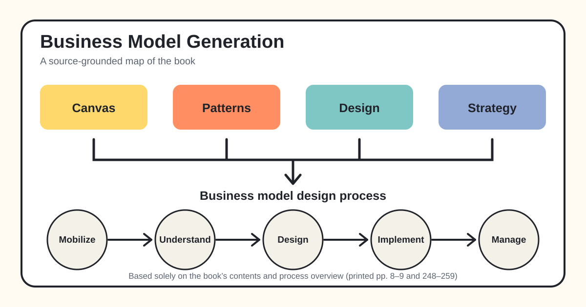
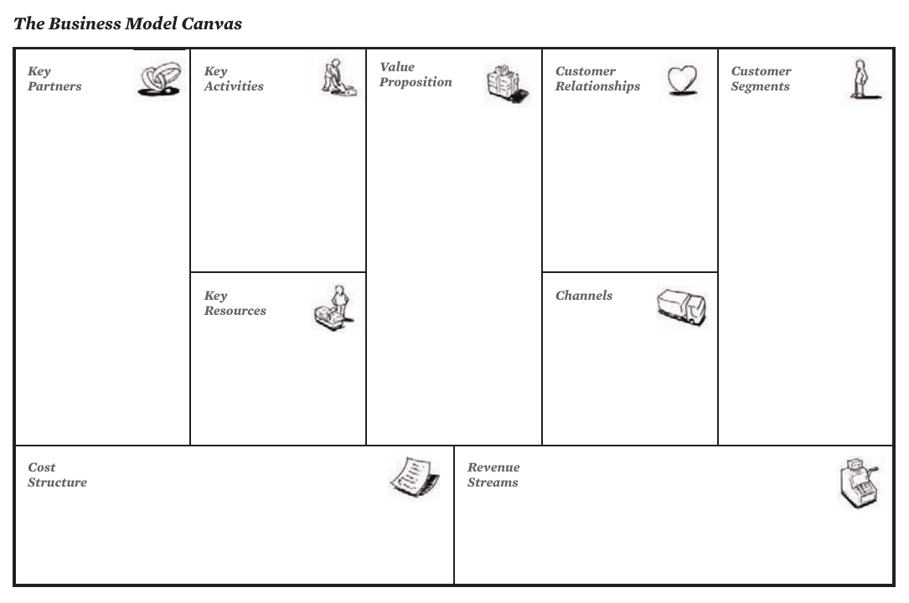
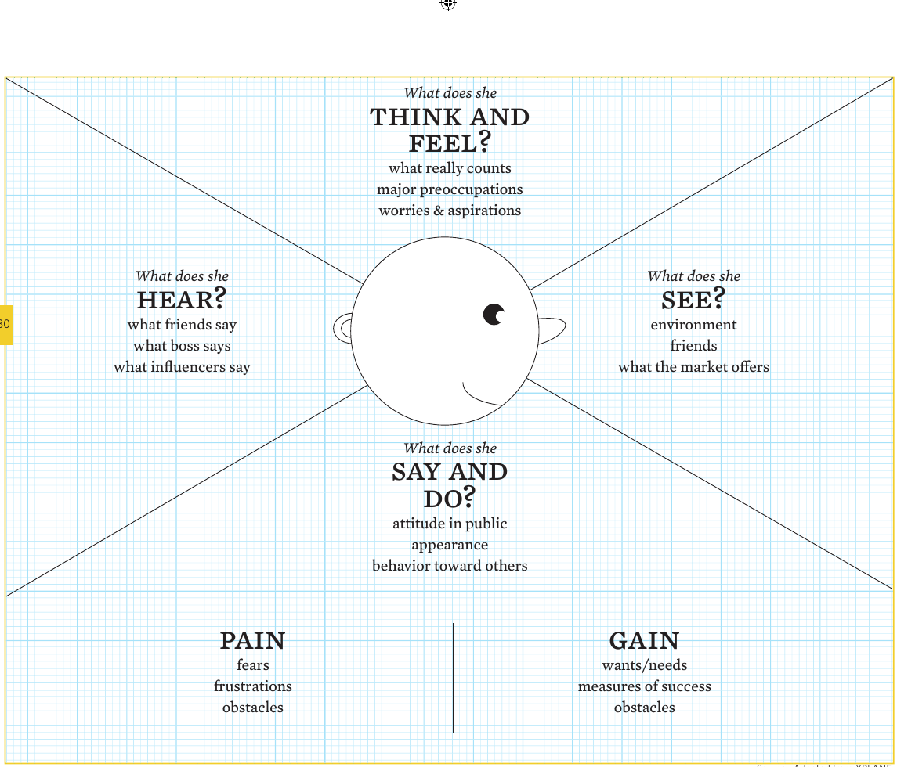

*Business Model Generation: A Handbook for Visionaries, Game Changers, and Challengers* was written by Alexander Osterwalder and Yves Pigneur, designed by Alan Smith, edited with contributions from Tim Clark, and co-created with 470 practitioners from 45 countries. The 2010 book is a visual handbook for describing, designing, testing, and managing business models. [Book title pages and opening, PDF pp. 1–15]

*The book connects its four main bodies of material—Canvas, patterns, design, and strategy—to a five-phase process for developing and managing a business model. [Printed pp. 8–9 and 248–259; PDF pp. 14–15 and 254–265]*

## 1. The book's central argument and structure

The book defines a business model as the rationale by which an organization creates, delivers, and captures value. Its aim is to provide a shared language that is simple enough for group discussion while still representing how an enterprise works as a connected system. The authors describe the model as a blueprint whose logic is implemented through structures, processes, and systems. [Book pp. 14–15 / PDF pp. 20–21]

The material is organized as a progression:

1. **Canvas:** one common language for describing a business model.
2. **Patterns:** recurring configurations seen across industries.
3. **Design:** techniques for creating and communicating alternatives.
4. **Strategy:** ways to examine environment, strengths, threats, value innovation, and multiple models.
5. **Process:** a generic path from preparing an initiative through continuously managing the resulting model.

The Outlook then raises five areas for further work, and the Afterword explains how the book itself was created with an innovative, co-created business model. [Book pp. 8–9 / PDF pp. 14–15]

## 2. The Business Model Canvas

The Canvas puts nine building blocks on one surface so a team can see both the individual pieces and their interdependence. The right side emphasizes customers and value; the left side emphasizes infrastructure and efficiency; revenue and cost complete the financial logic. The authors recommend a large printed Canvas with movable notes because the discussion, movement, and replacement of ideas are part of the learning process. [Book pp. 42–45, 48–50 / PDF pp. 48–51, 54–56]

*From the book: “The Business Model Canvas,” printed p. 44 / PDF p. 50.*

### The nine building blocks

| Building block | Meaning in the book | Main distinctions and questions |
|---|---|---|
| **Customer Segments** | The groups of people or organizations the enterprise chooses to reach and serve. | Segments differ when they need a distinct offer, channel, relationship, profitability profile, or willingness to pay. The book distinguishes mass, niche, segmented, diversified, and multi-sided markets. [Book pp. 20–21 / PDF pp. 26–27] |
| **Value Propositions** | The bundle of products and services that solves a customer problem or satisfies a need. | Value may come from newness, performance, customization, completing a job, design, brand/status, price, cost or risk reduction, accessibility, or convenience. Ask what value is delivered, which problem is solved, and which need is satisfied. [Book pp. 22–25 / PDF pp. 28–31] |
| **Channels** | The communication, distribution, and sales touchpoints used to reach customers and deliver value. | A channel may support awareness, evaluation, purchase, delivery, and after-sales. The model must balance owned versus partner and direct versus indirect channels. [Book pp. 26–27 / PDF pp. 32–33] |
| **Customer Relationships** | The relationship type established with each segment. | The book lists personal assistance, dedicated assistance, self-service, automated services, communities, and co-creation. Relationships may support acquisition, retention, or increased sales. [Book pp. 28–29 / PDF pp. 34–35] |
| **Revenue Streams** | The cash generated from each segment after costs are subtracted from revenues. | Revenues can be transactional or recurring and can come from asset sales, usage fees, subscriptions, lending/renting/leasing, licensing, brokerage, or advertising. Pricing can be fixed or dynamic. [Book pp. 30–33 / PDF pp. 36–39] |
| **Key Resources** | The most important assets required to make the model work. | Resources may be physical, intellectual, human, or financial, and may be owned, leased, or acquired from partners. [Book pp. 34–35 / PDF pp. 40–41] |
| **Key Activities** | The most important actions required to deliver the model. | The book groups them as production, problem solving, and platform/network activities. Their importance changes with the model: software development, supply-chain management, and consulting problem solving are different examples. [Book pp. 36–37 / PDF pp. 42–43] |
| **Key Partnerships** | The suppliers and partners that help the model operate. | The four forms are alliances between non-competitors, coopetition, joint ventures, and buyer–supplier relationships. Motivations include optimization/scale, risk reduction, and acquiring resources or activities. [Book pp. 38–39 / PDF pp. 44–45] |
| **Cost Structure** | All costs incurred in operating the model. | Models can lean toward cost-driven or value-driven logic. Important characteristics include fixed and variable costs, economies of scale, and economies of scope. [Book pp. 40–41 / PDF pp. 46–47] |

The Apple iPod/iTunes example shows why the blocks must be read as a system: a seamless device–software–store offer depended on record-company agreements and an integrated customer experience, while most music-related revenue came from device sales rather than the store alone. [Book p. 47 / PDF p. 53]

## 3. Five recurring business model patterns

The book uses “patterns” to describe arrangements with similar characteristics, behaviors, or building blocks. A pattern is not a complete answer; it is a reusable configuration that can help a team recognize possibilities and combine ideas. [Book pp. 52–53 / PDF pp. 58–59]

### 3.1 Unbundling

An unbundled corporation separates three business types whose economics, competition, and cultures can conflict: **customer relationship**, **product innovation**, and **infrastructure management**. Relationship businesses pursue scope and customer share; product innovation businesses depend on speed and talent; infrastructure businesses require scale, standardization, and high utilization. The private-banking and mobile-telecom examples show why holding all three under one roof can create trade-offs, and why outsourcing or separation can sharpen focus. [Book pp. 56–65 / PDF pp. 62–71]

### 3.2 The Long Tail

Long Tail models sell relatively small quantities of a very large number of niche products. The aggregate of many infrequent sales can rival or exceed a small catalog of high-volume hits. The pattern depends on low inventory costs, an effective platform, and inexpensive ways to connect niche supply with interested buyers. The book attributes the pattern's rise to democratized production, democratized distribution, and lower search costs. Lulu.com illustrates it by enabling authors to self-publish through print-on-demand, avoiding the traditional publisher's need to select only titles expected to reach a minimum sales volume. [Book pp. 66–75 / PDF pp. 72–81]

### 3.3 Multi-sided platforms

A multi-sided platform connects two or more distinct but interdependent customer groups. It creates value by facilitating their interactions, and its value grows as it attracts users on the different sides. The central challenge is the “chicken and egg” problem: each side may wait for the other. Pricing and subsidies therefore become structural design decisions. Google, game consoles, and Apple's move from iPod to App Store demonstrate different ways to attract sides, subsidize some users, and earn from others. [Book pp. 76–87 / PDF pp. 82–93]

### 3.4 FREE as a business model

In a FREE model, at least one substantial segment continuously receives an offer at no charge because another part of the model pays. The book presents three main logics:

- **Advertising-supported multi-sided platform:** free content or service attracts an audience that advertisers pay to reach.
- **Freemium:** many free basic users are subsidized by a smaller number of premium users; low marginal service cost and conversion economics are critical.
- **Bait and hook:** a cheap or free initial offer drives repeated purchases of a linked follow-up product or service.

Flickr and Red Hat illustrate freemium variants, Skype combines free software-based calling with paid calls to phones, and Gillette illustrates the tight link between an inexpensive initial product and higher-margin follow-up purchases. [Book pp. 88–107 / PDF pp. 94–113]

### 3.5 Open business models

Open models systematically collaborate with outside partners. **Outside-in** innovation brings external ideas, technology, intellectual property, or products into an organization's work. **Inside-out** innovation allows others to use internal ideas or assets that would otherwise remain idle, often through licensing, joint ventures, or spin-offs. P&G's Connect & Develop bridges, GlaxoSmithKline's patent pools, and InnoCentive's seeker–solver platform show different ways knowledge crosses organizational boundaries. [Book pp. 108–117 / PDF pp. 114–123]

The pattern overview emphasizes that patterns may overlap. InnoCentive is both an open-innovation mechanism and a multi-sided platform; a free offer often uses multi-sided or freemium economics. The Canvas helps expose which blocks make each pattern viable. [Book pp. 118–119 / PDF pp. 124–125]

## 4. Six design techniques

The Design section treats business model creation as inquiry. Teams make ideas tangible, explore several alternatives, and delay commitment long enough to learn from different configurations. [Book pp. 124–125 / PDF pp. 130–131]

### 4.1 Customer insights

Business model design should include the customer's perspective, not merely ask what the organization can sell. The book argues for understanding a customer's environment, routines, concerns, and aspirations, including customers at the edge of the current market. The Empathy Map asks what the customer sees, hears, thinks and feels, says and does, and what causes pain or gain. This profile should inform Value Propositions, Channels, Relationships, and willingness to pay. [Book pp. 126–133 / PDF pp. 132–139]

*From the book: customer Empathy Map, adapted there from XPLANE, printed p. 130 / PDF p. 136.*

### 4.2 Ideation

Ideation has two broad movements: generate many possibilities, then synthesize and narrow them. Ideas may start from resources, the offer, customers, finance, or several epicenters together; a change beginning in one block usually affects others. “What if” questions deliberately challenge industry assumptions. The book's five-step approach is team composition, immersion, expansion, criteria selection, and prototyping. It asks for a diverse team, delayed judgment, one conversation at a time, quantity, visual expression, and room for wild ideas. [Book pp. 134–145 / PDF pp. 140–151]

### 4.3 Visual thinking

Sketches, diagrams, and movable notes turn assumptions into visible information. The Canvas acts as a visual grammar: it identifies what information belongs in the model and where. Visual work helps teams see the whole model, recognize relationships, form a joint understanding, create a persistent reference point, explore changes, and communicate internally or externally. The book recommends one idea per note, few words, and thick markers; it also stresses that the discussion leading to the final picture is as important as the picture. [Book pp. 146–159 / PDF pp. 152–165]

### 4.4 Prototyping

A business model prototype is a thinking tool rather than an early promise of the final solution. It may range from a napkin sketch, to an elaborated Canvas, to a financial business case, to a field test. Multiple prototypes expose structure, relationships, assumptions, and consequences. The “design attitude” accepts crude ideas, discards them quickly, explores alternatives, and keeps uncertainty open until a direction matures. [Book pp. 160–169 / PDF pp. 166–175]

### 4.5 Storytelling

Stories make an unfamiliar model tangible and can help introduce an idea, engage employees, or prepare an investor discussion. A story can use an employee to explain the model from inside the organization or a customer to show a job, problem, received value, and willingness to pay. The authors recommend a simple story with one protagonist and a format suited to the audience: talk and image, video, role play, text and image, or comic strip. [Book pp. 170–179 / PDF pp. 176–185]

### 4.6 Scenarios

The book uses two scenario types. **Customer scenarios** describe concrete contexts, behaviors, desires, and concerns to test Channels, Relationships, Value Propositions, and Revenue Streams. **Future-environment scenarios** do not predict one future; they construct several possible contexts and ask which model would work in each. The technique makes assumptions discussable and prepares teams to adapt. [Book pp. 180–189 / PDF pp. 186–195]

## 5. Strategy through the business model lens

### 5.1 Map the environment

A model operates inside a changing “design space.” The book groups external forces into four areas:

- **Market forces:** issues, segments, needs and demand, switching costs, and revenue attractiveness.
- **Industry forces:** incumbents, new entrants, substitutes, suppliers/value-chain actors, and stakeholders.
- **Key trends:** technology, regulation, society and culture, and socioeconomic trends.
- **Macroeconomic forces:** global conditions, capital markets, commodities/resources, and economic infrastructure.

The purpose is not to let the environment dictate the design, but to recognize drivers and constraints so the team makes informed choices—and, in some cases, designs a model that reshapes the environment. [Book pp. 200–211 / PDF pp. 206–217]

### 5.2 Evaluate the model

Regular assessment can reveal whether a model needs incremental improvement or a deeper redesign. The book combines the Canvas with SWOT so strengths, weaknesses, opportunities, and threats can be considered both for the whole model and for every block. Its checklists examine alignment with customer needs, margins and revenue quality, resource and activity defensibility, partner dependence, channel performance, relationships, and external threats or opportunities. The point is to move between individual blocks and the model's overall integrity because weakness in one block can affect several others. [Book pp. 212–225 / PDF pp. 218–231]

### 5.3 Combine the Canvas with Blue Ocean Strategy

The book pairs the Canvas with the Four Actions Framework: what to **eliminate**, **reduce**, **raise**, and **create**. The goal is value innovation—raising customer value while reducing costs, rather than accepting a fixed trade-off between differentiation and lower cost. Because the Canvas shows both the customer/value side and the infrastructure/cost side, a team can trace how changing an offer or segment changes activities, resources, partners, and costs. Cirque du Soleil and Nintendo Wii illustrate this whole-model view. [Book pp. 226–231 / PDF pp. 232–237]

### 5.4 Manage multiple business models

An established organization introducing a new model must decide how much to integrate it with the existing one. Similarity among the nine blocks, potential synergies, potential conflicts, and risk influence the choice between autonomy and integration. Swatch shows a model with autonomous product and marketing decisions but shared centralized capabilities; Nespresso shows a separately organized model with distinct customers, channels, and operations; car2go shows a phased experiment before deciding the final organizational form. The book notes that integration and separation choices may change over time. [Book pp. 232–239 / PDF pp. 238–245]

## 6. The five-phase business model design process

The process is adaptable, iterative, and rarely linear. Understanding and Design often overlap: early prototypes reveal research needs, and new evidence changes prototypes. The book identifies four broad innovation objectives—satisfy an unanswered need, bring something to market, improve or disrupt an existing market, or create a new market—and then uses five phases to organize the work. [Book pp. 244–249 / PDF pp. 250–255]

| Phase | Objective and focus | Main activities, success factors, and dangers |
|---|---|---|
| **Mobilize** | Prepare the initiative and set the stage. | Frame objectives, test preliminary ideas, plan, assemble a diverse team, establish the Canvas as a shared language, and secure visible sponsorship. Avoid overvaluing the initial idea and manage vested interests. [Book pp. 250–251 / PDF pp. 256–257] |
| **Understand** | Research and analyze the design space through immersion. | Study customers, the environment, technologies, competitors, earlier attempts, experts, ideas, and opinions. Avoid biased over-research and “analysis paralysis”; prototype early to expose gaps. [Book pp. 252–253 / PDF pp. 258–259] |
| **Design** | Generate, test, compare, and select viable options through inquiry. | Brainstorm, prototype, test, and select. Co-create across the organization, protect bold ideas from being diluted, explore several patterns and revenue logics, and avoid falling in love with one option too early. [Book pp. 254–255 / PDF pp. 260–261] |
| **Implement** | Put the selected prototype into the field. | Translate the model into projects, milestones, legal structures, budgets, and a roadmap. Communicate, involve people, execute, monitor uncertainty, respond quickly, sustain sponsorship, and decide how the new and old models should relate. [Book pp. 256–257 / PDF pp. 262–263] |
| **Manage** | Evolve the model in response to evidence and environmental change. | Continuously scan, assess, rejuvenate or rethink, govern a portfolio of models, and manage synergies and conflicts. The central danger is becoming trapped by past success. [Book pp. 258–259 / PDF pp. 264–265] |

## 7. The Outlook: five directions beyond the core method

The Outlook is intentionally brief and identifies topics the authors believe deserve more development:

1. **Beyond-profit models:** the Canvas also applies to public, nonprofit, and social ventures. The book distinguishes third-party-funded models, where the recipient is not the payer, from triple-bottom-line models that explicitly consider financial, social, and environmental outcomes. [Book pp. 263–265 / PDF pp. 269–271]
2. **Computer-aided design:** digital tools could store, compare, manipulate, simulate, and remotely co-create models while paper retains its advantages for intuitive workshop exploration. [Book pp. 266–267 / PDF pp. 272–273]
3. **Business plans:** Canvas work can feed a plan covering the team, business model, financial analysis, external environment, implementation roadmap, and risks. [Book pp. 268–269 / PDF pp. 274–275]
4. **Organizational implementation:** the model should align with strategy, structure, processes, rewards, and people; the book places the model at the center of those five organizational areas. [Book pp. 270–271 / PDF pp. 276–277]
5. **Business–IT alignment:** the Canvas can guide the business view, which is then aligned with applications, information, technology infrastructure, architecture, security, and skills. [Book pp. 272–273 / PDF pp. 278–279]

## 8. The book's own business model

The Afterword demonstrates the method by applying it to the book. Osterwalder and Pigneur chose not to begin with a conventional publisher-led process. They launched an online Hub, charged members for access, shared unfinished content, gathered feedback, and financed production partly through advance sales and co-creator fees. The team iterated content, design, and prototypes with the community, then used direct and indirect channels for the finished book. The final Canvas identifies readers, co-creators, and companies seeking customized editions as customer groups; a visual, practical handbook as the central offer; and community, co-creation, outsourced production, and several revenue sources as connected elements. [Book pp. 274–280 / PDF pp. 280–286]

This afterword reinforces the book's main point: a business model is not merely a revenue formula or a product description. It is a connected system in which the offer, customers, relationships, channels, activities, resources, partners, revenues, and costs support one another. [Book p. 280 / PDF p. 286]

## 9. Exercises from the book

The following activities are **faithfully condensed** from the supplied source. They are not new exercises, and the book does not provide a single answer key for them.

### Exercise 1: Customer Empathy Map

Brainstorm possible Customer Segments, choose three promising candidates, and select one. Give the customer a name and relevant demographic characteristics. Build a profile by answering what the customer sees, hears, thinks and feels, says and does, fears or finds frustrating, and wants or considers success. Use the profile to question the Value Proposition, Channels, Relationships, and willingness to pay. **No answer is provided in the source.** [Book pp. 130–133 / PDF pp. 136–139]

### Exercise 2: Silly Cow warm-up

List characteristics of a cow, then spend three minutes sketching three different business models that use those characteristics. The purpose is to disconnect the group from routine assumptions before ideation. The book warns that the deliberately silly exercise can backfire with some groups. **No answer is provided in the source.** [Book p. 145 / PDF p. 151]

### Exercise 3: Visual storytelling

Map a simple business model with one element per note; replace each text note with a simple drawing; choose the order in which the notes will appear; then tell the model's story one image at a time. **No answer is provided in the source.** [Book p. 159 / PDF p. 165]

### Exercise 4: Prototype a consulting business model

Using the supplied case of John, founder of a 210-person strategy consultancy, identify five major client issues with the Empathy Map, generate many alternative consulting models, select five promising ideas, then develop the three most diverse as Canvas prototypes with pros and cons. **No answer is provided in the source.** [Book p. 169 / PDF p. 175]

### Exercise 5: SuperToast storytelling

Use the book's nine-image SuperToast Canvas to invent a story. Retell it from different starting blocks and observe how the starting point changes the emphasis. **No answer is provided in the source.** [Book p. 179 / PDF p. 185]

### Exercise 6: Future-scenario workshop

Develop two to four future scenarios from at least two major criteria. Give each scenario a title and a short concrete story. In a workshop, create one or more appropriate business models for every scenario and explain why each model fits its assigned future. **No answer is provided in the source.** [Book p. 189 / PDF p. 195]

### Exercise 7: Canvas-based SWOT assessment

Assess the model as a whole and each building block from four perspectives: strengths, weaknesses, opportunities, and threats. Rate the book's paired statements and questions, record confidence and importance, then use the result to sketch possible future models rather than stopping at diagnosis. **No answer is provided in the source.** [Book pp. 216–225 / PDF pp. 222–231]

## 10. Condensed takeaway

The book's method can be summarized without adding a new framework: make the current logic visible with the Canvas; learn from recurring patterns without copying them blindly; understand customers and context; generate and prototype several alternatives; communicate them visually and through stories; evaluate the whole system; implement one model while managing uncertainty; and continue adapting it as the environment changes. [Book pp. 14–15, 246–259 / PDF pp. 20–21, 252–265]

