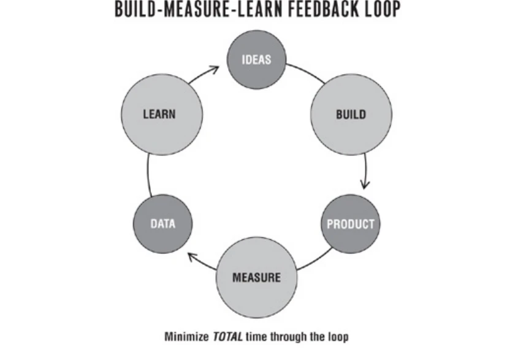
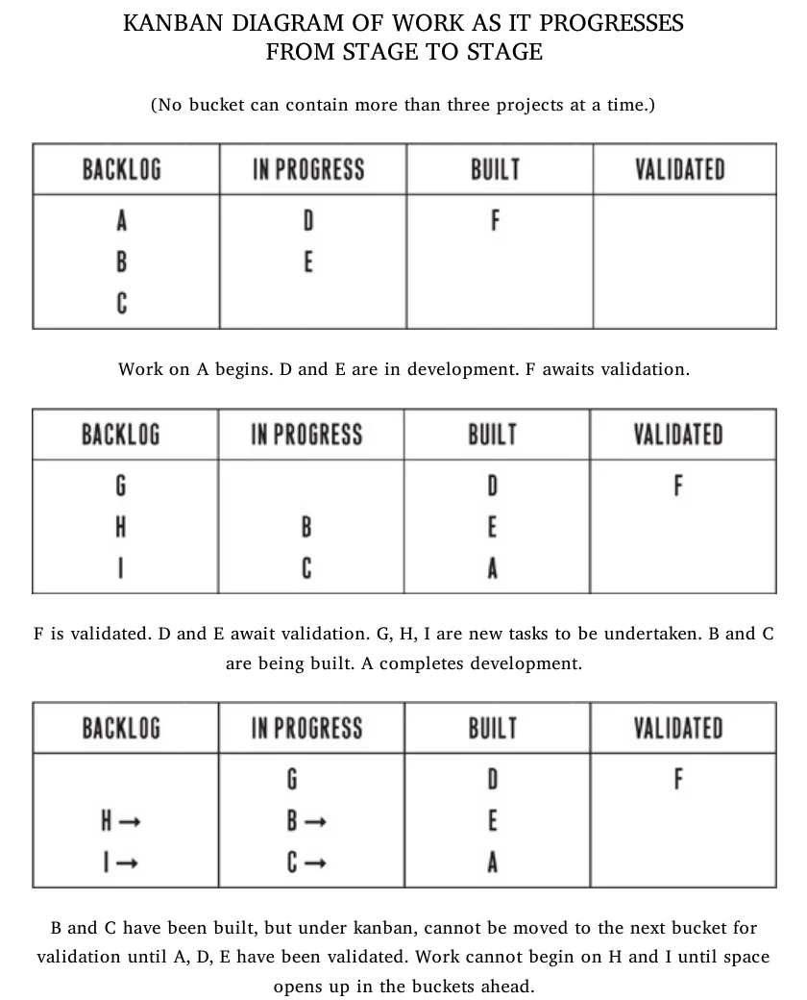
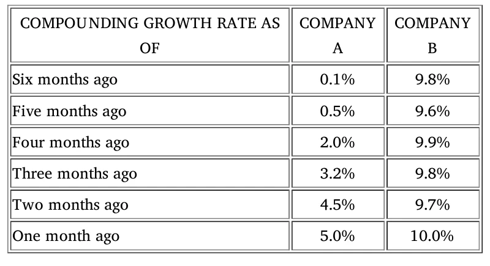

Eric Ries presents the Lean Startup as a management discipline for creating new products and services under extreme uncertainty. Its purpose is not to make teams produce more efficiently before they know what customers need; it is to help them learn, with evidence and as quickly as possible, how to build a sustainable business. The method joins vision with experimentation, measurement, and repeated strategic adjustment. [Introduction, PDF pp. 11–21]

## Book overview

The method rests on five principles. Entrepreneurs can exist in any sector or organization; entrepreneurship is a form of management; startup progress is validated learning; the core activity is the Build-Measure-Learn feedback loop; and innovators need innovation accounting to measure progress, set milestones, and prioritize work. Ries rejects both detailed prediction based on a stable past and unmanaged “just do it” chaos because startups have neither stable history nor certainty about their customers and products. [Introduction, PDF pp. 17–20]

The book follows three movements. **Vision** defines the startup, validated learning, and experiments. **Steer** takes one complete turn through Build-Measure-Learn: identify leap-of-faith assumptions, build a minimum viable product (MVP), measure with innovation accounting, and decide whether to pivot or persevere. **Accelerate** shows how small batches, growth engines, adaptive processes, and organizational design can shorten that loop as the organization scales. [Introduction, PDF p. 20]

## Part One — Vision

### Chapter 1: Start

Ries argues that a startup is an institution and therefore needs management, but not management copied unchanged from established businesses. Traditional forecasting works best when history is long and conditions are stable; startups face the opposite. Avoiding all process creates chaos, while rigid planning creates precise execution of assumptions that may be wrong. Entrepreneurial management must preserve vision while creating a disciplined way to test strategy. [Chapter 1, PDF pp. 24–28]

The Lean Startup adapts ideas from lean manufacturing: use worker knowledge, shrink batch sizes, reduce cycle time, distinguish value from waste, and build quality into the process. The crucial adaptation is the unit of progress. A factory can count high-quality goods; a startup must count **validated learning** about how to create a sustainable business. Ries describes a startup’s work as a loop in which ideas become products, products generate data, and data informs whether the strategy should change. [Chapter 1, PDF pp. 28–34]

Vision, strategy, and product change at different speeds. Vision is the destination; strategy includes the business model, product roadmap, partners, competitors, and customers; products are continually optimized. When evidence shows that the strategy is flawed, the startup pivots while keeping its overall vision. This balance rejects both abandoning the vision after every setback and refusing to change a failing strategy. [Chapter 1, PDF pp. 31–34]

### Chapter 2: Define

Ries defines a startup as “a human institution designed to create a new product or service under conditions of extreme uncertainty.” The definition does not depend on company age, size, industry, funding, or legal form. It includes internal innovators in large companies, nonprofit teams, public-sector ventures, and new independent firms. “Institution” matters because success requires people, coordination, culture, and management, not only an idea or technology. [Chapter 2, PDF pp. 35–38]

The SnapTax case shows this definition inside Intuit. A small team discovered that customers wanted to photograph a W-2 form and complete a simple tax return on a phone. Its success depended on an “island of freedom” in which the team could experiment while remaining accountable. The point is not that all corporate teams should imitate SnapTax’s features, but that a large established company can contain a startup whenever a team is creating something new under uncertainty. [Chapter 2, PDF pp. 38–41]

Intuit’s broader transformation illustrates the management challenge. The company learned that polished plans and senior approvals did not reliably predict new-product success, so it increased the number of experiments and held leaders accountable for learning and customer behavior. Leadership’s role became creating a system in which entrepreneurial teams could test ideas rather than trying to select every winning idea in advance. [Chapter 2, PDF pp. 41–44]

### Chapter 3: Learn

**Validated learning** is the book’s measure of startup progress: evidence that the team has discovered valuable truths about present and future business prospects. Ries distinguishes it from persuasive stories told after failure. Learning is validated when a change in theory leads to a testable prediction and subsequent product versions produce better behavior from real customers. [Chapter 3, PDF pp. 45–46, 56–58]

IMVU’s founders began with a detailed strategy: make a three-dimensional avatar product that worked as an add-on to existing instant-messaging networks. They spent months building interoperability customers did not value. Customer conversations and behavior refuted the assumptions: early adopters were willing to install another client, wanted to meet new people rather than use avatars with existing friends, and did not understand the strategic logic the founders considered obvious. The work was technically productive but created little customer value. [Chapter 3, PDF pp. 46–54]

Ries uses the case to redefine waste. In an uncertain startup, a feature completed on time and to specification is waste if nobody needs it. Value is whatever contributes to discovering and delivering what customers find valuable; learning that can change the business direction is productive work. The discipline therefore asks not only whether a team can build a product, but whether it should be built and whether a sustainable business can be created around it. [Chapter 3, PDF pp. 54–62]

Small results can be more informative than impressive-looking zeroes or forecasts. IMVU released early, charged customers, observed behavior, and ran repeated experiments. The specific tactics are not universal rules; Ries’s stated lesson is to treat each startup as a grand experiment and measure progress through validated learning rather than through how much work has been completed. [Chapter 3, PDF pp. 59–62]

### Chapter 4: Experiment

A startup experiment begins with a clear hypothesis, predicts what should happen, and tests that prediction empirically. The startup’s vision supplies direction, while the experiment discovers which parts of the strategy are sound. Ries distinguishes this from launching something merely to “see what happens”: an experiment must be capable of failing, or it cannot produce validated learning. [Chapter 4, PDF pp. 63–64]

Two leap-of-faith questions usually come first: the **value hypothesis**, whether customers find the product valuable, and the **growth hypothesis**, how new customers will discover and adopt it. Zappos tested demand for buying shoes online before building a warehouse network by photographing shoes in local stores and purchasing them at retail when customers ordered. The test sacrificed operational efficiency to learn whether real customers would complete the transaction. [Chapter 4, PDF pp. 64–66]

An experiment is also a first product. Kodak Gallery’s team learned to ask four questions in order: do customers recognize the problem, would they buy a solution, would they buy it from this organization, and can the organization build it? Its event-album prototype exposed difficulty creating albums and revealed which missing features customers actually cared about. Negative results were useful because they refined the product specification before a full launch. [Chapter 4, PDF pp. 69–72]

Village Laundry Services and the Consumer Financial Protection Bureau extend the method beyond software startups. Both cases begin with a limited service or public program, observe actual participation, and expand only after learning. Ries’s conclusion is that planning remains useful when operating history is stable, but a startup under uncertainty should convert assumptions into experiments that generate qualitative and quantitative feedback. [Chapter 4, PDF pp. 72–77]

## Part Two — Steer

Part Two organizes startup work around the loop below. Although work flows from ideas through building and measurement to learning, Ries says planning should proceed in the reverse direction: decide what must be learned, identify the measurement that would validate it, and then build the smallest product that can run that test. The goal is to minimize total time through the loop, not maximize activity at one stage. [Part Two introduction, PDF pp. 79–83]

*From the book: “Build-Measure-Learn Feedback Loop.” The diagram connects Ideas → Build → Product → Measure → Data → Learn and instructs the reader to minimize total time through the loop. [PDF p. 81]*

### Chapter 5: Leap

Every strategy contains assumptions. Ries calls the assumptions on which the entire business depends **leaps of faith**. Facebook’s early investors focused on evidence supporting two central hypotheses: high engagement suggested value, and rapid campus-by-campus adoption suggested growth. Revenue level alone did not answer whether those mechanisms were working. [Chapter 5, PDF pp. 84–87]

Analogs and antilogs help expose assumptions. An analog is a comparable success that supports one element of the plan; an antilog shows where the new venture must differ. The iPod strategy could use the Walkman as an analog for portable listening while treating Napster as evidence that people would download music but leaving payment as a leap of faith. The purpose is not imitation; it is to identify which beliefs remain untested. [Chapter 5, PDF pp. 87–90]

Ries borrows Toyota’s *genchi gembutsu* principle: go and see reality firsthand. Toyota’s Sienna chief engineer traveled across North America to understand roads and family use. Scott Cook called households and watched how people handled personal finances before Intuit built its solution. Customer contact confirms that a problem exists and informs a provisional customer archetype, but analysis and interviews cannot replace testing a product with behavior. [Chapter 5, PDF pp. 90–94]

### Chapter 6: Test

The **minimum viable product** is the version that allows a full Build-Measure-Learn turn with the least effort. It is not defined as the smallest imaginable product or as a prototype that tests only technical feasibility. It tests fundamental business hypotheses and begins, rather than ends, the learning process. [Chapter 6, PDF pp. 95–97]

The chapter presents several forms. Groupon began with a WordPress blog and manually produced coupons; Dropbox used a demonstration video to test demand before solving all technical risks; Food on the Table used a concierge MVP with one customer and manually performed work that software would later automate; Aardvark used human operators behind the scenes to simulate an automated service. Each MVP was deliberately inefficient in delivery but efficient in learning. [Chapter 6, PDF pp. 95–108]

MVP quality cannot be judged against an unknown customer standard. If customers do not care about a feature, building it is waste; if they use the MVP in an unexpected way, that behavior is evidence. Ries does not license careless work: defects that prevent learning or create a false result must be removed. The rule is to eliminate any feature, process, or effort that does not contribute directly to the learning sought. [Chapter 6, PDF pp. 108–111]

Legal, patent, competitor, brand, and morale risks can constrain MVP design and must be handled in context. Teams may use a separate brand, limited release, or private test, but secrecy should not become an excuse to delay feedback. Before testing, leaders should agree that disappointing results will trigger iteration or a considered pivot rather than immediate abandonment or blind perseverance. [Chapter 6, PDF pp. 111–114]

### Chapter 7: Measure

Traditional accounting compares results with forecasts, but startup forecasts are built on untested assumptions. **Innovation accounting** establishes accountability through three learning milestones: use an MVP to establish a real baseline, run experiments that tune a driver of the growth model toward the ideal, and then decide whether to pivot or persevere. A successful pivot begins a new cycle with a new baseline and should make subsequent tuning more productive. [Chapter 7, PDF pp. 115–121]

At IMVU, frequent product releases and rising cumulative registrations created an appearance of progress while funnel conversion rates barely moved. Cohort analysis separated each group of new customers and showed what each cohort actually did: register, download, use repeatedly, and pay. Split tests then isolated the effect of changes. This made it possible to distinguish work that changed customer behavior from work that merely added features. [Chapter 7, PDF pp. 121–130]

Ries contrasts actionable metrics with vanity metrics. A useful report has three qualities: it is **actionable**, showing a clear cause-and-effect relationship; **accessible**, expressed so people can understand and use it; and **auditable**, traceable to credible customer data. Gross totals can rise because of accumulated history even when the product team’s recent work has no effect, so they cannot by themselves guide decisions. [Chapter 7, PDF pp. 128–146]

The chapter’s kanban example limits each stage—backlog, in progress, built, and validated—to three items. Work cannot enter the next stage until capacity opens, and a completed feature does not count as validated until its effect has been measured. This constraint exposes the accumulation of untested work and turns learning, rather than feature completion, into the flow’s endpoint. [Chapter 7, PDF pp. 137–140]

*From the book: “Kanban Diagram of Work as It Progresses from Stage to Stage.” No bucket can contain more than three projects; work waits when downstream validation is full. [PDF p. 138]*

### Chapter 8: Pivot (or Persevere)

A **pivot** is a structured course correction designed to test a new fundamental hypothesis about the product, business model, or engine of growth. It keeps one foot anchored in what the startup has learned while changing another element. The alternative is to persevere with the current strategy. The choice requires evidence about whether experiments are moving the business model’s drivers toward a sustainable result. [Chapter 8, PDF pp. 147–158]

Votizen illustrates successive pivots. Its initial verified-voter social network produced some engagement but weak retention and referral. The team narrowed the product, changed the customer and revenue logic, and repeatedly tested new assumptions. Ries emphasizes that moderate success can make pivoting harder than obvious failure because vanity metrics preserve hope while experimentation becomes less productive. [Chapter 8, PDF pp. 148–157]

Ries recommends a scheduled pivot-or-persevere meeting attended by product-development and business leadership. Product leaders bring the complete trend of optimization results against expectations; business leaders bring customer conversations and market evidence. Meetings held too frequently lack data, while long delays waste runway. He redefines runway as the number of pivots the startup can still attempt, not merely months of cash remaining. [Chapter 8, PDF pp. 157–168]

The catalog includes zoom-in, zoom-out, customer-segment, customer-need, platform, business-architecture, value-capture, engine-of-growth, channel, and technology pivots. A pivot is not an arbitrary change or a substitute for strategy. It is a new strategic hypothesis that needs a new MVP and another evidence cycle. [Chapter 8, PDF pp. 168–174]

## Part Three — Accelerate

### Chapter 9: Batch

Small batches expose errors earlier and reduce the work tied up between idea and feedback. Ries uses the envelope-folding exercise to show why single-piece flow can beat performing each task in a large batch: large piles create handling, sorting, and rework, while a small batch reveals a faulty process almost immediately. For startups, the benefit is not simply faster production but earlier discovery that the product or process is wrong. [Chapter 9, PDF pp. 180–183]

IMVU applied small batches through continuous deployment, releasing changes frequently and stopping the line when a change broke the product. SGW Designworks used rapid computer-aided design, physical prototypes, immediate customer review, and repeated iterations to deliver a field x-ray structure in weeks. These cases show how reducing batch size compresses the time between a decision and evidence about that decision. [Chapter 9, PDF pp. 183–191]

Large batches create a “death spiral”: specialized groups hand large bodies of work downstream, questions and defects return late, and managers authorize even larger rescue projects. Pull systems reverse this logic. Work is authorized by demand from the next stage, not pushed because an upstream specialist is available. In product development, validated learning can act as the pull signal for the next experiment. [Chapter 9, PDF pp. 191–199]

### Chapter 10: Grow

Sustainable growth means new customers arrive because of actions by past customers—through word of mouth, product usage, funded advertising, or repeat purchase and use. Ries groups these mechanisms into three engines so that teams can focus on the few metrics that control their particular feedback loop. [Chapter 10, PDF pp. 199–203]

- **Sticky engine:** growth depends on retention. If new-customer acquisition exceeds churn, the customer base compounds; the team should focus on engagement and reducing attrition. [PDF pp. 203–205]
- **Viral engine:** normal product use brings additional customers. The viral coefficient measures how many new customers each customer produces; a coefficient above one produces exponential growth. [PDF pp. 205–208]
- **Paid engine:** revenue from a customer’s lifetime value funds acquisition. Growth depends on the margin between lifetime value and cost per acquisition, not on revenue or advertising spend viewed separately. [PDF pp. 208–211]

More than one engine can operate, but Ries recommends concentrating on one at a time because each demands different operating expertise and metrics. Product/market fit should appear as sustained evidence in the relevant engine, not as a subjective declaration. Every engine eventually exhausts its current customers or channels, so slowing growth should be detected early enough to tune the engine or pivot. [Chapter 10, PDF pp. 211–216]

The book’s comparison below shows why a current rate alone is insufficient. Company B remains near 10 percent but is not improving; Company A rises from 0.1 to 5 percent. Innovation accounting values the direction produced by experiments, not just the larger snapshot. [Chapter 10, PDF p. 214]

*From the book: “Compounding Growth Rate as of” comparison. Company A improves across six months while Company B stays nearly flat at a higher rate. [PDF p. 214]*

### Chapter 11: Adapt

An adaptive organization changes its process in response to current conditions. It must slow down when speed creates recurring defects and accelerate again when prevention removes them. IMVU’s employee training evolved through repeated responses to actual onboarding problems rather than through one large program designed in advance. [Chapter 11, PDF pp. 217–221]

The **Five Whys** asks why a problem occurred, then continues through successive causes until the team reaches process-level conditions. At each level, the organization makes a proportional investment: small symptoms receive small remedies; deeper recurring causes justify stronger prevention. The method connects immediate technical repair with training, process, and management changes without requiring a speculative large program. [Chapter 11, PDF pp. 221–226]

The practice can collapse into the “Five Blames” if people use it to identify a culprit. Ries recommends including everyone affected, explaining the method, appointing someone with authority, and treating mistakes as process problems. IGN’s experience shows that starting with a narrowly scoped problem builds skill and trust more safely than applying the method immediately to a long list of organizational grievances. [Chapter 11, PDF pp. 226–236]

QuickBooks moved from an annual large-batch release toward shorter cycles. The transition required changes in testing, coordination, and customer feedback rather than simply telling people to work faster. The chapter’s broader point is that adaptive speed comes from systems that reveal and prevent problems, not from pressure to increase individual utilization. [Chapter 11, PDF pp. 236–243]

### Chapter 12: Innovate

Internal startup teams need three structural conditions: scarce but secure resources, independent authority to develop the business, and a personal stake in the outcome. Startup budgets may be small, but unexpected cuts can destroy experiments; teams also need cross-functional power to build, market, and deploy without repeated functional approvals. Structure enables experimentation but does not guarantee success. [Chapter 12, PDF pp. 244–247]

An **innovation sandbox** protects both the startup and the parent organization. Ries proposes limiting an experiment’s duration and customer exposure, assigning one team end-to-end responsibility, using a small common set of actionable metrics, and monitoring customer reactions so a catastrophic effect can stop the test. The sandbox makes experiments visible and accountable rather than hiding innovation in a secret unit. [Chapter 12, PDF pp. 247–254]

Companies manage four kinds of work: creating new products, growing them, optimizing established products, and maintaining legacy operations. Each phase needs different skills and controls. Ries argues that “entrepreneur” should be a legitimate internal job title, with people rewarded through innovation accounting rather than forced to leave innovation work as their products mature. Successful experiments eventually need reintegration and scale, while the organization preserves capacity for new startups. [Chapter 12, PDF pp. 254–261]

### Chapter 13: Epilogue — Waste Not

Ries returns to Frederick Winslow Taylor’s scientific management. Taylor’s movement increased efficiency but also produced systems that can overvalue local productivity and undervalue human judgment. Modern work often optimizes the production of outputs without asking whether those outputs create value. In conditions of uncertainty, efficiently building an unwanted product is still waste. [Chapter 13, PDF pp. 262–265]

Lean Startup practices provide what Ries calls organizational “superpowers”: state assumptions explicitly, test them, use evidence rather than departmental persuasion, and treat failure as information. He argues for research programs that study startup productivity and for innovation accounting that can inform long-term investment. His proposed Long-Term Stock Exchange would reward companies for durable performance and transparent investment in innovation rather than only short-term financial results. [Chapter 13, PDF pp. 265–272]

The epilogue rejects rigid doctrine. Scientific thinking does not mean formula or diminished creativity; it means testing beliefs in service of the vision. Speed and quality should support one another, setbacks should trigger learning instead of blame, and work should be judged by whether it creates customer value and a sustainable organization. [Chapter 13, PDF pp. 272–273]

### Chapter 14: Join the Movement

The final chapter points readers toward local communities, customer-development resources, lean product-development works, and related writing. Its role is not to add another technique but to frame Lean Startup as a developing practice that improves through participation, teaching, and continued testing rather than through fixed orthodoxy. [Chapter 14, PDF pp. 274–279]
