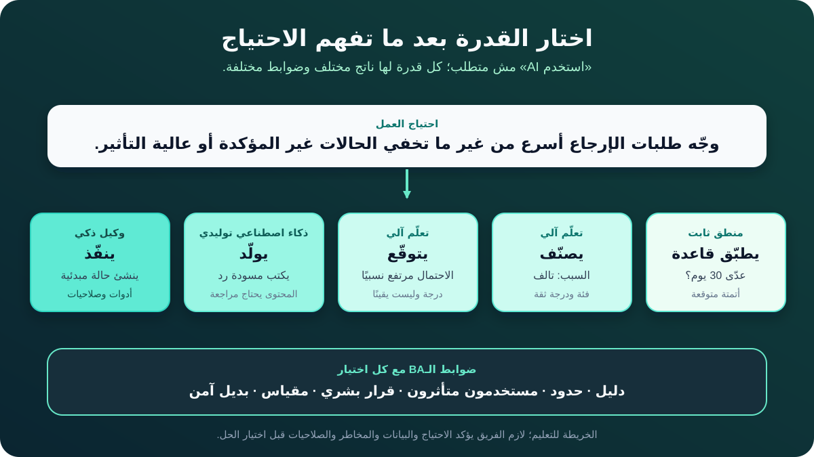

# أساسيات الذكاء الاصطناعي لمحللي الأعمال

الذكاء الاصطناعي (Artificial Intelligence - AI) اسم واسع. لما يتقال في مشروع، الاسم لوحده ما يوضحش النظام هيعمل إيه، أو محتاج بيانات إيه، أو ناتجه لازم يكون موثوق قد إيه، أو مين يفضل مسؤولًا عن النتيجة.

محلل الأعمال (Business Analyst - BA) مش محتاج يبني Model علشان يضيف قيمة. لكنه محتاج فهم كفاية يحوّل جملة «لازم نستخدم AI» لأسئلة أوضح: **بنحل مشكلة إيه؟ النظام هيطلع إيه؟ إيه القرار اللي هييجي بعد الناتج؟ وإيه اللي هيحصل لما الناتج يكون غلط؟**

الشرح ماشي على مثال تعليمي واحد: متجر أونلاين عايز يحسّن التعامل مع طلبات إرجاع المنتجات. الأدوار والأرقام والقواعد في المثال افتراضات للتعليم، مش سياسة إرجاع مقترحة لأي مؤسسة.

## 1. ابدأ بالاحتياج، مش باسم التكنولوجيا

المتجر بيستقبل طلبات إرجاع مكتوبة بحرية، زي: «سماعة الرأس وصلت والعلبة مفتوحة، والناحية الشمال مش شغالة». موظف الدعم بيقرأ الرسالة، ويحدد السبب، ويراجع الطلب والسياسة، وبعدها يوجّه الحالة للمكان المناسب.

الإدارة اقترحت: «نستخدم AI علشان نؤتمت الإرجاع». دي فكرة، مش متطلب. الجملة مخبية احتياجات وقرارات مختلفة.

| البند | العبارة في المثال | حالتها |
|---|---|---|
| المشكلة الحالية | الموظفون بيقضوا وقتًا في قراءة وتوجيه كل طلب | افتراض يحتاج قياسًا |
| النتيجة المطلوبة | تقليل وقت التوجيه من غير زيادة الموافقات الغلط | نتيجة مقترحة |
| المتأثرون | العملاء والدعم والعمليات والمالية ومراجعو الاحتيال | قائمة أولية |
| قرار عالي التأثير | هل المبلغ هيرجع للعميل؟ | يفضل مع دور مخوّل في أول Pilot |
| سؤال مفتوح | هل الرسائل وسجلات الطلبات دقيقة كفاية لدعم الأتمتة؟ | يحتاج بحثًا |

الـBA يتأكد الأول من العملية الحالية وخط الأساس (Baseline) والمستخدمين المتأثرين والقيود وتكلفة الأخطاء. بعد كده الفريق يقدر يقرر هل الأنسب قواعد ثابتة، أو AI، أو خليط بينهم.

**سؤال للـBA:** لو شلنا كلمة «AI» من الاقتراح، هل صاحب الفكرة يقدر يشرح المشكلة والنتيجة القابلة للقياس؟

## 2. افصل بين الأتمتة والتعلّم الآلي والذكاء التوليدي والوكلاء

المفاهيم دي ممكن تشتغل مع بعض، لكنها مش أسماء لنفس الحاجة.

| المفهوم | معناه ببساطة | مثال الإرجاع | سؤال مهم للـBA |
|---|---|---|---|
| **أتمتة بقواعد ثابتة** | تنفذ قواعد مكتوبة مسبقًا | لو الشراء أقدم من مدة الإرجاع المؤكدة، وجّه الحالة للمراجعة اليدوية | هل القواعد ثابتة وكاملة وليها Owner؟ |
| **الذكاء الاصطناعي** | اسم شامل لأنظمة مبنية على الآلة تستنتج مخرجات من مدخلات لتحقيق أهداف | يفسّر رسالة الإرجاع ويطلع فئة أو توصية | الناتج بيؤثر على مين وعلى أنهي عملية؟ |
| **التعلّم الآلي (Machine Learning - ML)** | تقنيات تتعلّم أنماطًا من البيانات بدل الاعتماد فقط على قواعد مكتوبة | يتعلّم من طلبات اتصنفت سابقًا علشان يصنّف السبب الجديد | هل البيانات التاريخية مناسبة وممثلة للواقع؟ |
| **الذكاء الاصطناعي التوليدي (Generative AI)** | ينتج محتوى جديدًا، زي النص أو الصورة أو الصوت أو الكود | يكتب مسودة رد باستخدام معلومات الحالة المعتمدة | أنهي ادعاءات تحتاج مصدرًا ومراجعة؟ |
| **النموذج اللغوي الكبير (LLM)** | Model توليدي بيتعامل مع اللغة وينتجها | يلخّص الطلب أو يكتب أسئلة عن المعلومات الناقصة | أنهي سياق مسموح مشاركته، وإزاي هنراجع المسودة؟ |
| **وكيل AI (AI Agent)** | يسعى لهدف عبر خطوات وممكن يستخدم أدوات مسموحة | يقرأ الحالة، ويسترجع السياسة، ويسأل سؤالًا، وينشئ حالة مبدئية | إيه الأدوات والصلاحيات والإجراءات وشروط التوقف؟ |

أحيانًا تكون القاعدة الثابتة أكثر أمانًا وأقل تكلفة وأسهل في الاختبار من الـAI. والحل ممكن يجمع أكثر من أسلوب: القواعد تراجع الأهلية، وML يصنّف السبب، وLLM يكتب مسودة الرد، وشخص مخوّل يوافق على رد المبلغ.

**خطأ شائع:** اعتبار كل Feature شكلها ذكي نفس النوع من التكنولوجيا. النتيجة متطلبات غامضة واختبارات مش مناسبة.

## 3. حدد القدرة اللي محتاجها الشغل فعلًا

بدل سؤال «نشتري أنهي أداة AI؟»، حدد نوع الناتج المطلوب.

| القدرة | المدخلات | الناتج | مثال الإرجاع |
|---|---|---|---|
| **التصنيف (Classify)** | حالة أو عنصر | فئة، وغالبًا معها Score | «منتج تالف» مع معلومات عن الثقة |
| **التوقّع (Predict)** | إشارات حالية وتاريخية | تقدير لنتيجة مستقبلية أو احتمال | احتمال احتياج الحالة لتصعيد |
| **التوصية (Recommend)** | سياق واختيارات ومعايير | اختيارات مقترحة أو مرتبة | اقتراح فريق الدعم التالي |
| **التوليد (Generate)** | تعليمات وسياق | محتوى جديد | مسودة رد تطلب صورة |
| **التنفيذ (Act)** | هدف وسياق وأدوات وصلاحيات | خطوة أو أكثر تم تنفيذها | إنشاء حالة مبدئية وتنبيه المراجع |

الناتج لازم يرتبط بقرار أو مهمة حقيقية. التصنيف مش مفيد لمجرد إن دقته عالية في Demo. يبقى مفيد لما الـWorkflow اللي بيستقبله يستخدمه بشكل مناسب، وتكون عواقب الخطأ مقبولة.

**إجراء للـBA:** اكتب جملة بالشكل ده: «النظام يستخدم **[المدخلات المسموحة]** علشان ينتج **[الناتج]**، وده يساعد **[الدور]** يعمل **[القرار أو الإجراء]** داخل **[الحدود]**».

في مثالنا:

> النظام يستخدم رسالة العميل وحقول الطلب المعتمدة علشان يقترح فئة لسبب الإرجاع، وده يساعد الدعم يوجّه الطلب؛ الحالات غير المؤكدة أو المستبعدة تروح للفرز اليدوي.

## 4. ميّز الـModel عن الحل الكامل

الـAI Model مجرد مكوّن واحد. اللي العمل والمستخدم بيشوفوه هو نظام وWorkflow كاملان.

| الطبقة | بتشمل إيه؟ | الـBA يبحث عن إيه؟ |
|---|---|---|
| **البيانات والسياق** | الرسائل وحقول الطلب ونص السياسة والـLabels ونسخ المصادر | الملكية والجودة والصلاحية والمعنى والفجوات والاحتفاظ |
| **الـModel** | المكوّن اللي يستنتج فئة أو Score أو توصية أو محتوى | المهمة المقصودة والحدود المعروفة والنسخة ودليل التقييم |
| **التطبيق** | الشاشات والـAPIs والاسترجاع والتحقق والتخزين حول الـModel | رحلة المستخدم والتكاملات والأخطاء وسهولة الوصول والأداء |
| **سير العمل** | الأشخاص والـQueues والقرارات والتسليمات والموافقات | المسؤولية والتصعيد ومستوى الخدمة والاستثناءات |
| **الضوابط** | الوصول والسجلات والمراقبة والمراجعة البشرية والرجوع للخلف والحوادث | المسؤول ومحفز الإجراء والدليل والتكرار والاستجابة |

لو المصنّف رجّع «منتج تالف»، باقي الحل لسه لازم يعرض النتيجة للشخص الصح، ويحافظ على رسالة العميل الأصلية، ويتعامل مع Order ناقص، ويمنع رد مبلغ من غير صلاحية، ويسجّل اللي حصل.

**خطأ شائع:** كتابة «الـAI لازم يكون دقيقًا» من غير تحديد الـWorkflow والمستخدمين المتأثرين والاستجابة للخطأ.

## 5. افهم التدريب والاستخدام ودورة الحياة

لـBA مبتدئ، خمس مصطلحات كفاية علشان يبدأ نقاشًا مفيدًا:

1. **التدريب (Training):** إنشاء أو تعديل Model باستخدام بيانات وهدف. في المثال، ممكن تكون طلبات تاريخية عليها Labels لأسباب الإرجاع المؤكدة.
2. **التقييم (Evaluation):** الفريق يختبر الـModel بأمثلة ممثلة للواقع، مش مجرد نفس أمثلة الضبط، ويراجع النتيجة العامة ومجموعات الفشل المهمة.
3. **الاستخدام أو الاستدلال (Inference):** الـModel المدرّب يستقبل مدخلًا جديدًا ويطلع ناتجًا، زي فئة أو Score.
4. **الإطلاق والتشغيل:** الـModel يدخل في تطبيق وWorkflow حقيقيين فيهم مستخدمون وصلاحيات ومراقبة ودعم.
5. **التغيير أو الإيقاف:** البيانات أو السياسة أو المستخدمون أو الـModels أو الظروف بتتغير. الفريق يعيد التقييم أو يحدّث أو يقيّد أو يستبدل أو يوقف القدرة.

إطلاق الـModel مش معناه بالضرورة إنه بيتعلّم من كل تفاعل في النظام الحي. بعض الـModels تفضل ثابتة لحد تحديث معتمد. الـBA يسأل: مين يوافق على Model أو Dataset جديدة؟ إيه الدليل المطلوب؟ وإزاي المستخدمين هيعرفوا إن السلوك اتغير؟

إطار NIST بيتعامل مع إدارة المخاطر كشغل مستمر عبر دورة حياة نظام الـAI، مش مراجعة مرة واحدة. بالنسبة للـBA، ده معناه إن المتطلبات تشمل التشغيل والتغيير، مش أول Release فقط.

## 6. اعتبر الناتج دليلًا، مش حقيقة مؤكدة

مخرجات AI كثيرة بتكون فئات أو Scores أو اختيارات مرتبة أو مسودات. الرقم الدقيق في شكله ممكن يفضل غير مؤكد، أو مش مضبوط، أو غير مناسب للقرار.

افترض إن مصنّفًا تعليميًا طلع النتائج دي لطلب إرجاع:

| الفئة المحتملة | الـScore |
|---|---:|
| منتج تالف | 0.72 |
| مشكلة في فتح العلبة | 0.21 |
| تغيير رأي العميل | 0.07 |

الـScore مش دليل إن المنتج تالف، ومش ضمان تلقائي بنسبة 72%. الفريق لازم يحدد معنى الدرجة بالنسبة للـModel ده وإزاي هتُستخدم.

تصميم قرار أولي ممكن يكون:

| الشرط | استجابة سير العمل |
|---|---|
| فئة واحدة مسموحة حققت حد التوجيه اللي تم التحقق منه | اقترح الـQueue واعرض رسالة العميل الأصلية |
| مفيش فئة حققت الحد | وجّه للفرز اليدوي؛ ما تخمنش |
| الرسالة وبيانات الطلب بينهم تعارض | اعرض التعارض واطلب مراجعة |
| الحالة ممكن تؤدي لرد مبلغ | حافظ على موافقة الشخص المخوّل |

الـThreshold مش مجرد Setting تقني. هو بيعكس تكلفة الخطأ وحجم الشغل وتأثيره على العميل وقدرة المؤسسة على تحمّل المخاطر. القيم تتحدد بالاختبار لاحقًا؛ المثال مش بيفرض حدًا معينًا.

**سؤال للـBA:** إيه اللي هيحصل للعميل وللمؤسسة مع كل نوع من الناتج الغلط؟

## 7. تتبّع دور الـBA عبر دورة الحياة

الـBA بيربط قيمة العمل والمستخدمين المتأثرين بسلوك النظام.

| المرحلة | مساهمة الـBA | دليل أو Artifact |
|---|---|---|
| الاكتشاف | تأكيد الاحتياج والـBaseline وأصحاب المصلحة والقرارات الحالية والبدائل | تعريف المشكلة ودليل الحالة الحالية |
| تحديد الإطار | توضيح الاستخدام المقصود والممنوع والنتيجة والحدود والافتراضات | AI Capability Brief |
| التصميم | جمع احتياجات البيانات والـWorkflow والمراجعة البشرية والتفسير والجودة والبديل الآمن | متطلبات وProcess Model وDecision Table |
| التحقق | المساعدة في تحديد سيناريوهات ممثلة وقبول العمل وعواقب الفشل | خطة Evaluation وUAT |
| الإطلاق | تأكيد جاهزية التدريب والدعم والصلاحيات والتواصل والـRollback | قائمة Pilot وإطلاق |
| التشغيل | متابعة القيمة والفشل والشكاوى والتغيّر وتعديلات السياسة والحوادث | مراجعة الفوائد والمخاطر |

الـBA مش مالك كل المهام. فرق البيانات والهندسة والأمن والشؤون القانونية والمخاطر والعمليات والمنتج، وكمان المستخدمون المتأثرون، بيقدموا أدلة وقرارات مختلفة. دور الـBA يخلي الاعتماديات وحدود الملكية واضحة.

## 8. مثال مكتمل لـAI Capability Brief

الـBrief ده بيحافظ على النقاش في مستوى المشكلة والقدرة قبل التزام الفريق بمنتج أو Model.

| الحقل | المثال المكتمل | حالة الدليل |
|---|---|---|
| احتياج العمل | تقليل وقت التوجيه اليدوي اللي ممكن نتجنبه في طلبات الإرجاع | محتاجين Baseline |
| المستخدمون والمتأثرون | العملاء والدعم والعمليات والمالية ومراجعة الاحتيال | قائمة أولية؛ تحتاج تأكيدًا |
| القرار الحالي | الدعم يقرأ كل رسالة ويختار Queue | مؤكد بملاحظة العملية |
| القدرة المقترحة | تصنيف سبب الإرجاع واقتراح Queue | اختيار محتمل، مش حلًا معتمدًا |
| المدخلات المسموحة | رسالة العميل مع رقم الطلب والمنتج والتاريخ والحالة من حقول معتمدة | صلاحية البيانات وجودتها مفتوحتان |
| الناتج | السبب والـQueue المقترحان ومعلومات الـScore والرسالة الأصلية | يحتاج مراجعة Usability |
| القرار البشري | الدعم يقبل التوجيه أو يصححه أثناء الـPilot | ضابط مقترح |
| الإجراء الممنوع | ممنوع رد المبلغ أو الرفض أو اتهام العميل تلقائيًا | حد مقترح |
| الاستجابة للفشل | الحالات الناقصة أو المتعارضة أو المستبعدة أو غير المؤكدة تروح لفرز يدوي | محتاجة Service Target |
| مقاييس النجاح | وقت التوجيه والتصنيفات المصححة وإعادة التوجيه وشكاوى العملاء | التعريف والـBaseline مفتوحان |
| مخاطر مهمة | نص حساس وانحياز تاريخي في الـLabels وسوء فهم الـScores وتغيير السياسة | تتقيّم مع المسؤولين |
| الملكية والمراجعة | Product Owner للقيمة، والعمليات للـWorkflow، ونحتاج تحديد مسؤولي المخاطر والتقنية | قرار مفتوح |

لاحظ اللغة: الـBrief بيفصل الدليل المؤكد عن المقترحات والافتراضات والقرارات المفتوحة. اختيار «AI» ما يحسمش الحاجات دي.

## 9. أخطاء شائعة تتجنبها

- **البدء بـDemo لأداة:** الـDemo المقنع ممكن يخفي Business Case ضعيفة أو Workflow غير مناسب.
- **تسمية القواعد AI:** ده بيخلي الملكية والاختبار أقل وضوحًا. اوصف السلوك الحقيقي.
- **افتراض إن البيانات التاريخية هي الحقيقة:** الـLabels القديمة ممكن يكون فيها أخطاء أو ممارسة غير متسقة أو معاملة غير عادلة.
- **استخدام Accuracy كمتطلب وحيد:** الأخطاء ليها عواقب مختلفة، والمتوسط العام ممكن يخفي ضررًا على مجموعة أو فشلًا نادرًا لكنه خطير.
- **إضافة مراجعة بشرية من غير تصميمها:** المراجع محتاج صلاحية ووقتًا ودليلًا وإجراءً واضحًا، مش زر موافقة فقط.
- **تجاهل التشغيل:** الـModel والسياسة والبيانات وسلوك المستخدمين ممكن يتغيروا بعد الإطلاق.

## 10. قالب AI Capability Brief قابل لإعادة الاستخدام

انسخ الجدول ده قبل كتابة متطلبات AI التفصيلية:

| الحقل | ملاحظاتك |
|---|---|
| مشكلة العمل والدليل عليها | |
| النتيجة المطلوبة والـBaseline | |
| المستخدمون والمتأثرون وأصحاب القرار | |
| الـWorkflow والقرار الحاليان | |
| القدرة المحتملة: تصنيف أو توقّع أو توصية أو توليد أو تنفيذ | |
| المدخلات والمصادر المسموحة | |
| الناتج ومَن يستقبله | |
| القرار أو الإجراء البشري | |
| الاستخدامات والإجراءات الممنوعة | |
| عدم اليقين والاستثناء والبديل الآمن | |
| مقاييس القيمة والجودة والمخاطر | |
| الافتراضات والأسئلة المفتوحة | |
| المسؤولون والدليل التالي المطلوب | |

## 11. تمرين عملي

شركة اشتراكات بتستقبل رسائل من عملاء ممكن يكونوا عايزين يوقفوا الاشتراك مؤقتًا أو ينزلوا الباقة أو يلغوا. صاحب الفكرة طلب «AI Chatbot يمنع الإلغاءات».

جهّز AI Capability Brief مختصرًا:

1. أعد صياغة الطلب كمشكلة عمل ونتيجة محايدتين.
2. حدد قدرة واحدة ممكن تساعد: تصنيف أو توقّع أو توليد أو تنفيذ.
3. حدد قرار المستخدم اللي هييجي بعد الناتج.
4. أضف إجراءً ممنوعًا وبديلًا آمنًا واحدًا.
5. علّم كل ادعاء من غير دليل كافتراض أو سؤال مفتوح.

وفي الآخر اسأل: هل قاعدة ثابتة أو تحسين العملية يقدر يحل جزءًا من الاحتياج بمخاطر أقل؟

## مراجع للتوسع

- [OECD.AI: يعني إيه AI، وإيه الفرق بينه وبين نظام غير معتمد على AI؟](https://oecd.ai/en/wonk/definition)
- [IIBA: تسريع الذكاء الاصطناعي باستخدام تحليل الأعمال](https://go.iiba.org/UST-Global-Whitepaper)
- [NIST: إطار إدارة مخاطر الذكاء الاصطناعي](https://www.nist.gov/itl/ai-risk-management-framework)
- [NIST: وظائف إطار إدارة المخاطر—Govern وMap وMeasure وManage](https://airc.nist.gov/airmf-resources/airmf/5-sec-core/)
