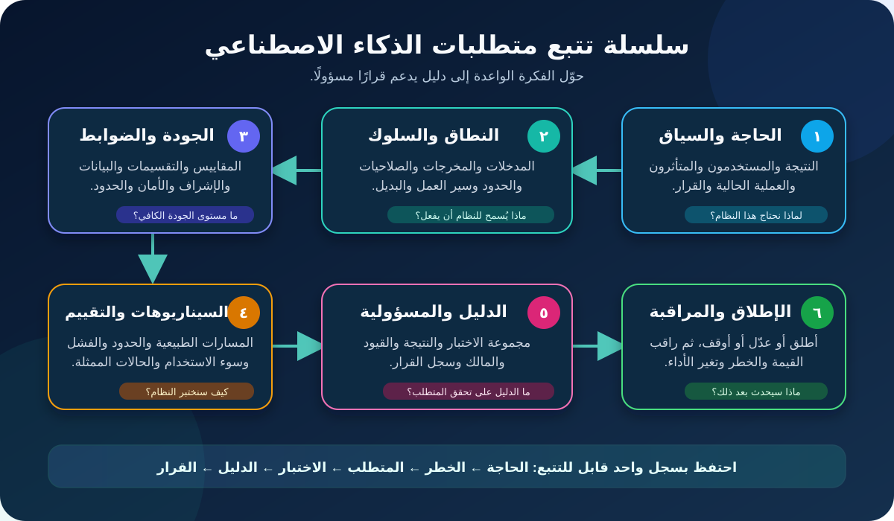

# كتابة متطلبات الذكاء الاصطناعي ومعايير القبول لمحللي الأعمال

متطلب الذكاء الاصطناعي مش مجرد Feature. لازم يحدد **نتيجة العمل وسياق التشغيل والسلوك المسموح وحدود الجودة والضوابط والدليل والتصرف لما النظام يكون غير متأكد أو غلط**.

البرمجيات التقليدية غالبًا بتمشي بقاعدة حتمية: نفس الـInput الصحيح يطلع النتيجة المتوقعة. AI ممكن يطلع إجابة مقنعة لكنها غلط، أو يتصرف بشكل مختلف بين مجموعات وظروف، أو يتغير لما البيانات أو الـModel أو الـPrompt أو الـProvider أو البيئة تتغير. ده ما يخليش المتطلبات مستحيلة؛ لكنه يخلي دور محلل الأعمال (BA) إنه يحوّل عدم اليقين لحاجة قابلة للاختبار والحوكمة.

الدرس مكمل مثال المتجر الإلكتروني. النظام المقترح يقترح سبب إرجاع وSupport Queue لتذاكر الويب الإنجليزية في فئة منتج واحدة. موظف مدرّب يؤكد أو يصحح كل اقتراح. كل الأرقام والأدوار والسياسات هنا افتراضات تعليمية، مش أهداف عامة ولا نصيحة قانونية.

## 1. ابدأ بالقرار، مش بالـModel

«استخدم AI لتصنيف الـTickets» فكرة حل، مش احتياجًا كاملًا. عرّف الأول القرار اللي الشغل لازم يدعمه.

| السؤال | مثال توجيه الإرجاع |
|---|---|
| إيه المشكلة؟ | الموظفون بيقضوا وقت في قراءة وتحويل طلبات إرجاع متكررة |
| إيه النتيجة المهمة؟ | عدد أكبر يوصل للـQueue الصح من غير زيادة تأخير العميل أو الأخطاء المؤذية |
| مين يستخدم النتيجة؟ | موظفو دعم مدرّبون |
| مين يتأثر؟ | العملاء والموظفون ومسؤولو الـQueues والتشغيل وأصحاب البيانات |
| إيه القرار المدعوم؟ | أي سبب إرجاع وأي Queue معتمدين يختارهم الموظف؟ |
| إيه اللي يفضل مسؤولية إنسان؟ | تأكيد أو تصحيح الاقتراح والتعامل مع الحالات المستبعدة |
| إيه البديل الأبسط؟ | Form أحسن أو Routing Rules أو إرشادات قابلة للبحث أو إعادة تصميم العملية |

صياغة مفيدة للنتيجة:

> قلّل القراءة اليدوية وإعادة التوجيه الممكن تجنبها في مجموعة التذاكر المعتمدة، مع الحفاظ على مراجعة الموظف وقدرة العميل على التصحيح وسياسة الإرجاع الحالية.

الصياغة دي تمنع إن Model Metric يتحول لهدف العمل. ممكن النظام يحقق رقمًا ممتازًا Offline ومع ذلك يزود وقت المعالجة أو يضغط Queue معينة أو يشجع قبول الاقتراح من غير تفكير.

## 2. اعمل حدود نطاق صريحة

النطاق ضابط. اكتب المشمول والمستبعد والممنوع قبل تفاصيل السلوك.

| الحد | داخل الـPilot | مستبعد أو ممنوع |
|---|---|---|
| المجموعة | Web Tickets بالإنجليزية لفئة منتج واحدة | لغات أو قنوات أو منتجات أو فرق أخرى |
| الإجراء | اقتراح سبب وQueue معتمدين | الموافقة على Refund أو رفض إرجاع أو إرسال رسالة أو ادعاء احتيال |
| المدخلات | Order Fields معتمدة ونص التذكرة الحالي | تاريخ عميل غير مرتبط أو حقول حساسة غير معتمدة |
| المستخدم | موظف دعم مدرّب بصلاحية مسماة | استخدام مباشر للعميل أو تشغيل من غير إشراف |
| استخدام الناتج | اقتراح قابل للمراجعة | إجراء تلقائي على نظام آخر |
| عدم اليقين | التحويل للمسار اليدوي | اختراع قيمة أو إجبار اختيار ضعيف الثقة |

اكتب الاستبعاد كسلوك يمكن ملاحظته. «الـPilot لا يشمل الاحتيال» أضعف من:

> لما Ticket تتعلّم بعلامة الاحتيال المعتمدة، الخدمة ما تطلعش سبب إرجاع أو Queue، وتحافظ على الطلب الأصلي وتحوله لمسار المتخصصين الحالي.

## 3. افصل أنواع المتطلبات

مراجعة شغل AI تبقى أسهل لما المتطلبات متقسمة حسب الغرض.

| نوع المتطلب | بيجاوب عن إيه؟ | مثال |
|---|---|---|
| Business | ليه التغيير له قيمة؟ | قلّل إعادة التوجيه من غير ما يسوء وقت حل مشكلة العميل |
| Stakeholder | الشخص محتاج إيه؟ | الموظف يفهم ويؤكد ويصحح ويبلغ عن الاقتراح |
| Functional | إيه السلوك المطلوب؟ | اعرض سببًا وQueue معتمدين، واطلب تصرفًا بشريًا |
| Data | إيه المعلومات المسموحة والمناسبة؟ | استخدم حقولًا معتمدة بمصدر ومعنى وRetention موثقين |
| Quality / Non-functional | الأداء يكون إزاي وفي أي ظروف؟ | حدود معتمدة للأداء والسرعة والأمن والإتاحة والتعافي |
| Responsible-AI Control | إزاي نمنع الضرر أو نتعامل معاه؟ | الإجراءات الممنوعة غير متاحة والـOverrides والشكاوى تُراقب |
| Transition | إيه المطلوب للتبني الآمن؟ | درّب فريق الـPilot وجهّز طاقة للبديل اليدوي |
| Monitoring | إيه اللي لازم يفضل صحيح بعد الإطلاق؟ | قِس إعادة التوجيه والتصحيحات حسب نوع الحالة وحقق عند الـTriggers |

ما تحطش كل ده في User Story ضخمة. استخدم مجموعة صغيرة مترابطة من المتطلبات والسيناريوهات والمخاطر والاختبارات وقواعد التشغيل.

## 4. اكتب السلوك الوظيفي من البداية للنهاية

اوصف الـWorkflow كاملًا، مش Model Call بس.

1. النظام يستقبل Ticket فقط بعد ما Eligibility Rules تؤكد اللغة والقناة والمنتج والفريق المعتمدين.
2. يسترجع الحقول المسموحة فقط ويسجل نسخة السياسة المطبقة.
3. يطلع سببًا واحدًا وQueue واحدة من القيم المعتمدة، ومعلومة تساعد الموظف يراجع.
4. الـInterface توضح إن الناتج من AI وتطلب تأكيدًا أو تصحيحًا.
5. اختيار الإنسان النهائي—مش الاقتراح الخام—هو اللي يوجّه التذكرة.
6. النظام يسجل الاقتراح وتصرف الإنسان ونسخة السياسة والنظام والوقت وحقول الـAudit المسموحة.
7. لو Input ناقص أو الخدمة واقفة أو الحالة مستبعدة، المسار اليدوي الأصلي يفضل متاحًا.

حدد **Source of Truth** لكل قاعدة. خدمة سياسة الإرجاع ممكن تحدد الأهلية، بينما AI يقترح السبب فقط. ما تسمحش لناتج AI يستبدل مصدر سياسة مضبوط من غير قرار واضح.

مثال Functional Requirement:

> **AI-FR-04:** بعد ما Ticket مؤهلة تستقبل اقتراحًا، الـInterface تعرض السبب والـQueue المقترحين، وتسمح للموظف يؤكد أو يستبدل الاثنين بقيم معتمدة، وتمنع التوجيه لحد ما الموظف يعمل واحدًا من التصرفين.

## 5. خلّي الجودة الاحتمالية قابلة للقياس

«الـModel لازم يكون Accurate» مش قابل للاختبار كفاية. حدد المقياس والمجموعة والـDataset وطريقة الحساب والحد والتقسيم والاستجابة.

| العنصر | أسئلة لازم تتحسم |
|---|---|
| وحدة القرار | بنقيس السبب ولا الـQueue ولا الاثنين معًا ولا نتيجة الـWorkflow؟ |
| تكلفة الخطأ | إيه الأضر: Queue غلط، حالة متخصصة ضائعة، ولا تصعيد زيادة؟ |
| المقياس | Precision أو Recall أو F1 أو Exact Match أو False-positive Rate أو إكمال المهمة أو Rubric؟ |
| المجموعة | أنهي لغة وقناة ومنتج وفترة زمنية وأنواع حالات ممثلة؟ |
| التقسيمات | أنهي مجموعات أو ظروف تشغيل مهمة تحتاج نتيجة مستقلة؟ |
| الحد | أنهي Minimum أو Maximum اعتمده صاحب السلطة للسياق ده؟ |
| عدم اليقين | حجم بيانات الاختبار قد إيه؟ والتقدير ثابت قد إيه؟ |
| الاستجابة | إيه اللي يحصل لو الحد ما اتحققش قبل الإطلاق أو في التشغيل؟ |

متطلب تعليمي—استبدل الأرقام بقرار معتمد:

> **AI-QR-02:** على Pre-pilot Evaluation Set لها Version من Web Tickets الإنجليزية المؤهلة، النظام بعد إعداده يحقق 88% على الأقل Exact Agreement مع Adjudicated Queue Label إجمالًا، و82% على الأقل لكل Return-reason Slice معتمدة فيها 100 حالة أو أكثر. أي Slice أصغر تتعرض مع حجم العينة وتتراجع نوعيًا. فشل أي حد يمنع الإطلاق لحد ما Product وRisk Owners يعتمدوا تغييرًا موثقًا أو نطاقًا أضيق أو دليلًا جديدًا.

ده أقوى من «Accuracy ≥ 88%» لأنه بيحدد إيه اللي اتقاس وفين ومين يقرر وإيه نتيجة الفشل. الأرقام تعليمية؛ مفيش حد آمن يناسب كل الحالات.

المتوسط ممكن يخبي جيوب فشل مكلفة. اعرض Confusion Matrix أو أنواع الأخطاء المهمة، مش رقمًا واحدًا. وقارن بالعملية الحالية أو Baseline له معنى لما تقدر.

## 6. حدد متطلبات البيانات والـLabels

جودة الـModel ما تصلحش Labels مش واضحة أو بيانات غير مناسبة. لكل Field وDataset سجّل:

- المعنى التجاري وSystem of Record والمالك والغرض المسموح؛
- طريقة الجمع والفترة والمجموعة والاستبعادات المعروفة؛
- التعامل مع Missing وInvalid وDuplicate وOutlier؛
- الصلاحية والتقليل والـRetention والحذف والنقل؛
- تعريف الـLabel وإرشاد الـAnnotators وحل الخلاف ومراجعة الجودة؛
- الفصل بين بيانات Training وTuning وEvaluation وLive Monitoring؛
- الـVersion والـLineage علشان النتيجة تتكرر.

مثال Data Requirement:

> **AI-DR-03:** كل Evaluation Case تحتوي Ticket Identifier ونسخة من المدخلات المعتمدة وReason وQueue بعد الـAdjudication ونسخة Label Guide وحالة الـAdjudication. الحالات من غير Reference Label محسومة ما تدخلش في Release Metric وتتبلغ منفصلة.

أحيانًا «Ground Truth» بيكون حكمًا تشغيليًا تم الاتفاق عليه، مش حقيقة مطلقة. وثق مين بيقرر وإزاي الخلاف يتحل.

## 7. عرّف إشرافًا بشريًا حقيقيًا

«Human in the Loop» مش Acceptance Criterion. المراجع محتاج معلومة وسلطة ووقت ومهارة وبديلًا قابلًا للاستخدام.

اكتب متطلبات لـ:

- إخطار واضح إن الاقتراح من AI؛
- الدليل أو السياق المطلوب للحكم؛
- إمكانية التأكيد أو التصحيح أو الرفض أو التصعيد؛
- عدم عقاب الموظف على Override مناسب؛
- تدريب على الغرض والحدود والفشل المعروف والبديل؛
- جمع ومراجعة الـOverrides من غير افتراض إن كل خلاف خطأ بشري؛
- مسار اعتراض وتصحيح للعميل أو الموظف لما يكون مناسبًا.

مثال Oversight Scenario:

> **Given** Ticket مؤهلة واقتراح AI، **When** الموظف يختلف، **Then** يقدر يختار سببًا وQueue آخرين من القيم المعتمدة من غير موافقة مدير، ويضيف Issue Flag اختياريًا، ويكمل التوجيه عادي؛ ويتسجل التصرف النهائي والـOverride للمراجعة.

اختبر الإشراف مع مستخدمين حقيقيين. ممكن الزرار يكون موجودًا لكنه غير عملي لأن الشاشة مخبية الطلب الأصلي، أو أسماء الـQueues مربكة، أو أهداف الوقت بتضغط على الموظفين يقبلوا كل اقتراح.

## 8. غطّي الفشل والـIntegrations والتعافي

سلوك AI جوه Service أكبر. المتطلبات لازم تغطي نقاط الوصل.

| الفشل أو التغيير | السلوك المطلوب |
|---|---|
| Provider Timeout | وقف الانتظار بعد الحد المعتمد ورجّع التذكرة للمسار اليدوي |
| Field مسموح ناقص | ما تخترعش قيمة؛ وضّح المدخل الناقص واستخدم البديل |
| Output غير صالح | ارفض أي قيمة خارج قوائم الأسباب والـQueues المعتمدة |
| Policy Version غير متوافقة | ما تعرضش اقتراح قبل توفر المصدر المعتمد |
| فشل الـLogging | اتبع قرار الـFail-safe المؤسسي، وما تدّعيش إن الدليل اتسجل |
| تصحيحات متكررة | نبّه المسؤول المحدد لما Monitoring Trigger تتحقق |
| تغيير Model أو Prompt أو Provider | قارن النسخ وأعد التقييم المطلوب قبل توسيع الإطلاق |
| Security أو Privacy Incident | احتوِ المعالجة المتأثرة واستخدم Incident Route المعتمد |

مثال Resilience Requirement:

> **AI-NFR-05:** لو خدمة الاقتراح ما رجعتش Valid Response داخل Interface Limit المعتمد، التطبيق يعرض Manual-routing Option، ويحافظ على كل الشغل المدخل، وما ينشئش Suggestion Record، ويرسل Availability Event المسموح لمراقبة التشغيل.

متطلبات السرعة والتكلفة لازم تقيس الـWorkflow من أوله لآخره، مش Model Endpoint بس.

## 9. اكتب سيناريوهات قبول أبعد من الـHappy Path

استخدم Given–When–Then لما تزود الوضوح، لكن اعتبرها صيغة مش بديلًا عن التحليل.

### المسار الطبيعي

> **Given** Ticket مؤهلة وكل الحقول المطلوبة موجودة، **When** اقتراح صالح يرجع، **Then** الموظف يشوف السبب والـQueue ويراجع الطلب الأصلي ولازم يؤكد أو يصحح قبل التوجيه.

### حدود النطاق

> **Given** Ticket بلغة غير مدعومة، **When** الأهلية تتفحص، **Then** لا يُرسل محتوى لخدمة AI والتذكرة تكمل في العملية اليدوية الحالية.

### عدم اليقين أو مدخل ناقص

> **Given** Ticket من غير Product Category مطلوبة، **When** التوجيه يبدأ، **Then** النظام يوضح الحقل الناقص ويعرض المسار اليدوي من غير اختراع Category.

### إجراء ممنوع

> **Given** أي اقتراح، **When** مكون التوجيه يكمل، **Then** ما يقدرش يوافق على Refund أو يرفض إرجاع أو يرسل رسالة للعميل أو يغيّر Order Record.

### الفشل والتعافي

> **Given** الـProvider غير متاح، **When** Ticket مؤهلة تتفتح، **Then** الموظف يقدر يخلص المهمة بالعملية الأصلية ومفيش اقتراح جزئي يغير Downstream Data.

### المراقبة والتغيير

> **Given** Correction Trigger اتعدّت لنوع حالة معتمد، **When** Monitoring Job تشتغل، **Then** المالك المحدد يستقبل التنبيه والـVersion والحالات المتأثرة قابلين للتحديد ومسار المراجعة أو الإيقاف يبدأ.

اختبر كمان سوء الاستخدام المقصود أو غير المقصود، والـAccessibility، وحدود الصلاحيات، والبيانات القديمة، والـBulk Processing، والمدخلات المتكررة، وتغير ظروف التشغيل حسب الحاجة.

## 10. صمّم التقييم قبل البناء

**التقييم (Evaluation)** طريقة منظمة لقياس هل النظام بعد إعداده حقق متطلباته في ظروف تشبه الاستخدام. صممه والمتطلبات لسه قابلة للتغيير.

| طبقة التقييم | الغرض | مثال الدليل |
|---|---|---|
| Component | فحص Model أو Prompt أو Classifier أو Rule وحدها | Metric Report له Version وError Analysis |
| End-to-end | فحص البيانات والـIntegration والواجهة والصلاحيات والبديل معًا | نتائج السيناريوهات وسجلات الـAudit |
| Human workflow | فحص قدرة الناس على المراجعة والتصحيح والتعافي | Usability Observation ونتائج المهام ومقابلات |
| Pilot | فحص القيمة والخطر في ظروف Live مضبوطة | وقت المعالجة وإعادة التوجيه والـOverrides والشكاوى والحوادث |
| Production monitoring | اكتشاف Drift أو فشل جديد أو سوء استخدام أو ضياع قيمة | Dashboards وAlerts وSampled Reviews وFeedback |

سجّل مصدر Evaluation Set وقواعد الأهلية والفترة وعملية الـLabel والاستبعادات والـVersion والصلاحية والقيود. امنع تسرب حالات التقييم للـTraining لو ده هيبطل صلاحية النتيجة.

نجاح Offline Test ما يثبتش إن الـLive Workflow آمن أو له قيمة. دليل الإطلاق يجمع نتائج كمية ومراجعة نوعية وSoftware Testing وHuman Factors وRisk Controls على قد خطورة الاستخدام.

## 11. ابنِ سلسلة التتبع

الـTraceability بيربط الاحتياج الأصلي بالسلوك اللي اتبنى والدليل. بيكشف الفجوات والـFeatures اللي مالهاش مبرر، ويساعد تفهم تأثير التغيير.

| الاحتياج أو الخطر | المتطلب | الاختبار أو التقييم | الدليل | المسؤول | القرار |
|---|---|---|---|---|---|
| منع إجراء تلقائي مؤذٍ | AI-FR-04: تأكيد بشري واضح | Permission Test وEnd-to-end Scenario | Test Record ناجح ومراجعة الواجهة | Product Owner | مؤهل لـPilot محدود |
| Queue غلط تأخر العميل | AI-QR-02: أداء حسب نوع الحالة | Offline Evaluation لها Version | Metric Report وError Analysis وقيود | Product وRisk Owners | مفتوح لحد تحقق الحدود |
| توقف الـProvider يوقف الشغل | AI-NFR-05: بديل يدوي | Outage Simulation | زمن التعافي ونتيجة عدم ضياع البيانات | Operations Owner | ناجح بشرط المراقبة |
| Labels ضعيفة تبطل الدليل | AI-DR-03: Reference Labels محسومة | Dataset Review | Label Guide ومراجعة الاتفاق وقائمة غير المحسوم | Data Owner | إصلاح قبل التقييم |

استخدم IDs ثابتة. اربط كل Requirement بمصدرها وخطرها وسيناريوها ومكان دليلها ومسؤولها وحالتها وتاريخ تغييرها. تتبع للخلف لاحتياج العمل وللأمام للحل والاختبار.

## 12. افصل القبول عن المراقبة

بعض الشروط تمنع الإطلاق، وشروط ثانية لازم تفضل سليمة أثناء التشغيل.

| النوع | المثال | القرار |
|---|---|---|
| Hard Release Gate | صلاحية Refund ممنوعة موجودة | ما تطلقش |
| Quality Gate | حد Slice معتمد ما تحققش | حسّن أو ضيّق النطاق أو أعد القرار رسميًا |
| Readiness Gate | الموظفون مش قادرين يكملوا بالبديل | أصلح الـWorkflow واختبر تاني |
| Pilot Success Measure | إعادة التوجيه تقل من غير ما يسوء حل مشكلة العميل | كمّل أو عدّل أو أوقف الـPilot |
| Monitoring Trigger | معدل التصحيح يتغير بوضوح عن الـBaseline المعتمد | حقق وممكن تضيّق أو توقف مؤقتًا |
| Incident Trigger | إجراء غير مصرح أو ضرر شديد مؤكد | احتوِ وصعّد فورًا |

Monitoring Thresholds مش حقائق دائمة. راجعها لما الحجم أو السياسة أو البيانات أو المستخدمون أو الأضرار أو الـModels أو الـProviders تتغير.

## 13. مثال مكتمل لـAI Requirements Pack

| قسم الحزمة | محتوى Pilot توجيه الإرجاع | الحالة |
|---|---|---|
| النتيجة والـBaseline | تقليل القراءة وإعادة التوجيه؛ الـBaseline الحالي يحتاج تأكيدًا | مفتوح |
| المستخدمون والمتأثرون | موظفون مدرّبون وعملاء ومسؤولو Queues وتشغيل وأصحاب بيانات | الخريطة الأولية مكتملة |
| النطاق المشمول | Web Tickets إنجليزية وفئة منتج وفريق Pilot محدد | مقترح |
| المستبعد والممنوع | مجموعات أخرى؛ لا Refund ولا رفض ولا رسالة ولا إجراء احتيال | Hard Boundary |
| الـFunctional Workflow | أهلية ومدخلات معتمدة واقتراح ومراجعة وتوجيه نهائي وAudit Event | Draft |
| البيانات والـLabels | Field Register وصلاحية وLabel Guide وAdjudication وDataset Lineage | يحتاج موافقة المالك |
| متطلبات الجودة | End-to-end Metric وSlices وحدود وBaseline وقيود | الأرقام تحتاج اعتمادًا |
| الإشراف البشري | إخطار وسياق وتصحيح وتصعيد وتدريب وبديل | يحتاج Usability Evidence |
| الأمان والخصوصية والأمن | Least Privilege وتقليل البيانات وحوادث وAccess Review | مراجعة المتخصصين مطلوبة |
| التكامل والفشل | Timeouts وInvalid Output وPolicy غير متاحة وLogging وتعافي | السيناريوهات Draft |
| خطة التقييم | Offline وEnd-to-end وHuman Workflow وPilot محدود | الـDataset لسه ما اتثبتتش |
| التتبع والدليل | IDs مرتبطة بالخطر والاختبار والدليل والمالك والحالة | الهيكل جاهز |
| قرار الإطلاق | صاحب سلطة مسمى يقرر Go أو Change أو Pause أو Stop | منتظر الدليل |
| المراقبة والتغيير | تصحيحات وإعادة توجيه وشكاوى وDrift وVersions وMaterial-change Review | الـTriggers تحتاج اعتمادًا |

التوصية الصادقة مش «جاهز» لمجرد إن المتطلبات اتكتبت. النظام **مش جاهز لـLive Pilot لحد ما المسؤولون والحدود ودليل البيانات والضوابط واختبارات البديل المفتوحة تتقفل**.

## 14. Definition of Ready وDefinition of Done

### جاهز للتنفيذ

- الاحتياج والمستخدمون والمتأثرون والنطاق والأفعال الممنوعة متفق عليهم؛
- اعتماديات العملية والبيانات والسياسة والـModel أو الـProvider والـIntegration والإنسان مرسومة؛
- المخاطر المهمة لها أصحاب وضوابط مقترحة؛
- المتطلبات وسيناريوهات القبول قابلة للاختبار؛
- مجموعة التقييم والمقاييس والـSlices والدليل وسلطة القرار معروفين؛
- القرارات والافتراضات المفتوحة ظاهرة.

### مكتمل لإطلاق محدود

- اختبارات الوظائف والجودة والبيانات والأمن والخصوصية والإتاحة والبديل لها دليل؛
- حدود التقييم المعتمدة ناجحة، أو قرار موثق من صاحب السلطة غيّر النطاق؛
- الموظفون مدرّبون ويقدروا يعملوا Override وتصعيد وتعافي؛
- المراقبة والتنبيهات والحوادث والدعم والـRollback ومراجعة التغيير شغالين؛
- الخطر المتبقي والقيود وشروط الموافقة وتاريخ المراجعة متسجلين؛
- البديل اليدوي أو الأكثر أمانًا متاح لما يكون مطلوبًا.

## 15. أخطاء شائعة

- **كتابة «استخدم AI» كمتطلب:** عرّف النتيجة وفكر في بدائل أبسط.
- **استخدام رقم Accuracy واحد:** حدد وحدة القرار وتكلفة الأخطاء والـSlices والـDataset وعدم اليقين والاستجابة.
- **اعتبار Vendor Benchmark دليل قبول:** اختبر النظام بعد إعداده End-to-end في سياقك.
- **اعتبار زرار Confirm إشرافًا:** تحقق من المعلومة والسلطة والوقت والمهارة والبديل.
- **نسيان Abstention:** حدد إمتى النظام ما يجاوبش أو ما يتصرفش.
- **اختبار المدخلات المتوقعة فقط:** غطّي الحدود والنواقص وسوء الاستخدام والتوقف والقواعد القديمة والتغيير.
- **خلط القبول بالمراقبة:** وضّح إيه يمنع الإطلاق وإيه يبدأ تحقيقًا بعدين.
- **غياب التتبع:** كل متطلب حرج يحتاج مصدرًا وخطرًا واختبارًا ودليلًا ومسؤولًا وحالة.
- **اختراع قرارات قانونية أو Risk Decisions:** وجّهها للمتخصصين وسجّل القرار.

## 16. قالب AI Requirements Pack قابل لإعادة الاستخدام

| القسم | محتواك |
|---|---|
| مشكلة العمل والـBaseline والنتيجة المطلوبة والبدائل الأبسط | |
| المستخدمون والمتأثرون والقرارات والعملية الحالية | |
| الاستخدام المشمول والمستبعد والممنوع والمتوقع | |
| المدخلات والمخرجات والصلاحيات والـWorkflow وSource of Truth والبديل | |
| مصادر البيانات والحقول والغرض والجودة والـLabels والـLineage والصلاحية والاحتفاظ | |
| مقاييس الجودة والمجموعات والـSlices والحدود وعدم اليقين والـBaselines | |
| المراجعة البشرية والشرح والتصحيح والتصعيد والاعتراض والتدريب | |
| الخصوصية والأمن والأمان والإنصاف والإتاحة والـAudit والسرعة والتكلفة والتعافي | |
| الـIntegrations والـTimeouts والـInvalid Outputs والفشل الجزئي والتعافي والحوادث | |
| سيناريوهات القبول: طبيعي وحدود واستثناء وسوء استخدام وتغيير | |
| مجموعات وطرق وأدوات التقييم والدليل والقيود والمراجعة المستقلة | |
| التتبع: الحاجة ← الخطر ← المتطلب ← الاختبار ← الدليل ← المالك ← القرار | |
| بوابات الإطلاق ومقاييس الـPilot وMonitoring Triggers وقواعد الإيقاف وتاريخ المراجعة | |
| الافتراضات والقرارات المفتوحة وتاريخ التغيير وسجل الموافقة | |

## 17. تمرين عملي

بنك عايز مساعد AI يقترح تصنيفًا وخطوة تالية لأسئلة مكتوبة عن معاملات البطاقات. موظف يراجع الاقتراح قبل أي تصرف.

1. اكتب نتيجة العمل من غير ما تذكر AI.
2. حدد السلوك المشمول والمستبعد والممنوع.
3. اكتب Functional وData وQuality وOversight وFallback Requirement، واحدًا من كل نوع.
4. اختَر خطأً مكلفًا وحدد Metric مناسبة وPopulation وSlice وصاحب اعتماد الحد والاستجابة.
5. اكتب خمس سيناريوهات Given–When–Then: مسار طبيعي وحدود وبيانات ناقصة وتوقف وإجراء غير مصرح.
6. اعمل Traceability Row واحدة من الاحتياج أو الخطر لحد القرار.
7. حدد الدليل المطلوب قبل الـPilot والإشارات اللي ممكن توقفه.

ما تخترعش سياسة بنك أو التزامات قانونية أو Risk Tolerance أو Performance Thresholds. سمِّ صاحب الخبرة والسلطة اللي لازم يقرر كل واحدة.

## مراجع للتوسع

- [NIST AI RMF Core](https://airc.nist.gov/airmf-resources/airmf/5-sec-core/)
- [NIST AI RMF Playbook: Measure](https://airc.nist.gov/airmf-resources/playbook/measure/)
- [IIBA Business Analysis Standard: Understanding Requirements and Designs](https://www.iiba.org/knowledgehub/the-business-analysis-standard/4-implementing-business-analysis/4-4-understanding-requirements-and-designs/)
- [IIBA Business Analysis Standard PDF](https://production.iiba.org/globalassets/business-analysis-resources/the-business-analysis-standard/files/the-business-analysis-standard.pdf)

إرشاد NIST يدعم اختيار Metrics حسب السياق، وتوثيق Test Sets، والإشراف البشري، ومراقبة التشغيل، وGo/No-go Evidence. معيار IIBA يشرح Functional وNon-functional Solution Requirements والـBidirectional Traceability من الاحتياج الأصلي للحل المنفذ. استخدم الاثنين كإرشاد يتكيف مع حوكمة مؤسستك وحالة الاستخدام.
