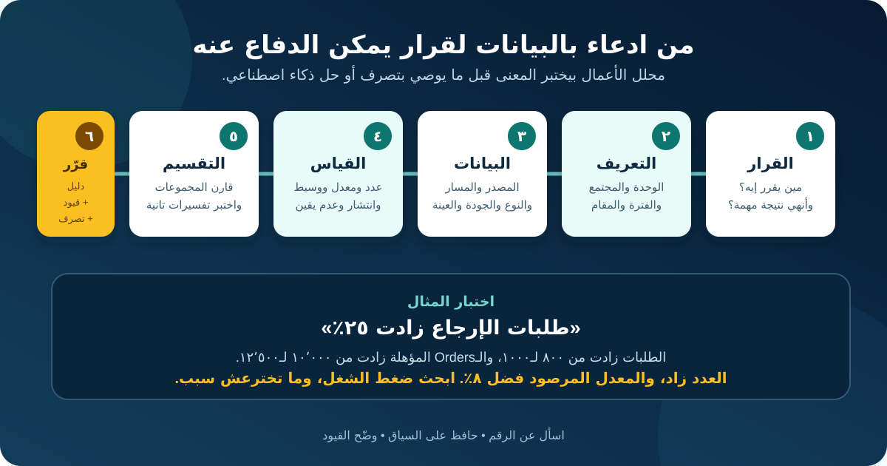

# الثقافة البيانية لمحللي الأعمال

**الثقافة البيانية (Data Literacy)** هي قدرتك على قراءة البيانات والسؤال عنها وتفسيرها وتوصيلها واستخدامها بمسؤولية. مش معناها إنك لازم تبقى Data Scientist أو تحفظ معادلات إحصائية. بالنسبة لمحلل الأعمال (BA)، معناها إنك تعرف الرقم بيمثل إيه، وسايب إيه، وهل دليله كفاية للقرار ولا لأ.

الدرس ده بيكمل سيناريو متجر الـOnline التوضيحي. Dashboard العمليات بتقول: **«طلبات الإرجاع زادت 25% في مايو.»** مدير بيقترح زيادة فريق الدعم وتجربة مساعد AI يوجّه طلبات الإرجاع. قبل ما الـBA يوصي بأي حل، لازم يختبر الجملة دي معناها إيه فعلًا.

كل الأدوار والأرقام والحقول والحدود والسياسات الجاية افتراضات تعليمية. اللي قابل لإعادة الاستخدام هو الطريقة، مش الأرقام المخترعة.

## 1. ابدأ بالقرار، مش بالـDashboard

الـDashboard عرض للبيانات، مش سؤال عمل. ابدأ بتحديد مين هياخد أنهي قرار، وإمتى، وإيه الدليل اللي ممكن يغيّر القرار.

| عنصر القرار | إجابة توضيحية |
|---|---|
| القرار | هل نغيّر عدد الموظفين، ولا نعيد تصميم الاستقبال، ولا نجرب مساعد توجيه، ولا ما نغيّرش؟ |
| صاحب القرار | مدير عمليات الإرجاع |
| المدة | الثمان أسابيع الجاية |
| النتيجة المطلوبة | نقلل الانتظار اللي ممكن نتجنبه من غير ما نزود التوجيه الغلط |
| قيود مهمة | الميزانية الحالية، المراجعون المدرّبون، قواعد الخصوصية، والاستعداد للموسم |
| دليل ممكن يغيّر القرار | معدل الإرجاع، الطلب حسب القناة والسبب، توزيع تأخير الـQueues، إعادة الشغل، وتأثير العميل |

حوّل الادعاء الأصلي لأسئلة:

- هل **عدد** طلبات الإرجاع زاد، ولا **معدلها** هو اللي زاد؟
- أنهي Orders كانت مؤهلة أصلًا للإرجاع؟
- هل الزيادة في كل المنتجات والقنوات، ولا في أجزاء معينة؟
- هل التغيير مستمر، موسمي، ولا ناتج عن تغيير تعريف؟
- هل انتظار العميل سببه طلب أكبر، ولا معالجة أبطأ، ولا تحويلات أكتر، ولا سبب تاني؟

**تصرف الـBA:** سجل سؤال القرار قبل ما تطلب Extract أو تبني Chart. غير كده التحليل ممكن يبقى بحث مكلف عن رقم مثير للاهتمام بس.

## 2. حدد وحدة الملاحظة ومستوى التفاصيل

**وحدة الملاحظة (Unit of Observation)** هي الحاجة اللي كل صف بيمثلها. و**مستوى التفاصيل (Granularity)** هو مستوى تسجيل البيانات. الاختيارين دول بيحددوا إيه اللي ينفع تعدّه وتقارنه.

في Process الإرجاع، الصف الواحد ممكن يمثل:

- Order واحد؛
- Item واحد جوه Order؛
- طلب إرجاع واحد؛
- Support Ticket واحدة؛
- Routing Event واحدة؛ أو
- ملخص يومي حسب فئة المنتج.

الوحدات دي مش بدائل لبعض. Order واحدة ممكن تحتوي على ثلاث Items، وتعمل طلبي إرجاع، وينتج عنها أربع Routing Events. لو عملت Join من غير فهم، الصفوف ممكن تتضاعف والحجم يبان أكبر من الحقيقة.

| الحقل | مثال | سؤال المعنى |
|---|---|---|
| `order_id` | O-1042 | هل فريد لكل Order ولا بيتكرر بين الأسواق؟ |
| `order_item_id` | O-1042-2 | هل الـItem ممكن ترجع أكتر من مرة؟ |
| `return_request_id` | R-8301 | إعادة الفتح بتعمل Request جديدة ولا تعدّل القديمة؟ |
| `routing_event_id` | E-5529 | كل تحويل بيعمل Event جديدة؟ |
| `created_at` | 2026-05-18 14:20 | أنهي Timezone وأنهي Business Date مستخدمين؟ |

**سؤال الـBA:** «كل صف بيمثل إيه بالضبط، وأنهي Key يثبت ده؟»

## 3. اعرف نوع البيانات قبل ما تختار الحساب

قيم شكلها واحد ممكن تحتاج تعامل مختلف. رقم التليفون فيه أرقام، لكنه Identifier مش كمية ينفع نطلع متوسطها.

| النوع | مثال الإرجاع | استخدام مناسب | فخ شائع |
|---|---|---|---|
| Identifier | `return_request_id` | ربط أو إيجاد سجل | عدّ الـIdentifiers المكررة كحالات جديدة |
| فئوي من غير ترتيب | القناة: Web أو Email أو Chat | تجميع ومقارنة | اعتبار Codes زي 1 و2 و3 كميات |
| فئوي مرتب | الأولوية: منخفضة، متوسطة، عالية | ترتيب أو فلترة | افتراض إن المسافة بين المستويات متساوية |
| رقمي منفصل | عدد التحويلات | عدّ وفحص التوزيع | عرض المتوسط بس |
| رقمي مستمر | وقت المعالجة بالدقائق | تلخيص وفحص الانتشار | خلط الدقائق بالساعات |
| تاريخ ووقت | وقت إنشاء الطلب | ترتيب ومدة وTrend | تجاهل الـTimezone أو تقويم العمل |
| نص حر | شرح العميل | تصنيف أو مراجعة بضوابط | اعتباره Structured Facts دقيقة |
| Boolean | `eligible_for_return` | فلترة أو حساب نسبة | عدم تعريف تصرف القيم الناقصة |

**قاموس البيانات (Data Dictionary)** المفيد بيسجل تعريف العمل، والنوع، والقيم المسموحة، والوحدة، والمصدر، والمسؤول، ووقت التحديث، والحساسية، والقيود المعروفة. اسم الحقل لوحده مش تعريف.

## 4. تتبّع المصدر والـLineage والمعنى

**مسار البيانات (Data Lineage)** بيوضح البيانات بدأت منين واتغيرت إزاي. و**الـMetadata** هي معلومات تساعد الناس تلاقي البيانات وتفهمها وتستخدمها: التعريفات، والمسؤولون، والتوقيت، والـFormats، والقيم المسموحة، وقواعد التحويل.

الـDashboard في المتجر ماشية في المسار التوضيحي ده:

`Checkout وReturn Forms → Order وCase Systems → Event Logs → Warehouse Transformations → Dashboard Measure → Management Decision`

في كل Handoff اسأل:

| سؤال الـLineage | ليه مهم؟ |
|---|---|
| مين أنشأ القيمة، ولأي غرض تشغيلي؟ | حقل متجمع للتوجيه ممكن ما يقيسش نية العميل |
| القيمة مدخلة ولا محسوبة ولا مستنتجة ولا Default؟ | الـDefaults ممكن تبان كأنها اختيارات حقيقية |
| أنهي Records مستبعدة؟ | الحالات الملغية أو المفتوحة أو اليدوية ممكن تختفي |
| أنهي Transformation غيّرها؟ | إزالة التكرار أو تحويل العملة أو Mapping الفئات يغيّر التفسير |
| أنهي تعريف ونسخة كانوا شغالين؟ | تغيير سياسة في مايو ممكن يبوّظ المقارنة مع أبريل |
| الـExtract حديثة قد إيه؟ | يوم ناقص ممكن يبان كأنه انخفاض |

«جاية من الـData Warehouse» مكان، مش شرح للـLineage.

## 5. عرّف المجتمع والعينة والمقام

**المجتمع (Population)** هو المجموعة الكاملة اللي السؤال بيتكلم عنها. **العينة (Sample)** هي الجزء اللي اتشاف أو اتراجع فعلًا. و**المقام (Denominator)** هو الأساس اللي النسبة أو المعدل بيتحسب عليه.

الـDashboard بتعرض الأرقام التوضيحية دي:

| الشهر | طلبات الإرجاع | الـOrders المسلّمة والمؤهلة | معدل طلبات الإرجاع |
|---|---:|---:|---:|
| أبريل | 800 | 10,000 | 8.0% |
| مايو | 1,000 | 12,500 | 8.0% |

العدد زاد 25%: `(1,000 − 800) ÷ 800`. لكن المعدل فضل 8%: `طلبات الإرجاع ÷ الـOrders المسلّمة والمؤهلة`.

الجملتين ممكن يكونوا صح، لكن بيدعموا قرارات مختلفة:

- العدد الأعلى ممكن يزود ضغط الشغل؛
- المعدل الثابت ما يثبتش إن المنتجات بقت أكثر عرضة للإرجاع؛
- قرار الموظفين لسه محتاج أوقات الوصول ومجهود المعالجة والـBacklog والقدرة الاستيعابية، مش الحجم بس.

بعد كده افحص العينة. لو الـDashboard فيها Tickets **المقفولة** بس، الحالات المفتوحة اللي طولت مش موجودة. ده **Selection Bias** لأن فرصة دخول الحالة في التحليل مرتبطة بالنتيجة اللي بنقيسها.

**تصرف الـBA:** اكتب المجتمع وقواعد الإدخال والاستبعاد والفترة والمقام وطريقة العينة جنب كل مقياس مهم.

## 6. اقرأ التوزيع، مش المتوسط بس

المتوسط بيضغط ملاحظات كتير في رقم واحد. قبل ما تستخدمه، افحص **التوزيع (Distribution)**: شكل القيم وتركيزها وانتشارها والفجوات والحالات المتطرفة.

لحالات مايو المقفولة، افترض:

| المقياس | نتيجة توضيحية | بيكشف إيه؟ |
|---|---:|---|
| المتوسط الحسابي لوقت الحل | 31 ساعة | إجمالي الوقت ÷ الحالات المقفولة؛ الحالات الطويلة رفعته |
| الوسيط (Median) | 9 ساعات | نصف الحالات اتقفلت في 9 ساعات أو أقل |
| الـ90th Percentile | 72 ساعة | 90% اتقفلت خلال 72 ساعة، وأبطأ 10% أخدت أطول |
| المدى | 5 دقائق–240 ساعة | انتشار واسع جدًا محتاج تحقيق |

المتوسط الحسابي مش غلط، لكنه بيخبي الشكل. والوسيط ممكن يخبي تأخير شديد في الذيل. استخدم المقاييس مع بعض واربطها بالقرار.

وفرّق كمان بين:

- **العدد (Count):** كام طلب إرجاع وصل؛
- **المعدل أو النسبة:** كام حالة مقارنة بأساس مناسب؛
- **التغيير بالنقطة المئوية:** من 8% لـ10% يعني زيادة نقطتين مئويتين؛
- **التغيير النسبي:** من 8% لـ10% يعني زيادة 25%؛
- **الـPercentile:** القيمة اللي نسبة محددة من الملاحظات تقع تحتها.

اكتب الوحدة وطريقة الحساب. «التأخير = 31» ملهاش معنى واضح؛ لكن «متوسط الساعات المنقضية من إنشاء طلب مايو لحد الإغلاق النهائي للحالات المقفولة بحلول 7 يونيو» جملة قابلة للتفسير.

## 7. قسّم البيانات من غير ما تفقد الصورة الكاملة

الرقم الإجمالي ممكن يخبي تجارب مختلفة. **البُعد (Dimension)** هو صفة بنجمع المقياس حسبها، زي القناة أو فئة المنتج أو المنطقة أو نوع العميل أو الفترة. و**التفصيل حسب المجموعات (Disaggregation)** معناه إننا نفحص مجموعات مناسبة بدل الاعتماد على الإجمالي بس.

| التقسيم | الطلبات | الـOrders المؤهلة | معدل الطلب | وسيط وقت الحل |
|---|---:|---:|---:|---:|
| Web | 700 | 10,000 | 7.0% | 6 ساعات |
| Email | 300 | 2,500 | 12.0% | 28 ساعة |
| الإجمالي | 1,000 | 12,500 | 8.0% | 9 ساعات |

الـEmail قناة أصغر، لكن معدل الطلب فيها أعلى والحل أبطأ. ده ممكن يبرر دراسة الـForm أو تعقيد الحالات أو الموظفين أو التوجيه. ما يثبتش إن القناة نفسها سببت التأخير.

اختار التقسيمات لأنها مرتبطة بالـProcess أو القرار أو تأثير محتمل، مش لأن الأداة تقدر تطلع مئات التقسيمات. المجموعات الصغيرة جدًا ممكن تعمل معدلات غير مستقرة ومخاطر خصوصية. سجل قواعد الحد الأدنى للعرض مع مسؤولي البيانات والخصوصية المناسبين.

## 8. اختبر جودة البيانات كملاءمة للقرار

جودة البيانات مش Score واحد لكل الاستخدامات. هي **ملاءمة لغرض محدد**.

| بُعد الجودة | مثال الإرجاع | خطر القرار |
|---|---|---|
| الاكتمال | حالات Email كتير ناقصها فئة المنتج | مقارنة المنتجات ممكن تستبعد الحالات الصعبة |
| الصلاحية | بعض Reason Codes ما بقتش مسموحة | الـTrend بيخلط تعريفات قديمة وحديثة |
| الاتساق | System بتخزن دقائق والتانية ثواني | وقت المعالجة يطلع أكبر أو أصغر من الحقيقة |
| الحداثة | تحديث الـWarehouse متأخر يومين | قرار الموظفين يوصل بعد الـPeak |
| عدم التكرار | إعادة فتح الطلب تعمل Extract مكررة | الحجم يتضخم |
| الدقة | الـDefault Reason تفضل لما الـAgent ما يصححهاش | تحليل الأسباب يعكس سلوك الواجهة، مش الواقع |

عرّف القواعد ومعاها النطاق والمقام. بدل «الفئة مكتملة بنسبة 95%»، اكتب:

> من بين طلبات الإرجاع اللي اتعملت في مايو من Web Form، فيه 9,500 من 10,000 سجل عندهم Category غير فارغة وصالحة في تاريخ الطلب: 95%. حالات Email والحالات اليدوية مستبعدة ومتبلغ عنها لوحدها.

كده الادعاء قابل لإعادة الاختبار وبيوضح اللي مش بيغطيه.

## 9. افصل العلاقة عن السبب

لما متغيرين يتحركوا مع بعض، ده **ارتباط (Association أو Correlation)**. لوحده ما يثبتش إن واحد سبب التاني.

افترض إن المنتجات اللي عليها خصم عندها معدل إرجاع أعلى. تفسيرات محتملة:

- الخصم شجّع شراء سريع؛
- منتجات التصفية كانت من فئات معدل إرجاعها أعلى تاريخيًا؛
- حملة تسويق جابت مجموعات عملاء جديدة؛
- Discount Flag مكتملة أكتر في قناة بيع معينة؛
- مخزون متضرر اتعمل عليه خصم وكان أكثر عرضة للإرجاع.

المؤثرات البديلة دي ممكن تكون **عوامل مربكة (Confounders)**. الـChart لوحدها ما تختارش بينهم.

استخدم لغة حذرة:

- مدعوم: «في Extract مايو، الـOrders اللي عليها خصم كان عندها معدل طلب إرجاع مرصود أعلى.»
- مش مدعوم لسه: «الخصومات خلت العملاء يرجعوا منتجات أكتر.»

**تصرف الـBA:** سجل الملاحظة والتفسيرات المحتملة والدليل الناقص وخطر القرار لو حد اعتبر الارتباط سببًا. اطلب مساعدة Analyst أو Statistician في تصميم دراسة مناسبة لما الدليل السببي يبقى مهم.

## 10. اقرأ وصمّم الـCharts بعقل ناقد

الـChart المفروض تسهّل رؤية المقارنة المهمة من غير ما تضخمها.

قبل ما تقبل Visual، راجع:

- العنوان: هل بيحدد المقياس والمجتمع والفترة؟
- المحاور: هل الوحدات والـScales واضحة ومتسقة ومناسبة؟
- المقام: هل عدد بيتفهم غلط كأنه معدل؟
- الزمن: هل الفترات متساوية؟ وهل آخر فترة مكتملة؟
- الفئات: هل مجموعات اتدمجت أو اختفت أو ترتيبها اتغير؟
- عدم اليقين: هل Estimate من عينة صغيرة ظاهر كأنه دقيق؟
- سهولة الوصول: هل الـLabels مقروءة من غير اعتماد على اللون لوحده؟
- المصدر والتحديث: هل حد يقدر يتتبع الرقم؟

Bar Chart محورها بيبدأ من 7.8% ممكن تخلي تغيير من 8.0% لـ8.2% يبان ضخم. Line Chart ممكن تستخدم نطاق مركز علشان توضح التغير، لكن لازم الـScale والسياق يفضلوا ظاهرين. الموضوع مش قاعدة جامدة؛ السؤال هل التصميم بيساعد الجمهور يحكم على الحجم بأمانة؟

## 11. وصّل عدم اليقين والقيود

عدم اليقين ممكن ييجي من العينة أو البيانات الناقصة أو خطأ القياس أو تغيير التعريفات أو تأخر النتيجة أو الافتراضات. إخفاؤه ما يخليش القرار أكثر أمانًا.

استخدم Evidence Statement من أربع أجزاء:

1. **الملاحظة:** الحساب المعتمد بيقول إيه.
2. **النطاق:** أنهي مجتمع وفترة ومصدر ونسخة بيغطيهم.
3. **القيد:** إيه الناقص أو غير المؤكد.
4. **أثر القرار:** إيه المدعوم دلوقتي وإيه الدليل المطلوب بعد كده.

مثال:

> طلبات الإرجاع في مايو زادت من 800 لـ1,000، وفي نفس الوقت الـOrders المسلّمة والمؤهلة زادت من 10,000 لـ12,500، فمعدل الطلب المرصود فضل 8.0%. الـExtract بتغطي حالات Web وEmail المستلمة لحد 31 مايو، واتحدّثت في 7 يونيو. فئة المنتج ناقصة في الـEmail، والحالات المفتوحة مستبعدة من أرقام وقت الحل. الدليل يدعم بحث ضغط الشغل وتأخير الـEmail، لكنه ما يدعمش لسه إن جودة المنتج ساءت أو إن AI Router هو أفضل استجابة.

## 12. استخدم البيانات بمسؤولية

قدرتك إنك تحسب Segment مش معناها تلقائيًا إن جمعه أو ربطه أو نشره مبرر.

لكل مصدر وتحليل، اسأل:

- هل البيانات ضرورية للقرار المحدد؟
- مين مسؤول عن الوصول والمعنى والاحتفاظ والتصحيح؟
- هل التحليل بيكشف معلومات شخصية أو سرية أو مرخصة أو حساسة؟
- هل Proxy ممكن تكرر معاملة غير عادلة؟
- هل المجموعات الناقصة بتتعامل كأنها مش موجودة؟
- هل Segment صغيرة ممكن تعرّف أشخاصًا؟
- هل المستخدمون المتأثرون يقدروا يعترضوا أو يصححوا بيانات مهمة لما يكون مناسب؟

الـBA ما يخترعش حكم قانوني. سجل الغرض والأسئلة والمسؤولين والموافقات والقيود والقرارات المفتوحة، ودخّل متخصصي الخصوصية والقانون والأمن والبيانات والمجال حسب قواعد المؤسسة.

## 13. مثال مكتمل للوحة أسئلة البيانات

| خانة اللوحة | مثال الإرجاع المكتمل |
|---|---|
| القرار وصاحبه | مدير العمليات يقرر هل يغيّر الموظفين أو يعيد تصميم الاستقبال أو يجرب مساعدة أو ما يغيّرش |
| النتيجة والمدة | تقليل الانتظار اللي ممكن نتجنبه خلال 8 أسابيع من غير زيادة التوجيه الغلط |
| الأسئلة الأساسية | هل العدد أو المعدل أو التعقيد أو وقت الوصول أو سلوك المعالجة اتغير؟ فين ولمين؟ |
| الوحدة والـGrain | طلب إرجاع واحد؛ تجميع Item وRouting Event Tables قبل الربط |
| المجتمع والفترة | طلبات Web وEmail الخاصة بـOrders مسلّمة ومؤهلة في أبريل ومايو |
| المقاييس والتعريفات | عدد الطلبات؛ الطلبات ÷ الـOrders المؤهلة؛ Median وP90 للساعات؛ ومعدل التحويل |
| الأبعاد | القناة، وفئة المنتج، والسبب، والأسبوع، وأول وآخر Queue |
| المصادر والـLineage | Order Service وCase System وRouting Events وتحويل Warehouse موثق وDashboard v3 |
| فحوصات الجودة | الطلبات المكررة، صلاحية السبب حسب التاريخ، Missing Category حسب القناة، واتساق الوحدة والـTimezone |
| العينة والاستبعادات | تحليل وقت الحل يستبعد المفتوح؛ عمر الحالات المفتوحة بيتعرض منفصل |
| حدود العلاقة | ارتباط الخصم مش هيتوصف كسبب من غير دليل إضافي |
| الاستخدام المسؤول | إزالة حقول الهوية غير الضرورية، وإخفاء المجموعات الصغيرة غير الآمنة، وتأكيد الوصول والاحتفاظ |
| جملة الدليل | العدد زاد 25%؛ المعدل المرصود فضل 8%؛ تأخير Email يستحق بحث؛ السبب غير مثبت |
| التوصية | ابحث Workflow الـEmail والقدرة أولًا؛ قيّم AI بعد تأكيد المشكلة والبيانات |
| المسؤول والمراجعة | الـBA وData Analyst يحدثوا الدليل بعد تحديثين أسبوعيين مكتملين |

اللوحة دي تمنع الفريق من القفز من رقم ملفت لحل محدد مسبقًا.

## 14. قالب لوحة أسئلة البيانات قابل لإعادة الاستخدام

| خانة اللوحة | إجابتك |
|---|---|
| القرار وصاحب القرار والموعد | |
| النتيجة المطلوبة والقيود والخيارات الممكنة | |
| الأسئلة الأساسية والتفسيرات المنافسة | |
| وحدة الملاحظة والـGrain والـUnique Key | |
| المجتمع والفترة وقواعد الإدخال والاستبعاد | |
| المقاييس والمعادلات والوحدات والمقامات | |
| الأبعاد والتقسيمات المبررة | |
| المصادر والمسؤولون والـLineage والنسخ والتحديث | |
| أنواع البيانات وتعريفات الـData Dictionary | |
| قواعد الجودة ونتائجها حسب التقسيم المناسب | |
| طريقة العينة والتغطية والانحياز المحتمل | |
| التوزيع وعدم اليقين والقيود | |
| قرارات الخصوصية والأمن والأخلاق والوصول | |
| جملة الدليل والـVisualization الآمنة | |
| التوصية والأسئلة المفتوحة والمسؤولون وموعد المراجعة | |

## 15. أخطاء شائعة في الثقافة البيانية

- **البدء بالحقول المتاحة:** التحليل يجاوب الأسهل، مش اللي القرار محتاجه.
- **عدّ الوحدة الغلط:** Items وRequests وEvents بيتخلطوا.
- **عرض عدد من غير أساسه:** نمو حجم العمل يبان كتدهور في المعدل.
- **قول «المتوسط» من غير تحديده:** Mean وMedian وPercentiles بيجاوبوا أسئلة مختلفة.
- **النظر للإجمالي بس:** قناة أو مجموعة مهمة تختفي.
- **التقسيم لمجموعات صغيرة كتير:** Noise وخطر كشف المعلومات يبانوا كأنهم Insight.
- **اعتبار الناقص صفرًا:** «غير معروف» يتحول لحقيقة عمل غلط.
- **افتراض إن حقل الـSystem دقيق:** الـDefaults والاختصارات التشغيلية تتجاهل.
- **تحويل الارتباط لقصة سبب:** تفسير معقول يتقدم كأنه دليل.
- **حذف القيود من العرض:** أصحاب القرار ياخدوا ثقة البيانات ما استحقتهاش.
- **اعتبار الـDashboard مصدر الحقيقة:** التعريفات والتحويلات والمسؤولون يفضلوا مستخبيين.

## 16. تمرين عملي

Dashboard في بنك بتقول: «شكاوى نزاعات الكروت قلت 20% بعد إطلاق Digital Form جديدة.» البيانات فيها عدد الشكاوى الشهري، والـForms المتقدمة والمكتملة، وحالات الـCall Centre، وCustomer Segment، ونوع النزاع، ووقت الإكمال، ونتيجة الحل.

1. اكتب القرار اللي الدليل ممكن يدعمه وحدد صاحبه.
2. عرّف وحدة الملاحظة والمجتمع والفترة ومقامين محتملين.
3. اختار أربع حقول وصنّف أنواع بياناتها.
4. اشرح ليه عدد Complaint Records الأقل ممكن ما يعنيش مشاكل عملاء أقل.
5. اختار ثلاثة مقاييس وثلاثة تقسيمات، فيهم مقياس توزيع واحد.
6. حدد انحيازين محتملين في الاختيار أو القياس، ومشكلة خصوصية واحدة.
7. اكتب Evidence Statement من أربع أجزاء من غير ما تخترع نتائج.
8. وصّي بالتحليل أو فحص الجودة الجاي قبل ما تقول إن الـForm سببت تحسنًا.

ما تخترعش أهداف شكاوى أو صلاحيات قانونية أو تأثيرات عملاء أو استنتاجات سببية. سجلهم كقرارات مفتوحة أو احتياجات دليل عند المتخصصين المسؤولين.

## مراجع للتوسع

- [Statistics Canada: تدريب الثقافة البيانية](https://www.statcan.gc.ca/en/events-training/training/data-literacy)
- [Statistics Canada: كتالوج تعلم الثقافة البيانية](https://www.statcan.gc.ca/en/wtc/data-literacy/catalogue)
- [UK Office for National Statistics: إزاي البيانات بتُستخدم لإنتاج الإحصاءات](https://www.ons.gov.uk/aboutus/usingpublicdatatoproducestatistics/learningaboutdata/navigatingnumberstheonsdataeducationprogramme)
- [NIST AI RMF Core: اختيار البيانات وملاءمتها وتمثيلها](https://airc.nist.gov/airmf-resources/airmf/5-sec-core/)
- [IIBA: طرق عملية لاستخدام البيانات بفعالية](https://www.iiba.org/business-analysis-blogs/ready-to-get-data-smart-here-are-6-ways-to-use-data-effectively/)
