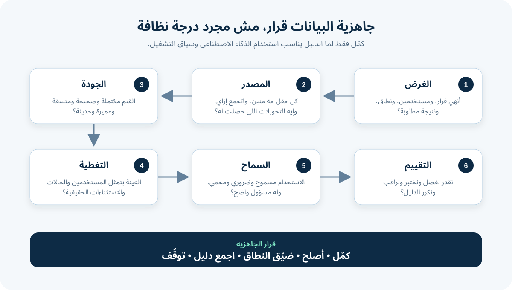

# جاهزية البيانات لمشروعات الذكاء الاصطناعي

**جاهزية البيانات (Data Readiness)** معناها إن عندك دليل إن البيانات مناسبة ومسموح باستخدامها ومفهومة وقابلة للصيانة لاستخدام AI محدد. مش معناها إن ملف Excel مفيهوش خلايا فاضية، أو إن المؤسسة عندها Database ضخمة.

بالنسبة لمحلل الأعمال (Business Analyst - BA)، الجاهزية قرار عمل. إنت بتربط القرار المقترح بالبيانات اللي بتمثله، وتكشف البيانات اتعملت إزاي، وتحدد مستوى الجودة المقبول، وتوضح الفجوات قبل ما الـModel يحولها لسلوك مكلف.

الشرح بيكمل مثال المتجر الأونلاين. الفرصة المفضلة هي مساعد يقترح سبب الإرجاع والـQueue المناسبة، وموظف بيأكد أو يصحح كل اقتراح. كل الأدوار والحقول والأحجام والحدود والسياسات افتراضات للتعليم.

## 1. ابدأ بالقرار المقصود، مش بالـDataset المتاحة

المتجر عنده خمس سنين من طلبات الإرجاع، ففريق المشروع قال: «عندنا Training Data كتير». الجملة دي تثبت إن البيانات موجودة، مش إنها صالحة.

اكتب الأول **بيان غرض للبيانات (Data Purpose Statement)** يكون محدودًا:

> في طلبات الإرجاع المكتوبة بالإنجليزية لفئة منتجات واحدة، استخدم معلومات الطلب المعتمدة علشان تقترح سببًا واحدًا وQueue واحدة. موظف متدرّب يأكد أو يصحح الاقتراح. النظام ممنوع يوافق على Refund، أو يتهم العميل باحتيال، أو يبعت رسالة تلقائيًا.

البيان ده هو السياق اللي هتقيّم البيانات على أساسه.

| سؤال الغرض | إجابة المثال | ليه الـBA بيسجلها؟ |
|---|---|---|
| الناتج المطلوب إيه؟ | اقتراح `return_reason` و`queue` | بيحدد الـLabels واختبارات القبول |
| مين هيستخدمه؟ | فريق دعم واحد متدرّب | بيحدد المستخدمين ودليل الـWorkflow |
| أنهي حالات داخل النطاق؟ | نص إنجليزي وفئة منتجات واحدة | بيحدد الـPopulation والحدود |
| أنهي حالات مستبعدة؟ | الاشتباه في احتيال وشكاوى سهولة الوصول والحالات ببيانات تالفة | يمنع التعميم غير الآمن |
| دور الإنسان إيه؟ | يأكد أو يصحح كل اقتراح | بيحدد بيانات المراجعة والبديل |
| أنهي نتيجة مهمة؟ | توجيه أسرع من غير أخطاء ضارة أكتر | بيربط الجودة بقيمة العمل |

**إجراء الـBA:** احتفظ بنسخ Versioned من بيان الغرض. لو الفريق ضاف لغات أو منتجات أو ردود مباشرة للعميل أو تنفيذ تلقائي، قيّم الجاهزية من جديد؛ الإجابة القديمة ما تغطيش الاستخدام الجديد.

## 2. اعمل خريطة لاحتياجات البيانات

حوّل الـWorkflow لأقل بيانات مطلوبة. افصل المعلومات الموجودة **قبل** الاقتراح عن المعلومات اللي بتتعمل **بعد** القرار.

- الـ**Feature** هو Input ممكن يساعد النظام يعمل اقتراح، زي نص الطلب أو فئة المنتج.
- الـ**Label** هو الإجابة المتوقعة في Supervised Learning، زي سبب الإرجاع المؤكد.
- الـ**Ground Truth** هو أفضل مرجع متاح بنقيّم عليه الناتج. هو دليل، مش حقيقة كاملة تلقائيًا.
- الـ**Proxy** مقياس متاح بنستخدمه بدل حاجة أصعب في الملاحظة. لازم تبرر ليه ينفع يمثلها.

| عنصر البيانات | دوره | المصدر | متاح وقت القرار؟ | سؤال مهم |
|---|---|---|---|---|
| `request_text` | Feature | Web Form واستقبال الإيميل | أيوه | هل العميل كتب معلومات حساسة ملهاش لازمة؟ |
| `product_category` | Feature | كتالوج الطلبات | أيوه | أنهي Version من التصنيف اتستخدم؟ |
| `order_status` | Feature | Order Service | أيوه | الـTimestamp متوافق مع وقت فتح الطلب؟ |
| `agent_selected_reason` | Label محتمل | أداة الدعم | بعد المراجعة | الموظف صححه ولا قبل Default؟ |
| `final_queue` | Label محتمل | سجل التوجيه | بعد التعامل | بيمثل الـQueue الصح ولا أول Queue فقط؟ |
| `resolution_time` | مقياس نتيجة | نظام الحالات | بعد الإغلاق | بيشمل وقت انتظار العميل؟ |

هنا بيظهر فخّين مشهورين:

1. **تسريب الهدف (Target Leakage):** حقل اتعمل بعد القرار يدخل بالغلط كـInput. الـModel ممكن يبان ممتاز في الاختبار، لكن الدليل ده مش هيكون موجودًا وقت التشغيل.
2. **Proxy ضعيف:** الفريق يعتبر «أول Queue» هي الإجابة الصح، رغم إن طلبات كتير بيتعاد توجيهها.

**سؤال الـBA:** «هل القيمة دي ممكن تكون موجودة بالشكل ده، في اللحظة اللي الـWorkflow الحقيقي محتاج فيها الاقتراح؟»

## 3. تتبّع المصدر والتحويلات

**مصدر البيانات وتاريخها (Data Provenance)** هو السجل اللي بيوضح البيانات جت منين وإيه اللي حصل لها. ده بيساعد الفريق يفسر القيم ويكرر التقييم.

اعمل Lineage بسيط لكل عنصر مهم:

`Customer Form → Intake Service → Case Record → Agent Edits → Routing Log → Analytics Extract`

سجّل في كل خطوة:

| تفصيلة في الـLineage | مثال الإرجاع |
|---|---|
| الأصل والمسؤول | طلب العميل؛ فريق Digital Support مسؤول عن تعريفات الاستقبال |
| غرض الجمع | فتح حالة دعم للإرجاع وتوجيهها |
| الوقت والـVersion | وقت الإنشاء ونسخة السياسة ونسخة الـForm |
| التحويل | إزالة HTML؛ توحيد أكواد الفئات؛ دمج الأحداث المكررة |
| تدخل الإنسان | الموظف ممكن يغيّر السبب الافتراضي ويضيف Notes |
| قيد معروف | طلبات الإيميل ناقص فيها حقلين موجودين في الـForm |
| التحديث والاحتفاظ | Extract يومي؛ قرار الاحتفاظ لسه مفتوح |

ما تقبلش «جاية من الـData Warehouse» كمصدر كفاية. الـWarehouse مكان؛ ما بيشرحش الجمع الأصلي ولا المعاني ولا التصحيحات ولا الـPopulation الناقصة.

## 4. اعمل Data Profiling بقواعد مرتبطة بالاستخدام

جودة البيانات معناها إنها **مناسبة للغرض**. جملة زي «الجودة 95%» بتخفي أنهي عيب مهم وفين موجود. عرّف قواعد على مستوى الحقل والسجل والعلاقة بين البيانات.

| البُعد | سؤال الـBA | قاعدة في المثال | الدليل |
|---|---|---|---|
| **الاكتمال (Completeness)** | القيم المطلوبة موجودة؟ | `request_text` موجود في كل Ticket داخل النطاق | نسبة النقص حسب قناة الاستقبال |
| **الصلاحية (Validity)** | القيمة ماشية مع الشكل أو القائمة المسموحة؟ | `queue` ضمن قائمة الـQueues المعتمدة في تاريخ الحالة | القيم غير الصالحة ونسخة القاعدة |
| **الاتساق (Consistency)** | الأنظمة والحقول متفقة؟ | فئة المنتج متطابقة بين نظام الطلب ونظام الحالة | نسبة الاختلاف حسب المصدر |
| **عدم التكرار (Uniqueness)** | فيه حالات أو أحداث متكررة؟ | Ticket ID أساسي واحد لكل طلب | مجموعات التكرار وسببها |
| **الحداثة (Timeliness)** | القيمة حديثة كفاية للقرار؟ | السياسة وربط الـQueues مناسبين لتاريخ الحالة | عمر البيانات ونسبة الربط القديم |
| **الدقة (Accuracy)** | القيمة بتمثل الحدث الحقيقي؟ | السبب المؤكد متوافق مع دليل الحالة المراجَع | عينة المراجعة وإرشادات المراجعين |

أي نسبة محتاجة Denominator وتقسيمات. «4% فقط ناقص» ممكن تخفي إن 45% من طلبات الإيميل ناقص فيها نفس الحقل. سجّل الفترة والـQuery والـPopulation والاستبعادات والمسؤول والحساب علشان شخص تاني يقدر يكرر النتيجة.

### Profile صغير قبل Build كبير

في التقييم المبكر، الـBA ممكن ينسق مراجعة لعينة ممثلة بدل ما يطلب برنامج تنظيف كامل فورًا. نتائج المثال التعليمية:

| النتيجة | الحالة | معناها للفرصة |
|---|---|---|
| نص الطلب موجود في 98% من Web Tickets داخل النطاق | أخضر | نقدر نكمل بحث Web Tickets |
| نص الإيميل فيه Signatures وتفاصيل طلب بأشكال غير متسقة | أصفر | اعمل Filtering أو استبعد الإيميل من أول Pilot |
| 17% من الطلبات اتوجهت تاني بعد أول Queue | أحمر لو هنستخدم أول Queue كـLabel | عرّف Label لتوجيه نهائي تم التحقق منه |
| أكواد الـQueues اتغيرت بعد إعادة تنظيم | أصفر | اربط الأكواد بتاريخ سريانها وما تدمجهاش عمياني |

الأرقام دي للتعليم. في تقييم حقيقي، اربط كل رقم بالـQuery أو سجل المراجعة بتاعه.

## 5. اختبر التغطية والتمثيل

الـDataset ممكن تكون كبيرة، وبرضه ناقصها ظروف مهمة. **التمثيل (Representativeness)** بيسأل: هل البيانات المستخدمة في التطوير والتقييم شبه الناس والحالات والبيئات والفترات اللي النظام هيشتغل فيها؟

قارن الـPopulation المقصودة بالعينة المتاحة عبر التقسيمات المهمة:

- قناة الاستقبال واللغة؛
- فئة المنتج وسبب الإرجاع؛
- المسار العادي والاستثناءات النادرة؛
- الفترات قبل وبعد تغيير سياسة أو Process؛
- مجموعات مستخدمين ممكن نتيجة الخطأ تختلف عليهم؛
- طلبات قصيرة وطويلة وغامضة وفيها Noise.

| التقسيم | نسبته في النطاق الحقيقي | نسبته في العينة المقترحة | السؤال |
|---|---:|---:|---|
| Web Form | 70% | 94% | هل أداء الإيميل هيبقى مستخبي؟ |
| Email | 30% | 6% | نستبعده ولا نجمع ولا نسحب عينة أكبر؟ |
| حالات «منتج غلط» | 8% | 2% | الـLabels ناقصة ولا الـExtraction منحاز؟ |
| شهر تغيير السياسة | 9% | 23% | هل سلوك مؤقت هيسيطر على العينة؟ |

تساوي النسب مش هدف تلقائي. الفريق محتاج دليل كفاية لتقييم الاستخدام المتوقع والأضرار المهمة. لما المجموعة صغيرة أو نتيجة الخطأ خطيرة، استخدم خبرة المجال ومراجعة موجهة بدل الاعتماد على Average عام فقط.

## 6. راجع الـLabels وقواعد الـAnnotation

التصرفات التاريخية مش Labels صحيحة تلقائيًا. ممكن تكون نتيجة شغل مستعجل أو سياسة قديمة أو Defaults أو تفسير غير متسق أو معاملة غير عادلة.

اعمل **Label Specification**:

| حقل الـLabel | التعريف |
|---|---|
| الاسم | `verified_return_reason` |
| القيم المسموحة | قائمة الأسباب الحالية ومعاها `unclear` |
| الدليل المستخدم | الطلب وحقائق الـOrder المتاحة وقت الاستقبال والسياسة المعتمدة |
| مين بيحطه؟ | مراجعين متدرّبين ما تعاملّوش مع الحالة الأصلية لو ده عملي |
| قاعدة الغموض | استخدم `unclear`؛ ما تخمنش من هوية العميل أو النتيجة |
| التصعيد | Domain Owner يحسم الخلافات المتكررة |
| النسخة | نسخة دليل الـLabel وتاريخ سريانه محفوظين مع السجل |

خلي مراجعين يعملوا Label لنفس جزء من العينة. ابحث أسباب الخلاف حسب السبب ونوع الحالة. الاتفاق مش دليل تلقائي على العدالة أو الصحة، لكن الخلاف ممكن يكشف تعريفات غامضة أو دليلًا ناقصًا أو سياسة مش واضحة.

**خطأ شائع:** حذف الحالات المختلف عليها علشان الـDataset تبان نظيفة. ممكن تكون دي بالضبط الحالات اللي الـWorkflow الحقيقي محتاج فيها توضيح أو رجوع لإنسان.

## 7. أكد السماح والضرورة والحماية

«إحنا عندنا البيانات» غير «مسموح نستخدمها للغرض ده». دخّل Data Owner وPrivacy وSecurity وLegal وRecords وأصحاب خبرة المجال حسب التزامات المؤسسة.

سجّل لكل مصدر:

- الغرض المعتمد والاستخدام الجديد المقترح؛
- المسؤول وقرار الوصول؛
- هل فيه بيانات شخصية أو سرية أو مرخصة أو جاية من طرف ثالث؛
- أقل حقول مطلوبة والحقول اللي لازم تتشال أو تتحول؛
- صلاحيات الوصول ومكان التخزين والنقل والاحتفاظ والحذف والتعامل مع الحوادث؛
- قيود الـVendors أو Model Providers أو إعادة الاستخدام أو النقل بين الدول؛
- إزاي الشخص المتأثر يطلب مساعدة أو تصحيحًا لما يكون مناسبًا.

ما تحولش ده لحكم قانوني من الـBA. الـDeliverable بتاعك هو أسئلة ودليل ومسؤولون وموافقات وقيود وقرارات مفتوحة، وكلهم قابلين للتتبع.

في المثال، اسم العميل وعنوانه الكامل مش بيساعدوا في اقتراح سبب الإرجاع. حذفهم يقلل التعرض. والنص الحر لسه محتاج مراجعة لأن العميل ممكن يكتب معلومة حساسة الـForm ما طلبهاش.

## 8. صمّم بيانات التقييم قبل التطوير

الفريق محتاج دليل منفصل عن البيانات اللي الـModel اتعلم أو اتظبط عليها.

- **Training Data** بتساعد الـModel يتعلم Patterns.
- **Validation Data** بتساعد تقارن وتضبط الاختيارات المرشحة.
- **Test Data** بتفضل محجوزة لتقييم نهائي أقل تحيزًا.
- **Pilot Data** بتوضح السلوك في الـWorkflow الحقيقي داخل حدود مضبوطة.

سجلات نفس محادثة العميل أو Duplicate Ticket أو طلب إرجاع مرتبط ما ينفعش تتسرب بين المجموعات دي. ولو السياسات والسلوك بيتغيروا مع الوقت، تقسيم حسب الزمن ممكن يبقى أصدق من Random Split. الفريق التقني يصمم الطريقة، والـBA يتأكد إنها بتمثل خط الزمن وظروف التشغيل.

حدد Evaluation Slices وحالات الرجوع للبديل قبل ما النتائج تظهر. غير كده الفريق ممكن يفضل يغيّر الاختبار لحد ما الحل المفضل يبان ناجحًا.

## 9. خطط للتغيير بعد الإطلاق

جاهز النهارده مش معناها جاهز للأبد. منتجات جديدة أو موسم أو تغيير سياسة أو قنوات أو لغة العملاء أو أسلوب فريق الدعم ممكن يغيروا شكل الـInputs ومعنى الـLabels. ده بيتسمى غالبًا **Data Drift** أو تغير التوزيع.

اعمل متطلبات Monitoring:

| الحاجة اللي هنراقبها | Trigger في المثال | استجابة المسؤول |
|---|---|---|
| القيم الناقصة وغير الصالحة | تعدّي الحد المعتمد في تحميلين يوميين | Data Owner يبحث مشكلة الـPipeline ويوقف النطاق المتأثر |
| تغطية التقسيمات | فئة منتج جديدة تعدّي حدود الـPilot | Product Owner يقرر هل تتقيّم وتتضاف |
| تصحيح الـLabels | Override Rate تزيد بشكل مهم لسبب معين | Domain Owner يراجع الدليل والـWorkflow ودليل الـModel |
| نسخة المصدر أو السياسة | سياسة الـQueues تتغير | أعد ربط الـLabels وقيّم قبل استمرار الاستخدام |
| حوادث البيانات الحساسة | اكتشاف حقل أو Text Pattern ممنوع | نفّذ Incident Process وأوقف المعالجة المتأثرة |

ما تحطش أرقامًا عامة في Template. الـThresholds لازم تعكس الاستخدام ونتيجة الخطأ والـBaseline ومستوى المخاطر المقبول في المؤسسة.

## 10. مثال مكتمل لـData Readiness Assessment

| المجال | الدليل من مثال توجيه الإرجاع | الحالة | الإجراء والمسؤول |
|---|---|---|---|
| الغرض والنطاق | Web Tickets إنجليزية، فئة واحدة، اقتراح فقط | أخضر | Product Owner يتحكم في تغيير النطاق |
| المصدر | الـLineage الأساسي مترسم؛ تحويلات الإيميل ناقصة | أصفر | Data Steward يوثق مسار الإيميل |
| جودة الـInputs | نص الويب موجود غالبًا؛ فيه اختلافات بين القنوات | أصفر | Analyst يعمل Profile حسب القناة والشهر |
| جودة الـLabels | أول Queue غير موثوقة؛ السبب النهائي المتحقق مش موجود | أحمر | Domain Lead يعمل Label Guide ويراجع عينة |
| التغطية | الويب ممثل زيادة؛ الحالات النادرة ناقصة | أصفر | ضيّق الـPilot واجمع أمثلة موجهة |
| السماح وتقليل البيانات | الموافقة مفتوحة؛ الاسم والعنوان مش ضروريين | بوابة حمراء | Privacy وData Owners يقرروا ويحذفوا الحقول |
| التقييم | التقسيم مقترح؛ تسريب الـTickets المرتبطة ما اتختبرش | أصفر | Data Scientist يختبر Grouping والتقسيم الزمني |
| المراقبة | فيه مقاييس Draft؛ الـTriggers والمسؤولون ناقصين | أصفر | Operations Owner يعتمد الحدود والاستجابة |
| القرار | البيانات مش جاهزة لبناء الحل الكامل | **أصلح وضيّق النطاق** | اعمل Labels متحققة وأكد السماح واستخدم Web فقط، وبعدها راجع تاني |

الحالة الحمراء مش معناها المشروع فشل. هي بتمنع ثقة زائفة وبتقول للفريق أنهي دليل يستحق يتعمل بعد كده.

## 11. حوّل الفجوات لمتطلبات وBacklog Items

«نظّف البيانات» جملة مش قابلة للاختبار. حوّل كل فجوة لنتيجة لها مسؤول:

> **متطلب جودة بيانات:** في Population الـWeb Tickets المعتمدة للـPilot، كل سجل داخل النطاق لازم يحتوي على Request Text غير فارغ، وفئة منتج صالحة في تاريخ الـTicket، وسبب حدده مراجع باستخدام Label Guide v1. أي سجل يفشل قاعدة يتم استبعاده والإبلاغ عنه حسب القاعدة والمصدر.

مثال Remediation Backlog:

| البند | دليل القبول | المسؤول | القرار اللي هيفتحه |
|---|---|---|---|
| نشر Label Guide v1 | تعريفات وأمثلة ومسار غموض معتمدة | Domain Lead | هل المراجعين يقدروا يعملوا Labels مفيدة؟ |
| مراجعة عينة مقسمة | Review Log وتحليل الخلاف | Domain Reviewers | هل الـLabels موثوقة كفاية للتقييم؟ |
| تأكيد استخدام البيانات | موافقة وقيود ومدة احتفاظ مسجلة | Data وPrivacy Owners | هل الـPilot مسموح له يعالج البيانات؟ |
| اختبار سلامة التقسيم | مفيش Case مرتبط في مجموعتين والفترة مسجلة | Data Scientist | هل دليل التقييم ممكن الدفاع عنه؟ |
| إعادة تقييم الجاهزية | Assessment محدث وقرار Go/No-Go | Product Owner | نبني ولا نجمع أكتر ولا نضيّق ولا نتوقف؟ |

## 12. أخطاء شائعة في جاهزية البيانات

- **عدّ الصفوف بدل اختبار الصلاحية:** الحجم ما يثبتش الصلة أو التنوع أو الصحة.
- **التنظيف قبل تعريف الاستخدام:** الفريق ممكن يتقن حقول القرار مش محتاجها.
- **اعتبار القرارات التاريخية حقيقة:** السلوك القديم ممكن يحتوي أخطاء وقواعد انتهت.
- **استخدام نسبة جودة عامة واحدة:** الـAverage بيخفي فشل مصدر أو فترة أو Population.
- **حذف الحالات الصعبة من غير توضيح:** التقييم ما بقاش بيمثل الـWorkflow الحقيقي.
- **تجاهل الحقول غير المتاحة وقت القرار:** الـLeakage بيعمل أداء اختبار غير واقعي.
- **شراء بيانات من غير فحص الحقوق والـLineage:** الوصول ما يثبتش إن إعادة الاستخدام مسموحة أو المعنى موثوق.
- **افتراض إن الـVendor مسؤول عن الجاهزية:** المؤسسة لسه مسؤولة عن الغرض والقيود والتأثير والقرار.

## 13. قالب Data Readiness Assessment قابل لإعادة الاستخدام

| المجال | الدليل المطلوب | الحالة | الفجوة والإجراء والمسؤول والتاريخ |
|---|---|---|---|
| القرار والمستخدمون والنتيجة المقصودة | | | |
| الـPopulation داخل النطاق والمستبعدة | | | |
| الـFeatures والـLabels والمقاييس المطلوبة | | | |
| المصدر والـProvenance والتحويلات | | | |
| الاكتمال والصلاحية والاتساق وعدم التكرار والحداثة والدقة | | | |
| التغطية والاستثناءات والمجموعات المتأثرة | | | |
| تعريف الـLabel وعملية المراجعة | | | |
| السماح وتقليل البيانات والأمان والاحتفاظ | | | |
| فصل Training وValidation وTest وPilot | | | |
| المراقبة والحدود والبديل وإدارة التغيير | | | |
| التوصية النهائية وصاحب القرار | | | |

استخدم **أخضر** فقط لما الدليل يكفي للمرحلة الحالية، و**أصفر** لما بحث محدد أو Control يقدر يقفل عدم اليقين، و**أحمر** لما الخطة الحالية لازم ما تكملش. سجّل السبب؛ اللون لوحده مش دليل.

## 14. تمرين عملي

بنك بيفكر في مساعد AI يقترح تصنيفًا لأسئلة العملاء المكتوبة عن معاملات البطاقات. الـDataset المتاحة فيها نص الحالة وأول تصنيف والتصنيف النهائي وAgent Notes وCustomer Segment ونتيجة الحل.

1. اكتب Data Purpose Statement محدودًا وثلاثة استبعادات واضحة.
2. صنّف كل حقل كـFeature محتملة أو Label أو Outcome Measure أو حقل حساس أو خطر إنه مش متاح وقت القرار.
3. اكتب خمس قواعد جودة قابلة للقياس ومعاها الـPopulation والـDenominator.
4. سمّي أربع تقسيمات محتاجة Coverage Check واشرح ليه.
5. حدد Leakage Path محتملًا وProxy ضعيفًا.
6. وصّي: كمّل، أصلح، ضيّق، اجمع، أو توقّف—وحدد الدليل اللي ممكن يغيّر توصيتك.

ما تخترعش صلاحيات قانونية أو قواعد احتيال أو أهداف دقة أو تأثيرات على مجموعات العملاء. سجلها كقرارات أو احتياجات دليل عند المسؤولين المناسبين.

## مراجع للتوسع

- [NIST AI RMF Core: Map وMeasure](https://airc.nist.gov/airmf-resources/airmf/5-sec-core/)
- [NIST AI RMF Playbook: Govern](https://airc.nist.gov/airmf-resources/playbook/govern/)
- [NIST AI RMF Playbook: Measure](https://airc.nist.gov/airmf-resources/playbook/measure/)
- [Google Machine Learning Crash Course: خصائص البيانات](https://developers.google.com/machine-learning/crash-course/overfitting/data-characteristics)
- [Google ML Universal Guides: جودة البيانات وتفسيرها](https://developers.google.com/machine-learning/guides/data-traps/quality)
- [IIBA: Ready to Get Data-Smart?](https://www.iiba.org/business-analysis-blogs/ready-to-get-data-smart-here-are-6-ways-to-use-data-effectively/)
