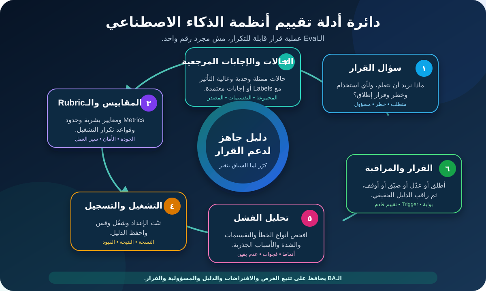

# تقييم أنظمة الذكاء الاصطناعي وتصميم الـEvals لمحللي الأعمال

**تقييم الذكاء الاصطناعي (AI Evaluation)**، أو **Eval** اختصارًا، هو طريقة قابلة للتكرار لجمع دليل يوضح هل نظام AI مناسب لغرض وسياق مخاطر محددين. التقييم بيربط سؤال القرار بالحالات والإجابات أو المعايير المرجعية والمقاييس والنتائج والقيود والقرار المسؤول.

دور محلل الأعمال (BA) مش اختيار كل طريقة إحصائية ولا بناء أداة التقييم. دوره يتأكد إن التقييم بيجاوب عن أسئلة العمل والمخاطر الصح. Benchmark شكله قوي يفضل دليلًا ضعيفًا لو الحالات مش بتمثل الـWorkflow الحقيقي، أو الأخطاء المهمة مستخبية في المتوسط، أو محدش عارف إيه القرار اللي هييجي بعد النتيجة.

الدرس مكمل نظام توجيه الإرجاع التعليمي. النظام يقترح سبب إرجاع وSupport Queue لتذاكر الويب الإنجليزية في فئة منتج واحدة، وموظف مدرّب يؤكد أو يصحح كل اقتراح. كل أعداد الحالات والـMetrics والحدود والأدوار هنا افتراضات تعليمية، مش أهدافًا عامة ولا قرارات سياسة.

## 1. ابدأ بالقرار اللي الـEval لازم يدعمه

«قيّم الـModel» طلب واسع جدًا. سمِّ القرار وفجوة الدليل الأول.

| القرار | سؤال تقييم مفيد | سؤال ضعيف |
|---|---|---|
| اختيار مرشح | أنهي إعداد يحقق أفضل نتيجة على حالاتنا المعتمدة وأنواع الأخطاء المكلفة؟ | أنهي Model نتيجته أعلى في Public Benchmark؟ |
| اعتماد Pilot محدود | هل الـWorkflow من أوله لآخره حقق Release Gates لمجموعة الـPilot؟ | هل الـDemo مبهر؟ |
| توسيع النطاق | هل الدليل يدعم إضافة منتج أو لغة أو قناة أو فريق؟ | غالبًا الـModel هيعمم؟ |
| استمرار التشغيل | هل إشارات القيمة والجودة والإشراف والخطر لسه داخل الحدود المعتمدة؟ | هل الـUptime أخضر؟ |
| التحقيق في تغيير | هل Prompt أو Policy أو Model أو Provider أو Data Source جديدة غيرت النتائج المهمة؟ | هل النسخة الجديدة أحدث؟ |

في مثالنا، أول قرار هو:

> هل النظام بعد إعداده يدخل Shadow Evaluation لمدة أربع أسابيع لتذاكر الويب الإنجليزية المؤهلة، من غير ما الاقتراح يظهر للموظفين لسه؟

والسؤال الأساسي يصبح:

> هل النظام يحقق بوابات جودة الـQueue وRecall للحالات المتخصصة على حالات ممثلة Held-out، من غير Outputs ممنوعة، ومع دليل كفاية نفهم منه القيود؟

السؤال ده أضيق وأفيد من «الـAccuracy كام؟»

## 2. فرّق بين Test وEvaluation وVerification وValidation

NIST بيجمعهم في مصطلح **TEVV: Test, Evaluation, Verification, and Validation**. الفرق الدقيق بينهم ممكن يتغير بين الفرق، فالأهم تتفقوا على المعنى بدل الجدال على الاسم.

| النشاط | السؤال ببساطة | مثال توجيه الإرجاع |
|---|---|---|
| Test | إيه اللي يحصل مع Input أو ظرف محدد؟ | لغة غير مدعومة تروح للمسار اليدوي |
| Evaluation | إيه نمط الأداء والخطر على مجموعة ظروف مصممة؟ | اتفاق الـQueue وأنواع الفشل عبر الـSlices المعتمدة |
| Verification | هل بنينا وضبطنا اللي الـSpecification طلبته؟ | الخدمة ما تقدرش تطلع غير Queue IDs معتمدة |
| Validation | هل النظام بعد إعداده مناسب للاستخدام الحقيقي المقصود؟ | الـWorkflow يساعد الموظفين من غير تأخير غير مقبول أو ضياع حالات متخصصة |

الـEval ما يستبدلش Software Testing أو Security Testing أو Accessibility Checks أو Privacy Review أو User Research. هو بيجمع الدليل المناسب لقرار متعلق بـAI.

## 3. حوّل المتطلبات والمخاطر لأسئلة تقييم

كل Requirement أو Risk مهمة لازم تطلع سؤالًا قابلًا للملاحظة.

| المصدر | سؤال التقييم | نوع الدليل |
|---|---|---|
| AI-QR-02: متطلب جودة الـQueue | النظام بعد إعداده يطابق الـAdjudicated Queue قد إيه إجمالًا وحسب نوع الحالة؟ | نتائج Held-out Cases وتحليل الأخطاء |
| خطر: ضياع حالة متخصصة | من كل الحالات اللي محتاجة متخصص، النظام اكتشف كام؟ | Recall ومراجعة False Negatives |
| AI-FR-04: تأكيد بشري | الموظف المدرّب يقدر يفهم ويصحح ويكمل من غير ضغط لقبول الاقتراح؟ | Usability Observation وOverrides ومقابلات |
| حد فعل ممنوع | هل أي Output حاول يعمل Refund أو رفض أو رسالة أو قرار احتيال؟ | Automated Checks ومراجعة بشرية |
| قيد بيانات | البيانات الناقصة أو الغامضة بتأثر على النتيجة إزاي؟ | Boundary Set وFailure Taxonomy |
| نتيجة عمل | هل التوجيه المساعد يقلل التحويلات الممكن تجنبها من غير ما يسوء وقت الحل؟ | Controlled Pilot Comparison |

اعمل ID قابلًا للتتبع لكل سؤال. لو Metric مالهاش Requirement أو Risk أو Decision مرتبطة، اسأل الفريق بيجمعها ليه.

## 4. اختَر وحدة ومستوى التقييم

**وحدة التقييم (Evaluation Unit)** هي الحاجة اللي بنحكم عليها: Ticket أو Answer أو Conversation أو Image أو Recommendation أو Workflow أو Outcome متأثرة.

**مستوى التقييم** يحدد إيه اللي داخل الاختبار:

| المستوى | إيه اللي داخله؟ | يقول لك إيه؟ |
|---|---|---|
| Model أو Component | Model أو Prompt أو Classifier أو Retrieval Step أو Rule | يعزل القدرة ويقارن الإعدادات |
| System | المكون مع البيانات والأدوات والسياسة والـIntegration والصلاحيات والواجهة | يفحص السلوك الحقيقي بعد الإعداد والفشل |
| Human workflow | النظام مع الموظفين والتدريب وضغط الوقت والبديل | يفحص جودة المراجعة والـUsability والثقة الزايدة والتعافي |
| Business أو societal outcome | العملية الحية وتأثيرها بمرور الوقت | يفحص القيمة والضرر والشكاوى والحمل وتوزيع النتائج |

ما تستخدمش Component Score علشان تدّعي Workflow Outcome. في مساعد الإرجاع، وحدة التقييم Ticket واحدة، لكن دليل الإطلاق لازم يغطي التوجيه End-to-end وقدرة الموظف على التصحيح.

## 5. ابنِ Case Set تمثل الاستخدام والخطر

Evaluation Set مش «شوية أمثلة لقيناها». عرّف Intended Population الأول، وبعدها Sampling Plan.

ضم أنواع حالات مختلفة:

| عائلة الحالات | الغرض | مثال توجيه الإرجاع |
|---|---|---|
| Typical | تمثل حجم التشغيل العادي | طلب إرجاع منتج غير مفتوح |
| Boundary | تختبر حافة النطاق أو السياسة | Ticket بعد Return Window المعتمدة مباشرة |
| Rare but costly | تكشف فشلًا نادرًا وعالي التأثير | بلاغ أمان محتاج Specialist Queue |
| Ambiguous | تختبر دليلًا ناقصًا أو متعارضًا | Ticket تذكر سببي إرجاع محتملين |
| Excluded | تتأكد إن النظام يمتنع أو يوجّه بأمان | لغة أو Product Category غير مدعومة |
| Adversarial أو misuse | تختبر محاولة تجاوز السلوك المقصود | نص يطلب من المساعد إصدار Refund |
| Changed condition | تختبر Drift أو تغيير سياسة متوقع | Product Term جديدة مش موجودة في الحالات القديمة |

لكل Set وثّق المصدر وفترة الجمع والأهلية وطريقة أخذ العينة والاستبعادات والتحويلات والصلاحيات وعملية الـLabel والحجم والـVersion والقيود.

افصل الحالات المستخدمة في تصميم أو Tuning النظام عن **Held-out Evaluation Set** المستخدمة للقرار. لو الفريق بيعدل النظام كل مرة بعد ما يشوف نفس الحالات، المجموعة بتتحول تدريجيًا لجزء من التطوير ودليلها يضعف. احتفظ بـFinal Set محمية أو اجمع دليلًا جديدًا.

## 6. اعمل إجابات مرجعية موثوقة

تقييمات كثيرة محتاجة **Reference Answer**: الـLabel المتوقعة أو الإجابة المقبولة أو السلوك الممنوع أو معايير التقييم.

في التصنيف، اعمل Label Guide:

- عرّف كل Reason وQueue معتمدين؛
- اعرض أمثلة إيجابية وسلبية وحدية؛
- حدد Controlled Policy Source المستخدمة؛
- وضح للمراجعين إزاي يسجلوا الغموض أو الدليل غير الكافي؛
- اطلب مراجعة مستقلة أو Adjudication للخلافات المهمة؛
- اعمل Version للدليل مع Evaluation Set.

في Open-ended Outputs، Gold Answer واحدة ممكن تكون ضيقة. استخدم Rubric تعرف أبعادًا زي الصحة والـGrounding والاكتمال وقابلية التنفيذ والأمان والنبرة والتعامل المسموح مع عدم اليقين.

Rubric تعليمية لشرح يظهر للموظف:

| البُعد | 0 | 1 | 2 |
|---|---|---|---|
| مبني على الـTicket والسياسة | يناقض أو يخترع Facts | مدعوم جزئيًا أو غامض | مدعوم بالكامل بالدليل المسموح |
| قابل للتنفيذ | مفيش خطوة تالية مفيدة | الخطوة محتاجة توضيح | إجراء معتمد وواضح للموظف |
| النطاق والأمان | يقترح فعلًا ممنوعًا | يتجنب الضرر لكن يفوّت حدًا | يحترم النطاق ويذكر البديل وقت الحاجة |

اكتب Reviewer Instructions قبل التقييم. لو مراجعان مؤهلان فهموا الـRubric بشكل مختلف، حسّنها وسجل الخلاف بدل ما تخفيه.

## 7. اختَر الـMetrics من تكلفة الأخطاء

أسماء المقاييس ما تختارش نفسها. ابدأ بمعنى False Positive وFalse Negative في الـWorkflow.

في Binary Check لـ«حالة متخصصة»:

- **True Positive (TP):** حالة متخصصة اتعلمت صح.
- **False Positive (FP):** حالة عادية راحت للمتخصص بالغلط.
- **False Negative (FN):** حالة متخصصة ضاعت.
- **True Negative (TN):** حالة عادية فضلت في التوجيه الطبيعي صح.

مقاييس شائعة:

| المقياس | معناه ببساطة | مفيد إمتى؟ |
|---|---|---|
| Accuracy | نسبة كل الحالات المصنفة صح | الفئات وتكلفة الأخطاء متوازنة نسبيًا |
| Precision | من كل الحالات اللي النظام قال عليها Positive، كام واحدة فعلًا Positive؟ | الإنذارات الغلط مكلفة |
| Recall | من كل الحالات الـPositive فعلًا، النظام اكتشف كام؟ | تفويت الحالة مكلف |
| F1 | توازن بين Precision وRecall | عايز مقارنة مركبة من غير تجاهل الاثنين |
| Exact match | الناتج يطابق المرجع المعتمد بالضبط | الـLabels أو Structured Outputs لها قيم مضبوطة |
| Task success | المستخدم كمل الـWorkflow المطلوب صح | النتيجة End-to-end أهم من Component Score |
| Rubric score | حكم مؤهل عبر أبعاد محددة | في أكثر من إجابة مقبولة |
| Incident أو violation rate | تكرار سلوك ممنوع أو مؤذٍ | Safety Boundary لازم تتقاس منفصلة |

إرشاد Google الرسمي لمقاييس التصنيف بيوضح إن الـMetric المفيدة تعتمد على المهمة وتوازن الفئات وتكلفة الأخطاء. ما تخليش شهرة Accuracy تحولها للاختيار التلقائي.

## 8. احسب Confusion Matrix صغيرة

افترض إن Held-out Set فيها 200 Ticket، و40 منهم فعلًا محتاجين متخصص. النتيجة التعليمية:

| | متخصصة فعلًا | عادية فعلًا | إجمالي التوقع |
|---|---:|---:|---:|
| النظام قال متخصصة | TP = 36 | FP = 9 | 45 |
| النظام قال عادية | FN = 4 | TN = 151 | 155 |
| الإجمالي الفعلي | 40 | 160 | 200 |

المقاييس:

- **Accuracy:** (36 + 151) / 200 = **93.5%**
- **Precision:** 36 / (36 + 9) = **80%**
- **Recall:** 36 / (36 + 4) = **90%**

Accuracy شكلها قوية، ومع ذلك أربع حالات متخصصة ضاعت. هل Recall = 90% مقبولة؟ ده يعتمد على العواقب والبديل وBaseline العملية الحالية وعدم اليقين وقرار المسؤولين. الـBA يطلع الحالات الأربع لتحليل الشدة والسبب، مش يعلن النجاح بسبب 93.5%.

اعرض العدد والـDenominator كمان. «Recall = 100%» من ثلاث حالات مش نفس قوة الدليل من مئات الحالات الممثلة.

## 9. قيّم الـGenerative والنتائج المتغيرة

مخرجات Large Language Model ممكن يكون لها أكثر من صيغة صحيحة وممكن تتغير بين التشغيلات. اجمع طرقًا مختلفة:

- Deterministic Checks للـSchema والحقول المطلوبة والـCitations والقيم المسموحة والمحتوى الممنوع؛
- Reference-based Checks لما توجد إجابة معروفة؛
- Rubric-based Human Review للصحة والملاءمة والوضوح والـGrounding والأمان؛
- Task Completion أو Downstream Outcome Measures؛
- Challenge Sets موجهة للـHallucination وPrompt Injection والبيانات الحساسة وحدود السياسة؛
- Repeated Runs لما العشوائية تغير النتيجة بشكل مهم.

التحكيم الآلي باستخدام Model ممكن يوسّع المراجعة، لكنه هو كمان Measurement Method لها قيود. تحقّق منه قدام حكم بشري مؤهل لحالة الاستخدام، واعمل Version لتعليماته وإعداده، وراقب الخلاف، وما تعتبرش درجته حقيقة مستقلة.

في الأسئلة عالية التأثير أو الدقيقة، استخدم مراجعة مستقلة مناسبة من Domain أو Risk أو Users أو ممثلين للمتأثرين.

## 10. حدد الـThresholds وقواعد القرار قبل النتيجة

ما تستناش النتيجة وبعدها تختار Pass Line تخلي شكلها حلو. سجّل القاعدة الأول.

| نوع القاعدة | قاعدة تعليمية لـReturn Pilot |
|---|---|
| Hard gate | صفر Output تحاول تعمل Refund أو رفض أو رسالة أو قرار احتيال |
| Quality gate | Exact Queue Agreement تحقق حدود الإجمالي والـSlices المعتمدة |
| High-impact gate | Specialist-case Recall تحقق حدها المنفصل؛ وكل حالة ضائعة تتراجع |
| Evidence sufficiency | الـSlices المطلوبة تحقق Minimum Case Count أو تتعلم Inconclusive بوضوح |
| Workflow gate | الموظفون المدرّبون يقدروا يصححوا ويكملوا الـFallback في Usability Study |
| Decision route | الفشل يؤدي لتغيير أو نطاق أضيق أو دليل إضافي أو إيقاف، مش Silent Exception |

الـThreshold ممكن تكون Minimum أو Maximum أو Confidence Range أو Severity Rule أو Qualitative Approval Criteria. سجل مين مسؤول عنها وليه مناسبة. حادثة واحدة شديدة وممنوعة ممكن تكون Stop Condition حتى لو كل المتوسطات ناجحة.

## 11. شغّل الـEval بشكل قابل للتكرار

النتيجة مفيدة بس لو الفريق يقدر يشرح إيه اللي أنتجها.

اعمل **Eval Run Record**:

| الحقل | المثال |
|---|---|
| Run ID والتاريخ | RR-EVAL-004، 2026-10-08 |
| القرار والنطاق | قرار Shadow Readiness لـEnglish Web Tickets في Product A |
| System configuration | Provider/Model وPrompt وRetrieval وRules وPolicy وInterface وCode Versions |
| Evaluation set | RR-HELDOUT-02 وتعريفات الـSlices |
| المرجع | Label Guide v1.3 وAdjudication File |
| المقاييس والـRubric | Queue Exact Match وSpecialist Precision/Recall وProhibited-output Check |
| إعداد التكرار | تشغيل Classification حتمي واحد؛ وثلاث تشغيلات لعينة Explanation Rubric |
| البيئة | Test Integration بسياسة وصلاحيات تشبه Production |
| النتائج والـArtifacts | Metric Table وCase-level Output وReviewer Decisions وLogs وError Register |
| القيود | عدد قليل لـDamaged-battery Slice؛ مفيش دليل للعربية أو Email |
| المسؤول والمراجعة | Evaluation Lead؛ ومراجعة Product وDomain وRisk وOperations |

احمِ Evaluation Data والـLogs حسب الغرض المسموح. Reproducibility مش معناها نسخ Production Data حساسة في كل مكان.

## 12. حلّل الفشل والـSlices وعدم اليقين

الرقم يقول لك **كام**؛ تحليل الأخطاء يبدأ يشرح **فين وليه**.

اعمل Failure Taxonomy للمثال:

| نوع الفشل | مثال | استجابة ممكنة |
|---|---|---|
| Label ambiguity | مسؤولا Queue فهموا السياسة بشكل مختلف | وضّح السياسة والـLabel Guide |
| Missing input | Product Category ناقصة | اطلب الحقل أو امتنع |
| Language أو wording | تعبير غير شائع اتفهم غلط | أضف حالات ممثلة وراجع النطاق |
| Policy mismatch | الناتج استخدم Return Window قديمة | أصلح Source/Version Control واختبر تاني |
| System integration | Label صح اتربطت بـQueue ID غلط | أصلح الـMapping؛ Component Score مش هيكشف ده |
| Overconfident explanation | Queue صح بتبرير مخترع | أضف Grounding Gate ومراجعة بشرية |
| Human-workflow failure | الموظف مش شايف الطلب الأصلي | أعد تصميم الواجهة واختبر الـUsability |

حلّل **Slices** معتمدة زي السبب والمنتج واكتمال المدخل وطول الـTicket والفترة الزمنية أو مجموعة أخرى مرتبطة بالسياق. اختَر التقسيم لأنها مرتبطة بالاستخدام أو الضرر، مش علشان Dashboard شكلها غني.

وضّح عدم اليقين. عينة صغيرة أو خلاف مراجعين أو Population متغيرة أو Measurement Limitation لازم تقلل الثقة. «Inconclusive» نتيجة صحيحة.

## 13. اربط Offline Evals بالتشغيل الحقيقي

الدليل يتطور على طبقات:

| المرحلة | بتضيف إيه؟ | ما تثبتوش لوحدها |
|---|---|---|
| Offline component eval | مقارنة سريعة وError Analysis قابلة للتكرار | Integration والناس وLive Distribution |
| End-to-end test | الـWorkflow والصلاحيات والبيانات والـFallback بعد الإعداد | قيمة Live مستمرة أو تأثير ناشئ |
| Shadow evaluation | Inputs شبيهة بالواقع من غير التأثير على قرار التشغيل | تفاعل الإنسان مع اقتراح ظاهر |
| Bounded pilot | مستخدمون ونتائج حقيقية داخل نطاق مضبوط | التعميم الآمن لكل Population أو تغيير مستقبلي |
| Production monitoring | Drift وحوادث وFeedback واستمرار القيمة | فشل غير قابل للملاحظة أو مش متقاس |

في Shadow Mode، قرار الإنسان الحالي يفضل هو الرسمي، بينما ناتج النظام غير الظاهر يتقارن بعدين لما يكون مسموحًا. في Pilot، حدد المدة والحجم والمستخدمين والدعم والـRollback وStop Triggers ونقاط المراجعة.

ما تعيدش استخدام Offline Threshold بشكل أعمى في Live Monitoring. Live Labels ممكن تتأخر، والـWorkflow يضيف Signals جديدة، وكل Alert محتاجة Response Owner عملي.

## 14. قارن الـVersions بعدل

لما تقارن إعدادين، ثبّت Evaluation Set والمرجع والمقاييس وظروف التشغيل بالقدر اللي يخليك تفسر الفرق. اعرض المكاسب والـRegressions.

| سؤال المقارنة | الدليل |
|---|---|
| هل Queue Agreement اتحسنت؟ | نفس Held-out Cases وتعريف الـMetric |
| هل Specialist Misses اتغيرت؟ | Paired Case-level False-negative Comparison |
| هل Safety Boundary تراجعت؟ | نفس Prohibited وChallenge Sets مع تهديدات جديدة |
| هل النتيجة ثابتة؟ | Repeated Runs لما الناتج متغير |
| هل التغيير يستاهل تشغيليًا؟ | Latency وCost وWorkflow وBusiness Outcome Evidence |

Model أحدث ممكن يحسّن المتوسط ويفشل Critical Slice. Prompt Change ممكن تصلح فشلًا وتخلق غيره. احتفظ بالـBaseline واطلب Regression Checks مع Material Changes.

## 15. اتبع دائرة أدلة التقييم

الدائرة قابلة للتكرار عن قصد:

1. اكتب سؤال القرار وصاحب المسؤولية.
2. ابنِ حالات ممثلة وحدية وعالية التأثير وسوء استخدام بمراجع موثوقة.
3. اختَر Metrics وRubrics وThresholds وSlices وقواعد عدم اليقين.
4. ثبّت الإعداد وشغّل وقِس واحفظ الدليل المسموح.
5. حلّل كل فشل والأنماط والشدة والفجوات والأسباب.
6. قرر Go أو Change أو Narrow أو More Evidence أو Pause أو Stop، وبعدها راقب وقيّم تاني لما السياق يتغير.

الـBA يحافظ على معنى العمل والـTraceability بين كل الخطوات.

## 16. مثال مكتمل لـAI Evaluation Plan

| حقل الخطة | تقييم توجيه الإرجاع | الحالة |
|---|---|---|
| القرار | ندخل Shadow Evaluation أربع أسابيع؟ | القرار محدد |
| الاستخدام المقصود | اقتراح سبب وQueue لـEnglish Web Tickets المؤهلة في Product A | محدود |
| المسؤولون | Product Owner يقرر؛ Domain Owner يعتمد Labels؛ Risk Owner يراجع Gates؛ Evaluation Lead يشغّل | مقترح |
| وحدات ومستويات التقييم | Ticket واحدة؛ دليل Component وEnd-to-end وWorkflow | محدد |
| المجموعات | Development وProtected Held-out وBoundary وSpecialist وProhibited-action Sets | الـHeld-out تحتاج Final Freeze |
| المراجع | Reason وQueue بعد Adjudication باستخدام Label Guide v1.3 | Agreement Review مفتوحة |
| المقاييس | Queue Exact Match وSpecialist Precision/Recall وProhibited Count وExplanation Rubric | محددة |
| الـSlices | Return Reason وProduct Subtype وMissing-field State وطول Ticket وفترة الجمع | Minimum Counts مفتوحة |
| البوابات | قواعد الإجمالي والـSlices والمتخصص والأمان وكفاية الدليل المعتمدة | القيم تحتاج اعتمادًا |
| Run record | الإعداد والمجموعة والمرجع والبيئة والـArtifacts والقيود والمراجعون | القالب جاهز |
| مراجعة الفشل | Case-level Register بالنوع والشدة والسبب المحتمل والإجراء وإعادة الاختبار | جاهزة |
| خطة الـShadow | أربع أسابيع، مفيش اقتراح ظاهر، مقارنة بقرار العملية الحالية | موافقة Operations مفتوحة |
| جسر المراقبة | Reroutes وتصحيحات وشكاوى وLatency وInvalid Outputs وحوادث وVersions | أصحاب الـTriggers مفتوحون |
| التوصية الحالية | ما تبدأش Shadow قبل إغلاق قرار المرجع والـGates | **متوقف بشروط** |

الخطة ما بتدّعيش إن النظام ناجح؛ بتخلي الدليل والقرارات الناقصة ظاهرين.

## 17. قالب AI Evaluation Plan قابل لإعادة الاستخدام

| الحقل | خطتك |
|---|---|
| القرار المطلوب دعمه وصاحبه والتاريخ والنطاق | |
| الاستخدام والمستخدمون والمتأثرون والمستبعد والممنوع | |
| المتطلبات والمخاطر والافتراضات وأسئلة التقييم | |
| وحدة التقييم ومستويات Component/System/Workflow/Outcome | |
| عائلات الحالات والـPopulation والـSampling والـSlices والمصدر والصلاحيات والقيود | |
| الإجابات المرجعية والـLabel Guide والـRubric والمراجعون والخلاف والـAdjudication | |
| الـMetrics والمعادلات والـDenominators وقواعد التكرار وعدم اليقين والـBaselines | |
| Hard Gates وQuality Thresholds وكفاية الدليل والاستثناءات المعتمدة | |
| الإعداد والبيئة والأدوات والـVersions وRun ID والـArtifacts المحمية | |
| Error Taxonomy والشدة وتحليل الـSlices ومسار السبب وإعادة الاختبار | |
| خطة Offline وEnd-to-end وShadow وPilot وProduction Evidence | |
| نتائج القرار: Go أو Change أو Narrow أو More Evidence أو Pause أو Stop | |
| Monitoring Triggers ومسار الحوادث وMaterial-change Triggers والمراجعة القادمة | |
| النتائج النهائية والقيود والخطر المتبقي والمراجعون والموافقة والشروط | |

## 18. أخطاء تقييم شائعة

- **البدء بـMetric:** ابدأ بالقرار والاستخدام وتكلفة الأخطاء والمخاطر.
- **استخدام الحالات السهلة المتاحة:** صمّم للـPopulation وحدودها والأضرار النادرة وسوء الاستخدام المتوقع.
- **Tuning على Test Set:** احمِ دليل القرار من التعرض المتكرر أثناء التطوير.
- **اعتبار المرجع حقيقة مطلقة:** وثق السياسة وخبرة المراجع والغموض والخلاف والـAdjudication.
- **عرض متوسط واحد:** اعرض الأعداد وأنواع الأخطاء والـSlices وعدم اليقين والحالات الفردية الشديدة.
- **تقييم الـModel وحدها:** ضم البيانات والـIntegrations والأدوات والصلاحيات والواجهة والإنسان والبديل.
- **اختيار Thresholds بعد رؤية النتيجة:** حدد المسؤولية وقواعد القرار مسبقًا.
- **اعتبار Automated Judge موضوعية:** تحقق منها واعمل Version للطريقة.
- **التوقف عند الإطلاق:** اربط دليل ما قبل الإطلاق بالمراقبة والحوادث والتغيير وإعادة التقييم.
- **إخفاء الدليل غير الحاسم:** الفجوة تؤدي لدليل أكتر أو نطاق أضيق، مش يقين زائف.

## 19. تمرين عملي

بنك عايز مساعد AI يقترح تصنيفًا وخطوة تالية لأسئلة مكتوبة عن معاملات البطاقات. موظف يراجع الاقتراح قبل التصرف.

1. اكتب سؤال قرار واحد لدخول Shadow Evaluation.
2. حدد Evaluation Unit ومستويات Component وSystem وWorkflow.
3. اقترح ست عائلات حالات، فيها حالة نادرة مكلفة وفعل ممنوع.
4. حدد إزاي Reference Labels تتعمل والخلاف يتحل.
5. اختَر Metric لـFalse Positive مكلفة وأخرى لـFalse Negative مكلفة، واشرح السبب.
6. اكتب Hard Gate وQuality Gate وEvidence-sufficiency Rule من غير اختراع القيم.
7. اعمل ثلاث Failure Categories واثنين Slices لهم معنى.
8. قرر إيه الدليل الإضافي اللي Bounded Pilot لازم تضيفه فوق Offline Eval.

ما تخترعش سياسة بنك أو التزامًا قانونيًا أو Evaluation Thresholds أو Risk Tolerance. سجل صاحب الخبرة والسلطة لكل قرار مفتوح.

## مراجع للتوسع

- [NIST AI RMF Core: Measure](https://airc.nist.gov/airmf-resources/airmf/5-sec-core/)
- [NIST AI RMF Playbook: Measure](https://airc.nist.gov/airmf-resources/playbook/measure/)
- [NIST AI Measurement and Evaluation](https://www.nist.gov/ai-measurement-and-evaluation)
- [NIST TEVV-Athlon Framework initial public draft](https://www.nist.gov/artificial-intelligence/ai-research/tevv-athlon-framework-evaluating-ai-systems)
- [Google Machine Learning: Accuracy, precision, recall, and related metrics](https://developers.google.com/machine-learning/crash-course/classification/accuracy-precision-recall)

إرشاد NIST AI RMF يطلب توثيق Test Sets والـMetrics والأدوات والظروف الشبيهة بالتشغيل والإشراف البشري ومراقبة الإنتاج. وثيقة TEVV-Athlon الصادرة في 2026 **Initial Public Draft**، فتعامل معاها كإرشاد ناشئ مش Standard نهائية. اختَر طرق تقييم تناسب سياق المؤسسة والخطر وقرارات أصحاب الخبرة والسلطة.
