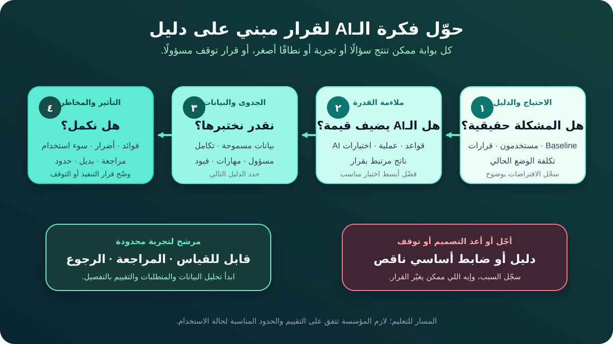

# اكتشاف فرص الذكاء الاصطناعي وترتيب أولوياتها

**فرصة الذكاء الاصطناعي (AI Opportunity)** هي مشكلة أو نتيجة في العمل ممكن قدرة من قدرات الـAI تساهم فيها بقيمة مفيدة. الفرصة مش طلب أداة، ولا وفرًا موعودًا، ولا حلًا تمت الموافقة عليه.

بالنسبة لمحلل الأعمال (Business Analyst - BA)، المطلوب هو تحويل الحماس لقرار مدعوم بدليل. يعني تقارن البدائل، وتكشف عدم اليقين، وتفهم مين ممكن يستفيد أو يتضرر، وتقترح أصغر خطوة تالية مسؤولة.

الشرح بيكمل مثال المتجر الأونلاين: المتجر عايز يحسّن التعامل مع إرجاع المنتجات. كل الأدوار والتقييمات والسياسات في المثال افتراضات للتعليم، مش حقائق عن مؤسسة حقيقية.

## 1. أعد صياغة طلب الـAI كاحتياج

صاحب المشروع بيقول: «محتاجين AI Agent يؤتمت الإرجاع». لو الفريق قبل الصياغة دي، يبقى اختار التكنولوجيا وشكل الحل قبل ما يتأكد من المشكلة.

افصل بين أربع حاجات:

| العنصر | السؤال | مثال الإرجاع |
|---|---|---|
| **الاحتياج** | إيه المشكلة أو الفرصة؟ | الدعم بيقضي وقتًا ممكن نتجنبه في فهم طلبات الإرجاع وتوجيهها |
| **النتيجة** | إيه اللي لازم يتحسن ولمين؟ | توجيه أسرع مع الحفاظ على صحة المعالجة ووصول العميل للمساعدة |
| **اختيار القدرة** | أنهي نوع مساعدة ممكن يفيد؟ | تصنيف سبب الإرجاع، أو كتابة مسودة رد، أو اقتراح الخطوة التالية |
| **اختيار الحل** | القدرة ممكن تتنفذ إزاي؟ | تحسين عملية، أو قواعد ثابتة، أو منتج جاهز، أو Model مخصص، أو Workflow مشترك |

صياغة أولية أفضل:

> محتاجين نقلل المجهود اللي ممكن نتجنبه في فرز طلبات الإرجاع، مع إبقاء الحالات غير المؤكدة وعالية التأثير واضحة للموظفين المخوّلين. هنقارن تحسين العملية والقواعد والحلول المدعومة بالـAI.

كده الاحتياج يفضل ثابتًا، والحل يقدر يتغير مع تحسن الأدلة.

**سؤال للـBA:** إيه اللي هيفضل يستحق التحسين لو الـAI مش متاح؟

## 2. حدد القرار وقِس الوضع الحالي

الـAI بيطلع ناتجًا، لكن القيمة بتظهر فقط لما الناتج يحسّن قرارًا أو مهمة. ارسم الـWorkflow الحالي قبل اقتراح المستقبل.

| الخطوة الحالية | القرار أو المهمة | الدليل المطلوب |
|---|---|---|
| العميل يرسل الطلب | هل الرسالة كاملة كفاية للمراجعة؟ | نسبة المعلومات الناقصة وأشهر الفجوات |
| الدعم يقرأ الرسالة | أنهي سبب إرجاع ينطبق؟ | وقت المعالجة وأنماط التصحيح وتعريف الفئات |
| الدعم يراجع الطلب والسياسة | هل الطلب مقبول أو استثنائي أو غير واضح؟ | مصادر القواعد والاستثناءات وحجم التصعيد |
| الدعم يوجّه الحالة | أنهي فريق أو Queue مسؤول عن الخطوة التالية؟ | نسبة إعادة التوجيه ووقت الانتظار وملكية الـQueues |
| دور مخوّل يقرر | موافقة أو رفض أو تحقيق أو طلب دليل؟ | صلاحيات القرار وعواقب الخطأ وأنماط الشكاوى |

ما تبنيش Business Case من التخمين. علّم كل بند بوضوح:

- **حقيقة مؤكدة:** مدعومة بمصدر موثوق أو ملاحظة فعلية.
- **تقدير:** محسوب بطريقة وافتراضات مكتوبة.
- **افتراض:** منطقي، لكنه مش مدعوم لسه.
- **سؤال مفتوح:** لسه محتاج دليلًا أو قرارًا.

مثلًا: «الدعم بيقضي 40% من وقته في التوجيه» مش حقيقة إلا لما الفريق يحدد النشاط وفترة القياس والعينة والمصدر. ممكن دراسة وقت قصيرة تكون الخطوة المفيدة التالية، مش بناء Prototype بالـAI.

## 3. جهّز اختيارات قبل ما تقيّمها

ما تقارنش اقتراح AI مفصل بـ«عدم عمل أي شيء» فقط. اطلع باختيارات مختلفة في التعقيد.

| الاختيار | إيه اللي هيتغير؟ | إيه اللي لازم يكون صحيحًا؟ |
|---|---|---|
| **تحسين الـForm والإرشادات** | أسئلة منظمة وشرح أوضح للسياسة | السبب الأساسي هو معلومات ناقصة أو مربكة |
| **تطبيق قواعد ثابتة** | توجيه الحالات حسب حالة الطلب وقواعد السياسة المؤكدة | القواعد مستقرة وصريحة وبتغطي حالات كفاية |
| **تصنيف بمساعدة AI** | اقتراح السبب والـQueue، والدعم يؤكد أو يصحح | فيه حالات ممثلة عليها Labels، والبديل اليدوي ممكن |
| **مساعدة توليدية للمسودة** | كتابة رد مبدئي من معلومات الحالة ومصادر السياسة المعتمدة | نقدر نسترجع المصادر بأمان ونراجع الادعاءات |
| **تنفيذ ذاتي** | تنفيذ خطوات زي إنشاء الحالة أو تعديلها | الصلاحيات والفشل والمراجعة والتأثير يبرروا الاستقلالية |

ممكن الاختيارات تشتغل مع بعض. Form منظم يقلل الغموض قبل ما الـModel يشوف الطلب. والقواعد الثابتة تحمي حدود السياسة، بينما الـAI يتعامل مع تنوع لغة العملاء.

**خطأ شائع:** اعتبار الاختيار الأكثر طموحًا تقنيًا هو الأعلى قيمة. التعقيد بيضيف تكلفة ومخاطر، لكنه ما يثبتش المنفعة.

## 4. مرّر كل اختيار على أربع بوابات للدليل

استخدم البوابات علشان تحدد الدليل المطلوب بعد كده. دي مش Checklist تستخدمها مرة واحدة؛ ارجع لها لما السياق أو البيانات أو السياسة أو النظام يتغير.

### البوابة 1: الاحتياج والدليل

أكد المشكلة الحالية والمستخدمين المتأثرين والـBaseline والقرارات والقيود والنتيجة المطلوبة. لو الاحتياج ضعيف أو غير مقاس، ابحث قبل اختيار التكنولوجيا.

في مثال المتجر، الدليل المفيد ممكن يشمل عينة من وقت المعالجة وإعادة التوجيه وأسباب نقص المعلومات والشكاوى ومقابلات العملاء وموظفي الدعم.

### البوابة 2: ملاءمة القدرة

اسأل هل التنوع وعدم اليقين بيخلوا قدرة AI مفيدة، ولا قواعد أبسط أو تعديل واجهة أو تدريب أو إصلاح العملية هيحل الاحتياج أحسن.

المصنّف ممكن يناسب تنوع لغة العملاء. لكنه ما يستبدلش قاعدة ثابتة زي: «دور مخوّل يوافق على كل Refund فوق الحد المؤكد».

### البوابة 3: الجدوى والبيانات

حدد البيانات المسموحة وجودتها وتمثيلها للواقع والتكامل والملكية والمهارات والتكلفة والوقت وقدرة الفريق على التقييم. وجود البيانات مش كفاية؛ لازم تكون مفهومة وصالحة ومسموح استخدامها للغرض المقترح.

لو Labels الإرجاع التاريخية غير متسقة، مراجعة عينة صغيرة منها ممكن تكون التجربة التالية. اكتشاف ده قبل بناء المصنّف أوفر وأأمن.

### البوابة 4: التأثير والمخاطر

ارسم الفوائد والأضرار المحتملة للأفراد والمجموعات والمؤسسة والعمليات المرتبطة. ضيف سوء الاستخدام المتوقع، والاستخدام خارج النطاق المقصود. وحدد المراجعة البشرية والبديل والشكاوى وشروط التوقف.

تنفيذ Refund تلقائي له تأثير مختلف عن اقتراح Queue داخلي. نفس الدقة التقنية ما تخليش الفرصتين متساويتين في الأمان أو القيمة.

إطار NIST لإدارة مخاطر الـAI بيستخدم وظيفة **Map** علشان يحدد الغرض والسياق والمتأثرين والفوائد والأضرار والنطاق والمعلومات اللازمة لقرار أولي بالتنفيذ أو التوقف. ده قريب جدًا من شغل الـBA قبل الالتزام بمبادرة AI.

## 5. قارن الفرص من غير ما تخفي عدم اليقين

الـTotal Score الواحد ممكن يدي ثقة زائفة. استخدم مصفوفة أدلة صغيرة، وسجّل سبب كل تقييم.

المثال بيستخدم:

- **أخضر:** دليل كافٍ للاستمرار في المرحلة الحالية.
- **أصفر:** فيه عدم يقين محتاج بحثًا أو ضابطًا محددًا.
- **أحمر:** مشكلة أساسية تمنع الشكل الحالي للاختيار.

| المرشح | دليل الاحتياج | القيمة المتوقعة | البيانات والجدوى | ملاءمة الـWorkflow | التأثير والمخاطر | قابلية القياس | القرار |
|---|---|---|---|---|---|---|---|
| تحسين الـForm والإرشادات | أخضر | أصفر | أخضر | أخضر | أخضر | أخضر | اختبر تحسين العملية الأول |
| اقتراح السبب والـQueue | أخضر | أخضر | أصفر | أخضر | أصفر | أخضر | مرشح لـPilot محدود بعد مراجعة الـLabels |
| كتابة مسودة رد | أخضر | أصفر | أصفر | أخضر | أصفر | أخضر | ابحث المصادر المعتمدة ومجهود المراجعة |
| الموافقة التلقائية على Refund | أصفر | أخضر | أصفر | أحمر | أحمر | أصفر | أوقف النطاق الحالي وأعد تصميم حدود الصلاحية |

التقييمات للتعليم. في Workshop حقيقية، كل خلية محتاجة ملاحظة دليل ومسؤولًا وتاريخًا. ما تعملش Average يخفي مشكلة حمراء في الخصوصية أو الأمان أو القانون أو الصلاحيات.

### استخدم بوابات توقف حقيقية عند الحاجة

الفرصة ما تكملش بشكلها الحالي لو مثلًا:

- مفيش Owner مسؤول يقبل القرار وعواقبه؛
- استخدام البيانات المقترح غير مسموح أو مش ممكن تبريره؛
- المستخدم المتأثر مفيش قدامه طريق عملي للتصحيح أو طلب المساعدة؛
- إجراء عالي التأثير مفيهوش مراجعة فعالة أو فشل آمن أو Rollback؛
- النجاح والضرر غير المقبول مش ممكن تقييمهما؛
- اختيار أبسط بيحقق الاحتياج بمخاطر وتكلفة أقل بوضوح.

«التوقف» نتيجة تحليل صحيحة. سجّل السبب، والدليل الجديد أو التعديل اللي ممكن يغيّر القرار.

## 6. اختار أصغر Pilot مسؤول

الـPilot نشاط تعلّم مضبوط، مش إطلاق Production في السر. ضيّق على الأقل الأبعاد دي:

| البعد | حدود الـPilot في المثال |
|---|---|
| المستخدمون | فريق دعم واحد متدرّب، مش كل الموظفين أو العملاء |
| الحالات | نصوص إنجليزية لفئة منتجات واحدة؛ استبعد الاشتباه في الاحتيال وشكاوى سهولة الوصول |
| الناتج | سبب وQueue مقترحان؛ مفيش رسالة مباشرة للعميل |
| الصلاحية | الدعم يقبل أو يصحح كل اقتراح |
| البيانات | حقول معتمدة وعينة تمت مراجعتها؛ مفيش نص حساس غير ضروري |
| الوقت | فترة اختبار محددة ومواعيد مراجعة معروفة |
| الخروج | وقف الاقتراحات والرجوع للتوجيه المعتاد من غير فقد الطلب الأصلي |

الاستبعادات مش قرارات منتج دائمة. هي بتخلي أول اختبار محدودًا. سجّل مين يقدر يغيّر النطاق، وإيه الدليل المطلوب.

## 7. عرّف القيمة والضوابط مع بعض

ترتيب الأولويات يقارن المنفعة المتوقعة بالمجهود وعدم اليقين والضرر، مش بالقيمة وحدها.

استخدم مجموعة قياس متوازنة:

| نوع المقياس | السؤال | مثال تعليمي |
|---|---|---|
| **نتيجة العمل** | هل الـWorkflow اتحسن؟ | وسيط وقت الفرز مقارنة بالـBaseline |
| **جودة الناتج** | هل الاقتراح مفيد؟ | التصنيفات المؤكدة والمصححة والمعاد توجيهها حسب السبب |
| **تأثير العميل** | هل أشخاص خدوا خدمة أسوأ؟ | التأخير والشكاوى وطلب المساعدة اليدوية حسب المجموعة المناسبة |
| **حاجز مخاطر** | هل حصل حدث غير مقبول؟ | Refund أو رفض أو اتهام باحتيال من غير صلاحية: الهدف صفر |
| **التبني وحجم الشغل** | الأداة قللت المجهود ولا نقلته؟ | وقت المراجعة وأسباب الـOverride |
| **التكلفة** | هل التحسين يستحق التشغيل؟ | تكلفة الطلب المقيم، شاملة المراجعة البشرية والدعم |

في خطة الـPilot، حدد المصدر والحساب والمسؤول وتكرار المراجعة وحد القرار. «المستخدمون حبوه» أو «الـModel دقيق» مش كفاية لإثبات قيمة العمل.

## 8. مثال مكتمل لـAI Opportunity Canvas

| الحقل | مثال فرز الإرجاع | الحالة |
|---|---|---|
| الاحتياج | تقليل الفهم اليدوي وإعادة التوجيه اللي ممكن نتجنبهم | الاتجاه مدعوم؛ الـBaseline ناقص |
| القرار المتأثر | أنهي سبب وQueue يستخدمهم الدعم؟ | قرار مؤكد في الـWorkflow |
| النتيجة المطلوبة | توجيه أسرع من غير زيادة المعالجة الضارة أو الغلط | مقترحة؛ المقاييس محتاجة تعريفًا |
| الدليل الحالي | المقابلات بتوضح تكرار القراءة اليدوية؛ بيانات الوقت وإعادة التوجيه ناقصة | دليل مختلط |
| الاختيارات | تحسين Form، وقواعد ثابتة، ومساعدة تصنيف، ومسودة رد، وتنفيذ ذاتي | مجموعة أولية |
| الاختيار التالي المفضل | سبب وQueue مقترحان مع تأكيد بشري | مرشح Pilot، مش حلًا معتمدًا |
| ليه AI ممكن يناسب؟ | لغة العملاء متنوعة وممكن تحتوي أنماطًا مفيدة للتصنيف | فرضية للاختبار |
| دليل البيانات المطلوب | اتساق الـLabels واللغات والصلاحية والحقول الناقصة والمجموعات المتأثرة | محتاج بحثًا |
| المستخدمون والنطاق | فريق دعم متدرّب واحد، وفئة منتجات ولغة محددتان | حدود مقترحة |
| النطاق الممنوع | مفيش Refund أو رفض أو اتهام أو رسالة للعميل تلقائيًا | حاجز مقترح |
| البديل | الفرز اليدوي المعتاد باستخدام الطلب الأصلي | ممكن؛ أكد القدرة الاستيعابية |
| مقاييس القيمة | وقت الفرز وإعادة التوجيه ونسبة التصحيح ومجهود المراجعة | التعريف والـBaseline ناقصان |
| مقاييس الضرر | التأخير والشكاوى والفروق بين المجموعات والإجراءات غير المخوّلة | المسؤولون والحدود ناقصان |
| الدليل التالي | دراسة وقت، ومراجعة Labels، ومراجعة المتأثرين، واختبار تحسين العملية | شغل مقترح |
| القرار | ابحث، وبعدها قرر هل تعمل Pilot محدودًا | التوصية الحالية |

الـCanvas مش Business Case كاملة. هدفها تخلي قرار الاستثمار التالي مناسبًا لحجم الدليل المتاح.

## 9. يسّر Workshop للفرص

اعمل جلسة مركزة فيها صاحب المبادرة وProcess Owner والمستخدمون في الصف الأول وممثلون عن البيانات أو التقنية والمخاطر، وكمان وجهة نظر المتأثرين المناسبة للسياق.

1. **أكد القرار:** الجلسة لازم تقترح إيه: بحث، Pilot، تمويل، تأجيل، ولا توقف؟
2. **راجع الدليل:** افصل الحقائق والتقديرات والافتراضات والأسئلة.
3. **ارسم القرار الحالي:** مين بيعمل إيه، باستخدام أنهي معلومات، ومع أنهي استثناءات؟
4. **اطلع ببدائل:** ضيف اختيارات العملية والقواعد.
5. **طبّق البوابات الأربع:** سجّل السبب، مش اللون فقط.
6. **اختار الدليل التالي:** أرخص اختبار آمن يحل نقطة عدم يقين مهمة.
7. **حدد الملكية:** مين يجمع الدليل ومين ياخد قرار الاستمرار أو التوقف؟

ما تجيبش المستخدمين المتأثرين علشان يوافقوا على حل جاهز فقط. خبرتهم ممكن تغيّر تعريف المشكلة، أو تكشف تأثيرًا غير عادل، أو توضح إن المنفعة المقترحة مش مهمة لهم.

## 10. أخطاء شائعة في ترتيب الأولويات

- **البدء بالـVendor أو الـModel:** الفريق يحسّن قرار شراء بدل تحسين النتيجة.
- **اعتبار الوقت النظري الموفر قيمة حقيقية:** المراجعة والتصحيح والتكامل والدعم والحوادث بتستهلك مجهودًا.
- **اعتبار Weighted Score حقيقة:** المجموع بيخفي جودة الدليل والموانع المهمة.
- **اعتبار كمية البيانات جاهزية:** المعنى والصلاحية والتغطية وجودة الـLabels مهمين.
- **تجاهل Non-AI Baseline:** الفريق مش هيعرف هل الـAI أضاف قيمة فوق تحسين العملية أو القواعد.
- **اختيار الحالات السهلة فقط:** الـDemo يبان قويًا وهو مستبعد الاستثناءات اللي بتسبب التكلفة أو الضرر الحقيقي.
- **افتراض إن الـPilot قليل المخاطر تلقائيًا:** مستخدمون حقيقيون وقرارات حية وبيانات محفوظة ممكن يعملوا تأثيرًا حقيقيًا حتى في نطاق صغير.

## 11. قالب AI Opportunity Canvas قابل لإعادة الاستخدام

| الحقل | ملاحظاتك |
|---|---|
| احتياج العمل والدليل الحالي | |
| القرار أو المهمة المتأثرة ومسؤولها | |
| النتيجة المطلوبة والـBaseline | |
| المستخدمون والمجموعات المتأثرة | |
| اختيارات العملية والقواعد والـAI والاختيارات المشتركة | |
| ليه قدرة AI ممكن تناسب أو ما تناسبش؟ | |
| البيانات المطلوبة وفجوات الدليل | |
| الجدوى والتكامل والمهارات والتكلفة | |
| الفوائد والأضرار المحتملة | |
| الاستخدام المقصود والمستبعد والممنوع | |
| المراجعة والبديل والشكاوى وشروط التوقف | |
| مقاييس القيمة والجودة والضرر والتبني والتكلفة | |
| الدليل التالي أو الـPilot المقترح | |
| صاحب القرار وتاريخ المراجعة | |

## 12. تمرين عملي

بنك بيستقبل أسئلة مكتوبة كثيرة عن معاملات البطاقات. صاحب المبادرة اقترح مساعد AI «يحل كل النزاعات فورًا».

1. أعد صياغة الاقتراح كاحتياج محايد ونتيجة مطلوبة.
2. حدد القرارات والأشخاص المتأثرين.
3. جهّز ثلاثة اختيارات على الأقل، فيهم اختيار واحد من غير AI.
4. قيّم كل اختيار بأخضر أو أصفر أو أحمر عبر البوابات الأربع، واكتب جملة دليل لكل تقييم.
5. اقترح بحثًا أو Pilot أو تأجيلًا أو إعادة تصميم أو توقفًا.
6. حدد حاجزًا واحدًا وحدًا واحدًا للـPilot يسهل الرجوع عنه.

ما تخترعش قواعد احتيال أو حقوق نزاع أو دقة أو وفرًا. سجّلها كاحتياجات دليل مفتوحة.

## مراجع للتوسع

- [IIBA: تحليل الأعمال من أجل الذكاء الاصطناعي](https://www.iiba.org/iiba-the-corner/business-analysis-for-artificial-intelligence/)
- [IIBA: معيار تحليل الأعمال](https://www.iiba.org/knowledgehub/the-business-analysis-standard/)
- [IIBA: النتائج وصناعة القيمة](https://www.iiba.org/knowledgehub/the-business-analysis-standard/2-understanding-business-analysis/2-5-outcomes-and-value-creation/)
- [NIST: وظيفة Map في AI RMF Core](https://airc.nist.gov/airmf-resources/airmf/5-sec-core/)
- [NIST: إرشادات Map في AI RMF Playbook](https://airc.nist.gov/airmf-resources/playbook/map/)
