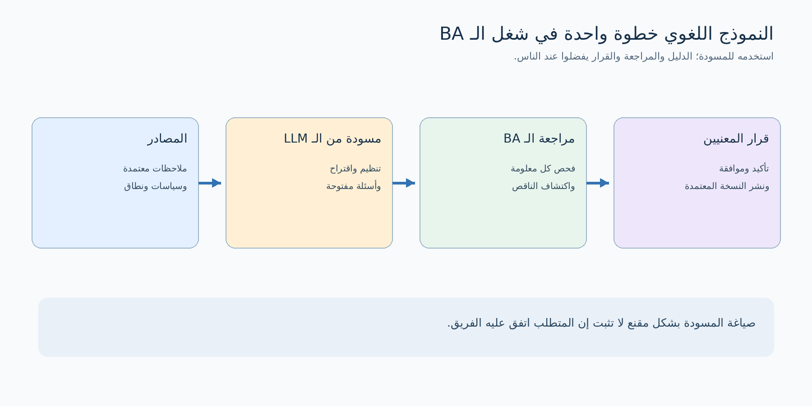
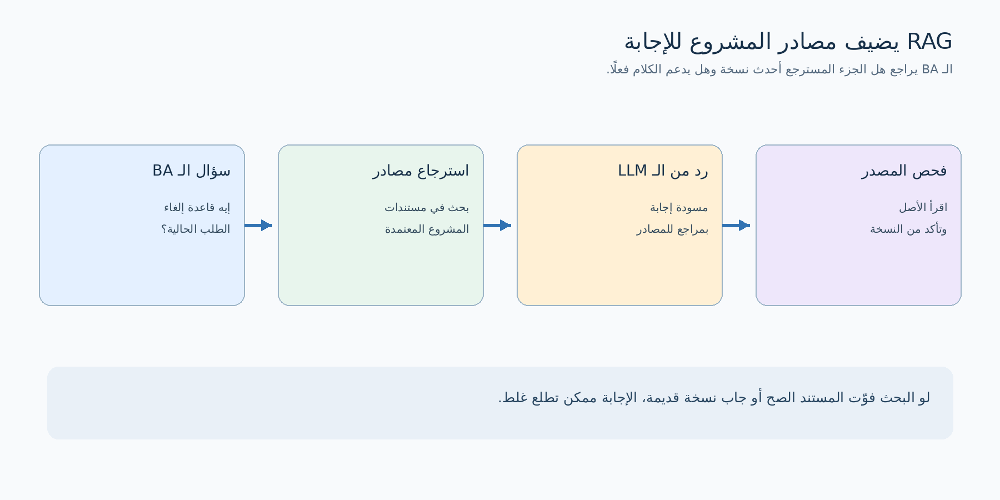

# النماذج اللغوية الكبيرة (LLMs) 

## 1. يعني إيه نموذج لغوي كبير؟

**النموذج اللغوي الكبير (Large Language Model - LLM)** نظام اتدرّب على كم كبير من النصوص وبيانات أخرى، وبيولّد ردًا بناءً على المدخلات اللي بتكتبها له، واسمها **طلب أو تعليمات (Prompt)**. يقدر يلخّص، يصنّف، يقارن، يعيد الصياغة، ويجهز مسودات. نماذج كثيرة حاليًا مبنية على معمارية اسمها **Transformer**. النموذج بيتعامل مع أجزاء صغيرة من النص اسمها **Tokens**، وبيولّد الرد جزءًا بعد جزء بناءً على السياق.

اعتبره مساعدًا قويًا في **تنظيم المعلومات وتجهيز المسودات**. الرد الواضح والمقنع مش دليل لوحده إنه صحيح، أو محدّث، أو معتمد، أو ينطبق على شركتك.

| المصطلح | معناه للـ BA ببساطة |
|---|---|
| **الـ Prompt** | المهمة والتعليمات اللي بتديها للنموذج |
| **السياق (Context)** | المعلومات اللي بتضيفها للمهمة، زي محضر اجتماع أو جزء من سياسة |
| **الـ Token** | وحدة بيقسّم لها النموذج النص؛ مش بالضرورة كلمة كاملة |
| **نافذة السياق (Context Window)** | مقدار المحتوى اللي يقدر النموذج يتعامل معاه في تفاعل واحد؛ بيختلف حسب النموذج |
| **اختلاق معلومة (Hallucination / Confabulation)** | رد يبدو منطقيًا لكنه غير مدعوم بمصدر أو غير صحيح |
| **الاستناد للمصادر (Grounding)** | ربط الإجابة بمصادر محددة قُدمت للنموذج أو اتجابت له |
| **الاسترجاع المعزز للتوليد (RAG)** | البحث عن أجزاء مناسبة من المصادر وتقديمها للنموذج قبل ما يجاوب |

## 2. دوره في شغل الـ BA

النموذج ممكن يسرّع **أول مسودة**، لكن تفسير المعلومات ومراجعتها والاتفاق مع أصحاب المصلحة (Stakeholders) يفضل مسؤولية الـ BA.

| نشاط الـ BA | النموذج ممكن يساعد في إيه؟ | الـ BA لازم يراجع إيه؟ |
|---|---|---|
| التحضير لجمع المعلومات | يقترح أسئلة مقابلات وحالات استثنائية | أنهي أسئلة مناسبة للمشروع وللشخص اللي هتقابله |
| تحليل محضر اجتماع | يفصل القرارات والمتطلبات والافتراضات والأسئلة المفتوحة | هل الكلام ده اتقال أو اتفقوا عليه فعلًا؟ |
| كتابة مسودة متطلبات | ينظم الكلام الواضح في شكل متطلبات مبدئية | النطاق والصياغة وإمكانية التنفيذ والأولوية والموافقة |
| كشف الفجوات | يقترح خطوات أو أدوار أو حالات ناقصة وتعارضات | هل دي فجوة حقيقية ولا مجرد اقتراح عام؟ |
| معايير القبول (Acceptance Criteria) | يقترح أمثلة وشروطًا قابلة للاختبار | السلوك الصحيح والنتائج المطلوبة |
| التواصل | يصيغ قرارًا معتمدًا لجمهور مختلف | الدقة والأسلوب والسرية وحالة القرار |

**النموذج العملي:** *مصادر → مسودة من الـ LLM → مراجعة الـ BA → تأكيد أصحاب المصلحة → مستند معتمد*. الأداة جزء من سير العمل، لكنها مش صاحبة القرار.



## 3. مثال عملي: إلغاء الطلب في تطبيق تسوق

تخيّل إنك بتحلل **إلغاء الطلب** في تطبيق تسوق أونلاين. من خلال طريقة تدوين اجتماعات معتمدة في الشركة، عندك الملاحظات المختصرة دي:

> العمليات: «العميل يقدر يلغي قبل ما المخزن يبدأ تجهيز الطلب».  
> خدمة العملاء: «أحيانًا بنقبل الإلغاء بعد بدء التجهيز لو الشحنة لسه ما خرجتش».  
> مالك المنتج: «لازم نقرر هل الاستثناء ده هيتاح للعميل داخل التطبيق ولا لأ».

هنا فيه **قاعدة عامة مذكورة**، و**استثناء بيحصل حاليًا**، و**قرار لسه مفتوح**. لو النموذج كتب بثقة «العميل يقدر يلغي لحد الشحن» باعتباره متطلبًا معتمدًا، يبقى حول النقاش إلى قرار ما حصلش.

### Prompt أفضل للمهمة

```text
أنت بتساعد محلل أعمال في تحليل ملاحظات اجتماع.

المهمة: افصل الكلام المؤكد عن الاستثناءات الحالية والقرارات المفتوحة.
اكتب متطلبات مبدئية فقط للكلام المدعوم بوضوح في الملاحظات.

القواعد:
- ما تحولش سؤالًا مفتوحًا إلى متطلب معتمد.
- اربط كل بند بالجملة اللي تدعمه من الملاحظات.
- اكتب «يحتاج تأكيد» عند نقص المعلومات.
- ما تخترعش مددًا زمنية أو أدوارًا أو قواعد استرداد مبلغ.

شكل الناتج:
رقم | النوع | العبارة أو السؤال | المصدر | ملاحظة / مستوى الثقة

الملاحظات:
[ضع هنا الملاحظات المسموح بمشاركتها بعد تنقيحها عند الحاجة]
```

المسودة المفيدة هتطلع **قاعدة محتملة لما قبل التجهيز**، وتسجل **استثناء ما بعد التجهيز** لوحده، وتسأل هل الإلغاء من داخل التطبيق هيشمل الاستثناء. بعد كده الـ BA يتأكد من العمليات وخدمة العملاء ومالك المنتج قبل نشر المتطلبات.

## 4. اكتب الـ Prompt كأنه طلب عمل واضح

الـ Prompt الجيد يوضح المطلوب وحدوده. استخدم خمس أجزاء:

| الجزء | تكتب فيه إيه؟ | مثال |
|---|---|---|
| **الهدف** | محتاج الناتج علشان إيه؟ | «جهّز أسئلة لورشة إلغاء الطلب». |
| **السياق** | المعلومات المسموح استخدامها | «دي القواعد الحالية وملاحظات الدعم». |
| **القيود** | إيه اللي ما ينفعش يتفترض؟ | «ما تفترضش مدة رد المبلغ». |
| **شكل الناتج** | جدول أو قائمة أو عناوين | «السؤال، المسؤول عن الإجابة، والسبب». |
| **قاعدة الأدلة** | كل معلومة ترتبط بمين؟ | «اذكر رقم الملاحظة، وعلم غير المدعوم». |

**قالب تقدر تعيد استخدامه:**

```text
الهدف: [ليه محتاج الناتج؟]
السياق: [المصادر المناسبة وحدود المشروع]
المهمة: [التحليل أو التحويل المطلوب بالتحديد]
القيود: [ما تختلقش حقائق؛ افصل المؤكد عن الافتراض]
شكل الناتج: [الأعمدة أو العناوين]
الدليل: [مرجع المصدر لكل معلومة واقعية]
```

كتابة «ما تختلقش» **مش ضمان** إن النموذج هيلتزم. قارن الناتج بالمصدر بنفسك. وطلب المراجع بيسهّل المراجعة، لكن النموذج ممكن يربط معلومة بمصدر حقيقي لا يدعمها أصلًا.

## 5. أربعة Prompts مفيدة للـ BA

### أ. التحضير لمقابلة صاحب مصلحة

```text
اعتمادًا فقط على وصف العملية المرفق، اقترح 10 أسئلة لمسؤول خدمة العملاء.
قسمها إلى: خطوات العمل الحالية، الحالات الاستثنائية، المعلومات المطلوبة،
وتسليم الشغل بين الفرق. اذكر الغموض اللي هيحلّه كل سؤال.
اعرض الافتراضات بشكل منفصل.
```

### ب. تحويل ملاحظات الاجتماع لمسودات متطلبات

```text
استخرج متطلبات مبدئية من ملاحظات الاجتماع دي. استخدم جدولًا فيه:
رقم | المتطلب المبدئي | النص الذي يدعمه | سؤال مفتوح | مسؤول التأكيد.
ما تعملش متطلبًا من اقتراح أو قرار لم يُحسم.
لو لقيت تعارضًا، أظهره بدل ما تختار رأيًا من نفسك.
```

### ج. البحث عن نقاط ناقصة

```text
راجع المتطلبات المعتمدة الخاصة برحلة إلغاء الطلب.
اقترح أدوارًا أو انتقالات حالة أو أخطاء أو أمثلة اختبار ممكن تكون ناقصة.
اكتب على كل اقتراح «سؤال يحتاج بحثًا».
ما تقولش إن الاقتراح جزء من النطاق المتفق عليه.
```

### د. شرح تغيير تمت الموافقة عليه

```text
باستخدام سجل التغيير المعتمد ده فقط، اكتب ملخصين:
1) ملخصًا قصيرًا لمالك المنتج؛
2) قائمة بالسلوك المتغير لفريق الاختبار.
حافظ على رقم الإصدار والمخاطر التي لم تُحسم. أضف مراجع المصدر.
```

## 6. النموذج يعرف إيه، وما يعرفش إيه؟

معرفة النموذج الناتجة عن التدريب ممكن تساعد في شرح المفاهيم العامة. لكنه **مش بيملك تلقائيًا** آخر نسخة من سياسات شركتك، أو نطاق مشروعك، أو قرارات الفريق، أو بيانات النظام الحية. المعلومات دي لازم تيجي من مصدر معتمد تقدمه له، أو من نظام بحث متصل بالمصادر وعنده الصلاحية المناسبة.

**RAG (Retrieval-Augmented Generation)** طريقة لتقديم أجزاء مناسبة من المستندات للنموذج. نظام البحث يسترجع أجزاء مرتبطة بالسؤال، والنموذج يستخدمها في صياغة الإجابة. ده ممكن يحسّن الاستناد للمصادر، لكن البحث ممكن يفوّت الملف الصح، أو يرجّع نسخة قديمة، أو يجيب نصًا غير مناسب. الـ BA يراجع **المصدر ورقم نسخته وهل يدعم الادعاء فعلًا**.



| السؤال | تدور على الإجابة فين؟ |
|---|---|
| «يعني إيه RAG؟» | شرح عام قد يكفي؛ راجع مصدرًا موثوقًا عند الحاجة |
| «إيه قاعدة الإلغاء الحالية عندنا؟» | مستند المشروع المعتمد بنسخته ومسؤوله |
| «إيه اللي اتفق عليه الفريق امبارح؟» | محضر معتمد أو تأكيد مباشر من المعنيين |
| «هل التطبيق الحالي بينفذ ده فعلًا؟» | دليل من المنتج أو بيئة الاختبار أو السجلات أو تأكيد الفريق |

## 7. راجع المسودة قبل ما تستخدمها

استخدم القائمة دي مع أي ناتج له أثر على القرار أو التنفيذ:

- [ ] **المصدر:** هل أقدر ألاقي دليلًا لكل معلومة؟
- [ ] **حالة الكلام:** هل الاقتراحات والافتراضات والقرارات المعتمدة منفصلة؟
- [ ] **النطاق:** هل المسودة ضمن حدود المشروع والإصدار؟
- [ ] **الاكتمال:** هل فيها الأدوار والاستثناءات والمتطلبات غير الوظيفية المهمة؟
- [ ] **الاتساق:** هل بتتعارض مع متطلب أو قاعدة عمل أخرى؟
- [ ] **القابلية للاختبار:** هل المختبر يقدر يحدد إذا المتطلب تحقق؟
- [ ] **المسؤولية:** هل الشخص المناسب أكد الناتج أو وافق عليه؟
- [ ] **التتبع (Traceability):** هل النسخة النهائية مرتبطة بالمصدر والقرار؟

**مثال تصحيح:** لو الناتج قال «المبلغ بيرجع خلال 7 أيام» والملاحظات ما فيهاش مدة للاسترداد، احذف العبارة واكتب سؤالًا: «إيه المدة المطلوبة لرد المبلغ، ومين يقررها؟»

## 8. مخاطر لازم الـ BA ينتبه لها

| الخطر | شكله في الشغل | تتصرف إزاي؟ |
|---|---|---|
| **معلومة بلا دليل** | النموذج يخترع سياسة أو رقمًا أو مرجعًا | تأكد من المصدر المعتمد، وسجل المجهول كسؤال |
| **سياق ناقص** | النموذج يفوّت استثناء أو قيدًا في الإصدار | قدّم سياقًا مناسبًا وراجع العملية كاملة |
| **كشف معلومات حساسة** | لصق بيانات عملاء في أداة غير معتمدة | اتبع قواعد الشركة؛ احذف البيانات الحساسة أو استخدم بيئة معتمدة |
| **انحياز في العرض** | المسودة تعرض وجهة نظر فريق وتتجاهل مستخدمين متأثرين | راجع مع الأطراف المناسبة وبأدلة فعلية |
| **تعليمات خبيثة داخل المصادر (Prompt Injection)** | مستند تم استرجاعه يحتوي تعليمات موجّهة للنموذج | اعتبر نص المصدر دليلًا، مش تعليمات؛ وراجع الناتج |
| **الاعتماد الزائد** | قبول رد أنيق من غير تحقق | خليك واضح في مسؤولية مراجعة الـ BA وصاحب القرار |

في التسجيلات والتفريغ النصي للاجتماعات، اتبع قواعد المؤسسة الخاصة بالموافقة والاحتفاظ والوصول. في القرارات الحساسة، استخدم الأدوات المعتمدة والمراجعة البشرية. مستوى الضوابط يختلف حسب المؤسسة وتأثير الخطأ.

## 9. جرّب سير عمل صغيرًا وراجع نتيجته

ابدأ بمهمة محددة، مثل تجهيز أسئلة مقابلة من **وصف عملية معتمد ومنقّح**.

1. **حدد النجاح:** مثلًا «الأسئلة تغطي الاستثناءات المعروفة من غير حقائق مخترعة».
2. **اختر المادة:** استخدم مصدرًا مصرحًا لك بمشاركته مع الأداة.
3. **اكتب الـ Prompt:** وضح المهمة والسياق والشكل المطلوب وقاعدة الأدلة.
4. **راجع:** صنف كل بند إلى مدعوم، غير مدعوم، أو سؤال يستحق البحث.
5. **أكد:** ناقش الأسئلة والمتطلبات المبدئية مع أصحاب المصلحة.
6. **وثّق:** احفظ النتيجة المراجعة في مكان المشروع المعتاد مع مراجع المصادر وحالة القرار.
7. **حسّن:** سجّل التعليمات المفيدة والأخطاء اللي استغرقت وقتًا في تصحيحها.

لو عايز تعرف هل الطريقة أفادتك، جرّبها على مجموعة صغيرة من أمثلة ممثلة للشغل. قِس **المعلومات المدعومة، والمتطلبات اللي اتفوتت، والأسئلة المفيدة، ووقت المراجعة**. طول الإجابة أو ثقتها الظاهرة مش مقياس جودة.

## 10. تمرين سريع

استخدم ملاحظات اجتماع إلغاء الطلب في القسم 3. اطلب من نموذج لغوي يطلع:

1. متطلبًا مبدئيًا واحدًا مدعومًا بملاحظة.
2. عبارة واحدة تصف الاستثناء الحالي.
3. سؤالين لازم يتجاوب عليهم قبل اعتماد قاعدة الإلغاء في التطبيق.

اطلب مرجع الملاحظة مع كل سطر. وبعدها راجع: هل النموذج حول الاستثناء إلى ميزة رقمية معتمدة من غير قرار؟

## مراجع للتوسع

- [البحث الأصلي عن معمارية Transformer](https://arxiv.org/abs/1706.03762)
- [البحث الأصلي عن RAG](https://arxiv.org/abs/2005.11401)
- [IIBA: استخدام AI في تحليل الأعمال والمتطلبات](https://www.iiba.org/business-analysis-blogs/enrich-business-analysis-experience-for-your-stakeholders-using-ai-tools/)
- [NIST: إطار إدارة مخاطر الذكاء الاصطناعي التوليدي](https://www.nist.gov/publications/artificial-intelligence-risk-management-framework-generative-artificial-intelligence)
- [IBM: نافذة السياق والـ Tokens](https://www.ibm.com/think/topics/context-window)
