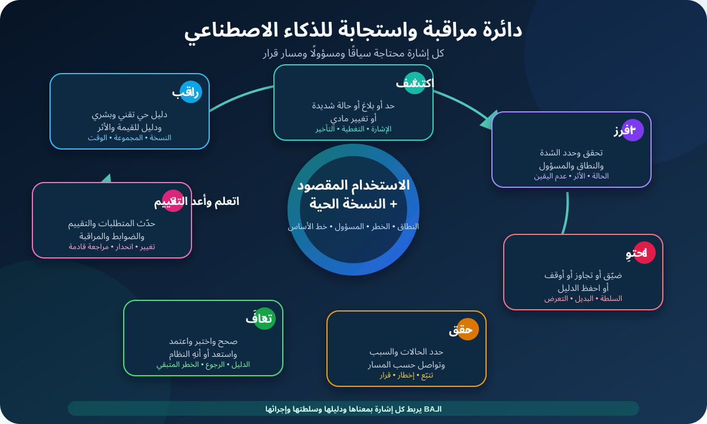

# مراقبة أنظمة الذكاء الاصطناعي والـDrift والحوادث لمحللي الأعمال

**مراقبة الذكاء الاصطناعي بعد الإطلاق (Post-deployment AI Monitoring)** هي جمع ومراجعة دليل بشكل متكرر بعد دخول النظام التشغيل الحقيقي. الهدف مش عمل Dashboard مليانة أرقام، لكن اكتشاف إمتى القيمة أو الجودة أو الخطر أو السياق أو سلوك النظام محتاج قرارًا.

بالنسبة لمحلل الأعمال (BA)، المراقبة بتربط اللي الفريق وعد بيه قبل الإطلاق باللي حصل فعلًا أثناء الاستخدام. الـBA يساعد يحدد إيه المهم، وإيه الدليل المتاح، ومعنى التغيير، ومين يستجيب، وإمتى المؤسسة تستمر أو تحقق أو تضيّق النطاق أو توقف مؤقتًا أو ترجع لنسخة سابقة أو تعيد التقييم أو تنهي النظام.

الدرس مكمل نظام توجيه الإرجاع التعليمي من درس التقييم. النظام دلوقتي في Pilot محدود لتذاكر الويب الإنجليزية المؤهلة في فئة منتج واحدة. هو بيقترح سبب الإرجاع وSupport Queue، وموظف مدرّب يؤكد أو يصحح الاقتراح. النظام ما يقدرش يصدر Refund أو يرفض طلبًا أو يرسل رسالة أو يقرر في احتيال. كل الأرقام والـThresholds والأدوار وقواعد الخدمة هنا افتراضات تعليمية، مش أهدافًا عامة ولا سياسة مؤسسة.

## 1. ابدأ بالقرارات، مش بالـDashboard

الإشارة اللي مالهاش مسار قرار بتتحول لضوضاء. ابدأ بالقرارات الحية اللي المؤسسة متوقعة تاخدها.

| القرار | سؤال المراقبة | دليل محتمل |
|---|---|---|
| استمرار الـPilot | هل النظام لسه مفيد وداخل الشروط المعتمدة؟ | مراجعة القيمة والجودة والخطر والـWorkflow |
| التحقيق | هل التغيير حقيقي ومهم ونقدر ننسبه لسبب؟ | Trend وحالات وVersions وSlices وFeedback |
| تضييق النطاق | هل منتج أو Queue أو نوع حالة أو مجموعة مستخدمين فيها فشل؟ | نتائج على مستوى الـSlice وحجم الحالات المتأثرة |
| الإيقاف أو التجاوز | هل استمرار الاستخدام ممكن يعمل أثرًا غير مقبول؟ | Hard Trigger أو حالة شديدة أو Incident Report |
| الرجوع عن تغيير | هل Configuration جديدة عملت Regression؟ | دليل قبل/بعد مرتبط بالـVersion |
| توسيع النطاق | هل الدليل الحي يدعم توسعًا محددًا؟ | نتائج Pilot مستقرة مع Evaluation جديدة |
| إنهاء النظام | هل القيمة أو قابلية الدعم أو الخطر بقت غير مقبولة؟ | دليل مستمر على النتيجة والتكلفة والحوادث والبديل |

في الـPilot، سؤال المراقبة هو:

> هل توجيه الإرجاع المساعد ما زال يحسّن الـWorkflow المعتمد من غير تفويت حالات متخصصة مهمة، أو إنتاج فعل ممنوع، أو إخفاء ضرر داخل Slice، أو فقدان قيمة العمل؟

## 2. ثبّت الـBaseline اللي هتراقبه

المراقبة محتاجة نقطة مرجعية. سجل النظام المنشور فعلًا، مش اسمه التسويقي بس.

| حقل الـBaseline | مثال توجيه الإرجاع |
|---|---|
| الاستخدام المقصود | اقتراح السبب والـQueue لتذاكر الويب الإنجليزية المؤهلة في Product A |
| الاستخدام المستبعد | لغات وقنوات ومنتجات أخرى أو قرارات آلية تمس العميل |
| حزمة الـVersion | Provider/Model وPrompt وRetrieval Source وPolicy وRules وQueue Map وInterface وCode Versions |
| الـPopulation | التذاكر المؤهلة اللي بتظهر لموظفي الـPilot المدرّبين |
| Baseline التقييم | الـHeld-out Evaluation المعتمدة والقيود المعروفة |
| دور الإنسان | الموظف يؤكد أو يصحح كل اقتراح |
| الـFallback | توجيه يدوي مع الحفاظ على الشغل المدخل |
| أصحاب القرار | Product وOperations وDomain وRisk وSecurity وPrivacy والأصحاب التقنيون حسب الحاجة |

لو الفريق مش قادر يحدد أنهي Version أنتجت النتيجة، ممكن يكتشف المشكلة لكنه يفشل في تفسيرها أو تكرارها. تعامل مع تغييرات الإعداد والـProvider والسياسة والبيانات والـWorkflow كأحداث مراقبة.

## 3. راقب النظام والـWorkflow والأثر مع بعض

وثيقة NIST AI 800-4 المنشورة في مارس 2026 بتنظم مراقبة ما بعد الإطلاق في ست فئات. استخدمها كفحص تغطية، مش كتصميم Dashboard إجباري.

| فئة المراقبة | سؤال الـBA | مثال الـPilot |
|---|---|---|
| Functionality | هل النظام ما زال يشتغل زي المقصود؟ | اتفاق الـQueue والحالات المتخصصة الضائعة والـInvalid Outputs |
| Operational | هل الخدمة مستقرة ويمكن الاعتماد عليها؟ | Availability وLatency وTimeouts واكتمال الـFallback |
| Human factors | إيه اللي بيحصل في تفاعل الإنسان مع الـAI؟ | التصحيحات والثقة الزايدة وصعوبة الاستخدام والـFeedback |
| Security | هل النظام معرض لهجوم أو سوء استخدام؟ | Prompt Injection وصلاحية غير مصرح بها وTool Calls مريبة |
| Compliance | هل الالتزامات والضوابط المطبقة ما زالت متحققة؟ | السجلات المطلوبة والـRetention والموافقات ومسار الشكاوى |
| Large-scale impacts | هل آثار أوسع بتظهر؟ | تحولات الحمل وتأثيرات الوصول وأنماط أثر متكررة |

مراقبة Model Accuracy وحدها هتفوت فشل الـIntegration وسلوك الإنسان. مراقبة الـUptime وحده هتفوت النتائج الغلط. ومراقبة الشكاوى وحدها هتفوت ناس مش قادرين أو مش مستعدين يشتكوا.

## 4. ابنِ Portfolio من الإشارات

اجمع أكثر من قناة دليل لأن كل قناة لها نقاط عمياء.

| عائلة الإشارة | أمثلة | القيد |
|---|---|---|
| Technical telemetry | Availability وLatency ونوع الخطأ وInvalid Schema وFallback Event | خدمة سليمة تقنيًا ممكن تطلع نصيحة مؤذية |
| المدخلات والبيانات | حقول ناقصة ولغة وطول ومصطلحات جديدة وتوزيع المصادر | تغير التوزيع لا يثبت وحده هبوط الأداء |
| الناتج والسلوك | Queue وAbstention ومحتوى ممنوع وGrounding وTool Action | بعض الأخطاء محتاجة حكمًا بشريًا |
| Quality labels | Queue مؤكدة وتصحيح ونتيجة لاحقة وAudited Sample | الـLabels الموثوقة ممكن تتأخر أو تغطي جزءًا من الاستخدام |
| الـWorkflow | Handling Time وOverride وReroute وEscalation وAbandonment | سلوك المستخدم له أسباب كثيرة |
| قيمة العمل | Reroutes متجنبة وResolution Time والحمل والتكلفة | متوسط المنفعة ممكن يخفي Slice متضررة |
| Human feedback | بلاغ موظف وشكوى وAppeal وFeedback من شخص متأثر | قنوات الإبلاغ ممكن تكون غير متساوية أو مرهقة |
| الخطر والحوادث | Near-miss وفعل ممنوع وPrivacy/Security Event وضرر شديد | الحدث النادر ما ينفعش يختفي جوه Rate |

صنّف الإشارات إلى **Leading** و**Lagging**. زيادة الحقول الناقصة ممكن تحذر مبكرًا من تدهور الجودة، بينما حالة متخصصة ضائعة ومؤكدة تثبت الفشل بعد وصول الـLabel. استخدم الـLeading Signals للتحقيق المبكر، لكن ما تعرضهاش كضرر Outcome مؤكد.

## 5. عرّف الـDrift بدقة

**الـDrift** معناه إن Pattern مهم اتغير مع الوقت. مش رقمًا غامضًا واحدًا، ومش معناه تلقائيًا إن الـModel غلط.

| نوع الـDrift | مثال توجيه الإرجاع | سؤال استجابة الـBA |
|---|---|---|
| Input أو population drift | تذاكر أكتر تستخدم Product Term جديدة | هل الاستخدام لسه داخل النطاق وممثل في Evaluation Data؟ |
| Data-quality drift | Product Category بقت ناقصة أكتر | هل Form أو Integration قبل النظام اتغيرت؟ |
| Concept أو policy drift | سبب الإرجاع الصحيح اتغير بعد تعديل سياسة | هل الـLabels والـRules والمراجع والتدريب والاختبارات ما زالت صحيحة؟ |
| Output أو behavior drift | اقتراحات المتخصص قلت بعد Provider Update | أنهي Version اتغيرت وهل الأداء اتأثر؟ |
| Workflow drift | الموظفون بقوا يقبلوا أسرع مع مراجعة أقل | هل ده خبرة ولا ضغط وقت ولا Over-reliance؟ |
| Outcome أو impact drift | الـReroutes قلت إجمالًا وزادت في Product Subtype | هل القيمة أو الضرر بيتنقل بين الـSlices؟ |

Drift Detection بتقارن توزيعات أو Rates أو Patterns قدام Baseline وTime Window محددين. هي ممكن تثبت **التغيير**، لكن مش سببه أو شدته أو قبوله تلقائيًا. حقق باستخدام دليل Case-level وسياق وأصحاب خبرة وسلطة.

## 6. اعمل Signal Dictionary

كل إشارة مهمة محتاجة تعريفًا مشتركًا.

| الحقل | مثال مكتمل |
|---|---|
| Signal ID | MON-Q-03 |
| القرار المدعوم | التحقيق أو تضييق Case Type فاشلة |
| الاسم | Confirmed specialist miss rate |
| التعريف | الحالات المتخصصة المؤكدة اللي اتوجهت خارج Specialist Queue ÷ كل الحالات المتخصصة المؤكدة |
| الـPopulation والاستبعادات | تذاكر Pilot المؤهلة ذات Adjudicated Labels؛ الحالات غير المحسومة مستبعدة ومعدودة منفصلة |
| المصدر والـLineage | Routing Event مرتبطة بجدول الحالات المحكّمة باستخدام Ticket ID مسموح |
| الـWindow والـCadence | Rolling Window معتمدة؛ مراجعة بالـCadence المعتمدة |
| الـBaseline | Pilot Release Evaluation مع مقارنة بالعملية الحالية |
| الـSlices | Product Subtype وMissing-field State وطول التذكرة وفترة الجمع |
| تأخير البيانات | الـAdjudication عادة تصل بعد Routing Event |
| الـTrigger | القيمة وMinimum Evidence Count محتاجين اعتمادًا من صاحب السلطة |
| المسؤول والمسار | Monitoring Owner يراجع البيانات؛ Domain Owner يراجع الحالات؛ Product/Risk Owners يقرروا الإجراء |
| القيود | لا تقيس الحالات غير المحسومة أو المحكّمة غلط |

سجل الـNumerator والـDenominator والوحدة والاستبعادات وMinimum Evidence والـLatency والـExpected Range ونقاط العمى. اسم زي «Correction Rate» غامض لحد ما الفريق يتفق إيه التصحيح وأنهي فرص تدخل في المقام.

## 7. افصل الـThreshold عن Action Rule

**Alert Threshold** تقول إمتى نبص. **Action Rule** تقول نعمل إيه بعد فهم الدليل والشدة.

| القاعدة | صيغة تعليمية |
|---|---|
| Warning | الإشارة تعدي Warning Boundary المعتمدة بدليل كافي → المسؤول يراجع البيانات والحالات |
| Investigation | التحذير يستمر أو يجتمع مع إشارات مرتبطة → افتح تحقيقًا قابلًا للتتبع |
| Scope restriction | Slice معتمدة تعدي Action Boundary → استخدم Manual Routing للـSlice دي |
| Immediate pause | أي فعل ممنوع مؤكد أو حادث شديد → احتوِ التشغيل المتأثر وفعّل Incident Authority |
| Rollback | Regression مرتبطة بـMaterial Version Change والرجوع معتمد → ارجع لآخر حزمة معتمدة |
| Reevaluation | Population أو Policy أو Provider أو Prompt أو Tool أو Workflow تتغير ماديًا → شغّل Evaluation المحددة قبل الاستمرار أو التوسع |

ما تخترعش قيمة علشان الـDashboard محتاجة رقمًا. استخدم Risk Tolerance ودليل التقييم وتذبذب الـBaseline وعواقب العمل وMinimum Sample Size وقرار أصحاب السلطة. أضف Hysteresis أو Recovery Rule لو التبديل السريع مؤذٍ: ممكن تحتاج الإشارة تفضل داخل Recovery Range المعتمدة قبل الرجوع للتشغيل العادي.

## 8. تعامل مع الحقيقة المتأخرة والناقصة

الـGround Truth في التشغيل غالبًا متأخرة أو جزئية أو محل خلاف. Ticket ممكن تتصحح فورًا، وتتحكّم بعد أيام، ونتيجتها تظهر بعد الحل.

استخدم طبقات:

1. **Immediate checks:** Queue ID صحيحة، فعل ممنوع، Timeout، وFallback.
2. **Early proxies:** تصحيح الموظف، Confidence أو Abstention Pattern، ومدخلات ناقصة.
3. **Delayed quality:** Reason وQueue بعد Adjudication وحالة متخصصة ضائعة مؤكدة.
4. **Outcome evidence:** Reroute وResolution Time وشكوى وأثر لاحق.
5. **Periodic sampled review:** مراجعة بشرية مؤهلة لحالات مش واخدة Label بطريقة أخرى.

اعرض Freshness وCoverage جنب كل نتيجة. Metric مبنية على 42% من الحالات ذات Labels ما ينفعش تظهر كمقياس لكل الـPopulation. افحص هل الحالات اللي لها Label مختلفة عن اللي مالهاش.

## 9. خلّي الـFeedback والـChallenge والـOverride قابلة للملاحظة

الـFeedback قناة مراقبة، مش زر للزينة. حدد:

- مين يقدر يبلغ عن مشكلة أو تصحيح أو Appeal أو Near-miss؛
- إيه المعلومات اللي تتجمع، وإيه البيانات الحساسة اللي ممنوع تدخل؛
- توقعات الاستلام والـTriage والرد؛
- إزاي نوصل للـVersions والحالات المرتبطة؛
- إزاي Themes المتكررة تغير المراقبة أو التدريب أو التصميم أو النطاق؛
- إزاي الناس تستخدم الـFallback أو تعترض على نتيجة لما يكون ده مطبقًا.

ما تكافئش Complaint Rate قليلة من غير فحص سهولة الوصول والعبء. الصمت ممكن يعني رضا، وممكن يعني إن طريق البلاغ مستخبي أو غير آمن أو غير فعال.

## 10. أضف ضوابط للـGenerative AI والـAgents

النواتج المتغيرة والأنظمة اللي تستخدم Tools محتاجة أكتر من Accuracy Chart.

| السطح | أمثلة للمراقبة |
|---|---|
| Generated content | Claims غير مدعومة وCitations ناقصة ومحتوى غير آمن وتسريب بيانات حساسة وجودة الرفض |
| Retrieval | حداثة المصدر وDocument ناقصة وصلاحية غلط وعدم تطابق Citation مع Source |
| Tool use | الأداة المختارة والـParameters والـAuthorization والـSide Effect والـConfirmation والـRollback |
| Agent sequence | Step Trace وLoop متكررة وDelegation غير متوقعة وStop Condition وHuman Handoff |
| Variability | Sampled Evals متكررة بشروط مضبوطة وJudge Methods لها Version |
| Cost and capacity | Tokens وTool Calls وLatency وQueue Time وحدود الـProvider |

سجل دليلًا كافيًا للتحقيق داخل حدود الخصوصية والأمان والـRetention المسموحة. زيادة الـLogging مش دائمًا أفضل؛ الاحتفاظ بمحتوى حساس من غير حاجة بيخلق خطرًا جديدًا.

## 11. فرّق بين Issue وNear-miss وIncident

الفريق محتاج لغة تشغيل موحدة.

| المصطلح | معناه العملي | المثال |
|---|---|---|
| Observation | إشارة أو بلاغ لسه ما اتقيّمش | Correction Spike ظهرت في الـDashboard |
| Issue | مشكلة مؤكدة محتاجة معالجة عادية | Queue Mapping قديمة لنوع حالة منخفض التأثير |
| Near-miss | فشل كان ممكن يعمل أثرًا لكنه اتلحق | الموظف لحق Refund Suggestion ممنوعة قبل التنفيذ |
| Incident | حدث حقق معايير الحادث في المؤسسة | Unauthorized Action أو Protected-data Exposure أو Misrouting شديد ومتكرر |

الشدة مش مجرد تكرار. فكّر في الأثر الحقيقي والمحتمل، والناس المتأثرة، وإمكانية العكس، والمدة، والنطاق، والالتزامات القانونية أو التعاقدية، وقابلية الاستغلال، واستمرار التعرض. Incident Process المعتمدة، مش الـBA لوحده، هي اللي تحدد التصنيف والإخطار.

## 12. صمّم الاستجابة قبل ما الـAlert تضرب

دائرة استجابة عملية:

1. **راقب:** اجمع الدليل الحي المسموح مع الـVersion والسياق.
2. **اكتشف:** حدد Threshold أو بلاغًا أو حالة شديدة أو Material Change.
3. **افرز:** تحقق من الإشارة وقيّم الشدة والنطاق وعيّن المسؤول.
4. **احتوِ:** ضيّق أو تجاوز أو أوقف أو اسحب صلاحية أو احفظ الدليل حسب السلطة.
5. **حقق وتواصل:** حدد الحالات المتأثرة والأسباب واستخدم مسارات التواصل والإخطار المعتمدة.
6. **تعافَ:** صحح واختبر واعتمد واستعد التشغيل أو عالج الأثر أو أنهِ النظام حسب الحالة.
7. **اتعلم وأعد التقييم:** حدّث المتطلبات والحالات والضوابط والتدريب والـRunbooks والمراقبة.

استعد لـFalse Alert وMissed Alert. سجل مين يقدر يوقف النظام، ومين يعتمد استعادة التشغيل، وإيه اللي يحصل للشغل الجاري، وإزاي تحمي قدرة المسار اليدوي.

## 13. اربط المراقبة بالـChange Control

Material Change ممكن تبطل الـBaseline حتى لو مفيش Alert ظهرت.

| حدث التغيير | أقل سؤال مطلوب |
|---|---|
| Provider أو model update | هل القدرات والقيود والسلوك والشروط أو الدليل اتغيروا؟ |
| Prompt أو rule أو retrieval change | أنهي Requirements وRegression Cases لازم تتعاد؟ |
| Policy أو label change | هل المقارنات التاريخية لسه لها معنى؟ |
| User أو language أو product أو channel جديدة | هل ده توسع معتمد محتاج Evaluation جديدة؟ |
| Tool أو permission change | هل الـSide Effects الممكنة أو Security Boundary اتغيرت؟ |
| Interface أو workflow change | هل Human Review أو Fallback أو Over-reliance Risk اتغير؟ |
| Incident pattern متكرر | هل الإصلاح المحلي غير كافٍ ومحتاج Redesign أو Retirement؟ |

Change Record تربط الطلب والسبب والمتطلبات والمخاطر المتأثرة ودليل التقييم والموافقات وDeployment Version وتعديل المراقبة وRollback Plan وتاريخ المراجعة.

## 14. راقب الاعتماديات الخارجية

المؤسسة ممكن تستعين بـProvider خارجي، لكنها ما تقدرش تستعين بحد يشيل عنها مسؤولية إدارة استخدامها وآثارها.

راقب Provider Notices وتغييرات الـVersion والـAvailability والـRate Limits ومعالجة البيانات وSecurity Events واستجابة الدعم والـSubcontractors لما تكون مهمة وخطة الاستمرارية أو الخروج. حدد إيه الدليل اللي الـProvider هيوفره وإيه اللي المؤسسة لازم تقيسه بنفسها.

لو الـProvider غيّر Model من غير وقت كافي أو Case-level Visibility، سجل ده كقيد مراقبة وصمّم Compensating Control زي Release Gateway أو Canary Scope أو Evaluation متكررة أو Manual Fallback.

## 15. حوّل التعلم لتحسين مضبوط

مش كل تغيير محتاج Retraining للـModel. الـRoot Cause ممكن تكون في Policy أو Labels أو Source Data أو Integration أو Interface أو Training أو Staffing أو Incentives أو Scope.

استخدم Improvement Record:

| الحقل | الغرض |
|---|---|
| الدليل والحالات المتأثرة | وضح إيه اللي حصل ولمين |
| الثقة في السبب | افصل السبب المؤكد عن الـHypothesis |
| المعالجة المقترحة | Fix أو Control أو Training أو نطاق أضيق أو Retirement |
| الفائدة المتوقعة والخطر الجديد | امنع نقل الضرر لمكان تاني |
| التقييم والاعتماد | حدد الدليل قبل الإطلاق |
| النشر والرجوع | خلّي التغيير قابلًا للعكس لما يكون ممكنًا |
| تعديل المراقبة | أضف أو عدّل Signals وThresholds وSlices وتاريخ المراجعة |

قفل Ticket مش دليل على التحسن. تحقق من المعالجة في Evaluation وفي الدليل الحي، وبعدها وثق الـResidual Risk.

## 16. مثال مكتمل لـAI Monitoring and Incident Plan

| حقل الخطة | Pilot توجيه الإرجاع | الحالة |
|---|---|---|
| الغرض والقرار | استمرار أو تحقيق أو تضييق أو إيقاف أو Rollback أو Retirement للـPilot | محدد |
| النطاق والـBaseline | English Web Tickets وProduct A وحزمة Version محددة وتأكيد بشري | محدد |
| Functionality | Queue Quality وSpecialist Misses وInvalid/Prohibited Outputs وSlices معتمدة | Signal Definitions جاهزة مبدئيًا |
| Operations | Availability وLatency وTimeout واكتمال الـFallback | مرتبطة بمسار Operations |
| Human factors | التصحيحات وعينة Over-reliance وAgent Feedback والشكاوى | Review Method مفتوحة |
| Security/privacy | Injection Attempts وUnauthorized Access/Action وSensitive-data Event | مسار يملكه متخصصون |
| القيمة | Reroutes وHandling/Resolution Outcomes والحمل والتكلفة | تأكيد الـBaseline مفتوح |
| الـLabels والمراجعة | Immediate Checks وDelayed Adjudication وPeriodic Sample | اعتماد الـSampling مفتوح |
| الـTriggers | Warning وInvestigation وSlice Restriction وHard Pause وReevaluation | القيم تحتاج اعتمادًا |
| مسار الحادث | Detect وTriage وContain وInvestigate وCommunicate وRecover وLearn | العملية الحالية محتاجة اختبار |
| Change control | Provider وModel وPrompt وPolicy وData وTool وInterface وScope Events | Release Gateway مكتوبة مبدئيًا |
| Third parties | Notices وVersions وOutages وData Terms وEvidence وContinuity | Contract Evidence مفتوح |
| التقارير | Weekly Pilot Review مع مسار فوري للحدث الشديد | مقترح |
| التوصية الحالية | الاستمرار فقط بعد اعتماد قيم الـTriggers وSample Review وسلطة الإيقاف وتجربتها | **جاهز بشروط** |

الخطة ما بتوعدش إن المراقبة هتمنع كل فشل. هي بتخلي الدليل القابل للملاحظة ونقاط العمى والسلطة وتوقعات الاستجابة واضحة.

## 17. قالب AI Monitoring and Incident Plan قابل لإعادة الاستخدام

| الحقل | خطتك |
|---|---|
| الاستخدام المقصود والمستبعد والـPopulation والمتأثرون وحزمة الـVersion الحالية | |
| غرض المراقبة والقرارات اللي بتدعمها | |
| Functionality وOperational وHuman وSecurity وCompliance وImpact Signals | |
| Signal ID والتعريف والمعادلة والمصدر والـPopulation والاستبعادات والـSlices والقيود | |
| الـBaseline والـWindow والـCadence وتأخير البيانات والـCoverage وMinimum Evidence | |
| Warning وInvestigation وAction وRecovery وHard-stop Rules | |
| Feedback وComplaint وAppeal وOverride وSampled-review Routes | |
| أنواع الـDrift وطريقة التحقيق | |
| معايير الحادث والشدة والـTriage والاحتواء والتواصل والتعافي والتعلم | |
| سلطة Pause وBypass وRollback وRestoration وRetirement | |
| Material-change وReevaluation Triggers | |
| Third-party Evidence وNotification وContinuity وExit Controls | |
| المسؤولون والـEscalation Path وجمهور التقرير والـReview Cadence | |
| Evidence Retention والخصوصية والأمان وحدود الوصول | |
| Improvement Record والـResidual Risk والاعتماد وتاريخ المراجعة القادمة | |

## 18. أخطاء مراقبة شائعة

- **بناء Dashboard قبل القرارات:** حدد إيه اللي كل Signal ممكن تطلقه.
- **مراقبة الـModel بس:** ضم الـIntegrations والناس والـWorkflow والقيمة والآثار.
- **تسمية أي تغيير Drift:** سمِّ الـBaseline والـWindow والـPopulation والـPattern المتغيرة.
- **اعتبار الـDrift فشلًا:** حقق هل الجودة أو الخطر اتغيروا فعلًا.
- **استخدام Proxies فقط:** اشرح الفجوة واجمع Outcome Evidence متأخرة أو Sampled.
- **إخفاء Denominators صغيرة:** اعرض العدد والـCoverage وعدم اليقين والـSlices غير الحاسمة.
- **إخفاء الضرر داخل المتوسط:** افحص Slices مهمة وحالات فردية شديدة.
- **Alerts من غير سلطة:** سمِّ مين يحقق ويوقف ويرجع ويستعيد التشغيل.
- **تسجيل كل حاجة:** قلل واحمِ الدليل الحساس.
- **تجاهل المستخدم الصامت:** اجمع Telemetry مع Feedback سهلة وField Review.
- **الإصلاح من غير إعادة تقييم:** كل معالجة مادية محتاجة Evidence وRegression Checks.
- **افتراض إن عدم وجود حوادث يعني الأمان:** الإبلاغ والاكتشاف والتصنيف ممكن يفشلوا.

## 19. تمرين عملي

بنك عنده Pilot محدود لمساعد AI يقترح تصنيفًا وخطوة تالية لأسئلة مكتوبة عن معاملات البطاقات. موظف بيراجع كل اقتراح قبل التنفيذ.

1. اكتب ثلاث قرارات حية لازم خطة المراقبة تدعمها.
2. عرّف Functionality وOperational وHuman-factor وSecurity وValue Signal واحدة لكل نوع.
3. اختَر Input وPolicy وBehavior وWorkflow وOutcome Drift محتملة.
4. كمّل Signal Dictionary لحالة High-priority ضائعة.
5. افصل Warning Threshold عن Action Rule.
6. اشرح إزاي Delayed Labels والحالات من غير Labels هتظهر في التقرير.
7. عرّف مثالًا لـIssue وNear-miss وIncident.
8. اكتب أصحاب الـTriage والاحتواء والإيقاف والتعافي واستعادة التشغيل.
9. سمِّ ثلاث Material Changes تحتاج Reevaluation.

ما تخترعش سياسة بنك أو التزامات قانونية أو Risk Tolerances أو Notification Deadlines أو Threshold Values. سجل صاحب الخبرة والسلطة لكل قرار مفتوح.

## مراجع للتوسع

- [NIST AI RMF Core: Measure and Manage](https://airc.nist.gov/airmf-resources/airmf/5-sec-core/)
- [NIST AI RMF Playbook: Manage](https://airc.nist.gov/airmf-resources/playbook/manage/)
- [NIST AI 800-4: Challenges to the Monitoring of Deployed AI Systems](https://doi.org/10.6028/NIST.AI.800-4)
- [NIST AI RMF Generative AI Profile](https://doi.org/10.6028/NIST.AI.600-1)
- [Google Cloud: Introduction to Vertex AI Model Monitoring](https://cloud.google.com/vertex-ai/docs/model-monitoring/overview)

وثيقة NIST AI 800-4 بتوضح إن طرق مراقبة ما بعد الإطلاق والمصطلحات المشتركة ما زالت مجالًا بيتطور. استخدم فئاتها كوسيلة فحص تغطية، مش كدليل إن فيه تصميم مراقبة عالمي واحد. خصص الطرق والـThresholds والاستجابة والحوكمة حسب الاستخدام المقصود والخطر والدليل المتاح والالتزامات المطبقة.
