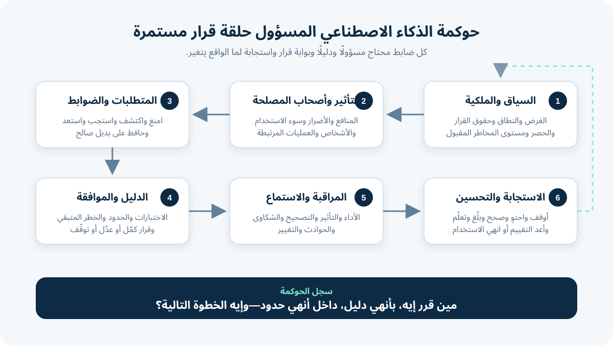

# الذكاء الاصطناعي المسؤول والمخاطر والحوكمة لمحللي الأعمال

**الذكاء الاصطناعي المسؤول (Responsible AI)** معناه إن المؤسسة تصمم أو تشتري أو تستخدم أو تنهي استخدام AI بطريقة تحقق قيمة مشروعة، وفي نفس الوقت تحدد وتقيس وتدير تأثيره على الناس والمؤسسة والمجتمع. و**حوكمة الذكاء الاصطناعي (AI Governance)** هي نظام القرارات اللي يخلي الشغل ده قابلًا للتكرار: أدوار وسياسات وضوابط ودليل وموافقات ومراقبة وتصعيد ومساءلة.

بالنسبة لمحلل الأعمال (Business Analyst - BA)، السؤال العملي مش: «هل الـAI أخلاقي؟» كحكم نعم أو لا مرة واحدة. السؤال هو: **مين من حقه يقرر إيه، باستخدام أنهي دليل، داخل أنهي حدود، وإيه اللي هيحصل لما النظام يغلط أو السياق يتغير؟**

الشرح بيكمل مثال المتجر الأونلاين. الـPilot المقترح بيقترح سبب إرجاع وSupport Queue لطلبات Web مكتوبة بالإنجليزية في فئة منتجات واحدة. موظف متدرّب بيأكد أو يصحح كل اقتراح. كل الأدوار والتقييمات والحدود والسياسات افتراضات للتعليم، مش حقائق ولا استشارة قانونية.

## 1. حوّل المبادئ لقرارات تشغيل

كلمات زي العدالة والشفافية والأمان والخصوصية والمساءلة مهمة، لكنها مش متطلبات لوحدها. افصل بين خمس طبقات:

| الطبقة | معناها | مثال توجيه الإرجاع |
|---|---|---|
| **المبدأ (Principle)** | قيمة أو صفة مرغوبة | محدش ياخد خدمة أسوأ بسبب صفات شخصية ملهاش علاقة بالطلب |
| **السياسة (Policy)** | قاعدة أو التزام في المؤسسة | الـPilot يقترح توجيه، لكنه ممنوع يوافق على الإرجاع أو يرفضه |
| **المتطلب (Requirement)** | شرط قابل للاختبار للاستخدام ده | كل اقتراح يعرض السبب والـQueue ويسمح بالتصحيح قبل التوجيه |
| **الضابط (Control)** | إجراء يمنع الخطر أو يكتشفه أو يستجيب له أو يتعافى منه | الإجراءات الممنوعة مش متاحة، وكل Override وسببه بيتسجلوا |
| **الدليل (Evidence)** | إثبات يُستخدم في القرار | نتائج اختبار حسب نوع الحالة، ومراجعة الوصول، وتحليل التصحيح، وسجل موافقة |

لو مستند الحوكمة بيقول فقط «النظام لازم يكون عادل وقابل للتفسير»، فريق التنفيذ مش هيعرف يبني ده أو يختبره. الـBA بيساعد أصحاب المصلحة يحددوا أنهي معلومة وسلوك ونتيجة واستجابة تثبت المقصود في السياق ده.

## 2. حدد السياق والنطاق ومسار الحوكمة

الخطر بيعتمد على الاستخدام. اقتراح Queue داخلية مختلف عن رفض Refund أو اتهام عميل باحتيال أو اتخاذ قرار عن توظيف أو ائتمان.

ابدأ بـ**سجل مختصر لنظام الـAI**:

| حقل السياق | إجابة الـPilot التعليمية |
|---|---|
| غرض العمل | تقليل القراءة وإعادة التوجيه اللي ممكن نتجنبهم في طلبات الإرجاع |
| دور الـAI | اقتراح سبب واحد وSupport Queue واحدة |
| دور الإنسان | مراجعة كل اقتراح وتأكيده أو تصحيحه |
| الناس المتأثرون | العملاء وموظفو الدعم ومسؤولو الـQueues وفرق التشغيل |
| النطاق الداخل | Web Tickets إنجليزية، وفئة منتجات واحدة، وفريق واحد متدرّب |
| النطاق المستبعد | الإيميل واللغات الأخرى والاشتباه في احتيال والردود التلقائية وقرارات الـRefund |
| البيانات والمورد | حقول حالة معتمدة؛ قرار الـProvider لسه مفتوح |
| صاحب القرار | Product Owner لعمليات الإرجاع |
| مسار المراجعة | مراجعة المجال والبيانات والخصوصية والأمن وLegal/Compliance وAccessibility حسب الحاجة |

الـBA مش هو اللي يقرر أنهي قانون ينطبق. سجّل أماكن التشغيل والمستخدمين والبيانات والقطاع ونوع القرار وأدوار الموردين والمجموعات المتأثرة، علشان المسؤولين المؤهلين يحددوا الالتزامات. ما تخمّنش التصنيف القانوني أو مستوى الخطورة من درجة Workshop.

كمان شوف هل المؤسسة عندها أصلًا AI Inventory أو Acceptable-Use Policy أو Procurement Route أو Risk Classification أو Model Approval أو Incident Process. Canvas المشروع لازم تتصل بحوكمة المؤسسة، مش تستبدلها.

## 3. خلّي المساءلة واضحة

«فيه إنسان في العملية» ما يثبتش المساءلة. سمّي مين عنده السلطة والقدرة والوقت والمعلومات علشان يتصرف.

| قرار الحوكمة | الدور المسؤول في المثال | الأدوار المساعدة | الدليل المسجل |
|---|---|---|---|
| اعتماد الغرض وحدود الـPilot | Product Owner | Support Lead وBA ومتخصصو المخاطر | سجل النطاق والاستخدام الممنوع |
| اعتماد استخدام البيانات | Data Owner | Privacy وSecurity وLegal/Compliance | المصادر والغرض والقيود والاحتفاظ |
| اعتماد تعريفات الـLabels | Domain Owner | موظفون أصحاب خبرة وفريق البيانات | Label Guide ونتائج المراجعة |
| اعتماد خطة التقييم | Product وRisk Owners | Testing وDomain وData Science | المقاييس والتقسيمات والحدود والقيود |
| السماح ببدء الـPilot | سلطة حوكمة محددة بالاسم | كل المراجعين المطلوبين | Decision Record والخطر المتبقي |
| إيقاف التشغيل مؤقتًا | Operations Lead وسلطة الحوادث | Support وEngineering والـProvider | الـTrigger والإجراء والحالات المتأثرة والإخطار |
| اعتماد تغيير النطاق | Product Owner عبر مسار الحوكمة | المسؤولون المتأثرون | Change Assessment ودليل جديد |

افصل بين مصطلحات المسؤولية:

- **Owner:** مسؤول عن القرار ونتيجته.
- **Operator:** بيستخدم أو يشرف على النظام داخل الـWorkflow.
- **Reviewer:** بيقيّم الدليل باستقلال يناسب حجم الخطر.
- **Provider:** بيوفر Model أو Service أو Data أو Platform؛ مش بياخد تلقائيًا كل مسؤوليات المؤسسة.
- **Affected Person:** بيتأثر بالنتيجة حتى لو عمره ما استخدم الأداة.

ابعد عن RACI فيها خمس أسماء في كل خلية ومحدش يقدر يوقف النظام. لكل قرار حرج، حدد سلطة مسؤولة واحدة وبديلًا ممكن الوصول له.

## 4. ارسم المنافع والأضرار وسوء الاستخدام المتوقع

**التأثير (Impact)** هو تغيير بيحصل لشخص أو مجموعة أو مؤسسة أو Process أو بيئة. ضيف المنافع والأضرار، والتأثير المباشر وغير المباشر، والاستخدام المقصود وسوء الاستخدام المتوقع بشكل معقول.

ابدأ بالـProcess الحالية. الـAI ممكن يعمل ضررًا جديدًا، أو يكبّر ضررًا موجودًا، أو يكشف مشكلة كانت موجودة أصلًا.

| صاحب المصلحة أو الأصل | المنفعة المقصودة | الضرر أو مسار الفشل | الدليل المطلوب |
|---|---|---|---|
| العميل | يوصل للفريق الصح أسرع | تأخير أو تحويل متكرر بعد اقتراح غلط | الوقت من البداية للنهاية وإعادة التوجيه والشكاوى حسب التقسيم المناسب |
| موظف الدعم | قراءة متكررة أقل | ضغط الـAutomation يخليه يقبل الاقتراح من غير مراجعة حقيقية | سلوك الـOverride وحجم الشغل والمقابلات ووقت المراجعة بالملاحظة |
| مسؤول الـQueue | استقبال أكثر اتساقًا | تصنيف غلط بشكل منتظم يحمّل Queue واحدة زيادة | الحجم ونمط الأخطاء حسب السبب والفترة |
| المؤسسة | مجهود تعامل أقل | إجراء غير مصرح أو Privacy Incident أو Vendor Outage أو ضرر سمعة | Access Logs واختبار الحوادث وقدرة البديل ودليل العقد |
| أصحاب البيانات | أقل استخدام ضروري | Free Text يكشف معلومات حساسة ملهاش علاقة | مراجعة البيانات والفلترة والوصول والاحتفاظ ومسار الحوادث |

استخدم Failure Modes واضحة في الـWorkshop:

- Output شكله صح لكنه مبني على معلومات غلط أو ناقصة؛
- نمط أخطاء مختلف حسب اللغة أو القناة أو المنتج أو مجموعة تانية مهمة؛
- الـOperators يثقوا في الاقتراح بسرعة أو يتعلموا يلفوا حوالين النظام؛
- استخدام خارج الغرض المعتمد أو بواسطة فريق مش متدرّب؛
- Input خبيث أو بالخطأ أو غير متوقع؛
- Provider واقع أو Integration بايظ أو Log ناقص؛
- تغيير سياسة يخلي الـLabels والضوابط قديمة؛
- مفيش طريق عملي للعميل أو الموظف يعترض على النتيجة.

ما تضغطش كل خطر في Total Score واحد. سجّل **حجم التأثير** و**الاحتمال أو التعرض** و**سهولة الاكتشاف** و**إمكانية الرجوع** وعدد المتأثرين وجودة الدليل وعدم اليقين. Average قليل ما ينفعش يتغلب على منع قانوني أو ضرر شديد صعب الرجوع فيه أو Stop Condition في المؤسسة.

## 5. حوّل صفات الـAI الموثوق لأسئلة BA

إطار NIST لإدارة مخاطر الـAI بيذكر صفات منها: الصلاحية والموثوقية، والأمان، والأمن والمرونة، والمساءلة والشفافية، وقابلية الشرح والتفسير، وتعزيز الخصوصية، والعدالة مع إدارة التحيز الضار. اتعامل معاها كأسئلة مرتبطة، مش Badges منفصلة.

| الصفة | سؤال الـBA في Pilot الإرجاع |
|---|---|
| صالح وموثوق | الاقتراح بيؤدي بشكل كفاية للغرض وظروف التشغيل المحددة؟ |
| آمن | الـWorkflow يقدر يفشل من غير نتيجة غير مقبولة للعميل أو التشغيل؟ |
| آمن معلوماتيًا ومرن | مين يقدر يوصل أو يغيّر Inputs وOutputs وConfiguration وLogs؟ والخدمة هترجع إزاي؟ |
| قابل للمساءلة وشفاف | نقدر نحدد المسؤولين والقرارات والحدود والدليل والتغييرات والحوادث؟ |
| قابل للشرح والتفسير | الـOperator بياخد معلومة مفيدة كفاية يراجع بيها الاقتراح صح؟ |
| يعزز الخصوصية | الاستخدام مسموح ومحدود ومحمي ومدة الاحتفاظ مناسبة والحوادث ليها استجابة؟ |
| عادل مع إدارة التحيز الضار | أنهي فروق في النتائج مهمة؟ هتتقيّم إزاي؟ وإيه الاستجابة بعدها؟ |

وثّق الـTrade-offs. عرض Case Text أكتر ممكن يساعد المراجعة البشرية لكنه يكشف معلومات مش ضرورية. Model أعقد ممكن يحسن Metric ويصعّب الـTroubleshooting. صاحب السلطة هو اللي يقرر داخل السياسة ومستوى المخاطر المقبول وباستخدام دليل—مش الـBA أو الـModel لوحدهم.

## 6. صمّم ضوابط متعددة الطبقات وإشرافًا بشريًا حقيقيًا

**الضابط (Control)** بيغير احتمال الخطر أو تأثيره. استخدم طبقات علشان فشل واحد ما يتحولش تلقائيًا لضرر.

| نوع الضابط | الغرض | مثال توجيه الإرجاع |
|---|---|---|
| **Prevent** | يمنع إجراء أو تعرض غير مرغوب | مفيش API Permission تعمل Refund؛ الحالات المستبعدة تروح للمسار اليدوي |
| **Detect** | يكتشف الفشل أو التغيير بدري | راقب إعادة التوجيه والـOverrides والحقول الناقصة ومحاولات النطاق الممنوع |
| **Respond** | يحتوي الحدث ويتعامل معاه | أوقف الاقتراحات للسبب المتأثر وبلّغ Operations Owner |
| **Recover** | يرجع الخدمة الآمنة ويحافظ على الدليل | استخدم الطلب الأصلي ودليل الـQueue اليدوي، واحتفظ بالـLogs للمراجعة |
| **Correct** | يشيل السبب ويتحقق من التغيير | أصلح قواعد الـLabels أو أعد التدريب أو الإعداد، واختبر واعتمد تاني |

الإشراف البشري يبقى حقيقيًا لما الشخص:

- يعرف إن الناتج من AI ويفهم الغرض منه؛
- يشوف المعلومات اللي محتاجها للمراجعة؛
- عنده وقت وكفاءة يعترض؛
- يقدر يصحح ويرفض ويصعّد ويستخدم بديلًا آمنًا؛
- الـKPIs ما تعاقبوش على Override مناسب؛
- يوصله Feedback لما التصحيحات المتكررة تكشف مشكلة في النظام.

في الـPilot، زرار Confirm لوحده إشراف ضعيف. الـInterface لازم توضح السبب والـQueue المقترحين، وتسمح بالتصحيح، وتعرض الإرشاد المعتمد، وتحافظ على الطلب الأصلي، وتسجل تصرف الإنسان النهائي. اختبر فعالية الإشراف؛ ما تفترضهاش.

## 7. عرّف الشفافية والإخطار ومسار الاعتراض

الشفافية هي معلومة مناسبة للجمهور والقرار، مش مستندًا تقنيًا ضخمًا محدش يقدر يستخدمه.

| الجمهور | محتاج يعرف إيه؟ |
|---|---|
| موظف الدعم | الغرض والحدود والحالات المستبعدة وخطوات المراجعة وأنماط الفشل المعروفة والبديل ومسار الإبلاغ |
| العميل | إخطار مناسب بتدخل AI لما يكون مطلوبًا أو مناسبًا، وإيه اللي بيحصل للطلب، وإزاي يطلب مساعدة أو تصحيحًا |
| مراجع الحوكمة | سجل النظام والموردون والبيانات والتقييمات والقيود والخطر المتبقي والموافقات والمراقبة والحوادث |
| مسؤول التشغيل | النطاق الحالي والحدود والتنبيهات وقدرة البديل وخطة التغيير وإنهاء الاستخدام |

الشرح المفيد يساعد الشخص ياخد الخطوة التالية. «Model Confidence = 0.84» ممكن ما تقولش للموظف ليه الطلب ينتمي لـQueue. «الاقتراح بسبب إن الطلب بيذكر منتجًا غير مفتوح والـOrder داخل المدة المعتمدة» ممكن تكون أفيد—لكن فقط لو الجملة دقيقة وآمنة للعرض ومدعومة من النظام.

اعمل مسار اعتراض عملي. سجّل مين يستقبل الشكوى أو التصحيح، وتوقعات الاستجابة، وإزاي يلاقي السجلات والقرارات المرتبطة، وإزاي المشاكل المتكررة تأثر على المراقبة وقرار التغيير.

## 8. حوّل المخاطر لمتطلبات ودليل قابلين للاختبار

الحوكمة مكانها في المتطلبات والـBacklog وAcceptance Criteria وخطة الاختبار وإجراءات التشغيل وسجل القرار.

| الخطر | المتطلب أو الضابط | دليل القبول | المسؤول |
|---|---|---|---|
| الاقتراح يشغّل إجراء غير مصرح | الـPilot يقترح سببًا وQueue فقط، ومفيش Refund أو Messaging Permission | Architecture Review وPermission Test | Engineering Owner |
| الموظف يقبل الاقتراح تلقائيًا | كل حالة تحتاج مراجعة واضحة؛ التدريب يغطي الحدود والتدرب على الـOverride | Usability Session وTraining Record وسيناريوهات تصحيح | Support Owner |
| نوع حالة معين ياخد أخطاء أضر | التقييم يعرض إعادة التوجيه والتصحيح حسب السبب والتقسيم المعتمد | Evaluation Report له Version ومراجعة Domain | Product وRisk Owners |
| العميل ما يقدرش يتعافى من توجيه غلط | الطلب الأصلي يفضل موجودًا والتوجيه اليدوي متاح دائمًا | End-to-End Fallback Test | Operations Owner |
| النطاق يكبر من غير مراجعة | اللغة والقناة والمنتج وفريق المستخدمين تحت Configuration Control ومسجلين | Change-Control Test وAudit Record | Product Owner |

مثال Acceptance Scenario:

> **Given** إن Ticket خارج فئة المنتجات المعتمدة، **When** الـPilot يستقبلها، **Then** ما يعملش Routing Suggestion، والطلب الأصلي يفضل متاحًا للموظف، وحدث الخروج من النطاق يتحسب لمراجعة الحوكمة.

ابعد عن Requirement بيقول بس «التزم بمبادئ Responsible AI». اربط كل ضابط بخطر محدد وطريقة ودليل ومسؤول واستجابة.

## 9. احكم الموردين والمكونات الخارجية

شراء Service بيغير مين بيقدم الدليل؛ ما يشيلش مسؤولية المؤسسة عن الاستخدام الفعلي.

اطلب من الـProvider معلومات تناسب الخطر ودوره:

- الاستخدامات المقصودة والمستبعدة والحدود التقنية والتشغيلية؛
- البيانات اللي بتتبعت وتتخزن ويُعاد استخدامها ويُحتفظ بها وتتحذف ومين يوصل لها؛
- تغيير الـModel أو الـService والإخطار والـVersion Control والـRollback؛
- طرق ونتائج تقييم مرتبطة بظروف تشغيلك؛
- Security Controls وإخطار الحوادث والـAvailability والـRecovery؛
- Subcontractors والاعتماديات المهمة؛
- Logging وExport ودعم الـAudit والحفاظ على الدليل؛
- قيود الـIntellectual Property والمحتوى؛
- Exit Plan وإرجاع أو حذف البيانات واستمرار الـManual Process.

Marketing Claims وBenchmark Scores عامة مش Acceptance Evidence. اختبر النظام End-to-End بعد إعداده في سياقك، بما فيه Integrations والناس والسياسة والبديل.

## 10. استخدم بوابات قرار قائمة على الدليل

بوابة الحوكمة قرار حقيقي، مش اجتماع كل المشروعات بتعدّيه.

| البوابة | سؤال القرار | النتيجة الممكنة |
|---|---|---|
| الفرصة | الغرض مشروع وله قيمة وأفضل من اختيارات أبسط؟ | ابحث أو أعد التصميم أو أجّل أو توقّف |
| البيانات | البيانات المطلوبة مناسبة ومسموح بها للاستخدام المحدود؟ | كمّل أو أصلح أو ضيّق أو اجمع أو توقّف |
| قبل الـPilot | الضوابط ودليل التقييم بيخلّوا الخطر المتبقي داخل الحد المصرح؟ | وافق أو وافق بشروط أو عدّل أو توقّف |
| مراجعة الـPilot | دليل القيمة والمخاطر يدعم التوسع؟ | كمّل محدودًا أو توسع بمراجعة أو أوقف مؤقتًا أو انهي الاستخدام |
| تغيير مهم | Model أو Provider أو غرض أو Population أو Data Source أو صلاحية جديدة غيّروا التقييم؟ | أعد الاختبار والاعتماد أو قيّد أو توقّف |

**الخطر المتبقي (Residual Risk)** هو الخطر اللي يفضل بعد الضوابط. سجّله مع عدم اليقين والقيود. قبوله لازم ييجي من صاحب السلطة—مش من إيميل من غير رد، أو موافقة انتهت، أو عدم وجود Incident Reports.

## 11. راقب واستجب وأنهِ الاستخدام

اختبارات ما قبل الإطلاق مش هتغطي كل ظروف الواقع. المراقبة لازم تجمع Technical Measures ونتائج الـWorkflow وHuman Feedback والشكاوى والحوادث.

| الإشارة | Trigger تعليمي | الاستجابة المطلوبة |
|---|---|---|
| إجراء غير مصرح أو استخدام ممنوع | أي حالة مؤكدة | أوقف المعالجة المتأثرة واحتوِ وحقق وبلّغ عبر Incident Route |
| نمط إعادة توجيه أو تصحيح | يعدّي الحد المعتمد لسبب أو تقسيم مهم | ضيّق النطاق وراجع البيانات والـLabels والـWorkflow والـModel |
| فشل الإشراف البشري | خطوة المراجعة اتخطت أو الـOperators مش قادرين يستخدموا البديل | أوقف وصول الفريق وأصلح الـWorkflow والتدريب وأعد التحقق |
| تغيير Provider أو Model | Version مهم اتغير أو السلوك اتغير من غير توثيق | جمّد الـRollout وقارن الدليل وأعد الاختبارات المطلوبة |
| شكوى أو بلاغ ضرر | مشكلة متكررة موثوقة أو حادثة شديدة واحدة | اعمل Triage واحفظ الدليل وساعد المتأثرين وصعّد |

خطة الحوادث تحدد الإبلاغ والـTriage والاحتواء والتحقيق والتواصل والتصحيح والتعافي والتعلم. حافظ على دليل كفاية يفهم اللي حصل، من غير الاحتفاظ بالبيانات للأبد «احتياطي».

إنهاء الاستخدام جزء من الحوكمة. حدد مين يقدر ينهيه، وإزاي Integrations وAccess يتشالوا، وإيه اللي يحصل للبيانات والـLogs، وإزاي الحالات المفتوحة تكمل، وإزاي أصحاب المصلحة يعرفوا.

## 12. مثال مكتمل لـAI Risk and Governance Canvas

| مجال الـCanvas | Pilot توجيه الإرجاع | الحالة |
|---|---|---|
| الغرض والمنفعة | اقتراح سبب وQueue لتقليل مجهود التوجيه اللي ممكن نتجنبه | مؤكد لـPilot محدود |
| الناس والعمليات المتأثرة | العملاء والموظفون ومسؤولو الـQueues والتشغيل وأصحاب البيانات | خريطة أولية؛ تتأكد بالمشاركة |
| الاستخدام المقصود والممنوع | اقتراح مع تأكيد؛ مفيش Refund أو رسالة أو اتهام احتيال أو رفض | Hard Boundary مقترحة |
| صاحب القرار | Product Owner لعمليات الإرجاع | محدد؛ محتاج Delegate |
| المراجعون المطلوبون | Domain وData وPrivacy وSecurity وLegal/Compliance وAccessibility حسب الحاجة | المسار محتاج تأكيد |
| التأثيرات الأساسية | تأخير وتحويل متكرر وثقة زيادة وPrivacy Exposure وتحميل Queue وتضخم النطاق | سجل أولي |
| الضوابط | Permission Boundary واستبعادات ومراجعة واضحة وتصحيح وLogging وFallback وAlerts | التصميم محتاج Test Evidence |
| الشفافية والاعتراض | Operator Guide ومسار مساعدة مناسب للعميل وسجل حوكمة | المحتوى والملكية مفتوحين |
| دليل ما قبل الـPilot | جاهزية البيانات وSlice Tests وFallback وPermission Tests وUsability وتدريب | غير مكتمل |
| قرار الخطر المتبقي | المسؤول المصرح يقبل أو يشترط أو يرفض مع تسجيل القيود | لم يُتخذ |
| المراقبة والحوادث | إعادة التوجيه والـOverrides ومحاولات النطاق والشكاوى والتغييرات وتصعيد محدد | الحدود وجدول المسؤولين مفتوحين |
| التغيير وإنهاء الاستخدام | مراجعة Material Change واستمرار يدوي وإغلاق Access وData | محتاج Draft |
| التوصية الحالية | ما تبدأش Live Pilot قبل اكتمال دليل السماح والـLabels والضوابط والإشراف | **توقف مشروط** |

الحوكمة لازم تحفظ الخلاف. لو Reviewer معترض، سجّل المشكلة والدليل والقرار والسلطة والشروط والمتابعة بدل ما تمسح الاعتراض من آخر Slide.

## 13. يسّر مراجعة Responsible AI

ضم Product وProcess Owners والمستخدمين في الصف الأول وDomain Experts وأدوار البيانات والتقنية والاختبار ومتخصصي المخاطر المناسبين، وكمان وجهة نظر المتأثرين المناسبة للسياق.

1. أكد القرار اللي الجلسة لازم تدعمه.
2. اقرأ الغرض والنطاق والاستبعادات والإجراءات الممنوعة بصوت واضح.
3. ارسم الناس المتأثرين والعمليات المرتبطة قبل تقييم الخطر.
4. اوصف المنافع والأضرار وسوء الاستخدام والفشل وعدم اليقين.
5. عيّن لكل خطر مهم Owner وضوابط متعددة الطبقات.
6. حدد Acceptance Evidence وسلطة الخطر المتبقي وشروط التوقف.
7. صمّم مسار المراقبة والـFeedback والحوادث والتغيير وإنهاء الاستخدام.
8. سجّل القرارات المفتوحة والتواريخ وبوابة الحوكمة التالية.

ما تجيبش أصحاب المصلحة المتأثرين علشان يوافقوا على خطة خلصت. خبرتهم ممكن تغير المشكلة، أو تكشف تأثيرًا، أو توضح إن الشرح أو مسار الاعتراض المقترح مش قابل للاستخدام.

## 14. أخطاء حوكمة شائعة

- **اعتبار الحوكمة موافقة نهائية:** المخاطر والسياق بيتغيروا طول دورة الحياة.
- **نسخ المبادئ داخل المتطلبات:** القيم محتاجة سلوكًا ومقاييس ودليلًا ومسؤولين حسب السياق.
- **اعتبار أي Click إشرافًا بشريًا:** المراجع محتاج معلومة وسلطة ووقت ومهارة وبديلًا.
- **فحص Model Accuracy فقط:** الـWorkflow والناس والواجهات والبيانات والـIntegrations والـProvider بيعملوا مخاطر كمان.
- **استخدام Average يخفي ضررًا شديدًا:** بعض الحدود والممنوعات Hard Gates.
- **ترك الـSupplier يحدد الخطر المقبول:** المؤسسة اللي بتستخدم النظام مسؤولة عن قرارات الاستخدام والتأثير.
- **مراقبة Technical Uptime فقط:** الشكاوى والتصحيحات والـWorkarounds ونتائج المجموعات ممكن تكشف ضررًا.
- **عدم وجود مخرج آمن:** Process معتمدة على AI ممكن تفشل لما الـProvider أو الـModel أو البيانات أو السياسة يتغيروا.

## 15. قالب AI Risk and Governance Canvas قابل لإعادة الاستخدام

| المجال | دليلك وقرارك |
|---|---|
| الغرض والقيمة والسياق وAI Inventory ID | |
| الاستخدام المقصود والمستبعد والممنوع والمتوقع | |
| المستخدمون والمتأثرون والمجموعات والعمليات المرتبطة | |
| صاحب القرار والـOperators والـReviewers والـProviders وسلطة الإيقاف | |
| السياسات المطبقة وقرارات Legal/Compliance المتخصصة | |
| المنافع والأضرار وسوء الاستخدام ومسارات الفشل وعدم اليقين | |
| اعتماديات البيانات والـModel والمورد والـIntegration والـHuman Workflow | |
| ضوابط Prevent وDetect وRespond وRecover وCorrect | |
| الإشراف والبديل والإخطار والشرح ومسار الاعتراض | |
| المقاييس والتقسيمات والاختبارات والحدود والقيود ومكان الدليل | |
| الخطر المتبقي والقرار والموافق والشروط وتاريخ الانتهاء أو المراجعة | |
| المراقبة والـFeedback والشكاوى والحوادث والتصعيد | |
| Triggers التغيير المهم ومسار إعادة التقييم | |
| خطة الإنهاء والاستمرارية وإزالة الوصول والبيانات والتواصل | |

## 16. تمرين عملي

بنك بيقترح مساعد AI يوصي بتصنيف وخطوة تالية لأسئلة مكتوبة عن معاملات البطاقات. موظف بيشوف التوصية قبل ما يتصرف.

1. عرّف الاستخدام المقصود والمستبعد والممنوع.
2. حدد أربعة أصحاب مصلحة ومنفعة وضررًا لكل واحد.
3. عيّن أصحاب القرار للغرض والبيانات والتقييم والتشغيل الحي والحوادث وتغيير النطاق.
4. اكتب ضابط Prevent وDetect وRespond وRecover لضرر أساسي واحد.
5. اكتب Acceptance Scenario لاختبار الإشراف البشري الحقيقي، وواحد لاختبار الـFallback.
6. حدد Complaint Route وStop Condition وMaterial-Change Trigger.
7. وصّي: كمّل أو كمّل بشروط أو عدّل أو أوقف مؤقتًا أو نهائيًا، واكتب الدليل الناقص.

ما تخترعش التزامات قانونية أو Fraud Policy أو Risk Tolerance أو Performance Thresholds أو حقوقًا. وجّه الأسئلة للمسؤولين المؤهلين وسجّل القرارات الناتجة.

## مراجع للتوسع

- [NIST AI Risk Management Framework Core](https://airc.nist.gov/airmf-resources/airmf/5-sec-core/)
- [NIST AI RMF Playbook](https://airc.nist.gov/airmf-resources/playbook/)
- [OECD AI Principles](https://oecd.ai/en/ai-principles)
- [OECD: الشفافية وقابلية الشرح](https://oecd.ai/en/dashboards/ai-principles/P7)
- [OECD: المساءلة](https://oecd.ai/en/dashboards/ai-principles/P9)
- [المفوضية الأوروبية: الإطار التنظيمي لقانون الذكاء الاصطناعي](https://digital-strategy.ec.europa.eu/en/policies/regulatory-framework-ai)
- [IIBA: AI Governance at the Crossroads](https://www.iiba.org/business-analysis-blogs/ai-governance-at-the-crossroads-why-business-analysis-is-essential-for-responsible-ai/)
