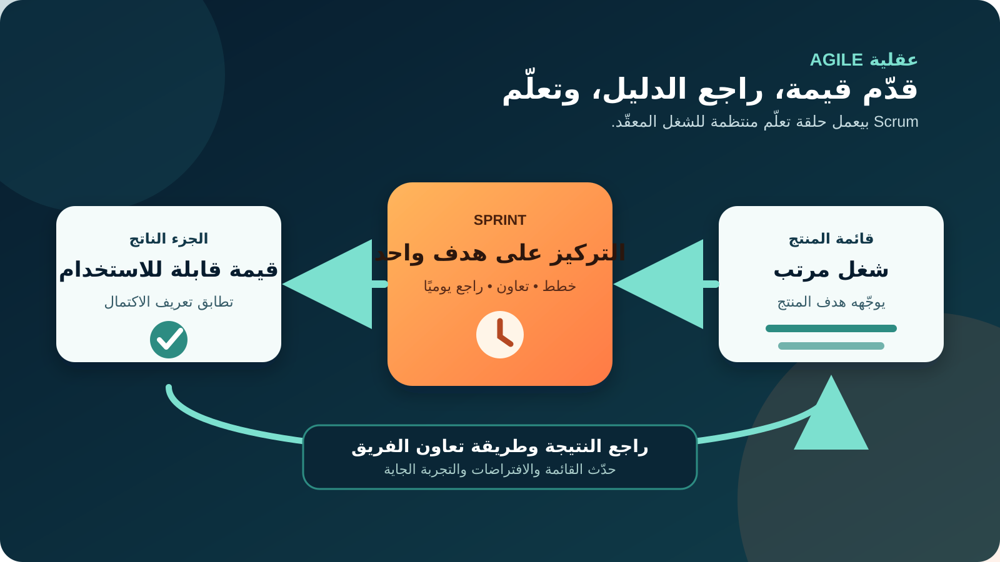
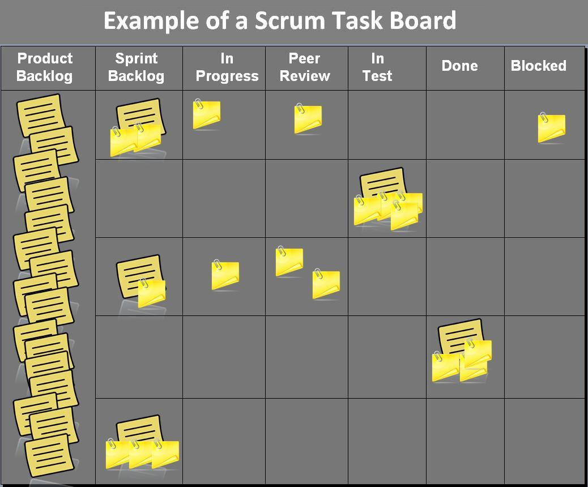

# العمل المرن (Agile) وإطار سكرم (Scrum) لمحللي الأعمال

## 1. ابدأ بالفرق بين العقلية وإطار العمل

**Agile** طريقة تفكير في الشغل بتدي قيمة أكبر لتعاون الناس، والنتيجة المفيدة، والشراكة مع العميل، والاستجابة للتعلّم. الـAgile Manifesto ما بيقولش إن الخطة أو العمليات أو العقود أو التوثيق ملهمش قيمة؛ لكنه بيقول إن العناصر المقابلة ليهم أهم لما نحتاج نختار.

**Scrum** إطار عمل خفيف بيساعد الناس والفرق والمؤسسات تتعامل مع مشكلة معقّدة بأسلوب تجريبي (Empirical). الفريق بيخلّي الشغل وتوقعات الجودة واضحة، وينتج حاجة قابلة للاستخدام في دورة قصيرة، ويراجع الدليل، وبعدها يكيّف قراراته.

بالنسبة لـ **محلل الأعمال (Business Analyst - BA)**، ده تغيير مهم: التحليل مش بيختفي، والمتطلبات مش بتتخمن مرة واحدة في أول المشروع. الـBA بيساعد الفريق ياخد القرار التالي المهم بفهم مشترك كفاية، وبعدها يحدّث الفهم لما المستخدمين أو المخاطر أو النتيجة تعلّم الفريق حاجة جديدة.



**أسئلة الـBA:** إيه النتيجة اللي بنحاول نحسنها؟ إيه الدليل اللي يدعم الجزء الجاي من الشغل؟ وإيه اللي لازم يفضل مرن لحد ما نتعلّم أكتر؟

## 2. المثال المستمر: تحسين إرجاع طلبات التسوق

هنستخدم نفس منتج التسوق أونلاين الموجود في باقي دروس باب. بيانات خدمة العملاء بتشير إن عملاء كتير بيتواصلوا مع الدعم لأنهم مش عارفين يبدأوا إرجاع منتج مؤهل بنفسهم. الشركة عايزة تختبر رحلة إرجاع ذاتية (Self-service).

الأشخاص والقواعد والمدد والأهداف الجاية كلها **افتراضات للتعليم**، مش حقائق عن متجر حقيقي:

| العنصر | مثالنا التعليمي |
|---|---|
| هدف المنتج (Product Goal) | تقليل اتصالات الدعم اللي ممكن نتجنبها، مع توضيح قواعد أهلية الإرجاع |
| مالكة المنتج (Product Owner) | ليلى، مسؤولة عن تعظيم قيمة المنتج والإدارة الفعّالة لقائمة المنتج |
| فريق Scrum | Product Owner و Scrum Master و Developers عندهم مهارات تصميم وبرمجة واختبار وبيانات وتحليل |
| مدة الـSprint | أسبوعان؛ Scrum يسمح بـSprint مدته شهر أو أقل |
| أول هدف تعلّم | العميل المؤهل يبدأ طلب إرجاع ويستلم رقمًا مرجعيًا |
| استثناءات معروفة | انتهاء مدة الإرجاع، منتج غير قابل للإرجاع، جزء من الطلب، شركة الشحن غير متاحة، Refund معلّق |

أول غلطة هي إننا نكتب «اعملوا صفحة للإرجاع» ونتعامل إن الحل مفهوم. الأفضل إن الـBA يوضّح **المشكلة**، والمستخدمين المتأثرين، والدليل الحالي، وقواعد العمل، والحاجات اللي لسه محتاجة اختبار.

## 3. افهم فريق Scrum ومكان شغل الـBA

دليل Scrum بيعرّف ثلاث **مسؤوليات (Accountabilities)**، مش مسميات وظيفية:

| المسؤولية | مسؤولة عن إيه؟ | تعاون مفيد من الـBA |
|---|---|---|
| **Product Owner** | تعظيم قيمة المنتج والإدارة الفعّالة للـProduct Backlog | توضيح النتائج ودليل أصحاب المصلحة والقواعد وخيارات الترتيب وسبب القرار |
| **Scrum Master** | تأسيس Scrum وتحسين فعالية الفريق | كشف تعطيل التحليل، وتسهيل الاكتشاف، وإظهار العوائق |
| **Developers** | إنشاء Increment قابل للاستخدام كل Sprint والالتزام بـDefinition of Done | التعاون في الأمثلة والبيانات والتحقق وأي تحليل مطلوب لإنتاج الـIncrement |

مسمى **Business Analyst** مش مسؤولية رابعة إلزامية في Scrum. ممكن الشركة تخلّي الـBA يدعم الـProduct Owner، أو يساهم جوه الفريق متعدد المهارات، أو يكون له مسمى رسمي تاني. المهم إن المسمى ما يعملش طابور تسليم بين «التحليل» و«التنفيذ». اتفقوا بوضوح: مين بياخد قرار المنتج؟ مين بينفّذ التحليل؟ وإزاي الناس اللي بتبني الـIncrement تشارك في الفهم؟

**خد بالك:** الـBA يقدر يسهّل النقاش ويقترح، لكن ما ينفعش يستبدل قرارات القيمة الخاصة بالـProduct Owner في السر، ولا يفرض على الـDevelopers كمية الشغل اللي يختاروها.

## 4. اربط مخرجات Scrum بالقرارات

Scrum فيه ثلاثة مخرجات (Artifacts)، وكل واحد مرتبط بالتزام يوضّح التركيز والشفافية:

| الـArtifact | الالتزام | مثال الإرجاع | الـBA يساعد يوضّح إيه؟ |
|---|---|---|---|
| **Product Backlog** | Product Goal | تحسين تجربة الإرجاع وتقليل الاتصالات الممكن تجنبها | النتائج والدليل والخيارات والقواعد والاعتماديات والأسئلة المفتوحة |
| **Sprint Backlog** | Sprint Goal | العميل المؤهل يطلب الإرجاع من غير التواصل مع الدعم | أمثلة النطاق والمخاطر والافتراضات المتغيرة والقرارات المطلوبة |
| **Increment** | Definition of Done | جزء قابل للاستخدام لطلب الإرجاع ويحقق مقاييس الجودة المتفق عليها | دليل القبول والسلوك من البداية للنهاية وتوقعات البيانات والتقارير |

الـProduct Backlog قائمة **مرتبة وبتتطور**، مش وثيقة متطلبات ثابتة. الـBacklog Refinement نشاط مستمر لتقسيم العناصر وتوضيحها. Scrum نفسه لا يفرض User Stories أو Definition of Ready أو Story Points أو شكل Board محدد. الفريق ممكن يستخدمهم كممارسات مساعدة لو فعلًا بيضيفوا قيمة.

**تصرف الـBA:** خلّي التتبع خفيف لكنه مفيد. اربط كل عنصر بالنتيجة والدليل والقواعد والقرارات بدل ما تنتج مستندات محدش بيستخدمها في قرار.

## 5. تابع Sprint واحدة كحلقة تعلّم

الـ**Sprint** بتحتوي باقي أحداث Scrum. كل حدث فرصة رسمية للمراجعة والتكيّف، مش اجتماع Status.

| الحدث | غرضه في Scrum | مثال الإرجاع | مساهمة الـBA |
|---|---|---|---|
| **Sprint Planning** | تحديد ليه الـSprint لها قيمة، وإيه الممكن يتعمل، وإزاي الفريق هيبدأ | الاتفاق على Sprint Goal لبدء إرجاع المنتجات المؤهلة | إحضار الدليل والقواعد والأمثلة والاعتماديات والقرارات المفتوحة |
| **Daily Scrum** | الـDevelopers يراجعوا التقدم نحو Sprint Goal ويكيّفوا خطتهم | قيد في API شركة الشحن يهدد الهدف | يكون متاحًا لتوضيح سريع، من غير تحويل الاجتماع لتقرير حالة من الـBA |
| **Sprint Review** | الفريق وأصحاب المصلحة يراجعوا النتيجة ويحددوا التكيّف التالي | المستخدم فاهم الأهلية لكنه متردد بسبب رسالة الـRefund | تسجيل الدليل والأولويات المتغيرة والمساعدة في تحديث الـProduct Backlog |
| **Sprint Retrospective** | الفريق يخطط لتحسين الجودة والفعالية | تأخر قرار سياسة الإرجاع سبّب إعادة شغل | تحسين طريقة Discovery وRefinement، مش المنتج بس |

Sprint مدتها أسبوعان ما تعنيش إن كل سؤال يستنى اجتماعًا. التحليل والـRefinement ومقابلات أصحاب المصلحة والاختبار ممكن يحصلوا طول الـSprint. الفريق يحمي Sprint Goal، وفي نفس الوقت يتفاوض على النطاق لما يتعلّم حاجة جديدة.

## 6. جهّز عنصر Backlog لنقاش Refinement

ابدأ بالنتيجة، وبعدها أضف أقل تفاصيل تكفي لنقاش مسؤول. ده مثال مكتمل على مخرج عملي للـBA.

### نموذج مكتمل لعنصر Backlog

| الحقل | المثال المكتمل |
|---|---|
| المستخدم / المشكلة | عميل عنده منتج مؤهل وتم توصيله، لكنه حاليًا بيتواصل مع الدعم عشان يبدأ الإرجاع |
| النتيجة المطلوبة | العميل يرسل الطلب ويستلم رقمًا مرجعيًا من غير مساعدة الدعم |
| الدليل | تحليل اتصالات الدعم يشير إن «إزاي أرجع المنتج؟» سبب متكرر؛ الحجم محتاج تأكيد |
| أصغر جزء مقترح | منتج واحد تم توصيله، سبب إرجاع قياسي، طلب داخل البلد، وطريقة الدفع الأصلية |
| قواعد العمل | المنتج داخل مدة الإرجاع المحددة، وتصنيفه مش ضمن المنتجات غير القابلة للإرجاع |
| أمثلة القبول | المنتج المؤهل ينجح؛ المدة المنتهية يتوضح سبب رفضها؛ المنتج غير القابل للإرجاع يتوقف؛ الطلب المكرر لا يتسجل مرتين |
| البيانات والتقارير | تسجيل Order ID وItem ID والسبب والوقت ونتيجة الأهلية والرقم المرجعي، من غير كشف بيانات شخصية غير لازمة |
| الاعتماديات | حالة الطلب، قابلية تصنيف المنتج للإرجاع، خدمة الـRefund، وتوفر شركة الشحن |
| قرارات مفتوحة | مين صاحب سياسة الأهلية؟ وإيه اللي يحصل لو حجز الشحن فشل بعد إنشاء الطلب؟ |
| إشارة النجاح | نسبة الإكمال ونسبة اتصالات الدعم لمحاولات الإرجاع المؤهلة، مع تحديد Baseline قبل الإطلاق |

### حوّل القواعد لأمثلة قبول

الأمثلة المحددة بتكشف الفراغات:

```text
Given إن المنتج في الطلب تم توصيله من 10 أيام
And إن تصنيف المنتج قابل للإرجاع
When العميل يرسل سبب إرجاع صحيح
Then يتم إنشاء طلب إرجاع
And يظهر للعميل رقم إرجاع مميز
```

وبعدها أضف مسار الفشل:

```text
Given إن طلب الإرجاع مؤهل
And إن حجز شركة الشحن غير متاح مؤقتًا
When العميل يؤكد الطلب
Then يتم حفظ طلب الإرجاع مرة واحدة
And يعرف العميل الخطوة التالية
And يتم تسجيل المشكلة للمتابعة التشغيلية
```

دي أمثلة، مش كل المتطلب. الفريق ما زال محتاج يراجع سهولة الاستخدام، وإتاحة الوصول (Accessibility)، والأمان، والتحليلات، والجوانب القانونية والتشغيلية، وDefinition of Done المناسبة للمنتج.

## 7. اقرأ الـBoard كأداة نقاش، مش كأنها Scrum نفسها



*لوحة Scrum حقيقية. الصورة لـDr Ian Mitchell، من [Wikimedia Commons](https://commons.wikimedia.org/wiki/File:Scrum_task_board_example.jpg)، ومتاحة بترخيص CC0 أو CC BY-SA 2.5. الـBoard ممارسة اختيارية، ومش واحدة من Scrum Artifacts الإلزامية.*

الـBoard ممكن تخلّي الشغل واضح، لكن الأعمدة والكروت وحدهم مش دليل إن الفريق Agile. لما الـBA يقرأ الـBoard، يسأل:

- إيه العناصر اللي بتخدم Sprint Goal؟ وإيه اللي بيشتت الفريق عنها؟
- هل فيه شغل واقف بسبب قاعدة أو قرار Stakeholder أو شرط اختبار أو تعريف بيانات غير واضح؟
- هل الفريق بيبدأ عناصر كتير من غير ما حاجة توصل لـDone؟
- هل Done معناها «اتكتب الكود»، ولا Increment قابل للاستخدام ويحقق Definition of Done؟

الصورة بتعرض تنفيذًا فعليًا واحدًا. Digital Board ممكن تكون مناسبة بنفس الدرجة. الفريق يختار الأداة اللي تحسّن الشفافية بدل ما يجبر طريقته على Template جاهز.

## 8. استخدم Story Points وVelocity بحذر

بعض الفرق بتقدّر عناصر الـBacklog باستخدام **Story Points**: مقياس نسبي للمجهود والتعقيد وعدم اليقين يتفق عليه نفس الفريق. هي مش ساعات، ومينفعش نقارنها بشكل موثوق بين فريقين. الـDevelopers مسؤولون عن خطتهم وتقديراتهم، والـBA يضيف سياق القواعد والاعتماديات وعدم اليقين.

**Velocity** هي كمية الشغل المقدّر اللي الفريق أكمله خلال Sprint. ممكن تساعد نفس الفريق يعمل Forecast تقريبي لما السياق مستقر. لكنها مش درجة إنتاجية، ولا Target لازم يزيد، ولا دليلًا على قيمة العميل. إعادة التقدير لرفع الـVelocity بتغير الرقم بس.

في مثال الإرجاع، عقد شركة شحن غير واضح ممكن يكبر القصة نسبيًا. الـBA يقلل عدم اليقين بجمع Documentation وأمثلة؛ بعدها الفريق يقسم القصة أو يعدّل التقدير. استخدم Range في التوقع، وافصل مقاييس النتيجة—زي الإرجاعات المكتملة واتصالات الدعم—عن تقديرات التسليم.

## 9. اتعاون باستمرار، بدل تسليم وثيقة متطلبات


*التعاون المستمر بيربط الـDiscovery والتنفيذ والتحقق بدل ما يحوّل التحليل لتسليم مستند مرة واحدة.*

إيقاع عملي مفيد للـBA في مثال الإرجاع:

1. **اكتشف (Discover):** راجع بيانات الدعم وشوف رحلة الإرجاع الحالية مع المستخدمين والتشغيل.
2. **صِغ المشكلة (Frame):** اربطها بـProduct Goal واكتب الافتراضات بوضوح.
3. **اعمل Refinement مع الفريق:** ناقش أجزاء صغيرة وقواعد وأمثلة وأسئلة مفتوحة مع Product Owner وDevelopers.
4. **ادعم التنفيذ:** جاوب بسرعة وحدّث الفهم المشترك لما التنفيذ يكشف قيدًا جديدًا.
5. **تحقق (Validate):** قارن الـIncrement بالأمثلة وتوقعات الجودة، وبعدها راجع دليل المستخدمين والتشغيل.
6. **تكيّف (Adapt):** حدّث الـBacklog وطريقة التحليل بعد الـReview والـRetrospective.

ده بيتوصف أحيانًا بتحليل **بالقدر الكافي وفي الوقت المناسب (Just enough, just in time)**. مش معناه «ما تكتبش حاجة». معناه تنتج أصغر مخرج موثوق يخدم القرار التالي، وتحفظ القواعد وسبب القرار في مكان الفريق يلاقيه، وما تفصّلش شغلًا بعيدًا غالبًا هيتغير.

## 10. تعامل مع التغيير والاستثناءات من غير فقد السيطرة

| الموقف | رد ضعيف | رد أفضل من الـBA |
|---|---|---|
| Stakeholder أضاف قاعدة في نص الـSprint | وعد فوري أو رفض أي تغيير | راجع أثرها على Sprint Goal، وتعاون مع Product Owner وDevelopers على النطاق وتحديث الـBacklog |
| عنصر مش واضح في Sprint Planning | اخفِ عدم اليقين داخل وثيقة كبيرة | اذكر المجهول واعرض أمثلة، وسيب الـDevelopers يقرروا هل الفهم كافي لاختياره |
| الـDemo شكله صح | اعتبر النتيجة ناجحة | راجع Definition of Done والاستخدام الحقيقي والاستعداد التشغيلي ومقاييس ما بعد الإطلاق |
| كل طلب بقى عاجل | خلّي الأولوية حسب المنصب أو الصوت الأعلى | ارجع لـProduct Goal والدليل وتكلفة التأخير والاعتماديات وقرار Product Owner |
| الفريق خلّص Tickets كتير ولسه العملاء بيتصلوا | ارفع تقرير Output فقط | قارن الـIncrement بنتيجة العميل والعمل المطلوبة |

لو معلومة جديدة ممكن تهدد Sprint Goal، وضّحها بسرعة. الفريق يقدر يوضّح النطاق ويتفاوض عليه مع Product Owner مع التعلّم. ما تقللوش الجودة في السر، وما تغيّروش معنى Done عشان الرسم البياني يبان أحسن.

## 11. قالب BA قابل لإعادة الاستخدام

انسخ الجدول ده قبل جلسة Refinement:

| الحقل | ملاحظاتك |
|---|---|
| علاقته بـProduct Goal |  |
| المستخدم / المشكلة |  |
| النتيجة المطلوبة |  |
| الدليل ودرجة الثقة |  |
| أصغر جزء مفيد |  |
| قواعد العمل |  |
| أمثلة القبول: النجاح |  |
| أمثلة القبول: الاستثناءات |  |
| البيانات والتقارير والخصوصية |  |
| الاعتماديات |  |
| الافتراضات والقرارات المفتوحة |  |
| إشارة النجاح والـBaseline |  |
| صاحب القرار / تاريخ المراجعة |  |

### تمرين صغير

وسّع مثال الإرجاع لحالة **إرجاع جزئي لمنتجين من نفس الطلب**. اكتب:

1. نتيجة واحدة مطلوبة؛
2. قاعدتين Business Rules؛
3. مثال قبول ناجح؛
4. مثالين للاستثناءات؛
5. مقياس واحد هتراجعه بعد الإطلاق.

وبعدها حدد إيه اللي هتسأله للـProduct Owner والـDevelopers والتشغيل وممثل عميل قبل التفكير في اختيار العنصر داخل Sprint.

## مراجع للتوسع

- [بيان Agile الرسمي](https://agilemanifesto.org/iso/ar/manifesto.html)
- [مبادئ Agile Manifesto](https://agilemanifesto.org/principles)
- [دليل Scrum الرسمي لعام 2020](https://scrumguides.org/scrum-guide.html)
- [تنزيلات دليل Scrum الرسمية، ومنها الترجمة العربية](https://scrumguides.org/download)

*سيناريو المنتج والأشخاص والسياسات والأهداف والمقاييس في الدرس افتراضية للتعليم. في مشروع حقيقي، أكدها مع أصحاب المسؤولية وبالدليل.*
