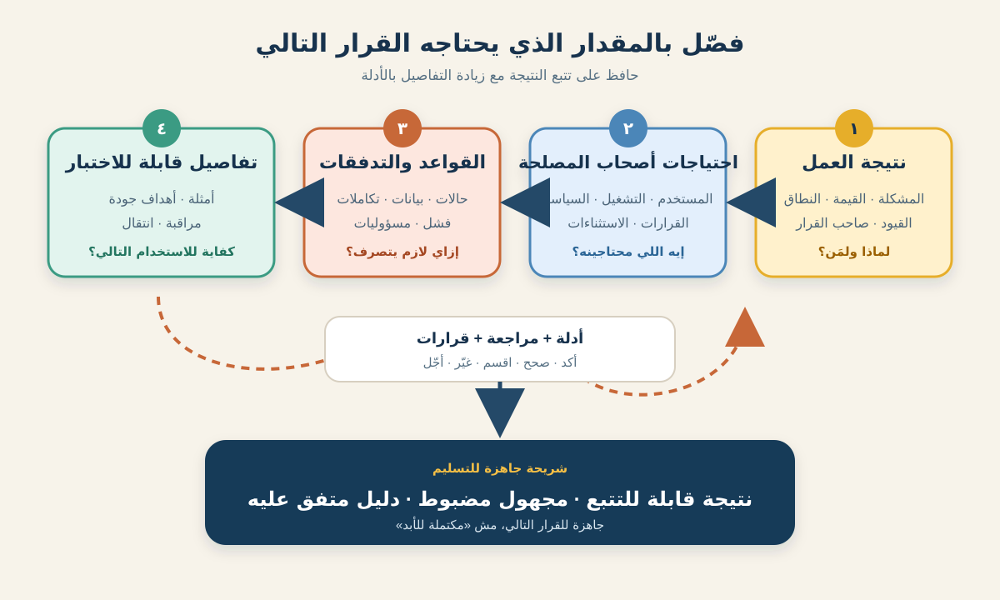

# التفصيل التدريجي للمتطلبات لمحلل الأعمال

المتطلبات نادرًا ما بتوصل كاملة. في بداية المبادرة ممكن الفريق يعرف نتيجة العمل المطلوبة، لكنه لسه مايعرفش كل قاعدة واستثناء وتكامل وخطوة تشغيل. **التفصيل التدريجي (Progressive Elaboration)** هو إضافة التفاصيل المناسبة بشكل مقصود مع نمو المعرفة والأدلة.

ده مش معناه «سيب كل حاجة غامضة لحد ما التطوير يبدأ». معناه تثبّت القرارات المستقرة، وتسجل المجهول، وتفصّل الشغل الأقرب أو الأعلى مخاطرة بما يكفي للقرار التالي. المعهد الدولي لتحليل الأعمال (IIBA) بيصف مهام تحليل الأعمال بأنها أنشطة تكرارية بتبني المعرفة، ومحتوى معهد إدارة المشاريع (PMI) بيشرح تحليل المتطلبات كتدرج من المتطلبات عالية المستوى لمستويات أدق كل ما نعرف أكتر.



هنستخدم سيناريو افتراضيًا واحدًا: متجر بقالة أونلاين عايز العميل **يغيّر ميعاد توصيل طلب محجوز** من غير الاتصال بالدعم. الأدوار والسياسات والأوقات والأنظمة والمقاييس هنا افتراضات تعليمية، مش قواعد عامة للبيع بالتجزئة.

## 1. ثبّت نقاط الارتكاز قبل إضافة التفاصيل

التفصيل التدريجي محتاج حدودًا. من غيرها أي فكرة جديدة ممكن تتقدم كأنها «تفصيلة إضافية». ابدأ بالاتفاق على المعلومات اللي تفضل مستقرة لحد ما دليل أو حوكمة يغيرها.

| نقطة الارتكاز | مثال البقالة | سؤال الـBA |
|---|---|---|
| المشكلة | العملاء بيتواصلوا مع الدعم لما الميعاد المختار مايبقاش مناسبًا | إيه الدليل على المشكلة ومين بيتأثر؟ |
| النتيجة | العميل المؤهل يختار ميعادًا بديلًا متاحًا بنفسه | إيه التغيير الملحوظ اللي المستخدم لازم يحققه؟ |
| مقياس القيمة | اتصالات أقل من غير زيادة التوصيلات الفاشلة | هنعرف منين إن التغيير أفاد؟ |
| حد النطاق | الطلبات المدفوعة قبل بدء تجهيز المخزن | أنهي طلبات وقنوات وحالات Lifecycle داخلة؟ |
| القيد | الميعاد الجديد لازم تكون فيه سعة للتجهيز والتوصيل | أنهي قواعد أو التزامات ماينفعش نتجاهلها؟ |
| صاحب القرار | العمليات تملك سياسة السعة، والـProduct يملك نطاق الإصدار | مين يقدر يعتمد أو يغير كل نقطة؟ |

النقاط دي مش محصنة من التغيير؛ هي بس واضحة. لو الهدف اتحول من «تغيير الميعاد» إلى «تعديل المنتجات والعنوان بعد الدفع»، فده مش تفصيلًا صغيرًا؛ ده تغيير للاحتياج يستحق Impact Analysis.

**إجراء للـBA:** علّم كل عبارة: **مؤكدة** أو **افتراض** أو **مفتوحة** أو **خارج النطاق**. الافتراض المفصل يفضل افتراضًا.

## 2. فصّل من خلال مستويات مترابطة

المتطلبات ممكن تتمثل بمستويات مختلفة من غير ما نفرض هرم مستندات جامد. الاختبار المفيد هو: هل التفاصيل الأدق قابلة للتتبع لاحتياج حقيقي؟

| المستوى | مثال تغيير الميعاد | الدليل أو المراجع |
|---|---|---|
| Business Requirement | تقليل اتصالات تغيير مواعيد التوصيل مع حماية أداء التنفيذ | Baseline للدعم وقائد العمليات والراعي |
| Stakeholder Requirement | العميل محتاج يشوف المواعيد البديلة المؤهلة قبل تأكيد التغيير | بحث المستخدم وحالات الدعم |
| Solution Requirement: السلوك | الخدمة تعرض المواعيد المطابقة لقواعد السعة والموقع ووقت الإغلاق | مالك سياسة السعة وفريق التنفيذ |
| Solution Requirement: الجودة | المواعيد المتاحة تظهر خلال هدف الاستجابة المتفق عليه تحت الحمل المتوقع | دليل الأداء ومالك الخدمة |
| Transition Requirement | موظفو الدعم محتاجين تعليمات للطلبات اللي ماتنفعش تتغير ذاتيًا | قائد الدعم ومالك التدريب |
| Acceptance Example | بافتراض إن التجهيز مابدأش وفيه سعة، لما العميل يؤكد ميعادًا جديدًا، حجز واحد جديد يستبدل القديم | Product والاختبار والعمليات |

المستويات مترابطة، مش مجرد فقرات بنكتبها بالترتيب. Business Requirement واحدة ممكن تنتج عدة Stakeholder وSolution Requirements. والاستثناء المكتشف ممكن يكشف Stakeholder ناقصًا أو يتحدى النطاق الأصلي.

**غلطة شائعة:** تستبدل المتطلب عالي المستوى بدل ما تحافظ على العلاقة. خليك محافظًا على النتيجة واربط بها القاعدة التفصيلية؛ كده سبب القاعدة يفضل ظاهرًا.

## 3. خطط التفاصيل حسب قرب القرار والمخاطرة

مش كل متطلب محتاج نفس العمق النهارده. استخدم أفقًا بسيطًا علشان تحدد مكان مجهود التحليل.

| الأفق | التفاصيل المطلوبة | مثال القرار |
|---|---|---|
| **الآن (Now)** — شريحة التسليم التالية | قواعد وسيناريوهات وبيانات وجودة واعتماديات وأدلة قبول وعوائق مفتوحة | هل الفريق يقدر ينفذ التغيير قبل بدء التجهيز؟ |
| **التالي (Next)** — الشريحة المرجحة بعدها | نتيجة واضحة وقواعد رئيسية وخيارات ومخاطر واعتماديات وأسئلة استكشاف | هل تغيير الميعاد ينفع بعد بدء التجهيز؟ |
| **لاحقًا (Later)** — اتجاه مرشح | مشكلة وفرضية قيمة وإشارة نطاق وقيد أساسي | هل العميل يقدر يغير عنوان التوصيل كمان؟ |

قدّم عنصرًا متأخرًا لما يعمل اعتمادية لقرار أو يحتاج وقتًا طويلًا أو فيه التزام قانوني أو Integration مكلف أو عدم يقين عالٍ. ماتتفصّلوش لمجرد إن حد عايز الـBacklog شكله كامل.

ده قريب من **Rolling-Wave Planning**: الشغل القريب ياخد تفاصيل أكثر، والمستقبلي يفضل بالمستوى المناسب. والـBA يسجل من السياق المستقبلي ما يكفي لمنع قرار محلي يقفل خيارات لها قيمة.

**إجراء للـBA:** حدد **محفز تفصيل (Elaboration Trigger)** لكل عنصر، زي «قبل الإصدار المستهدف بست أسابيع» أو «بعد تجربة Capacity API» أو «لما Legal يؤكد سياسة الإغلاق».

## 4. استخدم حلقات دليل، مش تكبير المستند

التفصيل لازم يجاوب أسئلة. إضافة فقرات من غير تقليل عدم اليقين هي نمو في التوثيق، مش تحليلًا.

في كل جولة:

1. **سمّي القرار.** «هل نقدر ننقل الطلب بأمان بعد تخصيص مسار للسائق؟»
2. **اكشف الفجوة.** الأنظمة الحالية مالهاش تعريف واحد لـ«اكتمل التخصيص».
3. **اختار Technique.** ارسم الحالات مع العمليات، وافحص Event Data، واعمل Prototype لرسالة العميل.
4. **اجمع الدليل.** حدد أحداث النظام وحدود السياسة وحجم الاستثناءات ونتائج فهم المستخدم.
5. **حدّث الأدوات المترابطة.** عدّل State Model والقواعد والأمثلة والمخاطر وروابط التتبع.
6. **راجع وقرر.** اعتمد أو اقسم أو استكشف أو أجّل أو ارفض، وسجّل المالك والتاريخ.

### أسئلة استكشاف في المثال

- أنهي حالة طلب هي المصدر الموثوق: الدفع ولا المخزن ولا التوصيل ولا الحالة الظاهرة للعميل؟
- إمتى بنحرر سعة الميعاد القديم ونحجز الجديد؟
- إيه اللي يحصل لو حررنا القديم وفشل حجز الجديد؟
- هل رسوم التوصيل الترويجية تتغير مع الميعاد؟
- أنهي Notifications لازم تتبعت، وبأنهي لغة، وأنهي واحدة هي التأكيد القابل للمراجعة؟
- الدعم يشوف إيه لو التغيير Pending أو فشل جزئيًا؟
- أنهي Response Time وسلوك Accessibility يخلي الرحلة قابلة للاستخدام؟

الإجابة ممكن تنتج متطلبًا أو Business Rule أو تحديث Model أو Design Constraint أو Risk Response أو قرار تقسيم. ماتجبرش كل اكتشاف يدخل جملة «The system shall…».

## 5. افصل التفصيل عن التغيير والتصحيح

الفريق محتاج تصنيفًا مشتركًا لأن كل حركة لها حوكمة مختلفة.

| الحركة | المثال | التعامل |
|---|---|---|
| تفصيل داخل حد متفق عليه | تحديد أنهي رد من خدمة السعة معناه «ميعاد متاح» | ضيف التفصيلة واربطها وراجعها مع المالك المناسب |
| اكتشاف يصحح افتراضًا | بيانات الدعم بتقول إن أغلب الطلبات بعد بدء التجهيز | حدّث الافتراض وأعد تقييم النطاق والقيمة وسجّل الدليل |
| تغيير متطلب | إضافة تغيير العنوان لرحلة تغيير الميعاد | قيّم القيمة والأثر والأولوية والاعتماديات والاعتماد |
| تصحيح عيب | مثالان للقبول متعارضان مع قاعدة الإغلاق المعتمدة | صحح التعارض وأعد Verification للأدوات المتأثرة |
| قرار تصميم | عرض المواعيد في Calendar أو List | سجل السبب واعمل Usability Validation؛ ماتسميهوش احتياج عمل |

الـBaseline مش بيمنع التعلم. هو مرجع معتمد يخلي الناس تشوف إيه اللي اتغير. في Product Team خفيف، Version History وقرار مسجل ممكن يكفوا. في مبادرة منظمة أو تعاقدية ممكن تحتاج اعتمادًا رسميًا. خلّي التحكم مناسبًا للمخاطرة وسياسة المؤسسة.

**تحذير:** «لسه بنفصّل» مش عذر آمن لتوسيع النطاق في صمت. لو النتيجة أو الحدود أو التكلفة أو المخاطرة أو الاتفاق أو السلوك الملتزم به اتغير، اعمل Impact Analysis واستخدم مسار الاعتماد المتفق عليه.

## 6. قرر إمتى الشريحة عندها تفاصيل كفاية

«المتطلبات كاملة» نادرًا ما تكون حالة عامة مفيدة. اسأل هل الشريحة جاهزة للاستخدام التالي: ترتيب أو تصميم أو تقدير أو تنفيذ أو اختبار أو اعتماد؟

للشريحة الأولى من تغيير الميعاد، اتأكد إن:

- نتيجة المستخدم وقيمة العمل قابلتان للتتبع؛
- حالات الطلب الداخلة والاستبعادات الواضحة مفهومة؛
- قواعد العمل لها ملاك وأمثلة حدود؛
- النجاح والرفض والـTimeout والطلب المكرر والفشل الجزئي متغطين؛
- مصادر البيانات وملكية الحالة محددة؛
- الأمان والخصوصية والإتاحة والأداء والـAudit واللغات اتناقشوا؛
- تعامل العمليات والـMonitoring وظهور الحالة للدعم متعرفين؛
- أمثلة القبول متسقة مع التدفق والقواعد؛
- المجهول الباقي له مالك وخطة دليل وتاريخ قرار؛ و
- المراجعون المتأثرون عملوا Verification للجودة وValidation للقيمة المطلوبة.

العنصر ممكن يكون جاهزًا مع سؤال صغير مفتوح لو مش هيغير القرار الحالي وله مالك مسيطر عليه. اعتمادية مخفية أو تعارض سياسة غير محلول مختلف؛ ممكن يوقف الشريحة أو يجبر تقسيمها.

## 7. سجل تفصيل تدريجي مكتمل

| الجولة | التفاصيل والدليل المعروف | النقطة المفتوحة | القرار / الخطوة التالية |
|---|---|---|---|
| 1 — النتيجة | اتصالات الدعم بتثبت احتياج تغيير الميعاد؛ الهدف والـBaseline متفق عليهما | أنهي حالات الطلب مؤهلة؟ | Workshop للعمليات؛ المالك: BA؛ 6 أكتوبر |
| 2 — الحدود | الإصدار الأول للطلبات المدفوعة قبل التجهيز؛ تعديل العنوان والمنتجات خارج النطاق | وقت الإغلاق ومصدر السعة | مراجعة السياسة وAPI Walkthrough؛ العمليات والـIntegration ملاك |
| 3 — السلوك | ابحث عن مواعيد → احجز الجديد مؤقتًا → أكد → حرر القديم | الـService الحالية ماتدعمش Atomic Swap | أضف Pending State ومسار Recovery وسجّل قرار Architecture |
| 4 — الأمثلة | تمت مراجعة النجاح وعدم وجود سعة وتجاوز الوقت والتكرار والـTimeout والتعافي | صياغة الإشعار بالعربية | مراجعة محتوى مع الدعم والـLocalization |
| 5 — الجاهزية | القواعد وState Model وأمثلة القبول والـMonitoring ومسار الدعم اجتازوا V&V | لا يوجد عائق للشريحة الأولى | جاهزة لتقدير الفريق وتخطيط التنفيذ |

السجل حافظ على النتيجة والدليل الجديد والأسئلة والملاك والقرارات. وما ادعاش إن النسخة الأخيرة كانت موجودة من اليوم الأول.

## 8. Template قابل لإعادة الاستخدام

```text
رقم وعنوان المتطلب / الشريحة:
نتيجة العمل والدليل:
أفق القرار الحالي: الآن / التالي / لاحقًا
داخل / خارج النطاق:
نقاط الارتكاز المستقرة وأصحاب القرار:

التفاصيل الحالية:
- احتياجات أصحاب المصلحة:
- القواعد وحالات العملية:
- البيانات والتكاملات:
- توقعات الجودة:
- الانتقال والتشغيل:
- أمثلة القبول:

الدليل المستخدم وتاريخه:
الحقائق المؤكدة:
الافتراضات:
الأسئلة المفتوحة وملاكها وتواريخها:
المخاطر والاعتماديات:
روابط التتبع:

تصنيف الحركة: تفصيل / تصحيح افتراض / تغيير متطلب / عيب / قرار تصميم
الأثر والاعتماد المطلوب:
قرار الجاهزية والمراجعون:
محفز التفصيل التالي:
```

### تمرين سريع

طبّق الـTemplate على شريحة ثانية: **اسمح للعميل بتغيير الميعاد بعد بدء تجهيز المخزن**. حدد نقطة ارتكاز مستقرة، واحتياجين جديدين لأصحاب المصلحة، وثلاثة مسارات فشل، وتوقع جودة واحدًا، والدليل المطلوب قبل اعتماد الشريحة. بعد كده صنّف «اسمح كمان بتغيير العنوان» كتفصيل أو تغيير واشرح السبب.

## مراجع للتوسع

- [IIBA: مقدمة مهام تحليل الأعمال](https://www.iiba.org/knowledgehub/business-analysis-standard/4-tasks-and-knowledge-areas/introducing-business-analysis-tasks/)
- [IIBA: إنفوجراف أنواع المتطلبات](https://www.iiba.org/contentassets/38e412c7b77d456297d953de5bf5ca61/requirement-types-infograph.pdf)
- [PMI: تحليل المتطلبات والتفصيل التدريجي](https://www.pmi.org/learning/library/2019/04/07/15/30/time-manage-requirements-project-late-6956)
- [PMI: معجم مصطلحات إدارة المشاريع](https://www.pmi.org/-/media/pmi/documents/registered/pdf/pmbok-standards/pmi-lexicon-pm-terms.pdf)

*السيناريو والسياسات والتواريخ والأنظمة والمقاييس وقرارات الجاهزية افتراضية للتعليم. عدّل مستوى التفاصيل والأدلة والـBaselines والاعتمادات حسب طريقة التسليم والمخاطر والعقود والحوكمة عندك.*
