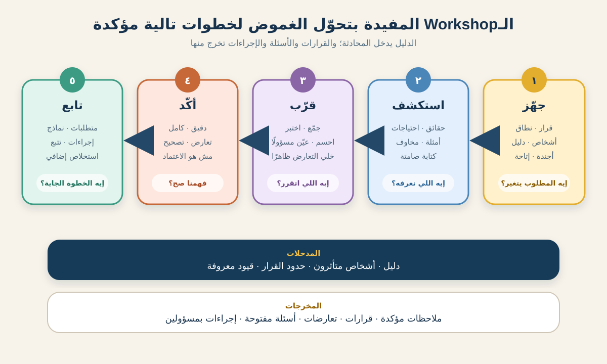

# استخلاص المتطلبات وتيسير ورش العمل

**استخلاص المتطلبات (Requirements Elicitation)** هو شغل إخراج المعلومات واستكشافها واستقبالها من الناس ومن مصادر تانية. الموضوع أكبر من إنك تسأل أصحاب المصلحة: «إنتوا عايزين إيه؟». محلل الأعمال (BA) بيراجع الدليل، ويراقب الشغل، ويختبر أمثلة، ويكشف الاختلافات، ويتأكد إنه فهم الكلام صح.

IIBA بيجمع الشغل ده في خمس مهام: التجهيز للاستخلاص، وتنفيذه، وتأكيد نتائجه، وتوصيل معلومات تحليل الأعمال، وإدارة تعاون أصحاب المصلحة. الأنشطة دي تكرارية، مش اجتماع واحد اسمه «جمع المتطلبات».

التوتوريال ده هيعلمك تختار أسلوب الاستخلاص المناسب وتيسّر Workshop تنتج دليلًا وقرارات وأسئلة مفتوحة قابلة للاستخدام، مش كمية Notes محدش واثق منها.



## السيناريو العملي: تحسين الاستلام من الفرع

سلسلة متاجر بقالة بتجرب خدمة الطلب أونلاين والاستلام من الفرع (Click-and-Collect) في ثلاثة فروع. عايزة العميل يختار ميعاد الاستلام ويسمح لشخص تاني يستلم الطلب. العمليات في الفرع والدعم والمخاطر ومكافحة الاحتيال والمنتج وفريق التنفيذ كل واحد عنده جزء من الصورة.

الـBA مطلوب منه ييسّر Workshop تدعم القرار ده:

> إيه القواعد والاستثناءات والمسؤوليات اللي لازم أول إصدار يغطيها لمواعيد الاستلام والشخص البديل؟

الشركة والأدوار والقواعد والمدد والقرارات هنا **افتراضية للتعليم**. في مشروع حقيقي لازم تأكدها مع أصحاب المصلحة وسياسات المؤسسة.

## 1. حدد نتيجة الاستخلاص قبل ما تحجز اجتماع

ماتبدأش بـ«نجمع كل الناس في Room». ابدأ بالقرار أو الغموض اللي محتاج معالجة.

| سؤال التخطيط | إجابة مثال الاستلام |
|---|---|
| ليه بنعمل Elicitation؟ | نحدد سياسة آمنة وقابلة للتشغيل لأول إصدار |
| محتاجين نعرف إيه؟ | خطوات الشغل الحالية وفحص الهوية وسعة المواعيد ومسارات الفشل وصاحب القرار |
| المخرج المطلوب إيه؟ | نطاق متفق عليه وقواعد مرشحة واستثناءات وقرارات وأسئلة مفتوحة |
| مين هيستخدم النتيجة بعد كده؟ | Product Owner والعمليات وفريق التنفيذ والدعم وصاحب المخاطر |
| إيه خارج النشاط؟ | التصميم التفصيلي للشاشات والتوسع خارج الفروع التجريبية الثلاثة |

الحدود دي تمنع الـWorkshop من التحول لمناقشة عامة عن الخدمة كلها، وتدي الميسّر طريقة محترمة يحط بيها المواضيع البعيدة في Parking Lot.

**تصرف الـBA:** اكتب هدفًا يبدأ بفعل قرار زي: *نحدد، نقارن، نتفق، نكتشف، نتحقق*. «نتكلم عن الاستلام» هدف واسع ومش قابل للقياس.

## 2. اختار الأسلوب المناسب لنوع الغموض

الـWorkshop مفيدة لما أكتر من دور محتاج يبني فهمًا مشتركًا أو يقارن وجهات النظر أو يتخذ قرارات مترابطة. لكنها مش أحسن بداية في كل موقف.

| الأسلوب | يفيد إمتى؟ | استخدامه في السيناريو | حدوده |
|---|---|---|---|
| تحليل المستندات | لما السياسات والتقارير والعقود والمتطلبات القديمة فيها دليل | راجع سياسة الاستلام وأسباب التواصل مع الدعم | المستند ممكن يصف الشغل المفروض يحصل، مش اللي بيحصل فعلًا |
| Interview | لما شخص واحد عنده معرفة متخصصة أو حساسة أو تفصيلية | قابل مسؤول المخاطر عن مخاطر الهوية | المقابلات المختلفة ممكن تنتج روايات متعارضة |
| Observation | لما السلوك الحقيقي ونقاط التسليم والـWorkarounds مهمة | راقب فترة استلام مزدحمة في فرع تجريبي | ملاحظة واحدة مش بالضرورة تمثل كل الفروع والأوقات |
| Survey | لما تحتاج مدخلات من عدد كبير على أسئلة محددة | اسأل موظفي الفروع عن الاستثناءات الأكثر تكرارًا | ضعيف في استكشاف الأسباب والمشاكل المجهولة |
| Prototype أو مثال | لما الناس تتفاعل أحسن مع شيء ملموس | اختبر رحلة افتراضية لـ«شخص بديل» | المثال المصقول ممكن يضيّق التفكير بدري |
| Workshop | لما أدوار متعددة لازم تربط الدليل وتحل الاعتماديات | اتفقوا على تدفق أول إصدار وقواعده وأصحاب الاستثناءات | التجهيز الضعيف يحولها لاجتماع Status مكلف |

في المثال، الـBA بيراجع السياسة الأول، ويراقب الاستلام، ويقابل مسؤول المخاطر. بعد كده يستخدم الدليل ده علشان يركز الـWorkshop. ده أقوى من توقع إن المشاركين يفتكروا كل حاجة في مكالمة واحدة.

**تنبيه:** ماتكبّرش عدد المشاركين لمجرد إن النتيجة تبان شرعية. ضم الناس اللي عندها معرفة أو قرار أو شغل متأثر أو مسؤولية عن تنفيذ النتيجة.

## 3. جهز خطة نشاط الاستخلاص

التجهيز يشمل النطاق والمشاركين والأسلوب واللوجستيات والمواد المساندة وطريقة تسجيل النتائج وتأكيدها.

### خطة Workshop مكتملة

| الحقل | الخطة الافتراضية |
|---|---|
| الهدف | الاتفاق على تدفق أول إصدار والقواعد المرشحة والقرارات غير المحسومة |
| صاحب القرار | Product Owner لنطاق الإصدار؛ وصاحب المخاطر لسياسة الهوية |
| المشاركون | BA/ميسّر، مشرف فرع، موظف استلام، مسؤول دعم، ممثل مخاطر، Product Owner، Engineer |
| القراءة المسبقة | صفحة للتدفق الحالي، وموضوعات الدعم، وجزء من السياسة، وثلاثة أمثلة استثناء |
| المدة | 90 دقيقة |
| طريقة العمل | كتابة صامتة، ومراجعة للتدفق، واختبار أمثلة، ومراجعة قواعد، وتثبيت قرارات |
| التسجيل | Shared Board وسجل نتائج فيه IDs |
| التأكيد | المشاركون يراجعوا السجل خلال يومي عمل؛ وأصحاب القرار يحسموا الاختلافات المسماة |
| الإتاحة واللوجستيات | إرسال المواد بدري، واختبار الرابط، وتشغيل Captions، وتوفير بديل للـBoard يعمل بالكيبورد |

### Agenda عملية لـ90 دقيقة

| الوقت | النشاط | النتيجة المقصودة |
|---:|---|---|
| 0–10 دقائق | الهدف والنطاق والأدوار وقواعد العمل | حدود مشتركة |
| 10–25 دقيقة | مراجعة الوضع الحالي | حقائق ونقاط ألم |
| 25–45 دقيقة | رحلة الاستلام المستقبلية | احتياجات ونقاط تسليم مرشحة |
| 45–65 دقيقة | اختبار أربعة استثناءات | قواعد وفجوات ومسؤوليات |
| 65–80 دقيقة | حسم القرارات أو تسجيلها | قرارات واختلافات مفتوحة |
| 80–90 دقيقة | Playback وإجراءات وطريقة التأكيد | فهم مشترك للخطوة التالية |

ابعت الهدف ومواد التحضير في وقت يسمح للناس تراجعها. ماترسلش ملف أربعين صفحة وتسميه Pre-work.

## 4. حضّر أسئلة تتحرك من الدليل للقرار

الأسئلة الجيدة ماتنطّش فورًا للـFeatures. اتحرك بسلم أسئلة:

1. **حقيقة:** إيه اللي بيحصل دلوقتي؟ وإيه الدليل؟
2. **مشكلة:** النتيجة بتفشل فين ولمين؟
3. **احتياج:** إيه النتيجة اللي لازم تتحسن؟
4. **قاعدة:** إيه اللي لازم يحصل دائمًا أو أحيانًا أو ممنوع يحصل؟
5. **مثال:** إيه اللي يحصل في حالة نجاح أو فشل محددة؟
6. **قرار:** مين يختار بين البدائل المتبقية، وإمتى؟

في سيناريو الشخص البديل اسأل:

- موظف الفرع بيتحقق من إيه دلوقتي قبل تسليم الطلب؟
- إيه سياسة رسمية وإيه Workaround محلي؟
- إيه الدليل اللي يخلي الموظف يثق إن الشخص مصرح له؟
- إيه اللي يحصل لو الاسم مطابق لكن كود الاستلام مش موجود؟
- هل العميل يقدر يغير الشخص بعد بدء تجهيز الطلب؟
- مين يملك خطر الاحتيال المتبقي ويقدر يعتمد القاعدة؟

ابعد عن الأسئلة الموجهة زي: «مش كود SMS يحل المشكلة؟». السؤال ده بيهرّب حلًا جواه. اسأل عن النتيجة المطلوبة والقيود قبل ما تقارن الحلول.

## 5. يسّر الـWorkshop من التوسع للتقارب

الميسّر مسؤول عن العملية، مش عن امتلاك كل الإجابات. خليك واضح إن المجموعة بتتحرك بين وضعين:

- **التوسع (Divergence):** جمع وجهات النظر والدليل والأمثلة والمخاوف من غير حكم مبكر.
- **التقارب (Convergence):** تجميع المعلومات المرتبطة واختبارها وكشف التعارضات والوصول لقرار أو خطوة تالية بمسؤول واضح.

### حركات تيسير مفيدة

**ابدأ بعقد واضح.** كرر الهدف وصلاحية القرار والـTimebox وقواعد العمل، واسأل لو فيه منظور أساسي غايب.

**ابدأ بكتابة صامتة.** ادّي كل شخص دقيقتين أو ثلاثة يكتب الاستثناءات قبل النقاش. ده يقلل تأثير أول شخص واثق يتكلم.

**استخدم نموذجًا مشتركًا.** راجع رحلة الاستلام على الشاشة واربط السؤال والقاعدة بالخطوة المناسبة بدل Notes منفصلة.

**اختبر أمثلة ملموسة:**

- العميل وصل داخل الميعاد؛
- الشخص البديل معاه الكود وهوية سارية؛
- الكود صح لكن الاسم مختلف؛
- العميل غيّر الشخص بعد ما الطلب بقى جاهز؛
- الفرع وصل للسعة أو العميل فوّت الميعاد.

**اعمل Playback بحياد.** قول: «أنا سمعت قاعدتين مختلفتين»، وبعدها اكتب الاتنين. ماتحولش رأي أعلى صوت لاتفاق.

**اقفل كل موضوع بصراحة.** صنّفه كقرار أو متطلب مرشح أو حقيقة مؤكدة أو تعارض أو سؤال مفتوح أو موضوع مؤجل.

## 6. اتعامل مع ديناميكيات الـWorkshop الصعبة

التيسير مش معناه إنك تمنع الاختلاف. معناه تخلي الاختلاف مفيدًا وآمنًا كفاية علشان يتفحص.

| الموقف | رد الميسّر |
|---|---|
| مشارك مسيطر على الكلام | اشكره، لخّص النقطة، وبعدها اطلب من كل دور متأثر يضيف أو يعترض بدليل |
| الناس ساكتة | استخدم كتابة صامتة أو Round-robin أو Chat أو مدخلات مجهولة قبل النقاش المفتوح |
| دورين كلامهم متعارض | سجّل الروايتين، واطلب مصدر الدليل، وسمّي صاحب القرار |
| المجموعة بتصمم شاشات بدري | ارجع لنتيجة المستخدم والقاعدة والاستثناء، وحط أفكار الواجهة في Parking Lot |
| صاحب القرار غايب | ماتخترعش إجماعًا؛ وثّق البدائل والأثر والمالك والميعاد |
| المشاركون Remote مهمشون | بدّل بين الصوت والـChat، وخلي الـBoard مقروءة، واسكت لحظة قبل قفل الموضوع |
| ظهرت معلومات حساسة | وقف التسجيل غير الضروري، واتبع قواعد الخصوصية، وقيّد الوصول للسجل |

جملة «كل الناس وافقت» مش مقنعة لو فيه مشاركون ماكانش عندهم قناة عملية للمشاركة.

## 7. سجّل نتائج الاستخلاص قدام الناس

الـNotes لازم تفصل الدليل عن التفسير. استخدم هيكل زي ده:

| النوع | معناه |
|---|---|
| حقيقة | معلومة مدعومة بمصدر معروف |
| احتياج | نتيجة محتاجها صاحب مصلحة أو العمل |
| قاعدة أو متطلب مرشح | صياغة لسه محتاجة تحليلًا وتصديقًا |
| مثال أو استثناء | حالة ملموسة تختبر الفهم |
| قرار | اختيار عمله صاحب الصلاحية |
| سؤال مفتوح | معلومة ناقصة أو متعارضة |
| إجراء | مسؤول وميعاد للمتابعة |

### سجل نتائج مكتمل

| ID | النوع | نتيجة الـWorkshop | المصدر أو المالك | الحالة |
|---|---|---|---|---|
| FACT-01 | حقيقة | الموظفون حاليًا بيستخدموا رقم الطلب والاسم وقت الاستلام | Walkthrough في الفرع التجريبي | مؤكدة للفرع A فقط |
| NEED-01 | احتياج | الموظف محتاج طريقة سريعة يعرف بيها الشخص المصرح له من غير اتصال بالدعم | مشرف الفرع ومسؤول الدعم | مؤكدة |
| RULE-01 | قاعدة مرشحة | العميل لازم يسمي الشخص البديل قبل الاستلام | ممثل المخاطر | محتاجة مراجعة سياسة |
| EX-01 | استثناء | الشخص معاه كود الاستلام لكن هويته منتهية | مجموعة الـWorkshop | محتاج قرار |
| DEC-01 | قرار | أول إصدار يدعم شخصًا بديلًا واحدًا لكل طلب | Product Owner | اتقرر في الجلسة |
| OPEN-01 | سؤال مفتوح | هل ينفع تغيير الشخص بعد حالة Ready؟ | صاحب المخاطر | مستحق 6 أكتوبر |
| ACT-01 | إجراء | مقارنة خيارات إثبات الهوية وتوثيق أثر الاحتيال | BA + صاحب المخاطر | مستحق 6 أكتوبر |

دي نتائج استخلاص، مش متطلبات معتمدة تلقائيًا. الـBA لسه هيحلل الصياغة والاعتماديات والجدوى والأولوية والتتبع.

## 8. أكّد النتائج—وماتخلطش التأكيد بالاعتماد

**التأكيد (Confirmation)** بيفحص إن السجل بيعبر بدقة عن قصد المشاركين ومفيهوش نقص أو تعارض أو غموض واضح. **الاعتماد (Approval)** قرار حوكمة يعمله شخص عنده صلاحية. ممكن يحصلوا في وقتين مختلفين.

بعد الـWorkshop:

1. نظّف السجل من غير ما تخفي الاختلافات؛
2. قارنه بالسياسة وملاحظات المراقبة والمصادر التانية؛
3. أبرز التعديلات والتعارضات والأسئلة بدل ما تدفنها؛
4. ابعت مستوى التفاصيل المناسب لكل مراجع؛
5. اطلب ردًا محددًا في تاريخ محدد؛
6. احتفظ بالنسخة المؤكدة وتاريخ القرارات.

استخدم حالات رد واضحة:

| الحالة | معناها |
|---|---|
| مؤكدة | «السجل بيعبر بدقة عن مدخلاتي» |
| مطلوب تصحيح | السجل فهم كلام المشارك غلط |
| التعارض مستمر | المصادر أو أصحاب المصلحة لسه مختلفين |
| غير مؤكدة | المراجع الصح ماردش أو الدليل ناقص |

عدم الرد مش موافقة. اتبع مسار التصعيد والاعتماد في مؤسستك بدل ما تعلّم السجل كمؤكد في صمت.

## 9. حوّل النتائج المؤكدة لشغل متطلبات مترابط

بعد التأكيد، حوّل المعلومات لأصغر مجموعة مفيدة من الـArtifacts:

- حدّث الوضع الحالي والمستقبلي؛
- اكتب وصنّف المتطلبات وقواعد العمل؛
- اربط الاستثناءات بأمثلة القبول؛
- سجل الافتراضات والمخاطر والاعتماديات والقرارات؛
- اربط كل عنصر مهم بمصدره وطريقة التصديق عليه؛
- خطط لاستخلاص إضافي للفجوات المتبقية.

مثلًا `RULE-01` ممكن تبقى Business Rule، و`EX-01` يبقى Acceptance Example، و`OPEN-01` يفضل ظاهرًا كسؤال غير محسوم. ماتخليش السؤال يختفي بمجرد إعادة كتابته كمتطلب واثق.

## 10. Template قابل لإعادة الاستخدام

```text
اسم النشاط:
القرار أو الغموض المطلوب معالجته:
الهدف والمخرجات المتوقعة:
داخل / خارج النطاق:
الدليل المعروف وروابط المصادر:
الأساليب المختارة وسبب الاختيار:
المشاركون والأدوار وصلاحية القرار:
الـPre-work والمواد المساندة:
التاريخ والمدة والمكان / الرابط:
اعتبارات الإتاحة والخصوصية والتسجيل:

الـAgenda والـTimeboxes:
قواعد العمل:
الأسئلة والأمثلة المطلوب اختبارها:
طريقة التسجيل وأدوار التيسير:

النتائج:
- الحقائق المؤكدة:
- احتياجات أصحاب المصلحة والعمل:
- القواعد / المتطلبات المرشحة:
- الأمثلة والاستثناءات:
- القرارات وأصحاب القرار:
- التعارضات والأسئلة المفتوحة:
- الإجراءات والملاك والمواعيد:

جمهور التأكيد والميعاد:
حالة الرد والتصحيحات:
روابط المتطلبات والنماذج المحدثة:
```

## Checklist للأخطاء الشائعة

- [ ] النشاط له هدف مرتبط بقرار، مش مجرد موضوع.
- [ ] الأسلوب المختار يناسب الغموض والجمهور.
- [ ] الدليل والـPre-work حجمهم مناسب ومتاحين للمشاركين.
- [ ] الناس عارفة مين يشارك ومين يقرر ومين ييسّر.
- [ ] الـAgenda فيها استثناءات، مش Happy Path بس.
- [ ] المشاركون الهادئون والـRemote عندهم قناة مشاركة عملية.
- [ ] الحقائق والافتراضات والمتطلبات المرشحة والقرارات والأسئلة منفصلة.
- [ ] التعارضات محتفظة بمصادرها وأصحابها.
- [ ] النتائج لها طريقة تأكيد وميعاد.
- [ ] التأكيد مش مقدم على إنه اعتماد رسمي.

## تمرين عملي

وسّع تجربة Click-and-Collect علشان العميل يقدر **يفوّت ميعاد الاستلام ويعيد الحجز مرة واحدة**. جهز خطة Workshop مدتها 45 دقيقة فيها:

1. هدف واحد مرتبط بقرار؛
2. أهم خمسة مشاركين وصاحب قرار واحد؛
3. ثلاث مواد Pre-work؛
4. أربعة أمثلة نجاح أو فشل؛
5. طريقة واحدة تضمن مشاركة متوازنة؛
6. ميعاد تأكيد وحالات الرد.

بعدها اكتب حقيقة وقاعدة مرشحة واستثناء وسؤالًا مفتوحًا من غير ما تدي أي عنصر ثقة أكبر من الدليل المتاح.

## مراجع للتوسع

- [IIBA: Elicitation and Collaboration](https://www.iiba.org/knowledgehub/the-business-analysis-standard/5-applying-business-analysis-tasks/5-3-business-analysis-knowledge-areas/elicitation-and-collaboration/)
- [IIBA: Conduct Elicitation](https://www.iiba.org/knowledgehub/business-analysis-body-of-knowledge-babok-guide/4-elicitation-and-collaboration/4.2-conduct-elicitation)
- [IIBA: Elicitation and Collaboration task cards](https://www.iiba.org/contentassets/a861c801c0df4d96bb57eb21f726ac34/all-task-cards-elicitation-and-collaboration.pdf)

*السيناريو وأدواره ومدده وقواعده ودليله وقراراته افتراضية. عدّل الأساليب وضوابط الخصوصية ومسار الاعتماد والسجلات حسب مؤسستك.*
