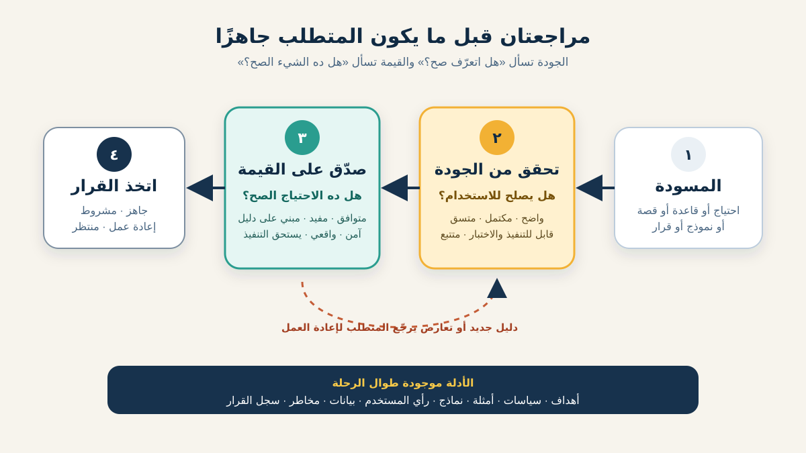

# التحقق والتصديق على المتطلبات لمحلل الأعمال

ممكن المتطلب يكون مكتوبًا بشكل ممتاز لكنه بيصف النتيجة الغلط. وممكن يصف نتيجة لها قيمة، لكن بصياغة غامضة تخلي شخصين ينفذوها بطريقتين مختلفتين. **التحقق والتصديق على المتطلبات (Requirements Verification and Validation أو V&V)** بيحمونا من المشكلتين المختلفتين دول.

- **التحقق (Verification)** بيسأل: *هل المتطلب متعرّف بجودة كافية للغرض منه؟*
- **التصديق (Validation)** بيسأل: *هل ده المتطلب الصح لاحتياج العمل وللناس المتأثرة؟*

المعهد الدولي لتحليل الأعمال (IIBA) بيصف الـVerification بأنه التأكد إن المتطلبات والتصميمات بتطابق معايير الجودة وصالحة للاستخدام، بينما الـValidation بيتأكد إنها متوافقة مع احتياجات العمل وبتدعم القيمة المطلوبة. محلل الأعمال (BA) بيستخدم الاتنين طوال التحليل، مش في اجتماع توقيع نهائي فقط.



الدرس مكمل مع سيناريو باب الافتراضي لمتجر أونلاين. المتجر عايز العملاء يبدأوا إرجاع المنتجات المؤهلة من غير الاتصال بالدعم. السياسة والأدوار والأرقام والقواعد هنا افتراضات تعليمية، مش قواعد عامة للتجارة.

## 1. سمّي الشيء اللي بتراجعه

كلمتا *Verification* و*Validation* بيتستخدموا كمان مع التصميم والبرمجيات والأنظمة الكاملة. علشان تمنع الخلط، سمّي الشيء والسؤال بوضوح.

| النشاط | الشيء محل المراجعة | السؤال | مثال للدليل |
|---|---|---|---|
| Requirements Verification | متطلب أو مجموعة متطلبات | هل مكتوبة ومنظمة ومترابطة بجودة تسمح باستخدامها؟ | Peer Review وQuality Checklist وفحص اتساق النماذج |
| Requirements Validation | متطلب أو مجموعة متطلبات | هل بتمثل الاحتياج الحقيقي وبتدعم القيمة؟ | مراجعة مالك السياسة وأمثلة المستخدمين وPrototype وربط الهدف |
| Solution Verification | الحل بعد التنفيذ | هل الحل مطابق للمتطلبات المحددة؟ | نتائج اختبار أو فحص أو تحليل |
| Solution Validation / Acceptance | الحل في استخدام واقعي | هل بيلبي احتياج المستخدم وينفع للغرض المقصود؟ | تجربة End-to-End أو تشغيل تجريبي أو UAT |

لازم V&V للمتطلبات يبدأ قبل التنفيذ. اختبار الحل لاحقًا ممكن يكشف عيبًا في المتطلب، لكن دي طريقة مكلفة جدًا علشان نكتشف حدًا غامضًا أو قاعدة محدش محتاجها.

**إجراء للـBA:** اكتب هدف المراجعة في جملة: «هنعمل Verification لمتطلبات أهلية الإرجاع علشان نتأكد إنها جاهزة للتنفيذ، وValidation مقابل هدف سياسة الإرجاع ورحلة العميل».

## 2. اعمل Verification لمتطلب واحد

الفريق بدأ بالمسودة دي:

> **R-01:** العملاء يقدروا يرجعوا أي منتج بسرعة خلال 30 يومًا.

الجملة شكلها معقول، لكن مراجعة الجودة بتكشف عيوبًا:

| سؤال الجودة | المشكلة في R-01 | سؤال المتابعة للـBA |
|---|---|---|
| ضروري وله مصدر؟ | كلمة «بسرعة» مش مربوطة بهدف أو احتياج قابل للقياس. | أنهي نتيجة محتاجة سرعة، وهنقيسها بإيه؟ |
| ذري (Atomic)؟ | الأهلية ونوع المنتج والمدة وسرعة الرحلة متجمعين. | نقسم القواعد والسلوكيات المستقلة إزاي؟ |
| غير ملتبس؟ | «خلال 30 يومًا» لا تحدد البداية والنهاية والمنطقة الزمنية والحد. | اليوم 30 داخل؟ والعد من الطلب ولا الشحن ولا التسليم؟ |
| مكتمل؟ | تسجيل الدخول وحالة المنتج والفشل والتفسير مش موجودين. | إيه اللي يحصل للمنتج المؤهل وغير المؤهل؟ |
| متسق؟ | «أي منتج» ممكن يتعارض مع استبعاد المنتجات الرقمية أو Final Sale. | أنهي سياسة هي المصدر، ومين مالكها؟ |
| قابل للتنفيذ؟ | خدمة الطلبات يمكن لا توفر وقت التسليم المطلوب للحساب. | هل المصدر يقدر يوفر بيانات موثوقة قبل الإصدار؟ |
| قابل للاختبار؟ | «بسرعة» مفيش لها شرط نجاح ملحوظ. | نستبدلها بتوقع قابل للقياس ومبرر إزاي؟ |

بعد المراجعة، الفريق ممكن يفصلها لمتطلبات زي:

- **R-01:** النظام لازم يقيّم المنتج المادي الذي تم تسليمه مقابل سياسة الإرجاع السارية على الطلب.
- **R-02:** العميل المسجل دخوله يقدر يقدم طلب إرجاع فقط لمنتج مؤهل تابع لطلبه.
- **R-03:** لما المنتج يكون غير مؤهل، النظام يمنع التقديم ويعرض سبب السياسة وطريق الدعم المناسب.
- **R-04:** قرار الأهلية يسجل نسخة السياسة ووقت القرار والنتيجة والسبب لأغراض المراجعة.

الأمثلة دي أوضح، لكنها مش Valid تلقائيًا. مالك السياسة لسه لازم يؤكد معنى «مؤهل»، ومتخصصو الأمان يراجعوا ملكية الطلب واحتياجات السجل، والعملاء يفهموا السبب المعروض.

**غلطة شائعة:** تعيد صياغة الجملة لحد ما شكلها يبقى احترافي من غير ما تحسم قرار العمل الناقص. تحسين اللغة مش هيقرر إذا كان اليوم 30 داخل المدة.

## 3. اعمل Verification للمجموعة المترابطة

ممكن كل متطلب ينجح لوحده، لكن المجموعة ككل تفشل. راجع الحزمة عبر الأهداف وتدفق العملية وقواعد العمل والبيانات والـUser Stories وأمثلة القبول وحالات الواجهة ومتطلبات الجودة.

في رحلة الإرجاع اسأل:

1. **التغطية:** هل فيه متطلب لكل خطوة واستثناء مهم—الأهلية والتقديم وتسليم الاسترداد وفشل شركة الشحن والإلغاء والدعم؟
2. **الاتساق:** هل جدول السياسة والـProcess Flow والـStory وحالة الشاشة بيستخدموا نفس الحد ونفس أكواد الأسباب؟
3. **التتبع:** هل كل متطلب تفصيلي بيرجع لاحتياج أو قاعدة أو مخاطرة أو هدف، ويتوصل للأمام بمثال قبول أو دليل آخر؟
4. **المستوى والتكرار:** هل قواعد العمل محفوظة في مصدر واحد مُحدّث بدل نسخ مختلفة داخل الـTickets؟
5. **الاعتماديات:** هل البيانات والخدمات والأدوار والصلاحيات والعمليات والتقارير المطلوبة ظاهرة؟
6. **خصائص الجودة:** هل راجعنا الإتاحة والأمان والخصوصية والأداء والتوافر وسجل المراجعة لما تكون مهمة؟

ربط بسيط ممكن يكشف فجوة:

```text
الهدف: تقليل اتصالات الدعم التي يمكن تجنبها بخصوص الإرجاع
  ← القدرة: شرح الأهلية داخل الخدمة الذاتية
    ← R-03: منع تقديم المنتج غير المؤهل وعرض السبب + طريق الدعم
      ← مثال: اليوم 31 يعرض RETURN_WINDOW_EXPIRED ولا ينشئ طلبًا
        ← مالك الدليل: مالك السياسة + مسؤول خدمة العملاء
```

التتبع مفيد لما بيدعم سؤالًا أو قرارًا. ماتعملش مئات الروابط اللي محدش هيحافظ عليها.

## 4. اعمل Validation مقابل الاحتياج والقيمة

دلوقتي اسأل: هل المتطلبات اللي اجتازت الجودة هي المتطلبات **الصح**؟ مجموعة المتطلبات ممكن تكون دقيقة ومتسقة وقابلة للاختبار، لكنها بتؤتمت السياسة الغلط أو بتحل مشكلة قيمتها قليلة.

اختبر خمس زوايا في سيناريو الإرجاع:

| زاوية الـValidation | سؤال الـBA | دليل مفيد |
|---|---|---|
| الاحتياج | الخدمة الذاتية بتحل مشكلة إيه، لمين، وعرفنا منين؟ | موضوعات اتصالات الدعم وJourney Research ومقابلات أصحاب المصلحة |
| التوافق | هل المتطلب بيدعم الهدف والنطاق المتفق عليهم؟ | Objective Map وScope Statement وBusiness Case |
| القيمة | هل الفائدة المتوقعة تستحق التكلفة والمخاطر وتغيير التشغيل؟ | Baseline وTarget ومقارنة البدائل وتقدير تكلفة الخدمة |
| الاستخدام الحقيقي | هل المستخدمون والموظفون الممثلون يقدروا يكملوا الرحلة في سياقهم؟ | Scenario Walkthrough وPrototype Session ومحاكاة العملية |
| النتائج الجانبية | مين ممكن يتضرر أو يتحمل عبئًا، وإيه إساءة الاستخدام أو الاستثناء المهم؟ | مراجعة المخاطر والإتاحة والاحتيال والخصوصية |

افترض إن البيانات بتقول إن أغلب اتصالات الدعم سببها إن العميل مش فاهم *ليه* المنتج غير مؤهل، مش إن نموذج التقديم ناقص. الدليل ده ممكن يغيّر أول إصدار: شرح الأهلية بوضوح قد يقدم قيمة أكبر من أتمتة حجز شركة الشحن.

**إجراء للـBA:** اجمع الناس اللي يملكوا الاحتياج والنتائج، مش بس اللي كتبوا المتطلب. في التغيير ده ممكن يشملوا العملاء وخدمة العملاء ومالك سياسة الإرجاع والعمليات والمالية والأمان ومتخصصي الإتاحة وممثلي التنفيذ.

**غلطة شائعة:** تعتبر موافقة صاحب المصلحة دليلًا كافيًا. الموافقة بتسجل قرارًا، لكن الـValidation محتاج دليلًا مناسبًا ومراجعين فاهمين. السكوت في رسالة المراجعة مش دليل إن المتطلب صح.

## 5. استخدم أمثلة تكشف الحدود والخلاف

الجمل المجردة بتشجع على موافقة مهذبة. الأمثلة المحددة بتجبر الفريق يقرر.

افترض تعليميًا إن السياسة تسمح بإرجاع المنتجات المادية المؤهلة لحد نهاية اليوم الميلادي رقم 30 بعد التسليم. اطلب من المراجعين يحسموا الحالات دي:

| المثال | النتيجة المتوقع تأكيدها | اللي المثال بيكشفه |
|---|---|---|
| تم التسليم من 29 يومًا؛ منتج مادي مؤهل | اسمح بطلب الإرجاع | المسار الطبيعي |
| تم التسليم من 30 يومًا بالضبط | اسمح أو ارفض—مالك السياسة يحسم بوضوح | شمول الحد والمنطقة الزمنية |
| تم التسليم من 31 يومًا | ارفض واعرض السبب وطريق الدعم | سلوك الفشل |
| منتج رقمي ظاهر بجانب المنتجات المادية | استبعده أو اشرح حالته حسب السياسة | نطاق نوع المنتج |
| وقت التسليم ناقص | ماتخمنش؛ حدد تصرفًا آمنًا ومالكًا للمشكلة | استثناء جودة البيانات |
| شخصان قدموا نفس المنتج في نفس اللحظة تقريبًا | أنشئ طلبًا نشطًا واحدًا كحد أقصى واشرح النتيجة الثانية | التكرار والتزامن |
| العميل يستخدم العربية مع Screen Reader | السبب وترتيب التركيز والحالة والإجراءات يفضلوا مفهومين | الإتاحة والتعريب |

الأمثلة ممكن تتحول بعدين لـAcceptance Criteria، لكن وظيفتها الأولى هنا هي الاكتشاف. سجّل القرارات المفتوحة بدل ما تخبّي عدم اليقين جوه صياغة عامة.

## 6. نفّذ مراجعة V&V خفيفة

استخدم تدفقًا متكررًا بدل اجتماع توقيع واحد كبير.

1. **جهّز.** حدد نطاق المراجعة ونسخة المتطلبات ومعايير الجودة وأهداف العمل وصلاحيات القرار والمشاركين والموعد.
2. **راجع مبدئيًا.** الـBA يفحص الهيكل والتكرار والمراجع الناقصة والغموض الواضح والـPlaceholders قبل استخدام وقت أصحاب المصلحة.
3. **اعمل Verification.** راجع كل عنصر والمجموعة. اربط كل عيب بمالك، وماتعدّلش قاعدة في صمت لو محتاجة قرار عمل.
4. **اعمل Validation.** امشِ في سيناريوهات نجاح وفشل وحدود وإتاحة واقعية مع أصحاب المصلحة المناسبين. قارن المتطلبات بالأدلة والأهداف.
5. **حل المشاكل.** صنف كل مشكلة: عيب صياغة، متطلب ناقص، قرار سياسة، تغيير نطاق، سؤال تصميم، قيد بيانات، أو مخاطرة مقبولة.
6. **قرر وثبّت النسخة.** سجّل المقبول والمرفوض والمؤجل والمفتوح، ومين قرر، وأنهي نسخة اتراجعت.
7. **ارجع للمراجعة.** أعد Verification وValidation لما الافتراضات أو السياسة أو النطاق أو الأدلة أو قيود الحل تتغير بشكل مؤثر.

الحالات الممكنة: **جاهز**، أو **جاهز بشروط مسجلة**، أو **محتاج إعادة عمل**، أو **في انتظار قرار**. كلمة «اتراجع» لوحدها مش بتوضح إذا كانت المشكلة ما زالت مفتوحة.

## 7. مصفوفة V&V مكتملة

الأداة المختصرة دي بتربط المتطلب والدليل والنتيجة والخطوة التالية.

| ID | المتطلب أو القرار | دليل Verification | دليل Validation | النتيجة والمالك |
|---|---|---|---|---|
| R-01 | قيّم المنتجات المادية التي تم تسليمها مقابل السياسة السارية | المصطلحات واضحة؛ مصدر السياسة مربوط؛ حقل التسليم مؤكد | مالك السياسة يؤكد النسخة وحد اليوم | جاهز — مالك السياسة |
| R-03 | امنع تقديم غير المؤهل واعرض السبب وطريق الدعم | سلوك الفشل والمخرج الملحوظ محددان | خمس جلسات مع عملاء تكشف إن كود السياسة وحده غير مفهوم | إعادة صياغة الرسالة — Content Designer |
| R-04 | سجّل مدخلات قرار الأهلية ونتيجته للمراجعة | الحقول المطلوبة ومصادرها محددة | العمليات والأمان يؤكدان احتياج التحقيق؛ مراجعة الخصوصية مفتوحة | مشروط — مسؤول الأمان |
| D-01 | أضف حجز شركة الشحن لأول إصدار | النطاق والاعتمادية موثقان | بيانات الاتصالات تشير إن الشرح يحل المشكلة الأكبر أولًا | مؤجل — Product Owner |

لاحظ إن الـValidation ممكن يغير النطاق، مش بس يوافق على الصياغة. ولاحظ كمان إن النتيجة المشروطة بتسمي الدليل الناقص ومالكه.

## 8. Template قابل لإعادة الاستخدام

```text
اسم المراجعة ونسخة المتطلبات:
احتياج / هدف العمل:
داخل وخارج النطاق:
معايير الجودة المستخدمة في Verification:
أسئلة Validation ومقاييس النجاح:
المراجعون المطلوبون وصاحب القرار:
الدليل المتاح / الناقص:

لكل عنصر:
- ID والمتطلب / القرار
- المصدر والربط للخلف
- ملاحظات Verification
- دليل Validation وصاحب المصلحة
- الاستثناءات / المخاطر / الافتراضات
- النتيجة: جاهز / مشروط / إعادة عمل / منتظر
- مالك الإجراء وتاريخه

الفجوات أو التعارضات العامة:
القرار وسببه:
النسخة المعتمدة والتاريخ:
سبب إعادة المراجعة مستقبلًا:
```

### تمرين سريع

راجع مسودة المتطلب: «استرد فلوس العميل فورًا لما تتم الموافقة على الإرجاع».

1. اكتشف أربع عيوب Verification على الأقل.
2. اكتب ثلاثة أسئلة تعمل Validation للاحتياج والقيمة.
3. جهّز أمثلة لاسترداد ناجح، وTimeout عند مزود الدفع، وطلب تم استرداد جزء منه.
4. سمّي صاحب المصلحة اللي يحسم كل نقطة مفتوحة والدليل اللي هتسجله.

## مراجع للتوسع

- [IIBA: The Business Analysis Standard — Verify and Validate Requirements and Designs](https://www.iiba.org/knowledgehub/the-business-analysis-standard/)
- [IIBA: BABOK glossary](https://www.iiba.org/career-resources/a-business-analysis-professionals-foundation-for-success/babok/glossary/)
- [ISO/IEC/IEEE 29148:2018 — مصطلحات وعمليات هندسة المتطلبات](https://www.iso.org/obp/ui/#iso:std:iso-iec-ieee:29148:ed-2:v1:en)
- [NASA Systems Engineering Handbook — تخطيط V&V والأدلة](https://www.nasa.gov/reference/system-engineering-handbook-appendix/)

*السيناريو والسياسة والأدوار والتواريخ والمقاييس والقرارات في الدرس افتراضية للتعليم. اتبع حوكمة مؤسستك ولوائح المجال وقواعد الموافقة عندك.*
