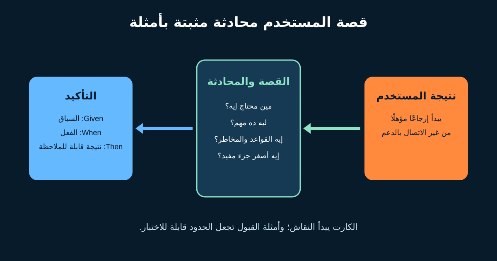

# User Stories وAcceptance Criteria بصيغة Given/When/Then

**User Story** تذكير قصير بنقاش عن احتياج مستخدم، مش عقدًا صغيرًا فيه كل حاجة يحتاجها المطور. قيمتها جاية من **Card وConversation وConfirmation** حواليها.

دور محلل الأعمال (BA) أو Product Owner (PO) إنه يربط نتيجة المستخدم بالقيمة، ويكتشف القواعد والاستثناءات مع الفريق، ويسيب أمثلة قابلة للملاحظة تساعد التصميم والاختبار.



## 1. ابدأ من نتيجة المستخدم

المتجر الافتراضي عايز العميل المؤهل يبدأ إرجاعًا من غير الاتصال بالدعم.

```text
بصفتي عميلًا عنده منتج تم تسليمه،
أريد طلب إرجاع مؤهل أونلاين،
لكي أستلم الخطوات التالية من غير الاتصال بالدعم.
```

الـFormat مفيد لكن صحة الجملة مش معناها جودة القصة. اسأل: هل الـRole أو السياق مفيد؟ هل الاحتياج مكتوب من غير فرض زر أو Database؟ هل الفائدة محددة؟ وهل القصة مرتبطة بنتيجة Product ودليل؟

«بصفتي System أريد Table» غالبًا Technical Task مش User Story. الشغل التقني ممكن يكون ضروريًا؛ سمّه بوضوح واربطه بالنتيجة اللي بيمكّنها.

## 2. استخدم الكارت لبدء المحادثة

اجمع الـPO والمطورين والاختبار والتصميم والعمليات وخبراء السياسة:

| الجانب | سؤال الإرجاع |
|---|---|
| النطاق | منتج واحد ولا عدة؟ Guest Orders؟ طلبات دولية؟ |
| القواعد | أنهي فئات ومدة إرجاع؟ مين مالك القاعدة؟ |
| البيانات | أنهي Order وItem وReason ووقت ونتيجة أهلية تتسجل؟ |
| التكامل | إيه اللي يحصل لو Courier أو Refund Service غير متاح؟ |
| الجودة | Accessibility وأمان وسرعة وAudit وLocalization؟ |
| النتيجة | أنهي معدل إكمال واتصالات دعم هيتغير؟ |

افصل القواعد المؤكدة عن الافتراضات والقرارات المفتوحة. الـAcceptance Criteria ماتخبيش سياسة Product لم تُحسم.

## 3. اكتب معايير القبول كحدود

**Acceptance Criteria** شروط لازم الحل يحققها. صيغة **Given/When/Then** مفيدة لما السياق والفعل والنتيجة مهمين:

```gherkin
Scenario: منتج مؤهل ينشئ طلب إرجاع واحد
  Given المنتج "I1" تم تسليمه من 10 أيام
  And فئته قابلة للإرجاع
  And لا يوجد طلب إرجاع للمنتج "I1"
  When العميل يؤكد سبب الإرجاع
  Then يتم إنشاء طلب إرجاع واحد للمنتج "I1"
  And يرى العميل رقمًا مرجعيًا فريدًا
```

- **Given** يحدد السياق المهم، مش كل تفاصيل قاعدة البيانات.
- **When** يحدد الحدث أو الفعل.
- **Then** يحدد نتيجة قابلة للملاحظة، مش طريقة التنفيذ الداخلية.

استخدم قيمًا محددة لما تكشف حدًا. «10 أيام» مفيدة لو المثال يحدد مدة الإرجاع الافتراضية أو يربطها بمصدر السياسة.

## 4. ضيف الاستثناءات قبل ما التنفيذ يكشفها

```gherkin
Scenario: مدة الإرجاع انتهت
  Given مدة الإرجاع المضبوطة 30 يومًا
  And المنتج تم تسليمه من 31 يومًا
  When العميل يحاول بدء إرجاع
  Then لا يتم إنشاء طلب إرجاع
  And يرى العميل السبب وطريق التواصل مع الدعم
```

```gherkin
Scenario: التأكيد المتكرر لا ينشئ نسخة مكررة
  Given يوجد طلب إرجاع للمنتج "I1"
  When العميل يؤكد نفس الإرجاع مرة أخرى
  Then لا يتم إنشاء طلب ثانٍ
  And يظهر رقم الإرجاع الموجود
```

غطّي الصلاحيات والبيانات الناقصة والحالة الفارغة والحدود وإعادة المحاولة والتكرار وفشل النظام التالي والتعافي. ماتكتبش عشرات الأمثلة الضعيفة؛ ركّز على مخاطرة العمل والحدود.

## 5. صغّر القصة من غير ما تفقد القيمة

| طريقة التقسيم | الجزء الأول | جزء لاحق |
|---|---|---|
| قاعدة العمل | الفئات القياسية القابلة للإرجاع | استثناءات بمراجعة يدوية |
| الـWorkflow | إنشاء الطلب والرقم | حجز شركة الشحن |
| اختلاف البيانات | منتج واحد | عدة منتجات من طلب |
| القناة أو البلد | Web محلي | دولي وApp |

تجنب تقسيمًا تقنيًا أفقيًا مثل «Database الأول وUI بعدين» لو ولا جزء ينتج سلوك مستخدم قابلًا للاختبار. لو في Enabler لازم يسبق، أظهر الاعتمادية.

استخدم **INVEST** كنقاش: مستقلة نسبيًا، قابلة للتفاوض، لها قيمة، قابلة للتقدير، صغيرة، وقابلة للاختبار. مش Checklist بيروقراطية للنجاح والفشل.

## 6. افصل القبول عن Definition of Done

| Acceptance Criteria | Definition of Done |
|---|---|
| خاصة بعنصر | توقعات جودة مشتركة لكل Increment |
| «المنتج المنتهي يعرض سبب السياسة» | Code Review واختبارات وAccessibility وMonitoring |
| تؤكد النطاق والسلوك | تؤكد جودة قابلة للإطلاق |

نجاح الأمثلة لا يستبدل اختبارات الأمان والأداء والإتاحة والبيانات والتشغيل. وفي المقابل Feature مكتملة تقنيًا ممكن تفشل نتيجة العمل بعد الإطلاق.

## 7. Story Brief مكتمل

```text
العنوان: بدء إرجاع منتج واحد مؤهل
رابط النتيجة: تقليل اتصالات الدعم الخاصة بالإرجاع
القصة: بصفتي عميلًا عنده منتج تم تسليمه، أريد طلب إرجاع مؤهل
أونلاين، لكي أستلم الخطوات التالية من غير الاتصال بالدعم.
داخل النطاق: منتج محلي واحد، سبب قياسي، طريقة الدفع الأصلية
خارج النطاق: الاستبدال ومراجعة التلف والطلبات الدولية
مصدر القواعد: مالك سياسة الإرجاع مع تسجيل الإصدار والتاريخ
الأمثلة: مؤهل، منتهي، غير قابل، مكرر، فشل شركة الشحن
البيانات والجودة: Audit للأهلية وخصوصية وErrors متاحة للجميع
الاعتماديات: حالة الطلب وReturnability والشحن والاسترداد
قرار مفتوح: نحفظ الطلب قبل حجز الشحن ولا بعده؟
المقياس: الإكمال واتصالات الدعم مقابل Baseline متفق عليه
```

### Template لإعادة الاستخدام

```text
العنوان ورابط النتيجة:
بصفتي [دور/سياق]، أريد [قدرة]، لكي [قيمة].
داخل / خارج النطاق:
قواعد العمل المؤكدة ومصدرها:
أمثلة Given/When/Then للنجاح:
أمثلة Given/When/Then للحدود والفشل:
البيانات والجودة والإتاحة والأمان والتقارير:
الاعتماديات:
الافتراضات والقرارات المفتوحة:
المقياس والـBaseline:
المراجعون وصاحب القرار:
```

### تمرين سريع

اكتب Story لعميل يريد إرجاع **منتجين من ثلاثة**. ضيف مثال نجاح ومثال مدة منتهية ومثال تأكيد مكرر، وحدد إيه يتشال من أول Release.

## مراجع للتوسع

- [Agile Alliance: User Stories](https://agilealliance.org/glossary/user-stories/)
- [Cucumber: Gherkin reference](https://cucumber.io/docs/gherkin/reference/)
- [The official Scrum Guide](https://scrumguides.org/scrum-guide.html)

*كل السياسات والتواريخ والأدوار والمقاييس في المثال افتراضية. أكدها مع أصحاب المصلحة المسؤولين.*
