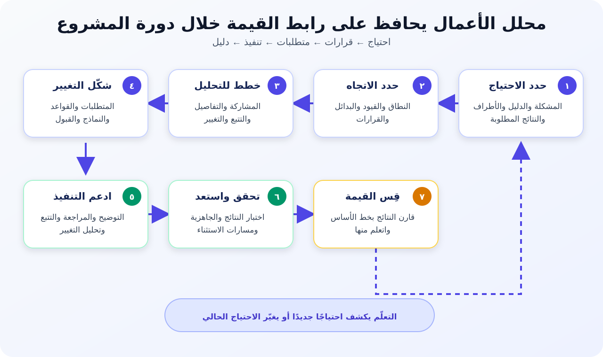

# مين هو محلل الأعمال (Business Analyst)؟

**محلل الأعمال (Business Analyst - BA)** بيساعد المؤسسة تفهم احتياجًا، وتقرر إيه التغيير اللي يستحق التنفيذ، وتتأكد إن التغيير حقق قيمة فعلية. هو حلقة الوصل بين أصحاب المصلحة اللي فاهمين الشغل، والناس اللي هتصمم الحل أو تبنيه أو تختبره أو تشغّله أو تراجعه.

المعهد الدولي لتحليل الأعمال (IIBA) بيعرّف تحليل الأعمال إنه تمكين التغيير عن طريق تحديد الاحتياجات واقتراح حلول تحقق قيمة لأصحاب المصلحة. يعني دور الـ BA أوسع بكتير من «كتابة المتطلبات». هو بيفحص المشكلة، ويوضح القرارات، ويحافظ على الرابط بين الاحتياج الأصلي والنتيجة اللي اتنفذت.

خلي 3 أسئلة قدامك طول الدرس:

1. **إيه المشكلة أو الفرصة اللي بنعالجها؟**
2. **إيه اللي لازم يتغير، ومين صاحب كل قرار؟**
3. **هنعرف منين إن التغيير نجح؟**

> **ملحوظة:**
>
> **تعريف بسيط:** الـ BA بيساعد الفريق يحل المشكلة الصح، ويتفق على المطلوب من الحل، ويتأكد إن الحل حقق القيمة المتوقعة.

## 1. المثال المستمر: تحسين خدمة التسوق أونلاين

شركة بيع بالتجزئة بتبيع منتجات من خلال متجر أونلاين. العملاء بيقدروا يطلبوا، لكن ناس كتير بتتواصل مع خدمة العملاء لأن حالة التوصيل مش واضحة. فريق المخزن أحيانًا بيكتشف فرقًا في المخزون بعد تسجيل الطلب، وتحديثات الاسترداد بتتأخر.

مدير اقترح: **«محتاجين تطبيق موبايل جديد فيه تتبع مباشر للطلب»**.

التطبيق ممكن يكون اختيارًا مفيدًا، لكنه لسه مش متطلبًا مؤكدًا. الأول، الـ BA محتاج يفهم:

- أنهي عملاء وأنواع طلبات بتواجه المشكلة؟
- فين تحديث الحالة بيتأخر أو يبقى غير دقيق؟
- إيه الدليل الموجود في استفسارات الدعم وبيانات التوصيل والإلغاء والاسترداد؟
- أنهي فرق أو شركات خارجية بتتحكم في كل تحديث؟
- إيه النتيجة المهمة: مكالمات دعم أقل، ولا تحديثات أدق، ولا استرداد أسرع، ولا ثقة أكبر؟
- هل تغيير العملية أو تحسين الويب أو رسائل Email وSMS أو إصلاح التكامل أو تطبيق موبايل أو مزيج بينهم هو الأنسب؟

الأدوار والقواعد والمقاييس في الدرس **أمثلة تعليمية**. في مشروع حقيقي لازم تتأكد منها مع العملاء والموظفين وشركات التوصيل وأصحاب القرار، وبالرجوع للبيانات الفعلية.

## 2. محلل الأعمال بيعمل إيه فعلًا؟

الـ BA مش مجرد شخص بيجمع الطلبات. هو بيحوّل موقفًا غامضًا لمجموعة مترابطة من الاحتياجات والقرارات والمتطلبات والأدلة.

| نشاط الـ BA | بيعمل إيه؟ | مثال التسوق أونلاين |
|---|---|---|
| يحدد الاحتياج | يوضح المشكلة والمتأثرين والدليل والأثر والنتيجة المطلوبة | يتأكد هل أغلب استفسارات الدعم سببها حالة غلط، ولا تحديث متأخر، ولا شرح غير واضح |
| يفهم الوضع الحالي | يراقب الشغل ويرسم العمليات والأنظمة والبيانات والقواعد ونقاط الألم | يتتبع الطلب من الدفع للتجهيز والشحن والتسليم والإلغاء والاسترداد |
| يشرك أصحاب المصلحة | يحدد المستخدمين والموظفين وأصحاب القرار والمتخصصين والجهات الخارجية | يشمل العملاء والدعم والمخزن والعمليات والمالية وIT والخصوصية وشركة التوصيل |
| يستخلص المعلومات (Elicitation) | يستخدم المقابلات وورش العمل والملاحظة ومراجعة المستندات والبيانات والنماذج | يراجع استفسارات الدعم، ويراقب تجهيز الطلب، ويختبر صياغة الحالات مع العملاء |
| يحلل وينمذج | يكتشف الأسباب والفجوات والتعارضات والاعتماديات والقواعد والاستثناءات والبدائل | يفرّق بين تأخر التوصيل وتأخر تحديث الحالة؛ كل واحدة ممكن تحتاج حلًا مختلفًا |
| يحدد المتطلبات | يصف القدرات والمعلومات وقواعد العمل والخصائص وشروط القبول | يحدد الحدث اللي يغيّر الحالة، ومين يستلم إشعارًا، وإيه اللي يحصل لو البيانات مش متاحة |
| يدعم القرار | يقارن البدائل والمفاضلات، وبعدها يوثق قرار صاحب الصلاحية وسببه | يقارن إصلاح التكامل والإشعارات والتطبيق حسب القيمة والوصول والتكلفة والمخاطر والاعتماديات |
| يتحقق ويقيّم | يتأكد إن المتطلبات بتعالج الاحتياج، ويدعم القبول، ويقيس النتيجة بعد الإطلاق | يربط متطلبات الحالة بالاختبارات ويقارن استفسارات الدعم بخط الأساس قبل التغيير |

### مخرجات ممكن يعملها الـ BA

ممكن ينتج من شغله تعريف للمشكلة، وسجل أصحاب مصلحة، وخريطة عملية، وقواعد عمل، ومتطلبات، وUser Stories، وشروط قبول، وتعريفات بيانات، وتحليل بدائل، وسجل قرارات، وسجل تتبع، ومقاييس نتائج.

المخرجات دي أدوات، مش الهدف. المستند مفيد لما يساعد شخصًا يفهم أو يقرر أو ينفذ أو يختبر أو يشغّل أو يقيّم التغيير.

### قرارات الـ BA ما بياخدهاش لوحده

الـ BA بيقدم التحليل ويسهّل الاتفاق، لكن القرار يملكه صاحب الصلاحية. في المثال:

- مدير العمليات يعتمد قواعد تجهيز الطلبات.
- مسؤول الخصوصية يؤكد قيود بيانات العملاء.
- مالك المنتج (Product Owner) يرتب عناصر الـ Product Backlog.
- الفريق التقني يختار تصميم التنفيذ داخل المتطلبات والقيود المتفق عليها.
- الراعي (Sponsor) يعتمد التمويل أو تغييرًا كبيرًا في النطاق.

**سؤال الـ BA:** «مين صاحب القرار، ومحتاج دليل إيه، وفين هنسجل الإجابة؟»

## 3. الفرق بين Business Analyst وProject Manager وProduct Owner

الأدوار الثلاثة بتتعاون مع بعض، وممكن شخص واحد يؤدي أكتر من دور. لكن التركيز الأساسي لكل دور مختلف.

| الدور | سؤاله الأساسي | تركيزه | مثال لمسؤوليته |
|---|---|---|---|
| **محلل الأعمال (BA)** | إيه الاحتياج؟ إيه اللي لازم يتغير؟ وهنختبره إزاي؟ | الاحتياجات وأصحاب المصلحة والعمليات والمتطلبات والقواعد والبدائل والقيمة | يحلل سبب فشل تحديثات الطلب ويحدد السلوك المطلوب وشروط القبول |
| **مدير المشروع (Project Manager - PM)** | هننظم المشروع ونسلمه بنجاح إزاي؟ | الخطة والأشخاص والوقت والميزانية والاعتماديات والمخاطر والتواصل والحوكمة | ينسق خطة التسليم والموارد والاعتماد على شركة التوصيل والمخاطر والتقارير |
| **مالك المنتج (Product Owner - PO)** | فريق المنتج يعمل إيه بعد كده علشان يعظّم قيمة المنتج؟ | هدف المنتج ومحتوى وترتيب الـ Product Backlog وقرارات القيمة | يقرر هل موثوقية الإشعار أهم في الـ Backlog من شاشة تتبع جديدة |

### بيتعاونوا إزاي؟

افترض إن العميل بيستلم إشعار «تم الشحن» قبل ما شركة التوصيل تستلم الطرد:

1. الـ **BA** يرسم أحداث الحالة، ويتأكد من معنى «تم الشحن»، ويحدد السيناريو العادي والاستثناءات.
2. الـ **PO** يحدد أولوية إصلاح السلوك مقارنة بباقي شغل المنتج.
3. الـ **PM** يدير الاعتماد على شركة التوصيل، ومخاطر التسليم، وأثر الجدول الزمني، والتنسيق.

الثلاثة ممكن يديروا ورش عمل، ويناقشوا النطاق، ويتعاملوا مع المخاطر، ويتواصلوا مع أصحاب المصلحة. الفرق هو غرض النشاط ومسؤولية القرار.

> **خُد بالك:**
>
> **ما تفترضش إن المسمى وحده بيحدد المسؤولية.** Scrum بيعرّف مسؤولية Product Owner، لكنه لا يعرّف دور Business Analyst منفصل. وضح مين يقدر يرتب الـ Backlog، ويعتمد قواعد العمل، ويقبل تغيير النطاق، ويوافق على التمويل داخل المؤسسة الفعلية.

## 4. عقلية الـ BA: المشكلة الأول والحل بعدين

أصحاب المصلحة غالبًا بيعبّروا عن الاحتياج في صورة حل: «اعملوا تطبيق»، أو «ضيفوا Dashboard»، أو «خلوا العملية أوتوماتيك». الـ BA بيسجل الفكرة، وبعدها يبحث عن الاحتياج اللي وراها.

### انقل الحوار من الطلب للدليل

استخدم الخطوات دي مع اقتراح تطبيق التتبع:

1. **اسمع الطلب:** «محتاجين تطبيق موبايل فيه تتبع مباشر».
2. **اسأل إيه اللي سبّبه:** العملاء بيتواصلوا مع الدعم لأنهم مش واثقين في حالة الطلب.
3. **دور على دليل:** راجع أسباب التواصل، والأحداث الناقصة، وتأخير التوصيل، وفشل الإشعارات، وآراء العملاء.
4. **حدد الأسباب والقيود:** شركة التوصيل بتبعت بعض الأحداث متأخرة؛ مصطلحات المخزن والتوصيل مختلفة؛ ومش كل عميل هينزل تطبيقًا.
5. **عرّف النتيجة:** ادّي العميل معلومات مفهومة وفي وقت مناسب، وقلل استفسارات الدعم اللي ممكن نتجنبها.
6. **قارن البدائل:** حسن صفحة الويب، أو أصلح التكامل، أو ابعت إشعارات استباقية، أو غيّر خطوات التشغيل، أو اعمل تطبيقًا، أو ادمج أكتر من اختيار.
7. **اختبر أخطر الافتراضات:** اتأكد إن أحداث شركة التوصيل موثوقة قبل ما توعد العميل بتتبع «مباشر».

### تعريف مشكلة مكتمل

> العملاء مش قادرين يفهموا مكان الطلب وخطوته التالية باستمرار؛ لأن أحداث الحالة ناقصة أو متأخرة أو مسماة بشكل مختلف بين الأنظمة. ده بيزود استفسارات الدعم وبيقلل الثقة. الشركة عايزة تقدم تحديثات مفهومة وفي وقت مناسب عبر القنوات المدعومة، مع الحفاظ على دقة سجلات التشغيل والعملاء.

التعريف وضح الناس المتأثرة والمشكلة الحالية والأثر والنتيجة المطلوبة، من غير ما يفرض حلًا واحدًا.

**استثناء لازم يتراجع:** العميل يشوف إيه لو شركة التوصيل ما بعتتش تحديثًا خلال المدة المتفق عليها؟ إخفاء عدم اليقين يعمل Happy Path شكله كويس، لكن خدمة حقيقية ضعيفة.

المشكلة الأول لا تعني تحليلًا بلا نهاية. ركز على الغموض اللي ممكن يسبب إعادة شغل كبيرة أو مخاطر أو استبعاد مستخدمين أو فقدان قيمة، واتعلم التفاصيل الأقل خطورة من الـ Prototypes والـ Feedback أثناء التسليم.

## 5. المجالات الخمسة لشهادة PMI-PBA

مخطط محتوى اختبار **PMI Professional in Business Analysis (PMI-PBA)** بيقسم شغل تحليل الأعمال لخمس مجالات. صفحة PMI الحالية بتعرض النسب التالية. النسب دي بتوصف توزيع الاختبار، مش الوقت اللي لازم كل BA يقضيه في المشروع.

| مجال PMI-PBA | نسبته في الاختبار | معناه في الشغل | مثال التسوق |
|---|---:|---|---|
| **تقييم الاحتياج (Needs Assessment)** | 18% | يحدد المشكلة أو الفرصة والقيمة والأهداف وأصحاب المصلحة ونطاق الحل | يؤكد مشكلة معلومات الطلب والمتأثرين والدليل والنتائج المطلوبة |
| **التخطيط (Planning)** | 22% | يخطط للتحليل والتواصل والتتبع والتغيير والمستندات والقبول | يحدد مين يحضر الورش، وإزاي المتطلبات تتعتمد، وإزاي التغيير يتسجل |
| **التحليل (Analysis)** | 35% | يستخلص وينمذج ويتحقق ويرتب المتطلبات والبدائل ويوصي بها | يرسم أحداث الحالة، ويحدد القواعد والاستثناءات، ويقارن بدائل الحل |
| **التتبع والمراقبة (Traceability and Monitoring)** | 15% | يتابع مصدر المتطلب وعلاقاته وحالته وتغييره ومشكلاته ومستنداته | يربط احتياج العميل بالمتطلب وعنصر الـ Backlog والتصميم والاختبار والإصدار |
| **التقييم (Evaluation)** | 10% | يقيّم هل الحل حقق المتطلبات والقيمة المطلوبة | يقيس دقة الحالة ونجاح الإشعارات واستفسارات الدعم وآراء العملاء |

المجالات دي مش خمس مراحل منفصلة بتحصل مرة واحدة. التخطيط بيتغير لما الظروف تتغير، والتحليل ممكن يكشف احتياجًا جديدًا، والتتبع مستمر خلال التنفيذ، والتقييم ممكن يبدأ دورة تحسين جديدة.

## 6. الـ BA بيعمل إيه في كل مرحلة من المشروع؟

أسماء المراحل بتختلف بين المؤسسات. اعتبر دورة الحياة التالية دليلًا عمليًا، مش ترتيبًا إلزاميًا.



*شغل الـ BA بيربط الاحتياج الأصلي بالقرارات ودليل التنفيذ والقيمة المقاسة.*

| مرحلة المشروع | خطوة الـ BA | سؤاله الأساسي | مخرج مفيد |
|---|---|---|---|
| **1. الفكرة وتقييم الاحتياج** | يدرس الوضع الحالي والدليل والأثر وأصحاب المصلحة والقيمة المطلوبة | هل عندنا احتياج حقيقي يستحق المعالجة؟ | تعريف المشكلة، وخط الأساس، وخريطة أصحاب المصلحة، وخطوات الوضع الحالي |
| **2. البداية والتخطيط** | يوضح النطاق والافتراضات والقيود وصلاحيات القرار وطريقة التحليل | إيه داخل النطاق؟ مين يقرر؟ والتحليل والتغيير هيتموا إزاي؟ | نموذج النطاق، وقاموس مصطلحات، وطريقة عمل الـ BA، وسجل القرارات والافتراضات |
| **3. التحليل التفصيلي** | يستخلص وينمذج المتطلبات والقواعد والبيانات والخصائص والبدائل والاستثناءات | التغيير لازم يحقق إيه في الوضع العادي وعند الفشل؟ | متطلبات أو Backlog Items، ونماذج عمليات وبيانات، وقواعد عمل، وشروط قبول |
| **4. البناء أو التنفيذ** | يوضح المقصود، ويراجع الشغل المنفذ، ويحلل أثر التغيير، ويحافظ على التتبع | هل التصميم المقترح لسه بيحقق الاحتياج والقيود؟ | توضيحات، وتحليل أثر، ومتطلبات محدثة، وروابط تتبع |
| **5. الاختبار والاستعداد** | يدعم سيناريوهات القبول واختبار قبول المستخدم (UAT) وجاهزية التشغيل وتحليل الفجوات | هل اختبرنا المسار العادي والبديل والاستثناء والفشل؟ | سيناريوهات قبول، ونتائج UAT، ومتطلبات جاهزية، وموافقات |
| **6. الإطلاق والتقييم** | يقارن النتائج بخط الأساس، ويكتشف الآثار غير المقصودة، ويقترح تحسينات | هل التغيير حقق قيمة؟ لمين؟ وإيه اللي يتغير بعد كده؟ | مقاييس نتائج، وموضوعات Feedback، ومراجعة منافع، وBacklog متابعة |

### اربط احتياجًا واحدًا بكل المراحل

```text
الاحتياج: تقليل استفسارات «طلبي فين؟» اللي ممكن نتجنبها
  ← المتطلب: عرض آخر حالة مؤكدة ووقت آخر تحديث
  ← القاعدة: ما نعرضش حدثًا غير مؤكد من شركة التوصيل كأنه اكتمل
  ← سيناريو القبول: الحدث المتأخر يظهر معه تنبيه مؤقت واضح
  ← المقياس: استفسارات الدعم لكل 1,000 طلب ونسبة أخطاء الحالة
```

لو الفريق بنى شاشة تتبع لكن بياناتها غير دقيقة، يبقى المخرج موجود والقيمة المطلوبة ما اتحققتش. التتبع بيكشف القطع ده في السلسلة.

## 7. مسؤوليات الـ BA في Agile وWaterfall

هدف الـ BA ثابت: يفهم الاحتياج، ويدعم القرارات، ويوضح المتطلبات، ويتحقق من القيمة. اللي بيتغير هو توقيت الشغل وشكل مخرجاته.

| العنصر | Agile أو التسليم التكيفي | Waterfall أو التسليم التنبؤي |
|---|---|---|
| توقيت التحليل | مستمر؛ التفاصيل بتزيد قبل التنفيذ بفترة قصيرة ومن خلال الـ Feedback | جزء أكبر من النطاق والتفاصيل بيتحلل قبل التصميم والبناء والاختبار |
| شكل المتطلبات | Backlog Items وأمثلة وشروط قبول ونماذج وPrototypes | مواصفات متطلبات ونماذج عمليات وبيانات وقواعد وواجهات وشروط قبول |
| Feedback أصحاب المصلحة | اكتشاف وRefinement ومراجعات وعرض أجزاء منفذة بشكل متكرر | مقابلات وورش ومراجعات رسمية وبوابات مراحل وتوقيعات مخططة |
| إدارة التغيير | تعديل أو ترتيب الشغل القادم مع الـ PO وتحليل أثره على الأهداف والسلوك الموجود | مقارنة التغيير بخط الأساس المعتمد واتباع Change Control |
| التتبع | روابط خفيفة لكن كافية بين الأهداف والـ Backlog والقرارات والاختبارات والإصدارات | غالبًا روابط واضحة بين احتياجات العمل والمتطلبات والتصميم والاختبار والموافقات |

### داخل فريق Agile

الـ BA بيدعم اكتشافًا مستمرًا، ويراجع الشغل القادم مع الـ PO والفريق، ويستكشف الأمثلة والحالات الطرفية، ويحدد شروط القبول، ويراجع الأجزاء المنفذة مع المستخدمين، ويحوّل الـ Feedback لدليل أو تعديل في الـ Backlog.

**خد بالك:** Agile لا يعني «من غير تحليل» أو «من غير توثيق». استخدم أصغر مخرج يحافظ على الفهم المشترك والقرارات المهمة.

### داخل مشروع Waterfall

الـ BA غالبًا بيحلل نطاقًا أوسع وواجهات وبيانات وقواعد واستثناءات بدري، وينظم المراجعات والـ Baseline الرسمي، ويحافظ على تتبع تفصيلي، ويحلل طلبات التغيير، ويدعم التسليم المنظم بين فرق البناء والاختبار.

**خد بالك:** اعتماد المتطلب لا يثبت إنه هيفضل صحيحًا للأبد. الدليل الجديد والعيوب ما زالوا محتاجين تحليلًا وتغييرًا متحكمًا فيه.

### داخل بيئة Hybrid

الحوكمة والتمويل ممكن يكونوا Predictive، بينما التنفيذ Iterative. الـ BA بيربط التزامات النطاق أو الامتثال الرسمية بعناصر الـ Backlog علشان تعديل التنفيذ ما يكسرش التزامًا معتمدًا من غير ما حد يلاحظ.

## 8. خريطة مكتملة لشغل الـ BA

المخرج المختصر ده بيوضح إزاي الـ BA يخطط شغله في مثال التسوق.

| الاحتياج أو القرار | الدليل | خطوة الـ BA | النتيجة وطريقة التحقق |
|---|---|---|---|
| ليه العملاء بيتواصلوا مع الدعم؟ | أسباب التواصل وسجل حالات الطلب | يقارن التواصل بالأحداث الناقصة أو المتأخرة أو غير الواضحة | تعريف مشكلة وخط أساس يراجعهم مع الدعم والعمليات |
| كل حالة طلب معناها إيه؟ | تعريفات أحداث المخزن وشركة التوصيل | يدير ورشة للمصطلحات والقواعد | قاموس حالات وقواعد بنختبرهم بطلبات فعلية، ومنها التأخير |
| أنهي اختيار يتنفذ الأول؟ | الوصول والقيمة والمجهود والمخاطر والاعتماديات | يقارن إصلاح التكامل والويب والإشعارات والتطبيق | تحليل بدائل وسبب قرار يعتمده صاحب الصلاحية |
| هل التغيير جاهز؟ | نتائج القبول وجاهزية التشغيل | يراجع السيناريو العادي والاستثناءات | نتائج قبول وفجوات مفتوحة يعتمدها صاحب قبول العمل |
| هل التغيير نجح؟ | خط الأساس والمقاييس بعد الإطلاق | يقيّم النتيجة والآثار غير المقصودة | مراجعة منافع وخطوات متابعة تُقاس في الموعد المتفق عليه |

## 9. أخطاء شائعة

| الخطأ | سلوك أفضل للـ BA |
|---|---|
| كتابة أول حل مطلوب كأنه المتطلب | عرّف الاحتياج وقارن البدائل الواقعية |
| الكلام مع المديرين فقط | أشرك المستخدمين والموظفين والمتخصصين والجهات الخارجية |
| توثيق الـ Happy Path فقط | حلل الأخطاء والتأخير والبيانات الناقصة والصلاحيات والإلغاء والاسترجاع بعد الفشل |
| افتراض إن الـ BA يعتمد كل قرار | سجل صاحب القرار وطريق الموافقة |
| اعتبار المتطلبات منتهية قبل التنفيذ | وضح وتتبع وحلل التغيير واتعلم خلال دورة المشروع |
| قياس الـ Features المكتملة فقط | قِس نتيجة العميل أو العمل وراقب الآثار السلبية |

## 10. لوحة جاهزة لتحليل التغيير

### لوحة تحليل التغيير للـ BA

| الحقل | اكتب فيه إيه؟ |
|---|---|
| الاحتياج أو الفرصة | تعريف محايد للمشكلة ومعه دليل مبدئي |
| أصحاب المصلحة | المستخدمون والموظفون وأصحاب القرار والمتخصصون والجهات المرتبطة |
| دليل الوضع الحالي | ملاحظات العملية وخط الأساس والشكاوى والقواعد والفجوات المعروفة |
| النتيجة المطلوبة | التحسن المطلوب في السلوك أو الأداء أو المخاطر أو التكلفة أو الوصول أو التجربة |
| النطاق والقيود | إيه داخل وخارج النطاق؟ وإيه الثابت أو المنظم أو المحدد بوقت أو غير المؤكد؟ |
| البدائل | اختيارات واقعية في العملية والسياسة والبيانات والتكامل والتقنية |
| المتطلبات والاستثناءات | القدرات والمعلومات والقواعد والخصائص والواجهات ومسارات الفشل |
| القرارات وأصحابها | القرار وصاحبه وتاريخه وسببه وشرط مراجعته |
| التتبع | الاحتياج ← المتطلب ← عنصر التنفيذ ← الاختبار أو الدليل ← الإصدار |
| المقاييس | خط الأساس والهدف أو الاتجاه ومصدر البيانات وموعد المراجعة والمسؤول |

### Checklist سريعة

- هل الفريق يقدر يشرح الاحتياج من غير ما يسمي حلًا مفضلًا؟
- هل الادعاءات المهمة مدعومة بدليل أو مكتوب بوضوح إنها افتراضات؟
- هل المستخدمون والموظفون المتأثرون شاركوا؟
- هل فهمنا المسار العادي والبديل والاستثناء والفشل؟
- هل أصحاب القرار واضحون للأولوية والقواعد والتصميم والنطاق والقبول؟
- هل كل متطلب مهم مرتبط بنتيجة وطريقة تحقق؟
- هل عندنا خطة لقياس القيمة بعد الإطلاق؟

### تدريب: حوّل طلب الحل لخطة BA

مدير في شركة البيع قال: **«محتاجين AI Chatbot علشان نقلل مكالمات دعم الطلبات»**.

1. اكتب 3 أسئلة تبحث المشكلة قبل ما تناقش الـ Chatbot.
2. اكتب تعريفًا للمشكلة في جملتين من غير ما تسمي حلًا.
3. حدد 4 أصحاب مصلحة، بينهم عميل ممكن يتستبعد لو الاختيار رقمي فقط.
4. اكتب متطلبًا واحدًا، واستثناءً واحدًا، وسيناريو قبول واحدًا.
5. اختار مقياس مخرج ومقياس نتيجة.
6. حدد كل نشاط بيدعم أي مجال من مجالات PMI-PBA الخمسة.

## مراجع للتوسع

- [IIBA: تعريف تحليل الأعمال](https://www.iiba.org/knowledgehub/the-business-analysis-standard/2-understanding-business-analysis/2-1-defining-business-analysis/)
- [IIBA: مبادئ تحليل الأعمال](https://www.iiba.org/knowledgehub/the-business-analysis-standard/3-mindset-for-effective-business-analysis/3-3-business-analysis-principles/)
- [PMI: شهادة PMI-PBA ومجالات الاختبار الحالية](https://www.pmi.org/certifications/business-analysis-pba)
- [PMI: مخطط محتوى اختبار PMI-PBA](https://www.pmi.org/-/media/pmi/documents/public/pdf/certifications/professional-business-analysis-exam-outline.pdf)
- [Scrum Guides: دليل Scrum لعام 2020](https://scrumguides.org/scrum-guide.html)

*سيناريو التسوق أونلاين والأدوار والقواعد والمتطلبات والمقاييس أمثلة تعليمية أصلية. لازم تتأكد من المسؤوليات والسياسات والأدلة ومقاييس النجاح الفعلية داخل مؤسستك.*
