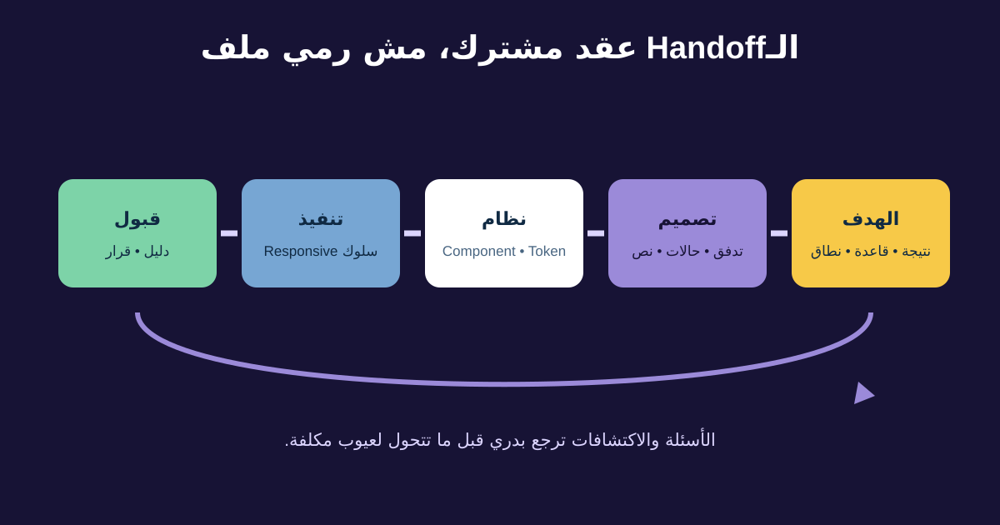

# Design-to-Development Handoff لمحللي الأعمال

الـHandoff مش لحظة المصمم يبعت Link والهندسة تنسخ Pixels. هو حوار مستمر يربط الهدف المتحقق والسلوك واختيارات النظام والقيود واكتشافات التنفيذ ودليل القبول.

في رحلة الإرجاع، الـBA يساعد يحافظ على قواعد الأهلية ومعنى المحتوى وسلوك الانتظار والفشل والـAnalytics والتعافي التشغيلي من الـPrototype لحد Production.



## 1. افهم مصطلحات الـHandoff

- **Design specification:** تفاصيل الترتيب والمحتوى والسلوك والـAssets والـResponsive.
- **Redline:** ملاحظات مرئية للمقاسات والمسافات؛ الأدوات الحديثة غالبًا تعرضها من Inspect.
- **Component:** عنصر UI متكرر بغرض وVariants موثقة.
- **Design token:** قيمة أو قرار مسمى للون أو مسافة أو خط أو Radius أو Motion ويرتبط بالتصميم والكود.
- **Asset:** أيقونة أو صورة أو Illustration أو Font أو ملف مطلوب.

Token مثل `space-300` ينقل قرار النظام أفضل من «12 Pixel هنا» لو التصميم والكود فعلًا بيستخدموه. ماتخترعش Mapping داخل Requirement؛ أكده مع التصميم والهندسة.

## 2. افصل طبقات القرار

| الطبقة | مثال الإرجاع | المسؤول غالبًا مع التعاون |
|---|---|---|
| نتيجة المنتج | العميل المؤهل يكمل بثقة | Product Owner / BA |
| قاعدة العمل | مصدر الأهلية وسبب السياسة | Policy owner / BA |
| سلوك التجربة | حفظ الاختيارات بعد Timeout | Design / BA / Engineering |
| Design System | Alert وButton وStatus وTokens | Design-system team |
| التنفيذ | State وAPI Retry وCaching وكود | Engineering |
| دليل القبول | سيناريوهات وإتاحة وAnalytics وUsability | الفريق كله |

الـBA يتدخل في تفصيلة تنفيذ لما تغير السلوك أو المخاطر أو النطاق أو القبول. غير كده اكتب النتيجة وسيب الآلية للمتخصص.

## 3. جهز حزمة قابلة للتتبع

الحزمة تشمل: هدف المستخدم والنطاق والدليل؛ Flow ونسخته؛ القواعد ومصدر المحتوى؛ State Matrix والـResponsive؛ Components وTokens؛ البيانات والصلاحيات والتكامل والقياس والخصوصية والإتاحة؛ أمثلة قبول؛ وقرارات مفتوحة بأصحابها.

| العنصر | المثال | المصدر / المسؤول |
|---|---|---|
| Flow | Order details ← reason ← pickup ← confirmation | Figma RET-v3 / Design |
| القاعدة | المنتج Delivered وداخل المدة | RET-ELIG-01 / Policy |
| المحتوى | سبب عدم الأهلية وطريق الدعم | Content table / Product content |
| Component | Alert بحالتي Error وInfo | Library / Design system |
| الحالة | Timeout يحفظ الطلب والاختيار | State matrix / Product + Engineering |
| Analytics | Start وEligibility وSubmit وFailure وComplete | Tracking plan / Analytics |
| القبول | لا Duplicate وإعلان الحالة وRTL | Scenarios / Team |

الـLinks وحدها هشة. استخدم IDs أو أسماء ثابتة علشان المتطلب يفضل مفهومًا لو الـFrames اتحركت.

## 4. اعمل محادثة جاهزية

اسأل التصميم: أنهي Flow وحالات معتمدة أو استكشافية أو خارج النطاق؟ إيه اللي يتغير مع شاشة ضيقة ونص طويل وعربي؟ أنهي Patterns من Design System؟

اسأل الهندسة: الخدمات تقدر توفر أنهي بيانات وأخطاء؟ إيه اللي يحصل مع Delay وRepeat وPartial success وRefresh؟ فيه Component أو Token مش موجود في الكود؟

اسأل QA وAccessibility وAnalytics وOperations وContent عن الدليل والتتبع المطلوب. انقل الإجابات للمصدر المُدار، مش Meeting Notes فقط.

## 5. تعامل مع الفجوات والتغيير

لو التنفيذ كشف إن Courier API لا يؤكد فورًا، ماتقربش Success State بشكل صامت. افتح قرار Pending Status ورسالة العميل وملكية العمليات والإشعار والـTimeout والقياس.

```text
الاكتشاف: رد شركة الشحن قد يفضل Pending لمدة 90 ثانية.
الهدف المتأثر: العميل يعرف إن الطلب موجود ومايكررش.
الاختيارات: انتظار؛ طلب Pending محفوظ؛ دعم يدوي.
القرار: احفظ Pending Request واعرض Reference وابعت تحديثًا.
المسؤولون: Product + Operations + Engineering.
المخرجات المحدثة: State Matrix وPrototype وAcceptance وTracking.
```

Screenshot بالمقاسات مش هتحل سلوك عمل ناقص.

## 6. Checklist جاهزية الـHandoff

```text
نتيجة المستخدم والدليل والنطاق:
رابط Flow والنسخة وتاريخ المراجعة:
القواعد ومصادر المحتوى:
الحالات والتعافي:
Responsive وLocalization وAccessibility:
Components وVariants وTokens وAssets:
البيانات والصلاحيات وAPIs والخصوصية والـAnalytics:
أمثلة القبول ومتطلبات الجودة:
الاستبعادات وحريات التنفيذ:
القرارات المفتوحة وأصحابها ومواعيدها:
عملية الاكتشاف والتغيير:
دليل القبول النهائي وصاحبه:
```

### تمرين سريع

الهندسة قالت إن Return API ممكن تنجح بعد Timeout في الواجهة. اكتب Decision Record فيه مخاطرة المستخدم ومنع التكرار وحالة Pending والتعافي وAnalytics Event ومالك العمليات ودليل القبول.

## مراجع للتوسع

- [Figma: Guide to developer handoff](https://www.figma.com/best-practices/guide-to-developer-handoff/)
- [Design Tokens Community Group: Format Module](https://www.designtokens.org/tr/drafts/format/)
- [W3C WAI: إشراك المستخدمين في تقييم Accessibility](https://www.w3.org/WAI/test-evaluate/involving-users/)

*قدرات الأدوات ومسؤوليات الفريق تختلف. اتفقوا على المصادر المُدارة وأصحابها وعملية المراجعة داخل مؤسستكم.*
