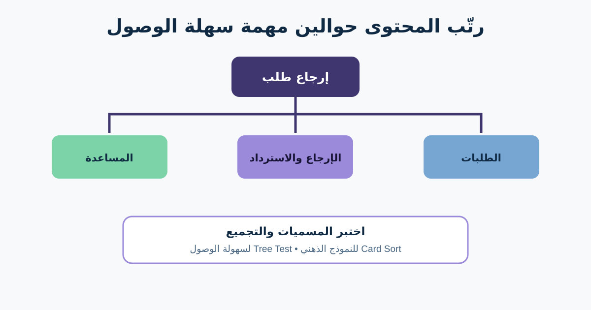

# Information Architecture وCard Sorting

بنية المعلومات (Information Architecture أو IA) هي طريقة تنظيم وتسميات وربط المحتوى والوظائف علشان الناس تلاقيها. الـSite Map مخرج واحد، لكن الهدف الحقيقي إن الشخص يتوقع الحاجة مكانها فين والـLabel معناها إيه.

في رحلة الإرجاع، العميل يدور في Help وتفاصيل الطلب والإيميل والتنقل داخل الحساب. الـBA يقدر يربط ملكية السياسة ومتطلبات المنتج بهيكل مبني على مهمة المستخدم، مش تقسيمات المؤسسة.



## 1. ابدأ بالمهام وجرد المحتوى

اكتب المحتوى والإجراءات الموجودة قبل تصميم التنقل: سياسة الأهلية، تاريخ الطلبات، تفاصيل المنتج، بدء الإرجاع، اختيار الشحن، حالة الطلب، موعد الاسترداد، والتصعيد للدعم.

| العنصر | مهمة المستخدم | المسؤول الحالي | الخطر / المشكلة |
|---|---|---|---|
| سياسة الإرجاع | يقرر المنتج ينفع يرجع | Policy | مكررة في Help وشروط Checkout |
| Return item | يبدأ طلبًا | Product | تظهر بعد فتح طلب واحد فقط |
| حالة الإرجاع | يفهم الخطوة التالية | Operations | المسميات مختلفة عن الإيميل |
| موعد الاسترداد | يعرف الفلوس هتوصل إمتى | Finance | المدة حسب طريقة الدفع |

ماتحذفش التكرار القديم قبل تأكيد الملكية والاحتفاظ القانوني وزيارات البحث والروابط المعتمدة عليه.

## 2. مثّل الهيكل بلغة المستخدم

```text
الحساب
├─ الطلبات
│  └─ تفاصيل الطلب
│     ├─ إرجاع المنتج
│     └─ متابعة الإرجاع
├─ الإرجاع والاسترداد
│  ├─ الأهلية والسياسة
│  ├─ حالة الإرجاع
│  └─ موعد الاسترداد
└─ المساعدة
   └─ تواصل مع الدعم
```

ده افتراض، مش إجابة مؤكدة. “Reverse logistics” مناسبة لفريق داخلي لكن مش للعميل. “My returns” يمكن ماتكونش واضحة قبل أول إرجاع. اختبر المسميات داخل سياق واقعي.

## 3. استخدم Card Sorting لفهم التجميع

في **Card Sort** المشاركون بيجمعوا كروت محتوى. الطريقة تكشف الـMental Model:

- **Open:** المشاركون يعملوا المجموعات ويسموها؛ مناسبة للاستكشاف.
- **Closed:** يحطوا الكروت داخل تصنيفات جاهزة؛ مناسبة لتقييم هيكل قائم.
- **Hybrid:** تصنيفات جاهزة مع إمكانية إضافة مجموعات؛ مناسبة لما جزء من الهيكل ثابت.

كروت مثال: إرجاع منتج، فحص الأهلية، متابعة الإرجاع، موعد الاسترداد، تغيير الاستلام، دعم، تنزيل الملصق، منتج تالف.

اكتب Labels محايدة. لو الكارت اسمه “Returns: refund timing” يبقى كشف التصنيف ومش هيختبر التوقع.

الـCard Sorting يقترح تجميعًا، لكنه لا يثبت إن المستخدم يقدر يتنقل في واجهة كاملة. المشاركون والكروت والحدود وطريقة التحليل بيأثروا على النتيجة.

## 4. اختبر الشجرة المقترحة

**Tree Testing** يعرض الهيكل النصي بلا تصميم بصري. مهمة مثال: «المندوب ماجاش. هتدور فين علشان تغيّر الاستلام؟» سجّل أول اختيار والنهاية والنجاح والوقت والمسار.

دور على الأنماط: هل الناس تتقسم بين Orders وReturns؟ هل Help بتجذبهم بسبب خبرة قديمة؟ هل Labels العربية والإنجليزية بتبني نفس التوقع؟ هل النتيجة تختلف لأول مرة عن العميل الخبير؟

ماتنقلش عنصرًا بسبب محاولة واحدة فاشلة. راجع صياغة المهمة والمشارك والمسارات المنافسة. أحيانًا مدخلان لنفس المصدر هما الاختيار الصحيح.

## 5. اربط IA بالمتطلبات والحوكمة

| القرار | المثال |
|---|---|
| مالك المحتوى الأساسي | Policy تملك القواعد والمنتج يعرض ملخصًا متزامنًا |
| مداخل التنقل | تفاصيل الطلب وصفحة الإرجاع يقودان لنفس التدفق |
| كلمات البحث | return وrefund والمصطلحات العربية المختبرة |
| الصلاحيات | العميل المسجل فقط يشوف إجراءات طلبه |
| Empty state | مفيش إرجاع: اشرح الأهلية واربط بالطلبات |
| Analytics | مصدر الدخول ونهاية مسدودة وتصعيد للدعم |

الـURL والبحث والترجمة ودورة حياة المحتوى ممكن يعملوا قيودًا تقنية وحوكمية. وضحها؛ الـSite Map مش كل المتطلب.

## 6. قالب قرار IA

```text
مهمة المستخدم ودليلها:
جرد المحتوى والإجراءات:
المسميات والمواقع الحالية:
الهيكل المقترح:
مالك المصدر وطريقة تحديثه:
نوع Card Sort وسبب الاختيار:
فئات المشاركين:
الكروت والتصنيفات:
مهام Tree Test:
إشارات النجاح والمشكلة:
أسئلة اللغة والترجمة:
الإتاحة والصلاحيات والبحث والقياس:
القرار وصاحبه وتاريخه ودليله:
```

### تمرين سريع

حط «تنزيل ملصق الإرجاع» و«تغيير الاستلام» و«موعد الاسترداد» في الشجرة. اكتب سؤال Card Sort ومهمة Tree Test ممكن يعارضوا اختيارك. ضيف مسارًا بديلًا بدل افتراض إن فيه مكانًا واحدًا صحيحًا.

## مراجع للتوسع

- [Nielsen Norman Group: Information Architecture](https://www.nngroup.com/articles/ia-study-guide/)
- [Nielsen Norman Group: Card Sorting](https://www.nngroup.com/articles/card-sorting-definition/)
- [Nielsen Norman Group: Tree Testing](https://www.nngroup.com/articles/tree-testing/)

*الهيكل المقترح افتراضي. اختبره مع مستخدمين ممثلين وملاك المحتوى ودليل البحث والقيود التقنية.*
