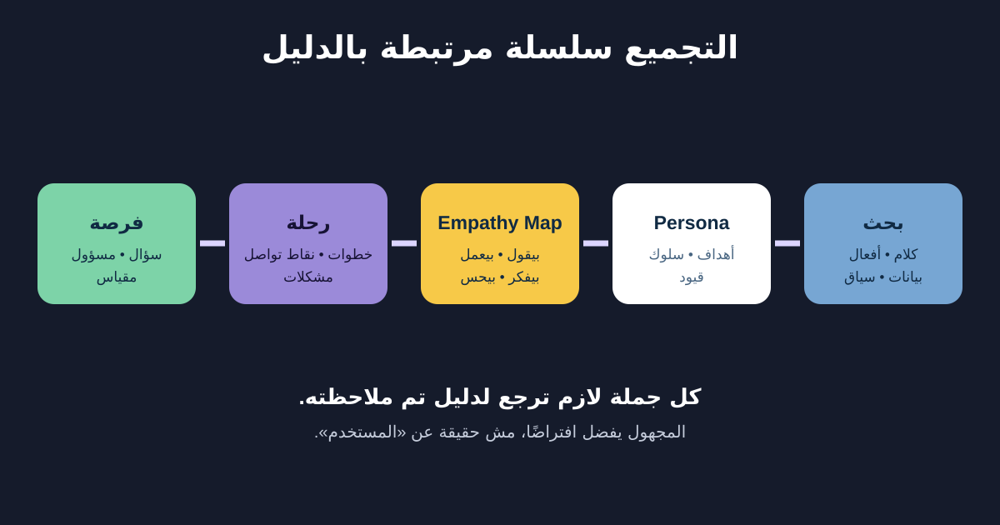

# Personas وEmpathy Maps وCustomer Journeys

الـPersonas وEmpathy Maps وJourney Maps أدوات لتجميع البحث وفهمه واتخاذ قرار. مش بديلًا عن الدليل، وتبقى خطيرة لما التفاصيل المتخيلة تتقدم كحقائق عن المستخدم.

هنجمع بحث الإرجاع الافتراضي من الدرس السابق. العميل عايز يعرف المنتج ينفع يرجع ولا لأ، ويكمل الطلب، ويفهم الخطوة التالية حتى لو حجز شركة الشحن فشل.



## 1. اختار الأداة حسب السؤال

| الأداة | السؤال الأساسي | محتوى مفيد |
|---|---|---|
| Persona | أنهي أنماط سلوك وأهداف بنصمم لها؟ | أهداف وسلوك وسياق وقيود ومصادر دليل |
| Empathy Map | الفئة قالت وعملت وفكرت وحست بإيه في الموقف؟ | ملاحظات واقتباسات واستنتاجات معلّمة |
| Journey Map | التجربة بتمشي إزاي عبر الوقت والقنوات؟ | مراحل وأفعال ونقط تواصل وأسئلة ومشكلات وفرص |

ماتعملش الثلاثة تلقائيًا. لو القرار عن Handoff بين الدعم وشركة الشحن، Journey أو Service Blueprint قد تكون أنفع من Persona جميلة.

## 2. ابنِ Persona من الأنماط

الـPersona المفيدة بتمثل نمط سلوك متكررًا مرتبطًا بالقرار. السن والوظيفة والصورة والبراند المفضل تفاصيل مالهاش لازمة إلا لو بتأثر على المهمة.

```text
نمط السلوك: عميل بيعمل Self-service Return لأول مرة
الهدف: يعرف الأهلية ويكمل من غير دعم
سلوك ملاحظ: يفتح Help قبل Order details؛ يقارن صياغة السياسة؛
  يأخذ Screenshot للرقم المرجعي
السياق: غالبًا على الموبايل وأحيانًا أثناء تغليف المنتج
القيود: ممكن مايفتكرش رقم الطلب؛ ممكن يستخدم خطًا كبيرًا
الدليل: P02 وP04 وP06؛ Theme دعم RTN-HELP؛ Mobile Funnel
افتراض للاختبار: يفضّل Courier Pickup عن Drop-off
```

ماتستخدمش Persona علشان تمسح فروقًا مهمة. لو مستخدمو Screen Reader عندهم حاجز تنقل مختلف، سجله وعالجه مباشرة.

## 3. استخدم Empathy Map بحذر

الخريطة غالبًا فيها **Says وDoes وThinks وFeels**. أول اتنين ممكن ييجوا من الملاحظة. التفكير والمشاعر استنتاجات إلا لو المشارك عبّر عنها، فوضح المصدر.

| المنطقة | مثال الإرجاع | حالة الدليل |
|---|---|---|
| Says | «أنا عايز أعرف ينفع يرجع ولا لأ» | اقتباس مباشر من P04 |
| Does | يفتح Help وبعدها يدور في إيميل الطلب | ملاحظ في P02 وP04 |
| Thinks | يمكن شايف إن Help مسؤولة عن الإرجاع | تفسير للاختبار |
| Feels | قال إنه مش متأكد بعد «تم استلام الطلب» | تصريح مباشر |

الخريطة تكشف الفراغات، مش تزين الحيطة. ضيف Source IDs والأسئلة المفتوحة.

## 4. ارسم رحلة العميل كاملة

الرحلة تبدأ قبل الواجهة وتكمل بعدها. العميل يلاحظ مشكلة، يراجع السياسة، يلاقي الطلب، يقدم الإرجاع، يسلم المنتج، ينتظر الفحص، ويستلم المبلغ.

| المرحلة | فعل العميل | نقطة التواصل | المشكلة / الدليل | الفرصة | المسؤول |
|---|---|---|---|---|---|
| يقرر | يتأكد إن المنتج قابل للإرجاع | Help والسياسة والطلب | مصطلحات مختلفة | مصدر سياسة واحد وملخص بسيط | Policy + Content |
| يبدأ | يلاقي الطلب المتسلّم | Order history | ناس بتدور في الإيميل الأول | Deep link واختبار الوصول | Product |
| يرسل | يختار السبب والشحن | Return flow | خطأ الشحن يهز الثقة | احفظ الطلب واشرح التعافي | Product + Integration |
| يتابع | يدور على الحالة | App وإيميل | “Received” غامضة | اسم المرحلة وموعد التحديث | Operations + Product |
| يسترد | يتأكد من وصول المبلغ | App وبنك | الوقت يختلف حسب الدفع | مدة مبنية على دليل وطريق تصعيد | Finance + Support |

الفرصة مش Feature تلقائيًا. حوّلها لسؤال: «إزاي نحافظ على الثقة وقت فشل شركة الشحن؟» وبعدها استكشف الحلول.

## 5. خليك صادق في النطاق والمشاعر والملكية

- حدد بداية ونهاية الرحلة؛ «دورة حياة العميل كلها» غالبًا أوسع من التنفيذ.
- استخدم Emotion Line لما يكون فيه دليل، مش تخمين ورشة.
- وضّح Frontstage وBackstage لو التسليمات هي سبب الألم.
- افصل الوضع الحالي بالدليل عن اقتراح الوضع المستقبلي.
- اكتب التاريخ والفئة؛ الرحلة تتغير مع السياسة والقنوات.

## 6. قالب تجميع قابل لإعادة الاستخدام

```text
القرار الذي يدعمه التجميع:
فئة المستخدم / نمط السلوك:
مصادر البحث وتواريخها:
الأهداف والسلوك والسياق والقيود المؤكدة:
الاقتباسات ومعرفات الملاحظات:
الافتراضات والدليل المتعارض:

نطاق الرحلة: تبدأ عندما… / تنتهي عندما…
المرحلة:
هدف وفعل المستخدم:
القناة / نقطة التواصل:
السؤال أو الشعور ومصدره:
المشكلة ومصدرها:
الاعتماد الخلفي / المسؤول:
سؤال الفرصة:
المقياس أو طريقة التحقق:
القرار المفتوح وصاحبه:
```

### تمرين سريع

ضيف مرحلة «مندوب الشحن ماجاش». حدد هدف العميل والدليل المطلوب والاستجابة الظاهرة والمسؤول الخلفي وسؤال فرصة ومقياسًا. علّم أي تفصيلة متخيلة كافتراض.

## مراجع للتوسع

- [Nielsen Norman Group: Personas](https://www.nngroup.com/articles/persona/)
- [Nielsen Norman Group: Empathy Mapping](https://www.nngroup.com/articles/empathy-mapping/)
- [Nielsen Norman Group: Journey Mapping 101](https://www.nngroup.com/articles/journey-mapping-101/)

*كل المشاركين والملاحظات وتصنيفات الدعم وحقائق الرحلة في المثال افتراضية للتعليم.*
