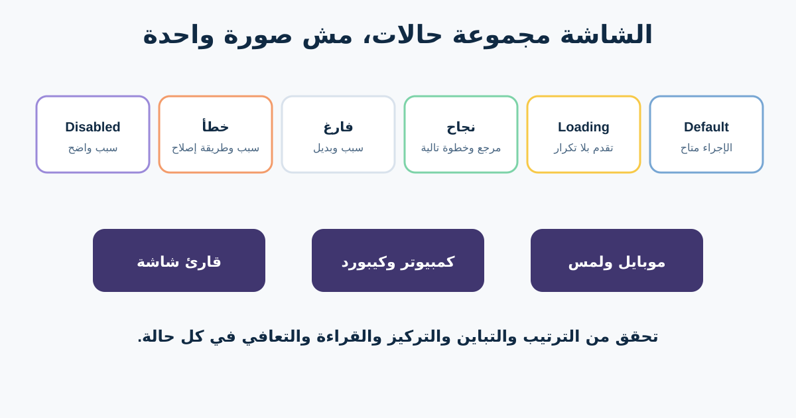

# UI وحالات التفاعل والـResponsive Design والـAccessibility

شاشة Happy Path ثابتة بتخفي جزءًا كبيرًا من المتطلب. الواجهات الحقيقية بتنتظر وتفشل وتبقى فاضية وتتغير حسب الشاشة وطريقة الإدخال، ولازم تتواصل بأكتر من لون أو Hover.

هنحوّل شاشة إرجاع المتجر لـState Matrix يراجعها المصمم والمهندس والمختبر ومحلل الأعمال مع بعض. وهنتعلم أساسيات Visual Hierarchy وPatterns بالقدر المطلوب لقرارات واضحة.



## 1. راجع Visual Hierarchy من المهمة

**الترتيب البصري (Visual Hierarchy)** بيساعد الناس تلاحظ وتفهم المعلومات بترتيب مفيد. بيستخدم المكان والحجم والتباين والمسافات والمحاذاة والتجميع والخط، مش الحجم بس.

ترتيب القراءة في تأكيد الإرجاع ممكن يكون: المنتج ونتيجة الأهلية؛ المبلغ وطريقة الاسترداد؛ اختيار الاستلام؛ إجراء Confirm؛ وبعده السياسة والدعم كمسارات ثانوية.

اسأل هل الترتيب البصري مطابق للقرار. محتوى ترويجي كبير ماينفعش ينافس تأكيد إرجاع له أثر. المسافات والمحاذاة الثابتة توضح المجموعات، وغير الثابتة ممكن توحي بعلاقات غلط. Typography Scale تفرق العنوان والنص والـLabel والمعلومة المساعدة من غير تصغير شرط مهم.

## 2. سمّي UI Patterns علشان تناقش الـTrade-offs

| الـPattern | مفيد لما | تحذير في الإرجاع |
|---|---|---|
| Modal | قرار مركز يقطع السياق | إدارة Focus والإغلاق والموبايل؛ ماتحطش رحلة طويلة جواه |
| Tooltip | شرح مساعد قصير | مش مكان تعليمات أساسية؛ Hover مش متاح للجميع |
| Inline validation | تصحيح الحقل في مكانه | اشرح المشكلة والتعافي؛ ماتعتمدش على الأحمر |
| Empty state | مفيش محتوى أو نتيجة | فرّق بين مفيش إرجاع وفشل التحميل ومفيش منتج مؤهل |
| Pagination | أجزاء ثابتة ومعرفة المكان مهمة | احفظ الفلاتر والمكان ووضح الإجمالي لو معروف |
| Infinite scroll | التصفح المستمر مفيد | ممكن يضر المكان والفوتر والمشاركة والكيبورد |
| Toast / status | تأكيد قصير لفعل مكتمل | النتيجة المهمة تفضل ظاهرة وتتعلن للـAssistive Technology |

المسميات لغة مشتركة، مش إجابات تلقائية. اختار حسب المهمة والمحتوى والمخاطر ومعايير المنصة والدليل.

## 3. حدد State Matrix

راجع Default وHover وFocus وActive وDisabled وLoading وSuccess وEmpty وError. في كل حالة اسأل: إيه الظاهر؟ إيه القاعدة؟ إيه اللي يتحفظ؟ المستخدم يتعافى إزاي؟

| الحالة | السلوك الظاهر | البيانات / القاعدة | الإتاحة والتعافي |
|---|---|---|---|
| Default | منتج مؤهل وConfirm | أحدث نتيجة أهلية معتمدة | عنوان واسم فعل واضحان |
| Loading | الزر غير متاح و«جاري الإرسال» | منع التكرار أو التعامل الآمن معه | إعلان الحالة وثبات Focus |
| Success | مرجع واستلام وTrack return | طلب واحد قابل للمراجعة | الإعلان يصل للتأكيد |
| Empty | «مفيش منتجات مؤهلة» مع سياسة ورابط طلبات | فرّق بين مفيش طلبات وعدم الأهلية | التفسير نص مش أيقونة |
| Error | الطلب محفوظ؛ الشحن فشل؛ Retry ودعم | احفظ Request ID والاختيار | Summary يربط للمشكلة مع سبب وخطوة |
| Disabled | Confirm لحد اختيار الاستلام | القاعدة ظاهرة جنب التحكم | الشرح مش داخل زر Disabled فقط |

## 4. حدد سلوك Responsive مش Breakpoints بس


*واجهة Responsive على أجهزة مختلفة. الصورة لـTfinc، من [Wikimedia Commons](https://commons.wikimedia.org/wiki/File:Responsive_design_-_Commons_Android_app.jpg)، بترخيص CC BY-SA 3.0.*

Responsive Design يكيّف المحتوى والتفاعل مع المساحة وقدرات الجهاز. المتطلب يصف الأولوية والسلوك مش Pixels عشوائية.

في رحلة الإرجاع: خليك محافظ على المنتج وسبب الأهلية والمبلغ والفعل مع بعض؛ رص الملخص قبل النموذج في الشاشة الضيقة؛ تجنب Horizontal Scroll للمحتوى العادي؛ خلى الـDialog مناسبًا كشاشة كاملة عند اللزوم؛ ادعم Zoom وText Resize والاتجاه واللمس والكيبورد؛ وتأكد من RTL وترتيب الأيقونات.

اسأل الفريق التصميم بيتغير فين بمعنى حقيقي، واختبر حوالين التحولات وبمحتوى طويل، مش أجهزة مسماة بس.

## 5. اعتبر Accessibility جزءًا من الجودة

WCAG 2.2 بتنظم الإرشادات تحت أربع مبادئ: **Perceivable وOperable وUnderstandable وRobust**. حوّلها لأسئلة:

- كل عنصر غير نصي مهم له Text Alternative مناسب؟
- كل فعل متاح بالكيبورد مع Focus واضح ومن غير Trap؟
- المعلومة متاحة من غير اعتماد على اللون أو المكان أو الشكل أو الصوت أو Hover أو Gesture فقط؟
- الـLabels والتعليمات والأخطاء وتغيرات الحالة واضحة ومربوطة برمجيًا؟
- التباين يحقق المعيار المنطبق؟
- التدفق يقبل Reflow وتكبير النص من غير فقد محتوى أو وظيفة؟
- Authentication والوقت والسحب وتكرار الإدخال متعامل معاهم بإتاحة؟

الأدوات الآلية تكشف بعض المشاكل، لكنها لا تثبت Conformance أو Usability. استخدم Code Review وAssistive Technology وKeyboard Testing ومراجعة المحتوى واختبارًا مع أشخاص ذوي إعاقة وقت الحاجة. حدد نسخة WCAG ومستوى المطابقة والمنصة والتزام المؤسسة بدل «لازم يبقى Accessible» فقط.

## 6. قالب الحالات والإتاحة

```text
المستخدم والمهمة والسياق:
المكون / الشاشة:
Default وHover وFocus وActive وSelected وDisabled:
Loading وSuccess وEmpty وError وOffline وTimeout:
إيه البيانات والاختيارات المحفوظة؟
التعافي والتصعيد:
Desktop وMobile وZoom وOrientation ونص طويل وRTL:
ترتيب الكيبورد ووضوح Focus:
اسم ودور وقيمة وحالة وخطأ الـScreen Reader:
Text alternatives وإشارات غير اللون:
معايير التباين وتكبير النص:
نسخة / مستوى WCAG ومالك السياسة:
دليل آلي ويدوي ومع مستخدمين:
القرارات المفتوحة وأصحابها:
```

### تمرين سريع

حدد الحالة بعد ضغط Confirm على شبكة بطيئة ثم Timeout من شركة الشحن. اكتب السلوك المرئي والبيانات المحفوظة والـFocus وإعلان Screen Reader ومنع التكرار والبديل التشغيلي.

## مراجع للتوسع

- [W3C: WCAG 2.2](https://www.w3.org/TR/WCAG22/)
- [W3C WAI: WCAG 2 at a Glance](https://www.w3.org/WAI/standards-guidelines/wcag/glance/)
- [W3C WAI: Accessibility Principles](https://www.w3.org/WAI/fundamentals/accessibility-principles/)

*الدرس مقدمة، مش تقييمًا قانونيًا أو شهادة مطابقة. أكد المعيار والالتزام المنطبقين مع متخصصين مؤهلين.*
