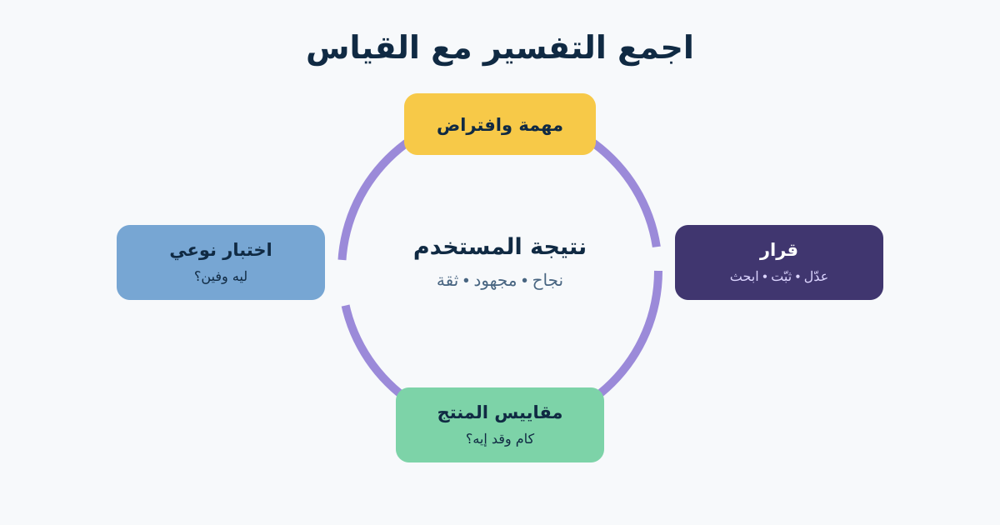

# Usability Testing وUX Metrics

اختبار سهولة الاستخدام بيراقب أشخاصًا ممثلين وهم بيحاولوا ينفذوا مهام واقعية على تصميم أو منتج. بيكشف التجربة بتتعطل فين وليه. بعدها Product Analytics تساعد الفريق يفهم الحجم ويراقب النتيجة في الرحلة الحقيقية.

هنختبر هل العميل يلاقي منتجًا مؤهلًا ويفهم النتيجة ويبعت مرة واحدة ويتعافى من فشل شركة الشحن. وبعدها هنربط النتائج بـFunnel ومقاييس من غير ما نتخيل إن مقياسًا واحدًا يشرح التجربة كلها.



## 1. حدد الاختبار حول مهام وقرارات

اكتب مهمة واقعية من غير ما تكشف اسم الإجراء:

> استلمت الطلب 1842 امبارح، لكن مقاس قميص غلط. اعرف ينفع ترجعه ولا لأ وابدأ العملية. وقف لما تعتقد إن الطلب اتسجل.

ماتقولش «اضغط Return item واختار Courier»؛ كده بتختبر اتباع تعليمات مش الوصول. حدد النجاح الجزئي والخطأ الحرج والقرار اللي الجلسة تقدر تغيره.

| عنصر الاختبار | مثال الإرجاع |
|---|---|
| المشاركون | متسوقون قريبون مناسبون للأجهزة واحتياجات الوصول |
| البداية | Test account فيه منتج مؤهل وآخر غير مؤهل |
| المهام | الأهلية وبدء الإرجاع وفهم التأكيد والتعافي من فشل الشحن |
| الملاحظة | المسار والكلمات والتردد والأخطاء والتعافي والثقة |
| القرارات | Navigation label والنص وحالة Pending وRetry |
| خارج النطاق | سرعة الاسترداد وأداء شركة الشحن Simulated |

## 2. أدِر Think-aloud Session


*باحث ومشارك يجربان موقعًا. الصورة لـSamuel Mann، من [Wikimedia Commons](https://commons.wikimedia.org/wiki/File:Project_User_Experience_Testing_(9719939867).jpg)، بترخيص CC BY 2.0.*

في **Think-aloud** اطلب من المشارك يقول بيحاول يعمل إيه وملاحظ إيه ومتوقع إيه. وضح إن الاختبار للمنتج مش للشخص.

استخدم Prompts محايدة: «بتدور على إيه دلوقتي؟»؛ «متوقع يحصل إيه؟»؛ «كمّل قول لي بتفكر في إيه»؛ «الرسالة معناها إيه بالنسبة لك؟»

ماتشرحش الواجهة أو تدافع عن التصميم أو تقود الإجابة. لو المشارك وقف تمامًا، سجّل المكان والسبب قبل مساعدته. اعمل Pilot علشان تكتشف حسابًا بايظًا أو مهمة غامضة أو بيانات غير واقعية.

خد الموافقة المناسبة للملاحظة والتسجيل، وقلل البيانات الشخصية، ووفر طرق مشاركة مناسبة للإتاحة.

## 3. افهم قاعدة «خمسة مستخدمين»

خمسة مشاركين نقطة بداية عملية شائعة لـ**اختبار نوعي تكراري مع فئة واحدة متقاربة نسبيًا**. مش قانونًا عامًا ومش بتخلي النتيجة ممثلة إحصائيًا.

استخدم جولات أو عينات إضافية لما: الفئات أو المهام أو الأجهزة أو اللغات أو احتياجات الوصول مختلفة؛ التصميم ناضج والمشكلات المتبقية نادرة؛ محتاج Benchmark أو مقارنة كمية؛ أو القرار عالي الأثر ماليًا أو قانونيًا أو أمنيًا.

الجولات الصغيرة مفيدة: اختبر، أصلح المهم، واختبر تاني بناس جديدة. Card Sorting والاختبار الكمي والاستبيانات والتجارب لها منطق Sample مختلف.

## 4. حلل الملاحظات من غير مسرح أرقام

اعمل Observation Log لكل مشارك ومهمة، وفرّق بين Critical Error وDifficulty وPositive Evidence وQuote/Explanation.

«3 من 5 فشلوا» يصف الدراسة الصغيرة، لكنه لا يثبت إن 60% من العملاء هيفشلوا. استخدم التكرار لترتيب البحث مع الخطورة ومخاطر العمل وأدلة أخرى.

| الحقل | مثال مكتمل |
|---|---|
| الملاحظة | P01 وP03 وP05 وقفوا بعد “Request received” وماعرفوش إن الشحن فشل |
| الدليل | Clips وNotes؛ مفيش Pending state مستمرة |
| التأثير | العميل ينتظر بلا فعل أو يبعت تاني |
| التوصية | افصل إنشاء الطلب عن حالة الحجز واعرض المرجع والتحديث القادم |
| التحقق | جولة نوعية جديدة وIntegration checks ومراقبة التكرار والدعم |

## 5. ابنِ Product Funnel بتعريفات مفيدة

```text
مشاهدة طلب مؤهل
← بدء رحلة الإرجاع
← فهم نتيجة الأهلية
← إرسال الطلب
← حجز الاستلام أو قبول Pending
← اكتمال الإرجاع
← اكتمال الاسترداد
```

عرّف لكل Event الفاعل والـTrigger والوقت والمعرفات والاستبعادات ومنع التكرار والموافقة والاحتفاظ والمالك. Drop-off ممكن يكون طبيعيًا لما العميل يكتشف عدم الأهلية، أو ضارًا. اربطه بالنتيجة ودليل نوعي.

## 6. اربط UX بنتائج المنتج

| الطبقة | مقياس افتراضي | التحذير |
|---|---|---|
| سهولة المهمة | إكمال بلا مساعدة وأخطاء ووقت وثقة | الادعاء الكمي محتاج تصميم دراسة وعينة مناسبين |
| السلوك | Start-to-submit وSubmit-to-complete | عرّف الأهلية والجلسات المكررة |
| نتيجة المستخدم | يفهم الحالة والخطوة التالية | ادمج السلوك باستبيان أو بحث موجه |
| نتيجة العمل | تقليل اتصالات الدعم الممكن تجنبها | راقب السياسة والموسم والقناة |
| Guardrails | Duplicate وشكاوى وأخطاء إتاحة واستثناءات | ماتحسنش Conversion بإخفاء خروج أو خطر صالح |

HEART—Happiness وEngagement وAdoption وRetention وTask success—يساعد يولد مقاييس، لكن مش كل فئة لازمة لكل Feature. ابدأ بهدف، وبعده User Signal، وبعده Metric.

Heatmaps ممكن تعرض Pointer أو Tap أو Scroll حسب الأداة. ماتكشفش النية أو الفهم أو المشاعر أو السببية. اعتبرها مدخلًا تشخيصيًا وراجع الخصوصية والموافقة.

## 7. قالب Usability وMeasurement

```text
القرار والافتراض:
فئات المستخدم ومعايير التوظيف:
Prototype / Build وحدوده:
سيناريوهات المهام وبيانات البداية:
تعريف النجاح والجزئي والخطأ الحرج والتوقف:
Think-aloud Prompts وأسئلة ما بعد المهمة:
الموافقة والتسجيل والخصوصية والتعويض والإتاحة:
Observation Log وطريقة الخطورة:
مبرر عدد الجلسات وحدوده:
النتائج وروابط الدليل وأصحاب القرار:

هدف المنتج وUser Signal:
Funnel Events وتعريفاتها:
UX وProduct outcome metrics:
Guardrails:
Segments والاستبعادات:
Baseline وفترة المراجعة وعتبة القرار:
مالك Instrumentation وفحص جودة البيانات:
بحث نوعي أو كمي لاحق:
```

### تمرين سريع

اكتب Think-aloud Task لسيناريو Timeout من غير تسمية زر Retry. بعد كده حدد ملاحظتين وFunnel Event ومقياس نتيجة وGuardrails اثنين يوضحوا هل Pending State الجديدة أكثر أمانًا.

## مراجع للتوسع

- [Nielsen Norman Group: Usability Testing 101](https://www.nngroup.com/articles/usability-testing-101/)
- [Nielsen Norman Group: عدد المشاركين في Usability Study](https://www.nngroup.com/articles/how-many-test-users/)
- [Google Research: HEART](https://research.google/pubs/measuring-the-user-experience-on-a-large-scale-user-centered-metrics-for-web-applications/)

*أعداد المشاركين والنتائج والـEvents والمقاييس افتراضية. اختار الطريقة والعينة حسب القرار والمخاطرة والفئة والتحليل المطلوب.*
