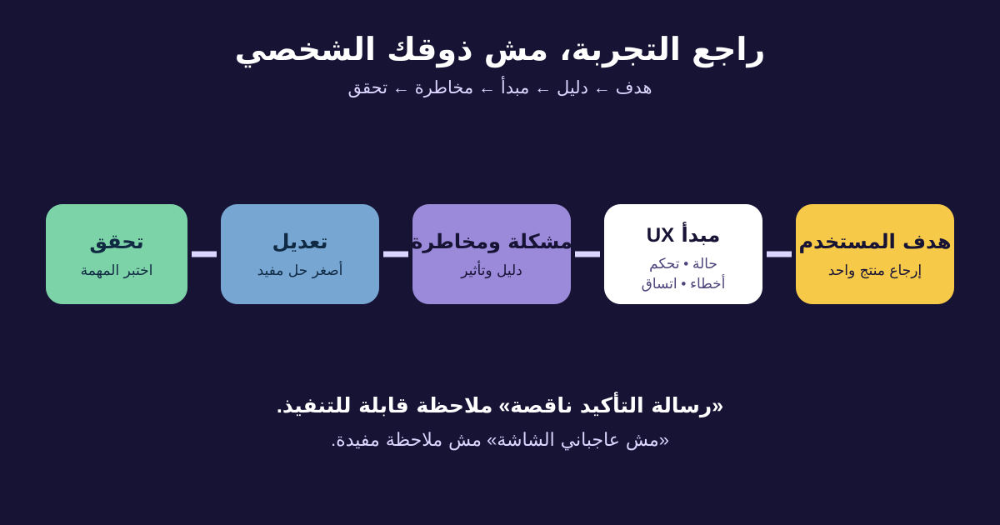

# مبادئ UX لمحللي الأعمال

تجربة المستخدم (User Experience أو UX) هي التجربة الكاملة للشخص وهو بيحاول يحقق هدفًا، مش شكل الشاشة بس. محلل الأعمال مش مطلوب منه يبقى Visual Designer، لكنه محتاج طريقة موثوقة يسأل بيها: هل التجربة مفهومة وسهلة وقابلة للتعافي وشاملة؟

هنستخدم تغييرًا افتراضيًا في متجر باب: العميل يقدر يرجّع منتجًا مؤهلًا من غير ما يكلم الدعم. هدفنا نستبدل كلام «عاجبني/مش عاجبني» بملاحظات يقدر الفريق يبحثها ويتحقق منها.



## 1. ابدأ بهدف المستخدم

**التصميم المتمركز حول المستخدم (User-Centered Design)** بيحافظ على هدف المستخدم وسياقه وقدراته والدليل المتاح أثناء اتخاذ القرارات. ده مش معناه تنفيذ كل طلب أو تجاهل قيود العمل؛ معناه اختبار هل الحل بيساعد المستخدم المقصود يحقق نتيجة مفيدة.

| صياغة مبنية على راحة المؤسسة | صياغة متمركزة حول المستخدم |
|---|---|
| «حط السياسة في PDF لأنها موجودة» | «ساعد العميل يعرف المنتج مؤهل ولا لأ وإيه الخطوة الجاية» |
| «اطلب كل الحقول علشان العمليات يمكن تحتاجها» | «اطلب المطلوب في الخطوة الحالية واشرح سبب أي بيانات حساسة» |
| «خبّي زر الإرجاع علشان نقلل الطلبات» | «وضّح الأهلية والبدائل مع الحفاظ على السياسة» |

سؤال الـBA: **ده هدف مين، في سياق إيه، وإيه الدليل إن التجربة الحالية فاشلة؟** نتيجة العمل مهمة، لكن لازم ترتبط بنتيجة حقيقية للمستخدم.

## 2. اعتبر الحمل المعرفي مخاطرة متطلبات

**الحمل المعرفي (Cognitive Load)** هو المجهود الذهني لفهم المعلومات وتذكّر التفاصيل ومقارنة الاختيارات واتخاذ القرار. قاعدة «كليكات أقل» مش دايمًا صح؛ شاشة واحدة مزدحمة ممكن تكون أصعب من ثلاث خطوات واضحة. قلّل القرارات غير الضرورية والحفظ والتكرار والمصطلحات الغريبة.

في رحلة الإرجاع، العميل ما يحتاجش يفتكر تاريخ الطلب أو يدور في السياسة أو يحسب آخر يوم. الواجهة تعرض المنتج المؤهل والموعد وطريقة الاسترداد والخطوة التالية. خطوة تأكيد إضافية ممكن تزود كليك لكنها تمنع إرجاعًا بالخطأ.

اسأل:

- المستخدم لازم يفتكر إيه من شاشة أو قناة سابقة؟
- إيه الاختيارات المطلوبة دلوقتي وإيه اللي ممكن يتأجل؟
- الكلمات لغة العميل ولا أكواد داخلية؟
- البيانات المتكررة متعبية بأمان ومعاها فرصة للتصحيح؟

## 3. استخدم مبادئ Nielsen العشرة كلغة للمراجعة

الـHeuristics مبادئ عامة، مش لائحة نجاح ورسوب. استخدمها لتحديد المخاطر وصياغة الأسئلة.

| المبدأ | مثال الإرجاع | سؤال الـBA |
|---|---|---|
| وضوح حالة النظام | وضّح إن الطلب بيتبعت | إيه الـFeedback وقت التأخير؟ |
| توافق النظام مع العالم الحقيقي | «استرداد على الكارت» بدل `PAYMENT_REVERSAL` | المستخدم هيفهم الكلام والترتيب؟ |
| تحكم وحرية المستخدم | رجوع قبل التأكيد النهائي | يقدر يلغي أو يعكس خطأ؟ |
| الاتساق والمعايير | نفس اسم «إرجاع المنتج» في كل مكان | الأفعال المتشابهة اسمها ومكانها ثابت؟ |
| منع الخطأ | امنع الإرسال المتكرر أثناء التحميل | التصميم يقدر يمنع خطأ مكلف؟ |
| التعرّف بدل التذكّر | اعرض الطلبات بدل طلب رقم الطلب | المستخدم مضطر يفتكر إيه؟ |
| المرونة والكفاءة | إعادة استخدام عنوان الاستلام | الخبير ينجز أسرع من غير لخبطة للمبتدئ؟ |
| البساطة | اعرض تفاصيل السياسة وقت الحاجة | فيه معلومات منافسة مخبية القرار الأساسي؟ |
| فهم الخطأ والتعافي | اشرح فشل الشحن واعرض Retry أو دعم | الرسالة بتقول إيه حصل ويعمل إيه؟ |
| المساعدة والتوثيق | إرشاد مختصر داخل السياق | المساعدة محددة وقريبة من المهمة؟ |

مشكلة واحدة ممكن تمس أكتر من مبدأ. ماتضخّمش العدد؛ سجّل أوضح مبدأ وتأثير المستخدم.

## 4. اكتب Feedback قابلًا للتنفيذ

```text
الملاحظة: إيه الموجود أو الناقص؟
الدليل أو المبدأ: إيه اللي يدعم القلق؟
تأثير المستخدم والعمل: إيه اللي ممكن يحصل؟
السؤال أو التوصية: قرار إيه مطلوب؟
التحقق: إيه الدليل اللي يؤكد التعديل؟
```

| الحقل | مثال مكتمل |
|---|---|
| الملاحظة | بعد Confirm الزر يفضل شغال ومفيش رسالة تقدم |
| المبدأ | وضوح حالة النظام ومنع الخطأ |
| التأثير | العميل ممكن يبعت مرتين ويعمل شغل عمليات مكرر |
| الخطورة | عالية لو النظام ينشئ طلبين؛ أكد بالـLogs وسلوك الخدمة |
| التوصية | امنع التكرار، أعلن التقدم، واجعل الـAPI يتعامل بأمان مع التكرار |
| التحقق | Keyboard وScreen Reader وشبكة بطيئة واختبار ضغطتين |

الخطورة قرار فريق مبني على التكرار والتأثير وصعوبة التعافي ومخاطر العمل، مش ثقة المراجع في رأيه.

## 5. تجنب أخطاء المراجعة

- ماتعاملش الـHeuristics كقوانين شخصية؛ ممكن استثناء متعمد يكون صحيحًا بالدليل.
- ماتقفزش من الملاحظة لإعادة التصميم قبل تأكيد السبب.
- ماتراجعش الـHappy Path بس؛ شوف Loading وEmpty وError وDisabled والتعافي.
- المراجعة الخبيرة مش بديلًا عن البحث مع مستخدمين ممثلين.
- ماتستخدمش «اختيارات أقل» لحذف معلومة لازمة لقرار آمن.

## 6. قالب Heuristic Review قابل لإعادة الاستخدام

```text
الرحلة وهدف المستخدم:
فئة المستخدم والسياق:
الشاشة / الحالة:
الملاحظة:
المبدأ المرتبط:
الدليل المتاح:
تأثير المستخدم والعمل:
الخطورة: منخفضة / متوسطة / عالية، والسبب
التوصية أو السؤال المفتوح:
صاحب القرار:
طريقة التحقق:
الحالة وتاريخ القرار:
```

### تمرين سريع

راجع شاشة «المنتج غير مؤهل». اكتب ملاحظة عن التفسير، وواحدة عن التعافي، وواحدة عن الاتساق. لكل ملاحظة حدد المبدأ والتأثير والدليل المطلوب قبل تغيير التصميم.

## مراجع للتوسع

- [Nielsen Norman Group: مبادئ سهولة الاستخدام العشرة](https://www.nngroup.com/articles/ten-usability-heuristics/)
- [Nielsen Norman Group: تنفيذ Heuristic Evaluation](https://www.nngroup.com/articles/how-to-conduct-a-heuristic-evaluation/)
- [ISO 9241-210: التصميم المتمركز حول الإنسان](https://www.iso.org/standard/77520.html)

*سياسة الإرجاع والمخاطر والضوابط افتراضية للتعليم. أكد القواعد والسلوك التقني ودليل المستخدم والتزامات الإتاحة داخل مؤسستك.*
