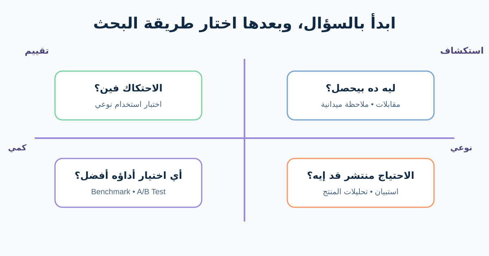

# UX Research والدليل لمحللي الأعمال

بحث تجربة المستخدم (UX Research) بيقلّل عدم الوضوح عن الناس والمهام وسلوك المنتج. مش مجموعة مقابلات شكلية قبل ما الفريق يبني فكرته المفضلة. البحث المفيد يبدأ بقرار، ويجمع دليلًا من مشاركين مناسبين، ويوضح حدوده.

متجرنا الأونلاين عنده اتصالات دعم كثيرة عن الإرجاع. الفريق بيفترض إن العملاء مش لاقيين زر الإرجاع، لكن الـAnalytics وحدها ماتقولش ليه. هنخطط بحثًا يفرّق بين مشكلة تنقل، أو سياسة غير مفهومة، أو طلب ناقص، أو عطل تقني.



## 1. حوّل طلب الحل لسؤال بحث

«نكبّر زر الإرجاع؟» بدأ بحل. الأسئلة الأفضل تكشف المجهول:

- العميل بيحاول يعمل إيه لما يكلم الدعم؟
- يتوقع يلاقي الأهلية وإجراء الإرجاع فين؟
- أنهي خطوة بتفشل أكتر، لمين وعلى أنهي جهاز؟
- هل بيفهم سبب عدم أهلية المنتج؟

سؤال البحث لازم يغير قرارًا حقيقيًا. سجّل صاحب القرار وإيه اللي الفريق هيعمله مع النتائج المحتملة.

| الحقل | مثال الإرجاع |
|---|---|
| القرار | رحلة الإرجاع تبدأ منين وإزاي؟ |
| الدليل الحالي | تصنيفات الدعم فيها «مساعدة إرجاع» والـFunnel فيه خروج من تفاصيل الطلب |
| المجهول | مش لاقي الإجراء، ولا مش فاهم الأهلية، ولا مش قادر يكمل؟ |
| المشاركون | عملاء عندهم طلب متسلّم خلال آخر 45 يومًا |
| صاحب القرار | Product Owner بمشاركة الدعم ومالك السياسة |

الأرقام والسياسة والعينة هنا افتراضية للتعليم.

## 2. افهم النوعي والكمي يجاوبوا على إيه

**البحث النوعي (Qualitative)** يستكشف ليه وإزاي. المقابلات والملاحظة واختبارات الاستخدام تكشف السلوك واللغة والاستراتيجيات ونقط التعطل. عينة صغيرة ممكن تكشف أنماطًا مهمة، لكنها ماتحددش مدى انتشار كل نمط بين كل العملاء.

**البحث الكمي (Quantitative)** يقيس كام وقد إيه وإزاي الأداء اتغير. الـAnalytics والاستبيانات والتجارب والـBenchmarks محتاجة تعريفات واضحة وملاحظات كافية. نقطة Drop-off بتحدد مكانًا، لكنها غالبًا ماتشرحش السبب.

| السؤال | طريقة مفيدة | القيد اللي لازم توضحه |
|---|---|---|
| ليه العميل بيكلم الدعم؟ | مقابلة مع مراجعة Tickets | الذاكرة والتصنيف ممكن يكونوا ناقصين |
| المستخدم بيتردد فين في التدفق؟ | Think-aloud Usability Test | النتيجة مرتبطة بالمهام وملاءمة المشاركين |
| كام عميل مؤهل بدأ إرجاعًا؟ | Funnel متتبع | التتبع لا يثبت النية أو السبب |
| أنهي Label أفضل؟ | A/B Test مضبوط | محتاج Traffic وGuardrails ونتيجة مفيدة |

ادمج الأدلة وقت الحاجة: الـAnalytics تحدد مكان المشكلة، والمقابلات تشرح السياق، واختبار الاستخدام يقيّم استجابة مقترحة.

## 3. اختار المشاركين حسب السلوك

اختار ناس شبه المستخدم والسياق المطلوبين. في دراسة الإرجاع ممكن نحتاج طلبًا متسلّمًا قريبًا، وموبايل أو كمبيوتر، وتجربة إرجاع أولى ومتكررة، وأشخاصًا يستخدمون Assistive Technology. ماتكتفيش بزملاء فاهمين مصطلحات المنتج.

احمِ المشاركين: وضّح الهدف والتسجيل والتخزين والانسحاب؛ اجمع أقل بيانات شخصية؛ استخدم حسابات اختبار؛ نظّم التواصل والتعويض؛ واتبع قواعد المؤسسة للبحث والخصوصية والموافقة.

لو فئة عندها مهام أو احتياجات وصول مختلفة، خطط لها بوضوح بدل ما تدفن الفرق جوه Persona متوسطة.

## 4. سجّل الملاحظة قبل التفسير


*تجميع ملاحظات البحث في Affinity Diagram. الصورة لـKalsau، من [Wikimedia Commons](https://commons.wikimedia.org/wiki/File:DesignEthnographyStudioLifeAnalysis2.jpg)، بترخيص CC BY 2.0.*

افصل ثلاث طبقات:

1. **ملاحظة:** «المشارك فتح Help قبل Order details».
2. **تفسير:** «يمكن متوقع الإرجاع موضوع دعم».
3. **قرار أو سؤال:** «اختبر رابط Returns في المكانين، وشوف هل التكرار يسبب لخبطة».

الاقتباس دليل على كلام شخص واحد، مش إثبات لاحتياج عام. جمّع الملاحظات، واحتفظ بالدليل المتعارض، واربط كل Theme بملاحظاتها الأصلية.

## 5. اعمل خطة تناسب القرار

| عنصر الخطة | مثال مكتمل |
|---|---|
| سؤال البحث | العميل بيلاقي ويفهم أهلية الإرجاع إزاي؟ |
| الطريقة | 6 جلسات نوعية مع مراجعة Funnel وتصنيفات الدعم |
| المشاركون | عملاء بطلب متسلّم؛ تنوع جهاز وخبرة واحتياجات وصول |
| المهام | إيجاد الأهلية، شرح النتيجة، بدء إرجاع، التعافي من فشل الشحن |
| الدليل | المسار والكلمات والأخطاء والتعافي والثقة؛ بلا بيانات دفع حقيقية |
| التحليل | سجل ملاحظات وThemes مرتبطة بالمصادر ودليل متعارض |
| القرار | Label ومكان التنقل والتفسير المطلوب للـPrototype |
| القيد | عينة نوعية صغيرة؛ الانتشار يحتاج بيانات منتج أو دراسة أكبر |

## 6. تجنب فشل البحث المتوقع

- سؤال «الزر الجديد كان سهل؟» يقود للإجابة. ادّي مهمة واقعية.
- Persona مكتوبة قبل البحث بتحول التخمين ليقين خيالي.
- Heatmap تبين Pointer أو Scroll، مش الانتباه أو الفهم أو الدافع.
- A/B Test يحسن المقياس المختار فقط؛ ضيف Guardrails للأخطاء والشكاوى والإتاحة والعمليات.
- البحث مش مسرح موافقة. اعرض الدليل اللي يعارض الفكرة كمان.

## 7. قالب خطة UX Research

```text
القرار وصاحبه:
سؤال البحث:
الدليل المعروف:
الافتراضات:
الطريقة وسبب اختيارها:
المشاركون والاستبعادات:
المهام / الأسئلة:
الموافقة والخصوصية والإتاحة:
البيانات المطلوبة:
طريقة التحليل:
النتائج المحتملة والقرارات:
القيود:
الوقت والمراجعون:
```

### تمرين سريع

الـFunnel الافتراضي يفقد 35% من الجلسات عند شاشة الأهلية. اكتب تفسيرين مختلفين، وطريقة نوعية وفحصًا كميًا لكل تفسير، والقرار اللي كل نتيجة هتغيره. الرقم مثال، مش Benchmark.

## مراجع للتوسع

- [Nielsen Norman Group: اختيار طريقة UX Research](https://www.nngroup.com/articles/which-ux-research-methods/)
- [Nielsen Norman Group: الفرق بين Qualitative وQuantitative Testing](https://www.nngroup.com/articles/quant-vs-qual/)
- [UK Government Service Manual: تخطيط User Research](https://www.gov.uk/service-manual/user-research/plan-user-research-for-your-service)

*أكد قواعد الموافقة والخصوصية والاحتفاظ والتوظيف وحوكمة البحث مع الفرق المسؤولة داخل مؤسستك.*
