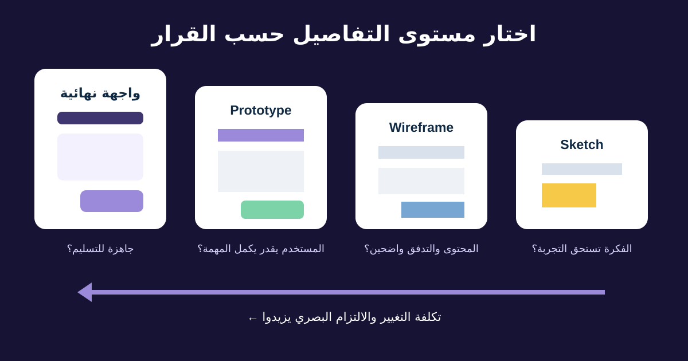

# قراءة Wireframes وPrototypes وFigma وDesign Systems

كل Design Artifact بيجاوب على أسئلة مختلفة حسب مستوى التفاصيل. محلل الأعمال محتاج يعرف إيه جاهز للمراجعة وإيه ما زال افتراضًا، ويربط الـFeedback بالمتطلبات ودليل المستخدم.

هنراجع رحلة الإرجاع من رسم بسيط لـClickable Prototype. الهدف مش إنتاج Visual Design؛ الهدف مراجعة رحلة العميل والقواعد والمحتوى والحالات والقرارات في الوقت المناسب.



## 1. اختار مستوى التفاصيل حسب القرار

| الأداة | مفيدة في | ماتعتبرش إن |
|---|---|---|
| Sketch | استكشاف بدائل ونطاق بتكلفة قليلة | الترتيب والمحتوى والتنفيذ نهائيين |
| Low-fidelity Wireframe | ترتيب المحتوى والأفعال والتنقل والحالات الأساسية | الخط واللون والمسافات نهائيين |
| High-fidelity Mockup | Visual hierarchy ومحتوى واقعي ومكونات | كل تفاعل شغال أو مختبر |
| Clickable Prototype | التدفق والفهم واختبار Usability مبكر | البيانات والأداء والأمان والإتاحة مكتملين |


*Wireframe ورقي لاستكشاف الترتيب. الصورة لـFernando Mafra، من [Wikimedia Commons](https://commons.wikimedia.org/wiki/File:Wireframe_(5019534612).jpg)، بترخيص CC BY-SA 2.0.*

التفاصيل العالية ممكن تعمل ثقة زائفة. اسأل التصميم بيدعم قرار إيه، وأنهي سلوك تم تمثيله وأنهي سلوك ناقص.

## 2. افهم تركيب Figma الأساسي

مصطلحات Figma بتتغير، فخلي الملف الحالي والمساعدة الرسمية مصدر الحقيقة. غالبًا هتقابل:

- **Page:** مساحة داخل الملف لتنظيم التدفقات أو مراحل الشغل.
- **Frame:** Container يمثل شاشة أو منطقة أو حدود Component.
- **Layer:** نص أو شكل أو صورة أو عنصر داخل Frame.
- **Component:** عنصر قابل لإعادة الاستخدام مثل Button أو Alert.
- **Instance:** نسخة مرتبطة بالـComponent مع تعديلات مسموحة.
- **Variant / property:** اختيار مضبوط مثل الحجم أو الحالة أو الأيقونة.
- **Prototype flow:** Frames وتفاعلات متصلة تبدأ من نقطة محددة.

لما المصمم يشاور على Design System، يقصد المكونات والـStyles والـTokens وقواعد الاستخدام والتوثيق المشتركة. زر جديد ممكن يكون استثناءً مقصودًا أو تكرارًا بالخطأ؛ اسأل.

## 3. اتبع الـPrototype كمهمة

ماتضغطش عشوائيًا. ابدأ بسيناريو:

```text
المستخدم: عميل عنده منتج متسلّم ومؤهل
الهدف: يطلب استلام Courier ويستلم رقمًا مرجعيًا
البداية: Order details
النهاية: تم إنشاء الإرجاع والخطوة والحالة واضحتان
الاستثناء: حجز شركة الشحن غير متاح
```

سجّل كل Frame وفعل وقرار وحالة. راجع Back والضغط المتكرر والإلغاء والـValidation وحركة Focus والمحتوى الواقعي والنص العربي الطويل.

وجود Connection يثبت إن العرض بيتحرك بين Frames، مش إن القواعد والـBackend والـAnalytics والإتاحة متنفذين.

## 4. اكتب Comment بسياق وقرار واحد

الـComment المفيد فيه المكان والسيناريو والدليل أو المتطلب والتأثير وسؤال:

> Return confirmation / mobile: بعد فشل الشحن، الـPrototype بيرجع لشاشة السبب وبيضيع اختيار الاستلام. RET-07 بيقول نحفظ الطلب. هل الحالة تعرض الطلب المحفوظ وطريق Retry؟ اربطوا سلوك التعافي المتفق عليه.

تجنب «خلّيها Pop» أو «حرّك الزر» أو «الشاشة ملخبطة» من غير شرح. ينفع تقترح حلًا، لكن افصله عن المشكلة والنتيجة.

انقل القرار لمصدر متطلبات أو Decision Log؛ الـResolved Comment مش دايمًا توثيق دائم.

## 5. راجع Design System من غير شرطة Pixels

- ده Component معتمد ولا Pattern جديد؟
- هل الحالات Default وHover وFocus وActive وLoading وDisabled وSuccess وError موجودة؟
- المحتوى مناسب للإنجليزي والعربي؟
- المسافات والألوان والخط والأيقونات مرتبطة بـTokens مسماة؟
- التوثيق بيقول إمتى مانستخدمش المكون؟

الـBA مسؤول عن وضوح النتيجة والقواعد والمعنى والاستثناءات والتتبع والقبول. المصمم مسؤول عن حرفة التصميم، والهندسة عن قرارات التنفيذ. الحدود تتقاطع بالتعاون، مش بوابة موافقة في اتجاه واحد.

## 6. Checklist مراجعة مكتملة

| المنطقة | فحص رحلة الإرجاع | النتيجة |
|---|---|---|
| النطاق | منتج مؤهل واحد؛ Exchange وMulti-item خارج النطاق | مؤكد |
| التدفق | طلب ← منتج ← سبب ← استلام ← تأكيد | موجود |
| القواعد | سبب الأهلية مطابق لمصدر السياسة | محتاج مالك السياسة |
| الحالات | Loading وخطأ الشحن | حالة Duplicate ناقصة |
| المحتوى | صياغة الاسترداد بلغة العميل | النص العربي الطويل مفتوح |
| الإتاحة | ترتيب Keyboard وإعلان الحالة | تتحقق في التنفيذ |
| النظام | Alert وButton من المكتبة | مؤكد |
| الدليل | مهمة اختبار ومعايير المشاركين | مخطط |

## 7. قالب Design Review

```text
رابط Flow / Frame والنسخة:
المستخدم والهدف وحالة البداية:
المتطلب / القاعدة / الدليل:
المسار الأساسي:
البدائل والفشل:
الحالات الناقصة أو الغامضة:
أسئلة المحتوى والترجمة:
أسئلة الإتاحة والـResponsive:
أسئلة Component / Token:
الـAnalytics ودليل القبول:
Comment: ملاحظة ← تأثير ← سؤال
القرار وصاحبه وتاريخه ومصدره:
```

### تمرين سريع

راجع Prototype فيه Success من غير Loading أو Error. اكتب ثلاثة Comments: منع الإرسال المكرر، التعافي، وFeedback للكيبورد أو Screen Reader. اربط كل Comment بقرار واحد.

## مراجع للتوسع

- [Figma: Guide to prototyping](https://help.figma.com/hc/en-us/articles/360040314193-Guide-to-prototyping-in-Figma)
- [Figma: Components وStyles وLibraries](https://www.figma.com/best-practices/components-styles-and-shared-libraries/)
- [W3C WAI: تصميم Web Accessibility](https://www.w3.org/WAI/tips/designing/)

*صلاحيات وخصائص Figma تختلف حسب الخطة وقد تتغير. أكد السلوك الحالي من التوثيق الرسمي.*
