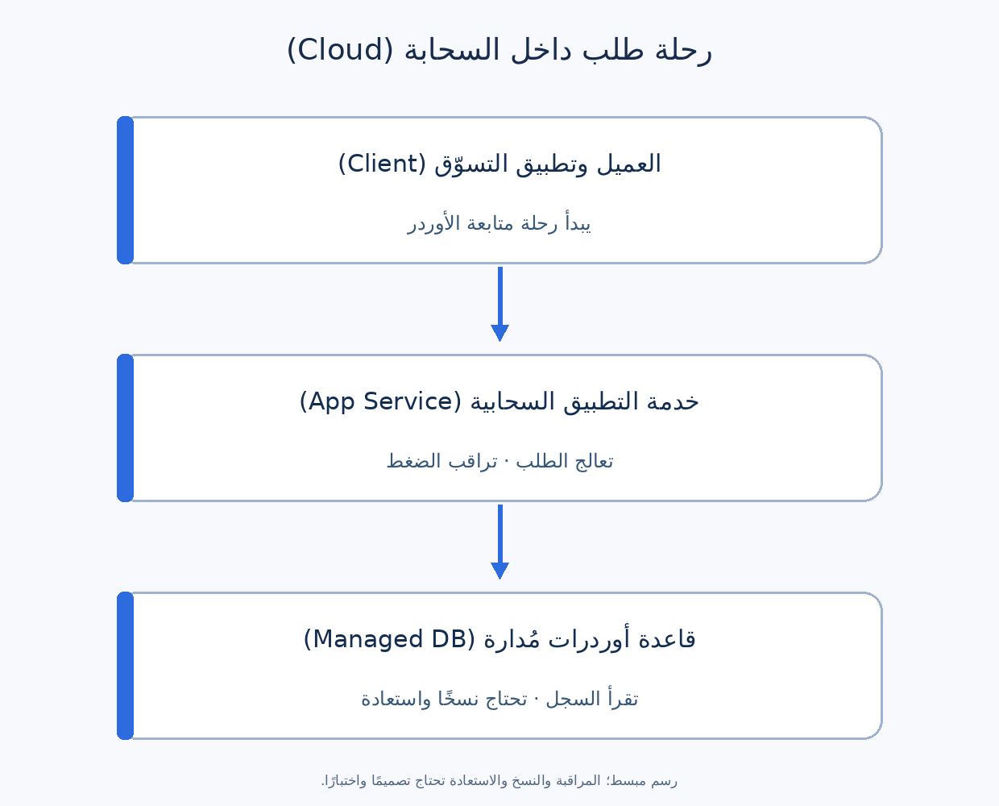

# الحوسبة السحابية (Cloud Computing): دليل عملي لمحلل الأعمال

الحوسبة السحابية (Cloud Computing) معناها تستخدم موارد تقنية—زي تشغيل التطبيقات وقواعد البيانات والتخزين—عن طريق الشبكة، وغالبًا تقدر تزود أو تقلل السعة حسب الحاجة وتقيس الاستخدام. محل تسوّق مثلًا ممكن يشغّل تطبيقه على خدمات مزوّد سحابي بدل ما يشتري ويدير كل الأجهزة بنفسه.

كمحلل أعمال (Business Analyst أو **BA**)، سؤالك المهم: **البيزنس محتاج الخدمات دي تعمل إيه؟** التطبيق يستحمل الضغط إزاي، وإيه اللي يحصل لو خدمة تعطلت، والبيانات تتخزن فين، ومين يوصل لها، والتكلفة تتراقب إزاي. مش لازم تضبط السيرفرات بنفسك عشان تحدد المتطلبات دي.

## مفاهيم أساسية

| المصطلح | معناه بالنسبة للـBA |
| --- | --- |
| قدرة المعالجة (Compute) | الموارد اللي تشغّل كود التطبيق. |
| التخزين (Storage) | مكان للملفات، زي صور المنتجات والنسخ الاحتياطية. |
| قاعدة بيانات مُدارة (Managed Database) | خدمة يتولى المزوّد بعض مهام تشغيلها؛ لكن الفريق لسه مسؤول عن بياناته وقواعد استخدامها. |
| تغيير السعة (Scaling) | زيادة أو تقليل الموارد مع تغيّر الطلب؛ مش حل تلقائي لكل بطء. |
| منطقة الاستضافة (Region) | منطقة جغرافية يوفّر فيها المزوّد خدماته؛ اختيارها قد يؤثر على السرعة ومكان البيانات وخطة التعافي. |
| الإتاحة (Availability) | هل الخدمة متاحة وقت الحاجة، وفق نطاق وفترة قياس متفق عليها. |
| النسخة الاحتياطية (Backup) | نسخة يمكن استعادة البيانات منها؛ لازم تتجرب عملية الاستعادة. |

ممكن يكون النشر في سحابة عامة (Public Cloud) أو خاصة (Private Cloud) أو مزيج بينهما (Hybrid Cloud). دي طرق نشر، أما المصطلحات التالية فتشرح **نوع الخدمة اللي المزوّد بيقدمها**:

| النموذج | معناه ببساطة | استخدام محتمل في مثالنا | سؤال الـBA |
| --- | --- | --- | --- |
| بنية تحتية كخدمة (IaaS) | تستأجر موارد زي الأجهزة الافتراضية؛ فريقك يدير جزءًا أكبر من البرمجيات. | تشغيل خدمة الأوردرات على أجهزة افتراضية. | مين يحدث نظام التشغيل ويراقبه؟ |
| منصة كخدمة (PaaS) | تستخدم منصة مُدارة لتشغيل تطبيقك؛ المزوّد يدير جزءًا أكبر من الأساس التقني. | تشغيل التطبيق وقاعدة بيانات مُدارة. | إيه اللي لسه الفريق لازم يضبطه ويؤمّنه وينسخه احتياطيًا؟ |
| برنامج كخدمة (SaaS) | تستخدم تطبيقًا جاهزًا عبر الخدمة. | نظام جاهز لتذاكر دعم العملاء. | هل يدعم الإجراءات المطلوبة والتكامل والصلاحيات وقواعد البيانات؟ |

النماذج دي مش ترتيب من الأفضل للأسوأ. تقسيم المسؤوليات الفعلي يعتمد على الخدمة المحددة والعقد.

## مثال عملي: تطبيق تسوّق أونلاين

**افتراضات للتوضيح:** العملاء يتصفحوا المنتجات ويطلبوا ويتابعوا التوصيل. مزوّد دفع خارجي يعالج المدفوعات. الفريق بيدرس تشغيل التطبيق وقاعدة بيانات الأوردرات على خدمات سحابية مُدارة. وقت حملة تخفيضات، الضغط قد يزيد جدًا عن الأيام العادية. كل الأرقام والقرارات التالية مقترحات تعليمية وليست حقائق عن مشروعك.



خدمة التطبيق تستقبل الطلبات وقد تزود السعة وقت الضغط. قاعدة بيانات الأوردرات تحتفظ بالسجلات. المراقبة والنسخ الاحتياطي يساعدان الفريق يفهم الأعطال ويتعافى منها. مزوّد الدفع تكامل منفصل وغير مرسوم في الشكل المبسط.

### حوّل جملة «التطبيق يستحمل التخفيضات» لمتطلبات

| موقف من البيزنس | اسأل عن إيه؟ | متطلب مقترح قابل للقياس |
| --- | --- | --- |
| الزحمة تزيد وقت الحملة | كام مستخدم على الـcheckout ولمدة قد إيه؟ | اختبر رحلة الشراء مع **٢٠٠٠ متسوق نشط في نفس الوقت** خلال حملة مدتها **ساعتان**؛ اتفق مع التطوير على رحلة اختبار واقعية ومعيار النجاح. |
| الشراء يبقى بطيئًا | أنهي خطوة تهم العميل أكتر؟ | حدد هدفًا لزمن استجابة الشراء عند **النسبة المئوية 95 (95th percentile)** تحت الحمل المتفق عليه، بعد قياس الوضع الحالي. |
| خدمة الأوردرات تتعطل | البيزنس يستحمل توقف الشراء قد إيه؟ | **هدف وقت الاستعادة (RTO)** المقترح: رجوع الشراء خلال **ساعتين** من عطل يشمله الاتفاق. |
| بيانات الأوردرات تضيع | أقصى بيانات حديثة ممكن البيزنس يعيد إدخالها قد إيه؟ | **هدف نقطة الاستعادة (RPO)** المقترح: فقد لا يتجاوز **١٥ دقيقة** من بيانات الأوردرات في حادث قابل للاستعادة. |
| التكلفة تزيد بعد الحملة | مين يتابع الصرف؟ | عرض التكلفة الشهرية لكل بيئة وتنبيه المسؤول عند تخطي حد الميزانية. |

الـ**RTO** هدف للوقت اللازم لاستعادة الخدمة، والـ**RPO** هدف لأقصى فقد بيانات مقاس بالوقت. الاتنين مش دليل إن النسخة الاحتياطية موجودة أو إن كل عطل هيتحل تلقائيًا. اتأكد هل استعادة قاعدة البيانات وحدها تكفي لعودة الشراء، وجرب رحلة التعافي كاملة. وبرضه «٢٠٠٠ متسوق نشط» غير «٢٠٠٠ طلب تقني في الثانية»؛ لازم طريقة اختبار الحمل تتحدد.

### الإتاحة وتجربة العميل

اتفاق مستوى الخدمة (Service-Level Agreement أو **SLA**) من المزوّد قد يغطي خدمة سحابية معينة فقط، مش رحلة الشراء كلها. أما هدف مستوى الخدمة للمنتج (Service-Level Objective أو **SLO**) فيحتاج طريقة قياس واضحة، مثل نسبة محاولات الشراء الصحيحة التي تنجح خلال شهر، مع الاتفاق على الاستثناءات والمراقبة. لو حطيت **99.9%** كهدف شهري توضيحي، ده يعادل حوالي **43.2 دقيقة** عدم إتاحة خلال شهر من 30 يومًا (`0.1% × 30 × 24 × 60`)؛ الحساب الحقيقي يتوقف على قواعد القياس. اتفق كمان على رسالة العميل وقت العطل، وإزاي تمنع تكرار الأوردر عند إعادة المحاولة.

## الأمان والمسؤوليات

في نموذج المسؤولية المشتركة (Shared Responsibility Model)، المزوّد يدير أجزاء من البنية السحابية، وفريقك يظل مسؤولًا عن بياناته والهويات والصلاحيات واختيارات التطبيق، بدرجات تختلف من خدمة لأخرى. وجود النظام على السحابة مش معناه إن المزوّد مسؤول عن كل تفاصيل الأمان.

في مثال التسوّق اسأل: مين يوافق على صلاحية الموظفين؟ مين يشوف أوردرات العملاء؟ النسخ الاحتياطية فين؟ مين يختبر استعادتها؟ وإيه اللي يحصل للبيانات عند انتهاء التعاقد؟ راجع متطلبات مكان البيانات والاحتفاظ بها مع فرق الخصوصية والقانون والأمن بدل ما تفترض إن اسم الـRegion وحده يحسمها.

## دور محلل الأعمال

1. **رحلة العميل والضغط:** أي خطوات لازم تشتغل؟ ما حجم الاستخدام الطبيعي ووقت الذروة، وبيتقاس إزاي؟
2. **الإتاحة والتعافي:** أي الرحلات أهم؟ من يعتمد RTO وRPO وSLO، ومين يتابع العطل، وإزاي تُختبر الاستعادة؟
3. **البيانات والتكامل:** أنهي نظام صاحب الحقيقة للأوردرات والمدفوعات؟ وأي بيانات تنتقل للمزوّد الخارجي؟
4. **الصلاحيات والخصوصية:** مين محتاج يوصل لأي بيانات، ليه، ولمدة قد إيه؟
5. **التكلفة والاختيار:** إيه اللي يرفع التكلفة؟ مين يراجع التقديرات والميزانية والتنبيهات؟ قارن الحلول بنفس الافتراضات.

### قالب متطلبات سحابية تقدر تستخدمه

```text
رحلة البيزنس وأهميتها:
المستخدمون والضغط: عادي / ذروة / فترة القياس:
هدف الأداء وطريقة قياسه:
هدف الإتاحة ونطاق القياس:
RTO وRPO وأنواع الأعطال المشمولة:
مالك البيانات ومكانها والاحتفاظ بها والصلاحيات:
التكاملات والاعتمادات الخارجية:
المسؤوليات: المزوّد / الفريق / الطرف الخارجي:
النسخ والاستعادة والمراقبة والتصعيد:
مسؤول الميزانية ومحركات التكلفة والتنبيهات:
القرارات المفتوحة واختبارات القبول:
```

### أخطاء شائعة

- افتراض إن زيادة السعة السحابية تصلح أي مشكلة تصميم أو استعلام بطيء.
- اعتبار SLA المزوّد ضمانًا لنجاح رحلة العميل كاملة.
- طلب «بدون توقف نهائيًا» أو «بدون فقد بيانات» من غير تحديد نطاق وتكلفة وتصميم تعافٍ.
- الاعتقاد إن وجود Backup يكفي من غير اختبار الاستعادة.
- اختيار Region قبل مراجعة سرعة الوصول ومكان البيانات والتكامل والتعافي.
- مقارنة الأسعار من غير نفس افتراضات الضغط والتخزين والدعم وبيئات العمل.

**تمرين سريع:** وقت التخفيضات الضغط اتضاعف، والعملاء يقولوا إن الدفع نجح لكن التطبيق ما أظهرش الأوردر. ابدأ بثلاثة أسئلة: هل تأكيد مزوّد الدفع وصل للتطبيق؟ هل الأوردر اتسجل في قاعدة البيانات؟ ماذا يرى العميل لو الرد اتأخر؟ حدد صاحب كل فحص قبل ما تقترح زيادة موارد السحابة.

## مراجع للتوسع

- [NIST: تعريف الحوسبة السحابية](https://www.nist.gov/publications/nist-definition-cloud-computing)
- [Microsoft Learn: المسؤولية المشتركة في السحابة](https://learn.microsoft.com/ar-sa/azure/security/fundamentals/shared-responsibility)
- [AWS: تحديد أهداف التعافي](https://docs.aws.amazon.com/wellarchitected/latest/framework/rel_planning_for_recovery_objective_defined_recovery.html)
