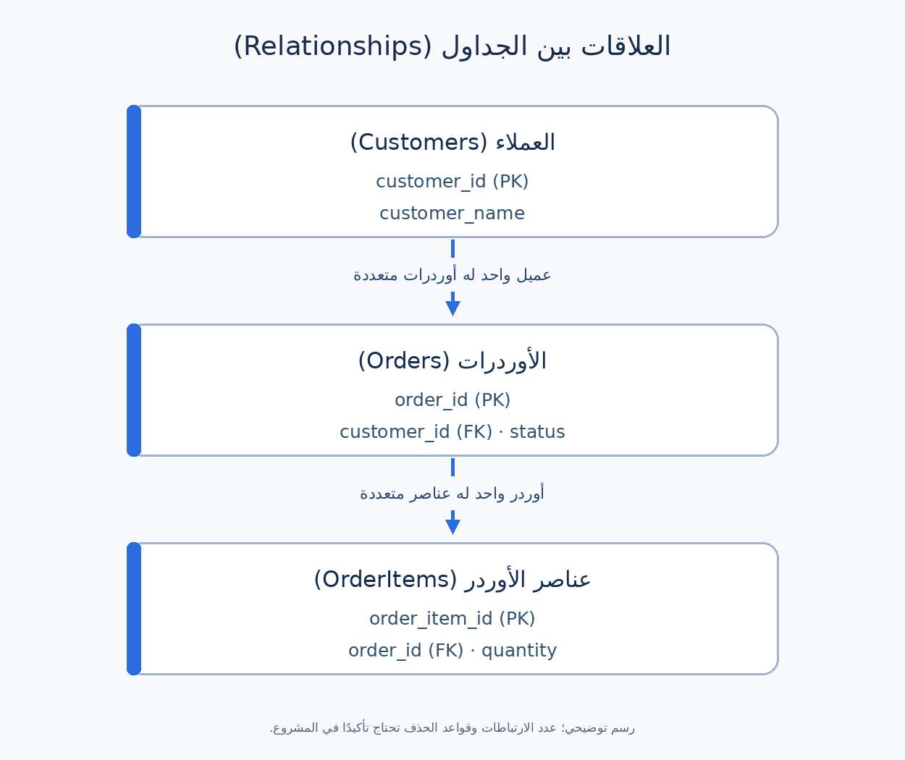

# قواعد البيانات (Databases): دليل عملي لمحلل الأعمال

قاعدة البيانات (Database) مكان منظم يحتفظ بمعلومات النظام عشان يقدر يرجع لها ويحدّثها. تطبيق التسوّق مثلًا ممكن يحتفظ ببيانات العملاء والأوردرات والمنتجات داخل كل أوردر. برنامج إدارة قواعد البيانات (DBMS) هو اللي يدير البيانات دي؛ وPostgreSQL مثال عليه.

كمحلل أعمال (Business Analyst أو **BA**)، المهم تفهم **كل معلومة معناها إيه، السجلات مرتبطة ببعض إزاي، وإيه قواعد البيزنس اللي لازم تفضل صحيحة**. مش لازم تبقى مسؤول عن تشغيل قاعدة البيانات عشان تسأل الأسئلة الصح.

## المفاهيم الأساسية

هنا هنستخدم قاعدة بيانات علائقية (Relational Database): البيانات فيها متقسمة لجداول مرتبطة ببعض. فيه أنواع تانية لقواعد البيانات؛ اختيار التصميم الفعلي بيكون مع الفريق التقني حسب احتياج المشروع.

| المصطلح | معناه ببساطة | مثال من التسوّق |
| --- | --- | --- |
| جدول (Table) | مجموعة سجلات عن نوع واحد من البيانات | `Orders` |
| صف أو سجل (Row / Record) | حالة واحدة داخل الجدول | الأوردر `O501` |
| عمود أو حقل (Column / Field) | معلومة في كل سجل | `status` |
| مفتاح أساسي (Primary Key / PK) | قيمة تميّز كل صف عن الباقي | `Orders.order_id` |
| مفتاح أجنبي (Foreign Key / FK) | حقل يشير لسجل في جدول تاني | `Orders.customer_id` → `Customers.customer_id` |
| علاقة (Relationship) | طريقة ارتباط السجلات | العميل الواحد ممكن يعمل كذا أوردر |
| قيد (Constraint) | قاعدة تُطبَّق على البيانات | الأوردر لازم يشير لعميل موجود |
| قيمة غير موجودة (NULL) | القيمة ناقصة أو لسه مش معروفة لو مسموح بكده | موعد التوصيل لسه غير معروف |
| استعلام (Query) | طلب للبحث أو التعامل مع البيانات | «هات أوردرات Mona» |

`NULL` مش زي الرقم `0` ولا نص فاضي. هل ينفع موعد التوصيل يكون غير محدد؟ ده قرار بيزنس قبل ما يكون إعداد تقني. والـPK يميّز السجل داخل الجدول؛ في الأنظمة الحقيقية رقم الأوردر اللي يظهر للعميل ممكن يكون حقلًا مختلفًا.

## مثال عملي: تطبيق تسوّق أونلاين

**افتراضات للتوضيح:** العميل يعمل أوردر، وكل أوردر فيه عنصر واحد أو أكتر. كل أوردر يخص عميلًا واحدًا. الأسماء والأرقام والقواعد أمثلة تعليمية؛ راجعها مع فريق المشروع الحقيقي.



العلامتان `1` و`متعدد` بتوضحا **عدد الارتباطات (Cardinality)**: العميل ممكن يكون عنده أوردرات كتير، والأوردر ممكن يحتوي عناصر كتير. في السيناريو المقترح، الأوردر لازم يكون فيه عنصر واحد على الأقل عند تأكيده. هل مسودة الأوردر ممكن تكون فاضية؟ ده قرار منفصل.

### بيانات صغيرة نمشي عليها

**جدول العملاء (`Customers`)**

| customer_id (PK) | customer_name |
| --- | --- |
| C101 | Mona |
| C102 | Omar |

**جدول الأوردرات (`Orders`)** — حقل `customer_id` مفتاح أجنبي يشير إلى `Customers`.

| order_id (PK) | customer_id (FK) | status | order_total_egp |
| --- | --- | --- | ---: |
| O501 | C101 | SHIPPED | 120.00 |
| O502 | C102 | PLACED | 75.00 |

**عناصر الأوردر (`OrderItems`)** — حقل `order_id` يشير إلى `Orders`. سعر الوحدة هنا هو السعر اللي اتحسب وقت الشراء، كقاعدة مقترحة للمثال.

| order_item_id (PK) | order_id (FK) | product_code | quantity | unit_price_egp |
| --- | --- | --- | ---: | ---: |
| I1 | O501 | P10 | 2 | 40.00 |
| I2 | O501 | P11 | 1 | 40.00 |
| I3 | O502 | P12 | 1 | 75.00 |

في المثال المبسط: إجمالي O501 هو `2 × 40 + 1 × 40 = 120 EGP`، وإجمالي O502 هو `1 × 75 = 75 EGP`. في الواقع ممكن تدخل خصومات وضرائب وشحن ومرتجعات. حدّد هل `order_total_egp` محفوظ كقيمة، ولا بيتحسب كل مرة، ولا مصدره نظام تاني، وأنهي مبلغ لازم يظهر في كل تقرير.

### المفاتيح والعلاقات بتحمي إيه؟

لو أوردر يشير للعميل `C999` ومفيش عميل بالرقم ده، قيد المفتاح الأجنبي ممكن يمنع تسجيله. والمفتاح الأساسي يمنع سجلين في `Orders` من مشاركة نفس `order_id`. القيود دي تساعد في **سلامة البيانات (Data Integrity)**، لكنها مش كفاية لتحديد كل قواعد البيزنس: مثلًا مش هتعرف منها وحدها هل ينفع الحالة ترجع من `SHIPPED` إلى `PLACED`.

## قراءة استعلام SQL بسيط

لغة الاستعلامات (Structured Query Language أو **SQL**) تُستخدم كثيرًا للتعامل مع البيانات العلائقية. الاستعلام ده للقراءة فقط؛ بيربط العميل بأوردراته عن طريق `customer_id`:

```sql
SELECT c.customer_name, o.order_id, o.status
FROM Customers AS c
JOIN Orders AS o ON o.customer_id = c.customer_id
WHERE c.customer_id = 'C101';
```

| customer_name | order_id | status |
| --- | --- | --- |
| Mona | O501 | SHIPPED |

`SELECT` يحدد الأعمدة، و`FROM` يبدأ من العملاء، و`JOIN ... ON` يربط الجدولين، و`WHERE` يختار العميل C101. الربط الداخلي (Inner JOIN) يعرض الصفوف اللي ليها تطابق في الجدولين. أما الربط الأيسر (LEFT JOIN) فيمكن يعرض عميلًا بلا أوردرات، وتكون أعمدة الأوردر `NULL`. اسأل: التقرير المفروض يشمل مين بالضبط؟

**خلي بالك من مستوى العد (Grain):** لو ربطت `Orders` بـ`OrderItems`، الأوردر O501 هيظهر مرتين لأنه فيه عنصرين. لو عدّيت الصفوف بعد الربط أو جمعت `order_total_egp` مباشرة، ممكن تعد الأوردر مرتين. قبل التقرير حدّد هل المطلوب عدد الأوردرات، أم العناصر، أم العملاء.

## دور الـBA: حوّل الاحتياج لقواعد واضحة

اسأل عن المثال من زاوية البيزنس:

1. **التعريفات:** إيه اللي يعتبر أوردر؟ هل المسودة تدخل في التقارير؟ وكل حالة معناها إيه؟
2. **مصدر الحقيقة:** أنهي نظام مسؤول عن هوية العميل وحالة الأوردر والسعر اللي اتدفع؟
3. **العلاقات:** هل الأوردر ممكن يخص أكثر من عميل؟ هل عنصر ينفع يوجد من غير أوردر؟ ولو العميل طلب حذف بياناته، إيه مصير الأوردرات؟
4. **صحة القيم:** هل `quantity` لازم يكون أكبر من صفر؟ هل موعد التوصيل ممكن يكون `NULL`؟ وإيه تغييرات الحالة المسموحة؟
5. **التاريخ:** لو السعر أو العنوان اتغيّر بعد الشراء، هل الأوردر القديم يحتفظ بقيمته وقت الشراء؟
6. **الوصول والاحتفاظ:** مين يشوف البيانات الشخصية؟ بتتخزن قد إيه؟ والتقارير تتعامل إزاي مع السجلات المحذوفة أو المجهولة؟

### مثال لمتطلبات بيانات

| الحقل أو القاعدة | تعريف مقترح | اختبار قبول بسيط |
| --- | --- | --- |
| `Orders.customer_id` | مطلوب ويشير لعميل موجود | ارفض أوردرًا يشير إلى `C999`. |
| `OrderItems.quantity` | رقم صحيح موجب | ارفض `0` و`-1`. |
| `Orders.status` | قيمة من حالات متفق عليها | ارفض حالة غير معرّفة مثل `READYISH`. |
| `OrderItems.unit_price_egp` | سعر الوحدة وقت الشراء | تغيير السعر الحالي لا يغيّر الأوردر القديم. |
| إجمالي الأوردر | مجموع السعر × الكمية في المثال المبسط | O501 يظهر `120.00 EGP`. |

دي **قواعد مقترحة** وليست حقائق مؤكدة عن مشروعك. الفريق التقني ممكن يطبّق القاعدة في قاعدة البيانات أو التطبيق أو الاثنين. اتفقوا أولًا على السلوك المطلوب، وبعدها على طريقة تطبيقه واختباره.

### أخطاء شائعة

- الخلط بين السعر الحالي في كتالوج المنتجات والسعر اللي العميل دفعه وقت الشراء.
- اعتبار القيمة الناقصة صفر، أو افتراض إن كل حقل اختياري له قيمة في كل صف.
- عمل تقرير بعد ربط جدول فيه عناصر متعددة من غير التأكد إن الأوردرات ما اتعدّتش مرتين.
- افتراض إن الشاشة والـAPI والتقرير وجدول قاعدة البيانات لازم يعرضوا نفس الحقول.
- تشغيل استعلامات تعدّل البيانات أو نسخ بيانات عملاء حقيقية لمجرد استكشاف النظام؛ استخدم صلاحية قراءة معتمدة وبيانات تجريبية آمنة.

## قالب تقدر تستخدمه

```text
سؤال البيزنس / التقرير أو الخاصية:
نوع السجل وتعريف الصف الواحد (Grain):
الحقول ومعانيها وأنواعها والقيم المسموحة:
المعرّف الفريد والعلاقات:
الحقول المطلوبة والحدود المسموحة:
مصدر الحقيقة ووقت التحديث:
سلوك التاريخ والحذف:
الصلاحيات والخصوصية ومدة الاحتفاظ:
أمثلة سجلات وحالات استثنائية:
اختبارات القبول والقرارات المفتوحة:
```

**تمرين سريع:** تقرير بيقول إن عندنا ٣ أوردرات في المثال، رغم إن `Orders` فيها صفّين فقط. إيه السبب المحتمل؟ ربما التقرير عدّ ٣ صفوف من `OrderItems` بعد الربط. اطلب الاستعلام وتأكد هل المؤشر المطلوب «عدد الأوردرات» (`O501` و`O502`) ولا «عدد العناصر» (`I1` و`I2` و`I3`).

## مراجع للتوسع

- [دليل PostgreSQL للمفاهيم العلائقية وSQL](https://www.postgresql.org/docs/current/tutorial.html)
- [شرح المفاتيح والقيود في PostgreSQL](https://www.postgresql.org/docs/current/ddl-constraints.html)
- [شرح ربط الجداول في PostgreSQL](https://www.postgresql.org/docs/current/tutorial-join.html)
