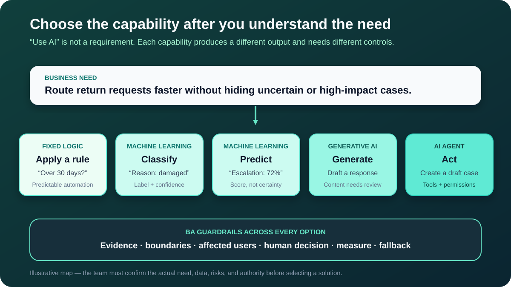

# AI Fundamentals for Business Analysts

Artificial intelligence (AI) is a broad label. On a project, the label alone does not tell you what the system will do, what data it needs, how reliable its output must be, or who remains responsible for the result.

A Business Analyst (BA) does not need to build a model to add value. The BA needs enough AI literacy to turn “we should use AI” into clearer questions: **What problem are we solving? What output will the system produce? What decision follows? What happens when it is wrong?**

This tutorial uses one illustrative scenario: an online store wants to improve how it handles product-return requests. The roles, figures, and rules are teaching assumptions, not a recommended return policy.

## 1. Start with the need, not the technology label

The store receives free-text return requests such as “The headphones arrived with an open box and the left side does not work.” Support staff read each message, identify the reason, check the order and policy, then route the case.

Management proposes: “Use AI to automate returns.” That is an idea, not a requirement. It hides several possible needs and decisions.

| Item | Illustrative statement | Status |
|---|---|---|
| Current problem | Staff spend time reading and routing every request | Assumption to measure |
| Desired outcome | Reduce routing time without increasing incorrect approvals | Proposed outcome |
| Affected people | Customers, Support, Operations, Finance, and fraud reviewers | Initial stakeholder list |
| High-impact decision | Whether money is refunded | Must remain with an authorized role for the first pilot |
| Open question | Are messages and order records accurate enough to support automation? | Needs investigation |

The BA first confirms the current process, baseline, affected users, constraints, and cost of errors. Only then can the team decide whether fixed rules, AI, or a combination is appropriate.

**BA question:** If the word “AI” disappeared from the proposal, could the sponsor still explain the problem and the measurable outcome?

## 2. Separate automation, machine learning, generative AI, and agents

These concepts can work together, but they are not interchangeable.

| Concept | Plain meaning | Return example | Important BA question |
|---|---|---|---|
| **Fixed automation** | Executes rules written in advance | If the purchase is older than the confirmed return window, route to manual review | Are the rules stable, complete, and owned? |
| **Artificial intelligence** | Umbrella term for machine-based systems that infer outputs from inputs for objectives | Interpret a return message and produce a category or recommendation | Which output influences which person or process? |
| **Machine learning (ML)** | Techniques that learn patterns from data rather than relying only on explicitly written rules | Learn from previously labelled requests to classify a new reason | Is the historical data suitable and representative? |
| **Generative AI** | Produces new content such as text, images, audio, or code | Draft a customer response using approved case facts | Which claims require evidence and review? |
| **Large language model (LLM)** | A generative model that processes and generates language | Summarize the request or draft questions for missing details | What context may be shared, and how will the draft be checked? |
| **AI agent** | Pursues a goal across steps and may use permitted tools | Read the case, retrieve policy, ask a question, and create a draft return case | Which actions, tools, permissions, and stop conditions apply? |

A fixed rule may be safer, cheaper, and easier to test than AI. A solution can also combine approaches: rules check eligibility, an ML model classifies the reason, an LLM drafts a response, and a person approves any refund.

**Common mistake:** Treating every smart-looking feature as the same technology. This leads to vague requirements and unsuitable tests.

## 3. Identify the capability the work actually needs

Instead of asking “Which AI tool should we buy?”, identify the kind of output required.

| Capability | Input | Output | Return example |
|---|---|---|---|
| **Classify** | A case or item | A label, often with a score | “Damaged item” with confidence information |
| **Predict** | Current and historical signals | An estimated future outcome or likelihood | Likelihood that the case will need escalation |
| **Recommend** | Context, options, and criteria | Ranked or suggested options | Suggest the next support queue |
| **Generate** | Instructions and context | New content | Draft a reply asking for a photo |
| **Act** | A goal, context, tools, and permissions | One or more executed steps | Create a draft case and notify a reviewer |

The output should connect to a real decision or task. A classification is not valuable merely because it is accurate in a demonstration. It is valuable only if the receiving workflow uses it appropriately and the consequences are acceptable.

**BA action:** Write one sentence in this form: “The system uses **[permitted inputs]** to produce **[output]**, which helps **[role]** make or perform **[decision/action]** within **[boundary]**.”

For the scenario:

> The system uses the customer's message and approved order fields to propose a return-reason category, which helps Support route the request; uncertain and excluded cases go to manual triage.

## 4. Distinguish the model from the whole solution

An AI model is only one component. The business experiences a complete system and workflow.

| Layer | What it includes | What the BA investigates |
|---|---|---|
| **Data and context** | Messages, order fields, policy text, labels, and source versions | Ownership, quality, permission, meaning, gaps, and retention |
| **Model** | The component that infers a label, score, recommendation, or content | Intended task, known limits, version, and evaluation evidence |
| **Application** | Screens, APIs, retrieval, validation, and storage around the model | User journey, integrations, errors, accessibility, and performance |
| **Workflow** | People, queues, decisions, handoffs, and approvals | Responsibility, escalation, service expectations, and exceptions |
| **Controls** | Access, logging, monitoring, human review, rollback, and incident handling | Owner, trigger, evidence, frequency, and response |

If the classifier returns “damaged,” the rest of the solution still has to show the result to the right user, preserve the original message, handle a missing order, prevent an unauthorized refund, and record what happened.

**Common mistake:** Writing “the AI must be accurate” while leaving the workflow, affected people, and error response undefined.

## 5. Understand training, inference, and the lifecycle

For a fresh BA, five terms are enough to start useful conversations:

1. **Training:** A model is created or adjusted using data and an objective. In the scenario, historical requests might be labelled with confirmed return reasons.
2. **Evaluation:** The team tests the model on representative examples that were not used simply to fit the model, then examines both overall results and important failure groups.
3. **Inference:** The trained model processes a new input and produces an output, such as a category or score.
4. **Deployment and operation:** The model becomes part of a real application and workflow with users, permissions, monitoring, and support.
5. **Change or retirement:** Data, policy, users, models, or conditions change. The team re-evaluates, updates, limits, replaces, or retires the capability.

Deployment does not necessarily mean the model learns from every live interaction. Some models stay unchanged until an approved update. The BA should ask who may approve a new model or dataset, what evidence is required, and how users are told about behavior changes.

NIST treats risk management as work across the AI lifecycle, not a one-time review. For a BA, that means requirements must include operation and change—not only the first release.

## 6. Treat outputs as evidence, not certainty

Many AI outputs are labels, scores, ranked options, or generated drafts. A number that looks precise can still be uncertain, poorly calibrated, or unsuitable for the decision.

Suppose an illustrative classifier gives a return request these scores:

| Possible category | Score |
|---|---:|
| Damaged item | 0.72 |
| Open-box concern | 0.21 |
| Changed mind | 0.07 |

The score does not prove the item is damaged, and it is not automatically a 72% guarantee. The team must define what the score means for that model and how it will be used.

An initial decision design could be:

| Condition | Workflow response |
|---|---|
| One permitted category meets the validated routing threshold | Propose that queue and show the original message |
| No category meets the threshold | Route to manual triage; do not guess |
| Message and order facts conflict | Show the conflict and request review |
| Case may lead to a refund | Keep the authorized human approval step |

The threshold is not just a technical setting. It reflects error costs, workload, customer impact, and risk tolerance. Those values must be tested later; this example does not prescribe a threshold.

**BA question:** What happens to the customer and the organization for each kind of wrong output?

## 7. Trace the BA's work across the lifecycle

The BA connects business value and affected people to system behavior.

| Stage | BA contribution | Evidence or artifact |
|---|---|---|
| Discover | Confirm the need, baseline, stakeholders, current decisions, and alternatives | Problem statement and current-state evidence |
| Frame | Define intended use, prohibited use, outcome, boundaries, and assumptions | AI Capability Brief |
| Design | Elicit data, workflow, human review, explanation, quality, and fallback needs | Requirements, process model, and decision table |
| Validate | Help define representative scenarios, business acceptance, and failure consequences | Evaluation and UAT plan |
| Release | Confirm training, support, permissions, communication, and rollback readiness | Pilot and release checklist |
| Operate | Monitor value, failures, complaints, drift, policy changes, and incidents | Benefits and risk review |

The BA does not own every task. Data, engineering, security, legal, risk, operations, product, and affected users contribute different evidence and decisions. The BA makes these dependencies and ownership boundaries visible.

## 8. Completed AI Capability Brief

This brief keeps the discussion at the problem-and-capability level before the team commits to a product or model.

| Field | Completed example | Evidence status |
|---|---|---|
| Business need | Reduce avoidable manual routing time for return requests | Baseline still required |
| Users and affected groups | Customers, Support, Operations, Finance, fraud review | Initial list; validate |
| Current decision | Support reads each message and selects a queue | Confirmed through process observation |
| Proposed capability | Classify the return reason and propose a queue | Option, not approved solution |
| Permitted input | Customer message plus approved order ID, item, date, and status fields | Data permission and quality open |
| Output | Proposed reason, queue, score information, and original message | Needs usability review |
| Human decision | Support accepts or corrects the route during the pilot | Proposed control |
| Prohibited action | No automatic refund, rejection, or customer accusation | Proposed boundary |
| Failure response | Missing, conflicting, excluded, or uncertain cases go to manual triage | Needs service target |
| Success measures | Routing time, corrected classifications, reroutes, and customer complaints | Definitions and baseline open |
| Important risks | Sensitive text, historical label bias, misunderstood scores, policy change | Assess with owners |
| Owner and review | Product owner for value; Operations for workflow; named risk and technical owners required | Open decision |

Notice the language: the brief distinguishes confirmed evidence, proposals, assumptions, and open decisions. It does not pretend that selecting “AI” settles them.

## 9. Common mistakes to avoid

- **Starting with a tool demo:** A fluent demo can hide a weak business case or an unsuitable workflow.
- **Calling rules AI:** This makes ownership and testing less clear. Describe the actual behavior.
- **Assuming historical data is truth:** Past labels can contain errors, inconsistent practice, or unfair treatment.
- **Using accuracy as the only requirement:** Different errors have different consequences, and overall averages can hide harmed groups or rare severe failures.
- **Adding human review without designing it:** Reviewers need authority, time, evidence, and a clear action—not just an approval button.
- **Ignoring operation:** Model, policy, data, and user behavior can change after release.

## 10. Reusable AI Capability Brief

Copy this structure before writing detailed AI requirements:

| Field | Your notes |
|---|---|
| Business problem and evidence | |
| Desired outcome and baseline | |
| Users, affected groups, and decision owners | |
| Current workflow and decision | |
| Candidate capability: classify, predict, recommend, generate, or act | |
| Permitted inputs and sources | |
| Output and recipient | |
| Human decision or action | |
| Prohibited uses and actions | |
| Uncertainty, exception, and fallback behavior | |
| Value, quality, and risk measures | |
| Assumptions and open questions | |
| Owners and next evidence needed | |

## 11. Practice exercise

A subscription service receives messages from customers who may want to pause, downgrade, or cancel. A sponsor asks for “an AI chatbot that prevents cancellations.”

Create a short AI Capability Brief:

1. Rewrite the request as a neutral business problem and outcome.
2. Identify one classification, prediction, generation, or action capability that might help.
3. Name the user decision that follows the output.
4. Add one prohibited action and one safe fallback.
5. Mark every unsupported claim as an assumption or open question.

Then ask: could a fixed rule or a process improvement solve part of the need with less risk?

## Further reading

- [OECD.AI: What is AI, and how is it different from a non-AI system?](https://oecd.ai/en/wonk/definition)
- [IIBA: Accelerating Artificial Intelligence with Business Analysis](https://go.iiba.org/UST-Global-Whitepaper)
- [NIST: Artificial Intelligence Risk Management Framework](https://www.nist.gov/itl/ai-risk-management-framework)
- [NIST: AI RMF Core—Govern, Map, Measure, and Manage](https://airc.nist.gov/airmf-resources/airmf/5-sec-core/)
