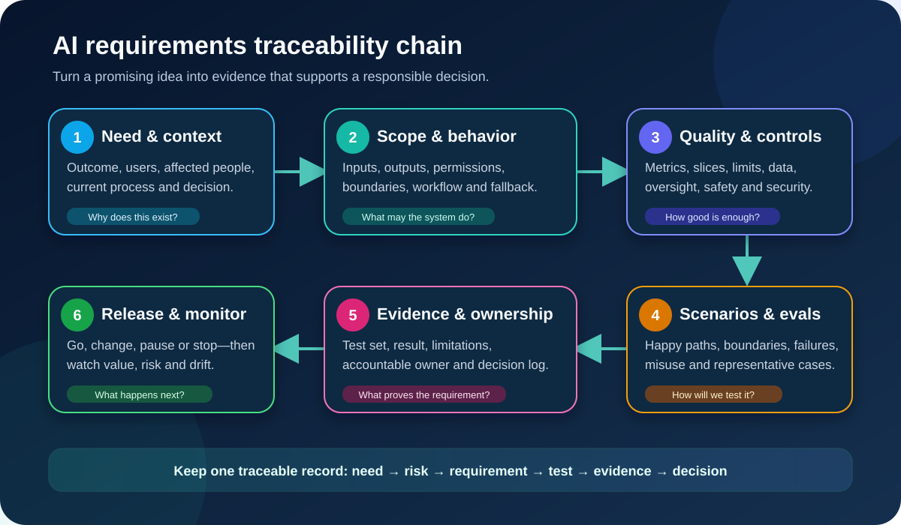

# Writing AI Requirements and Acceptance Criteria for Business Analysts

An AI requirement describes more than a feature. It must define the **business outcome, operating context, permitted behavior, quality limits, controls, evidence, and response when the system is uncertain or wrong**.

Traditional software often follows a deterministic rule: the same valid input produces the expected output. AI can return plausible but incorrect results, behave differently across groups or conditions, and change when its data, model, prompt, provider, or environment changes. That does not make requirements impossible. It means the Business Analyst (BA) must make uncertainty testable and governable.

This tutorial continues the illustrative online-store scenario. The proposed system suggests a return reason and support queue for English web tickets in one product category. A trained employee confirms or corrects every suggestion. All thresholds, roles, and policies below are teaching assumptions—not universal targets or legal advice.

## 1. Start with the decision, not the model

“Use AI to classify tickets” is a solution idea, not a complete need. First define the decision the work must support.

| Question | Return-routing example |
|---|---|
| What problem exists? | Agents spend time reading and rerouting repeatable return requests |
| What outcome matters? | More tickets reach the correct queue without increasing customer delay or harmful errors |
| Who uses the result? | Trained support agents |
| Who is affected? | Customers, agents, queue owners, operations, and data subjects |
| What decision is supported? | Which approved return reason and queue should an agent select? |
| What remains human-owned? | Confirming or correcting the suggestion and handling excluded cases |
| What simpler alternative exists? | Better forms, routing rules, searchable guidance, or process redesign |

A useful outcome statement is:

> Reduce avoidable manual reading and rerouting for the approved ticket population while preserving employee review, customer recovery, and the existing return policy.

This statement prevents a model metric from becoming the business goal. A system could score well offline and still increase handling time, overload one queue, or encourage careless approval.

## 2. Create a firm scope boundary

Scope is a control. State what is included, excluded, and prohibited before writing detailed behavior.

| Boundary | Included in the pilot | Excluded or prohibited |
|---|---|---|
| Population | English web tickets for one product category | Other languages, channels, products, or teams |
| Action | Suggest one approved reason and queue | Approve a refund, deny a return, send a message, or make a fraud claim |
| Input | Approved order fields and the current ticket text | Unrelated customer history or unapproved sensitive fields |
| User | Trained support agent with named access | Customer-facing or unattended operation |
| Output use | Reviewable suggestion | Automatic downstream action |
| Uncertainty | Route to manual handling | Invent a value or force a low-confidence choice |

Write exclusions as observable behavior. “The pilot excludes fraud” is weaker than:

> When a ticket is flagged by the approved fraud rule, the service must not generate a return reason or queue suggestion; it must preserve the original ticket and route it to the existing specialist process.

## 3. Separate requirement types

AI work becomes easier to review when requirements are grouped by purpose.

| Requirement type | Question it answers | Example |
|---|---|---|
| Business | Why is the change valuable? | Reduce avoidable reroutes without worsening customer resolution time |
| Stakeholder | What does a person need? | Agents need to understand, confirm, correct, and report a suggestion |
| Functional | What behavior must occur? | Display one approved reason and queue, then require a human action |
| Data | What information is permitted and fit? | Use only approved fields with documented source, meaning, and retention |
| Quality / non-functional | How well and under which conditions? | Meet agreed performance, latency, security, accessibility, and resilience limits |
| Responsible-AI control | How is harm prevented or handled? | Prohibited actions are unavailable; overrides and complaints are monitored |
| Transition | What enables safe adoption? | Train pilot agents, prepare fallback capacity, and migrate no historical decisions automatically |
| Monitoring | What must remain true after release? | Measure reroutes and corrections by approved case type and investigate triggers |

Do not put all of this into one enormous user story. Use a small set of linked requirements, scenarios, risks, tests, and operating rules.

## 4. Write functional behavior end to end

Describe the complete workflow, not only the model call.

1. The system receives a ticket only after eligibility rules confirm the approved language, channel, product, and team.
2. It retrieves only the permitted fields and records the applicable policy version.
3. It produces one approved reason, one queue, and the information the agent needs to review the suggestion.
4. The interface shows that the output is AI-generated and requires confirmation or correction.
5. The final human selection—not the raw suggestion—drives routing.
6. The system records the suggestion, human action, policy and system versions, timestamp, and permitted audit fields.
7. If an input is missing, the service is unavailable, or the case is excluded, the original manual process remains available.

Clarify the **source of truth** for each rule. The return-policy service might determine eligibility, while AI only suggests a reason. Never let an AI output silently replace a controlled policy source.

Example functional requirement:

> **AI-FR-04:** After an eligible ticket receives a suggestion, the interface shall show the proposed reason and queue, allow the agent to confirm or replace both from approved values, and prevent routing until the agent takes one of those actions.

## 5. Make probabilistic quality measurable

“The model must be accurate” is not testable enough. Specify the measure, population, dataset, calculation, threshold, segmentation, and response.

| Element | Questions to resolve |
|---|---|
| Decision unit | Are we scoring reason, queue, both together, or the final workflow outcome? |
| Error cost | Is a wrong queue, missed specialist case, or unnecessary escalation more harmful? |
| Metric | Precision, recall, F1, exact match, false-positive rate, task completion, rubric score, or another fit-for-purpose measure? |
| Population | Which language, channel, product, time period, and case types are represented? |
| Slices | Which meaningful subgroups or operating conditions need separate results? |
| Threshold | What minimum or maximum has the authorized owner approved for this context? |
| Uncertainty | How much test data exists, and how stable is the estimate? |
| Response | What happens when a threshold is missed before release or in production? |

Illustrative requirement—replace the numbers with an approved decision:

> **AI-QR-02:** On the versioned pre-pilot evaluation set of eligible English web tickets, the configured system shall achieve at least 88% exact agreement with the adjudicated queue label overall and at least 82% for every approved return-reason slice containing 100 or more cases. Any smaller slice shall be reported with its sample size and reviewed qualitatively. A missed threshold blocks release until the Product and Risk Owners approve a documented change, narrower scope, or new evidence.

This is stronger than “accuracy ≥ 88%” because it defines what is measured, where, by whom, and with what consequence. The values are illustrative; there is no universal safe threshold.

Average performance can hide costly pockets of failure. Report the confusion matrix or relevant error types, not just one score. Compare against the current process or another meaningful baseline when possible.

## 6. Specify data and label requirements

Model quality cannot rescue unclear labels or unsuitable data. For each field and dataset, record:

- business meaning, system of record, owner, and permitted purpose;
- collection method, time range, population, and known exclusions;
- missing, invalid, duplicate, and outlier handling;
- access, minimization, retention, deletion, and transfer rules;
- label definition, annotator guidance, disagreement resolution, and quality review;
- separation between training, tuning, evaluation, and live monitoring data;
- version and lineage so a result can be reproduced.

Example data requirement:

> **AI-DR-03:** Every evaluation case shall contain the ticket identifier, approved input snapshot, adjudicated reason and queue, label-guide version, and adjudication status. Cases without a resolved reference label shall not contribute to the release metric and shall be reported separately.

“Ground truth” is sometimes a negotiated operational judgement, not an unquestionable fact. Document who decides and how disagreement is resolved.

## 7. Define meaningful human oversight

“Human in the loop” is not an acceptance criterion. The reviewer needs information, authority, time, skill, and a usable alternative.

Write requirements for:

- clear notice that the suggestion came from AI;
- the evidence or context needed to judge it;
- ability to confirm, correct, reject, or escalate;
- no penalty for appropriate override;
- training on purpose, limits, known failures, and fallback;
- collection and review of overrides without treating every disagreement as human error;
- customer or employee challenge and correction routes where relevant.

Example oversight scenario:

> **Given** an eligible ticket and an AI suggestion, **when** the agent disagrees, **then** the agent can select another approved reason and queue without manager permission, add an optional issue flag, and complete routing through the normal workflow; the final action and override are recorded for review.

Test the oversight with real users. A button can exist yet remain unusable because the screen hides the original ticket, the queue names are confusing, or time targets pressure agents to accept every suggestion.

## 8. Cover failures, integrations, and recovery

AI behavior sits inside a larger service. Requirements must address the seams.

| Failure or change | Required behavior |
|---|---|
| Provider timeout | Stop waiting after the approved limit and return the ticket to manual handling |
| Missing permitted field | Do not invent a value; identify the missing input and use the fallback |
| Invalid output | Reject values outside the approved reason and queue lists |
| Policy-version mismatch | Do not present a suggestion until the approved source is available |
| Logging failure | Follow the organization's fail-safe decision; do not claim evidence was recorded |
| Repeated corrections | Alert the named owner when the monitoring trigger is reached |
| Model, prompt, or provider change | Compare versions and rerun the required evaluation before expanded release |
| Security or privacy incident | Contain the affected processing and use the approved incident route |

Example resilience requirement:

> **AI-NFR-05:** If the suggestion service does not return a valid response within the approved interface limit, the application shall display the manual-routing option, preserve all entered work, create no suggestion record, and emit the permitted availability event for operations monitoring.

Requirements for latency and cost should measure the end-to-end workflow, not only the model endpoint.

## 9. Write acceptance scenarios beyond the happy path

Use Given–When–Then where it improves clarity, but treat it as a format—not a substitute for analysis.

### Happy path

> **Given** an eligible ticket with all required fields, **when** a valid suggestion is returned, **then** the agent sees the reason and queue, reviews the original request, and must confirm or correct before routing.

### Scope boundary

> **Given** a ticket in an unsupported language, **when** eligibility is checked, **then** no content is sent to the AI service and the ticket follows the current manual process.

### Uncertainty or incomplete input

> **Given** a ticket without the required product category, **when** routing begins, **then** the system identifies the missing field and offers the manual path without fabricating a category.

### Prohibited action

> **Given** any suggestion, **when** the routing component completes, **then** it cannot approve a refund, deny a return, send a customer message, or change the order record.

### Failure and recovery

> **Given** the provider is unavailable, **when** an eligible ticket is opened, **then** the agent can finish the task through the original process and no partial suggestion changes downstream data.

### Monitoring and change

> **Given** the correction trigger is exceeded for an approved case type, **when** the monitoring job runs, **then** the named owner receives the alert, the affected version and cases are identifiable, and the documented review or pause procedure begins.

Also test adversarial or accidental misuse, accessibility, permission boundaries, stale data, bulk processing, repeated inputs, and changes in operating conditions when relevant.

## 10. Design the evaluation before building

An **evaluation** is a structured way to measure whether the configured system meets its requirements in conditions relevant to use. Design it while requirements are still changeable.

| Evaluation layer | Purpose | Example evidence |
|---|---|---|
| Component | Check a model, prompt, classifier, or rule in isolation | Versioned metric report and error analysis |
| End-to-end | Check data, integration, interface, permissions, and fallback together | Scenario results and audit records |
| Human workflow | Check that people can review, correct, and recover effectively | Usability observation, task results, interviews |
| Pilot | Check value and risk under controlled live conditions | Handling time, reroutes, overrides, complaints, incidents |
| Production monitoring | Detect drift, new failure patterns, misuse, or value loss | Dashboards, alerts, sampled reviews, feedback |

Record the evaluation set's origin, eligibility rules, time range, label process, exclusions, version, access, and limitations. Prevent evaluation cases from leaking into training where that would invalidate the result.

Passing an offline test does not prove that the live workflow is safe or valuable. Release evidence should combine quantitative results, qualitative review, software testing, human factors, and risk controls in proportion to the use case.

## 11. Build the traceability chain

Traceability connects the original need to the delivered behavior and evidence. It makes gaps and unsupported features visible and helps assess changes.

| Need or risk | Requirement | Test or evaluation | Evidence | Owner | Decision |
|---|---|---|---|---|---|
| Avoid harmful automatic action | AI-FR-04: explicit human confirmation | Permission test and end-to-end scenario | Passed test record; interface review | Product Owner | Eligible for bounded pilot |
| Wrong queue delays customers | AI-QR-02: performance by case type | Versioned offline evaluation | Metric report, error analysis, limitations | Product and Risk Owners | Open until thresholds pass |
| Provider outage stops work | AI-NFR-05: manual fallback | Outage simulation | Recovery time and no-data-loss result | Operations Owner | Pass with monitoring condition |
| Poor labels invalidate evidence | AI-DR-03: adjudicated reference labels | Dataset review | Label guide, agreement review, unresolved list | Data Owner | Repair before evaluation |

Use stable IDs. Link each requirement to its source, risk, scenario, evidence location, owner, status, and change history. Trace both backward to the business need and forward to the solution and test.

## 12. Distinguish acceptance from monitoring

Some conditions can block release; others must remain healthy during operation.

| Type | Example | Decision |
|---|---|---|
| Hard release gate | Prohibited refund permission exists | Do not release |
| Quality gate | Approved slice threshold is missed | Improve, narrow scope, or formally reconsider |
| Readiness gate | Operators cannot complete fallback | Fix workflow and retest |
| Pilot success measure | Reroutes decrease without worse customer resolution | Continue, change, or stop pilot |
| Monitoring trigger | Correction rate changes materially from approved baseline | Investigate and possibly narrow or pause |
| Incident trigger | Confirmed unauthorized action or severe harm | Contain and escalate immediately |

Monitoring thresholds are not permanent truths. Revisit them when volumes, policy, data, users, harms, models, or providers change.

## 13. Completed AI Requirements Pack

| Pack section | Return-routing pilot content | Status |
|---|---|---|
| Outcome and baseline | Reduce avoidable reading and rerouting; current baseline to validate | Open |
| Users and affected people | Trained agents, customers, queue owners, operations, data subjects | Initial map complete |
| Included scope | English web tickets, one product category, named pilot team | Proposed |
| Excluded and prohibited | Other populations; no refund, denial, message, or fraud action | Hard boundary |
| Functional workflow | Eligibility, approved inputs, suggestion, review, final routing, audit event | Drafted |
| Data and labels | Field register, permission, label guide, adjudication, dataset lineage | Needs owner approval |
| Quality requirements | End-to-end metric, slices, thresholds, baseline, limitations | Numbers need approval |
| Human oversight | Notice, context, correction, escalation, training, fallback | Needs usability evidence |
| Safety, privacy, security | Least privilege, minimization, incident route, access review | Specialist review required |
| Integration and failure | Timeouts, invalid output, unavailable policy, logging, recovery | Scenarios drafted |
| Evaluation plan | Offline, end-to-end, human workflow, bounded pilot | Dataset not yet frozen |
| Traceability and evidence | Requirement IDs linked to risk, test, evidence, owner, status | Structure ready |
| Release decision | Named authority decides go, change, pause, or stop | Pending evidence |
| Monitoring and change | Corrections, reroutes, complaints, drift, versions, material-change review | Triggers to approve |

The honest recommendation is not “ready” merely because requirements exist. It is **not ready for a live pilot until the open owners, thresholds, data evidence, controls, and fallback tests are resolved**.

## 14. Definition of Ready and Definition of Done

### Ready for implementation

- the need, users, affected people, scope, and prohibited actions are agreed;
- process, data, policy, model/provider, integration, and human dependencies are mapped;
- material risks have owners and proposed controls;
- requirements and acceptance scenarios are testable;
- the evaluation population, measures, slices, evidence, and decision authority are defined;
- unresolved decisions and assumptions are visible.

### Done for a bounded release

- functional, quality, data, security, privacy, accessibility, and fallback tests have evidence;
- approved evaluation thresholds pass, or an authorized documented decision changes the scope;
- operators are trained and can override, escalate, and recover;
- monitoring, alerts, incidents, support, rollback, and change review are operational;
- residual risks, limitations, approval conditions, and review date are recorded;
- the manual or safer alternative remains usable where required.

## 15. Common mistakes

- **Writing “use AI” as a requirement:** define the outcome and consider simpler options.
- **Using one accuracy number:** define the decision unit, error costs, slices, dataset, uncertainty, and response.
- **Treating vendor benchmarks as acceptance:** test the configured end-to-end system in your context.
- **Calling a confirmation button oversight:** verify information, authority, time, skill, and fallback.
- **Ignoring abstention:** specify when the system should not answer or act.
- **Testing only expected inputs:** cover boundaries, missing data, misuse, outages, stale rules, and change.
- **Mixing acceptance and monitoring:** state what blocks release and what triggers investigation later.
- **No traceability:** every critical requirement needs a source, risk, test, evidence, owner, and status.
- **Inventing legal or risk decisions:** route them to qualified owners and record the decision.

## 16. Reusable AI Requirements Pack template

| Section | Your content |
|---|---|
| Business problem, baseline, desired outcome, and simpler alternatives | |
| Users, affected people, decisions, and current process | |
| Included, excluded, prohibited, and foreseeable use | |
| Inputs, outputs, permissions, workflow, source of truth, and fallback | |
| Data sources, fields, purpose, quality, labels, lineage, access, and retention | |
| Quality measures, populations, slices, thresholds, uncertainty, and baselines | |
| Human review, explanation, correction, escalation, challenge, and training | |
| Privacy, security, safety, fairness, accessibility, audit, latency, cost, and resilience | |
| Integrations, timeouts, invalid outputs, partial failures, recovery, and incidents | |
| Acceptance scenarios: normal, boundary, exception, misuse, and change | |
| Evaluation sets, methods, tools, evidence, limitations, and independent review | |
| Traceability: need → risk → requirement → test → evidence → owner → decision | |
| Release gates, pilot measures, monitoring triggers, pause/stop rules, and review date | |
| Assumptions, open decisions, change history, and approval record | |

## 17. Practice exercise

A bank wants an AI assistant to suggest a category and next step for written card-transaction questions. An employee reviews the suggestion before taking action.

1. Write the business outcome without mentioning AI.
2. Define included, excluded, and prohibited behavior.
3. Write one functional, one data, one quality, one oversight, and one fallback requirement.
4. Choose one costly error and define a fit-for-purpose metric, population, slice, threshold owner, and response.
5. Write five Given–When–Then scenarios: happy path, boundary, missing data, outage, and unauthorized action.
6. Create one traceability row from need or risk through decision.
7. Identify evidence required before a pilot and signals that could pause it.

Do not invent banking policy, legal obligations, risk tolerance, or performance thresholds. Name the qualified owner who must decide each one.

## Further reading

- [NIST AI RMF Core](https://airc.nist.gov/airmf-resources/airmf/5-sec-core/)
- [NIST AI RMF Playbook: Measure](https://airc.nist.gov/airmf-resources/playbook/measure/)
- [IIBA Business Analysis Standard: Understanding Requirements and Designs](https://www.iiba.org/knowledgehub/the-business-analysis-standard/4-implementing-business-analysis/4-4-understanding-requirements-and-designs/)
- [IIBA Business Analysis Standard PDF](https://production.iiba.org/globalassets/business-analysis-resources/the-business-analysis-standard/files/the-business-analysis-standard.pdf)

The NIST guidance supports context-specific metrics, documented test sets, human oversight, production monitoring, and go/no-go evidence. IIBA's Standard explains functional and non-functional solution requirements and bidirectional traceability from the original need to the implemented solution. Use both as guidance, tailored to your organization's governance and use case.
