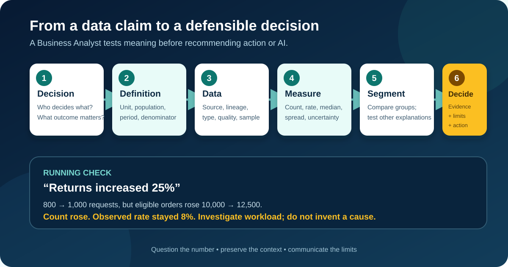

# Data Literacy for Business Analysts

**Data literacy** is the ability to read, question, interpret, communicate, and use data responsibly. It does not mean becoming a data scientist or memorizing statistical formulas. For a Business Analyst (BA), it means knowing what a number represents, what it leaves out, and whether it is good enough to support a decision.

This lesson continues the illustrative online-store scenario. An operations dashboard says: **“Returns increased by 25% in May.”** A manager proposes more support staff and an AI assistant to route return requests. Before recommending either option, the BA must test what the claim actually means.

All roles, numbers, fields, thresholds, and policies below are teaching assumptions. The method—not the invented figures—is the reusable part.

## 1. Start with the decision, not the dashboard

A dashboard is a view of data, not a business question. Begin by identifying who will decide what, by when, and what evidence would change that decision.

| Decision element | Illustrative answer |
|---|---|
| Decision | Whether to change staffing, redesign intake, pilot routing assistance, or make no change |
| Decision owner | Returns Operations Manager |
| Time horizon | Next eight weeks |
| Intended outcome | Reduce avoidable waiting without increasing incorrect routing |
| Important constraints | Existing budget, trained reviewers, privacy rules, peak-season preparation |
| Evidence that could change the decision | Return rate, demand by channel and reason, queue delay distribution, rework, and customer impact |

Turn the original claim into questions:

- Did the **number** of returns rise, or did the **rate** of returns rise?
- Which orders were eligible to be returned?
- Did volume change for every product and channel, or only some?
- Is the increase sustained, seasonal, or caused by a definition change?
- Is customer waiting caused by more demand, slower handling, rerouting, or something else?

**BA action:** record the decision question before requesting extracts or building charts. Otherwise, the analysis can become an expensive search for an interesting number.

## 2. Identify the unit of observation and granularity

The **unit of observation** is what one row represents. **Granularity** is the level of detail at which data is recorded. These choices control what can be counted and compared.

In the return process, one row might represent:

- one order;
- one item inside an order;
- one return request;
- one support ticket;
- one routing event; or
- one daily summary by product category.

Those units are not interchangeable. One order can contain three items, create two return requests, and generate four routing events. Joining them carelessly can multiply rows and exaggerate volume.

| Field | Example | Meaning question |
|---|---|---|
| `order_id` | O-1042 | Is it unique per order or reused across markets? |
| `order_item_id` | O-1042-2 | Can one item be returned more than once? |
| `return_request_id` | R-8301 | Does reopening create a new request or update the old one? |
| `routing_event_id` | E-5529 | Does every transfer create another event? |
| `created_at` | 2026-05-18 14:20 | Which timezone and business date apply? |

**BA question:** “What exactly does one row represent, and what key proves that?”

## 3. Recognize data types before choosing a calculation

The same-looking values can require different treatment. A telephone number contains digits but is an identifier, not a quantity to average.

| Type | Return example | Appropriate use | Common trap |
|---|---|---|---|
| Identifier | `return_request_id` | Join or find a record | Counting duplicated identifiers as new cases |
| Categorical, unordered | Channel: web, email, chat | Group and compare | Treating codes such as 1, 2, 3 as quantities |
| Categorical, ordered | Priority: low, medium, high | Rank or filter | Assuming equal distance between levels |
| Numeric, discrete | Number of transfers | Count and distribute | Reporting only the average |
| Numeric, continuous | Handling time in minutes | Summarize and inspect spread | Mixing minutes and hours |
| Date and time | Request created timestamp | Sequence, duration, trend | Ignoring timezone or business calendar |
| Free text | Customer explanation | Classify or review with controls | Treating text as accurate structured facts |
| Boolean | `eligible_for_return` | Filter or calculate a proportion | Not defining how missing values behave |

A useful **data dictionary** records the business definition, type, allowed values, unit, source, owner, refresh timing, sensitivity, and known limitations. Field names alone are not definitions.

## 4. Trace source, lineage, and meaning

**Data lineage** explains where data originated and how it changed. **Metadata** is information that helps people find, understand, and use data: definitions, owners, timestamps, formats, permitted values, and transformation rules.

The store's dashboard follows this illustrative path:

`Checkout and return forms → order and case systems → event logs → warehouse transformations → dashboard measure → management decision`

At each handoff, ask:

| Lineage question | Why it matters |
|---|---|
| Who created the value, and for what operational purpose? | A field collected for routing may not measure customer intent |
| Is it entered, calculated, inferred, or defaulted? | Defaults can look like real choices |
| Which records are excluded? | Cancelled, open, or manual cases may disappear |
| Which transformation changed it? | Deduplication, currency conversion, or category mapping changes interpretation |
| Which definition and version were active? | A May policy change can break comparison with April |
| How current is the extract? | A partial day can look like a drop |

“It comes from the warehouse” is a location, not a lineage explanation.

## 5. Define the population, sample, and denominator

The **population** is the complete group the question is about. A **sample** is the subset actually observed or reviewed. The **denominator** is the base against which a rate or proportion is calculated.

The dashboard provides these illustrative figures:

| Month | Return requests | Eligible delivered orders | Return-request rate |
|---|---:|---:|---:|
| April | 800 | 10,000 | 8.0% |
| May | 1,000 | 12,500 | 8.0% |

The count increased by 25%: `(1,000 − 800) ÷ 800`. But the rate stayed at 8%: `return requests ÷ eligible delivered orders`.

Both statements can be true. They support different decisions:

- the higher count may increase workload;
- the unchanged rate does not show that products became more return-prone;
- staffing still depends on arrival times, handling effort, backlog, and capacity—not volume alone.

Now inspect the sample. If the dashboard includes only **closed** tickets, long-running unresolved cases are missing. This is selection bias: inclusion is related to the outcome being measured.

**BA action:** state the population, inclusion and exclusion rules, time window, denominator, and sample method beside every important measure.

## 6. Read the distribution, not only the average

An average compresses many observations into one number. Before using it, inspect the **distribution**: the pattern of values, including concentration, spread, gaps, and extreme cases.

For May's closed tickets, assume:

| Measure | Illustrative result | What it reveals |
|---|---:|---|
| Mean resolution time | 31 hours | Total time divided by closed tickets; pulled upward by long cases |
| Median | 9 hours | Half the tickets closed in 9 hours or less |
| 90th percentile | 72 hours | 90% closed within 72 hours; the slowest 10% took longer |
| Range | 5 minutes–240 hours | Very wide spread that needs investigation |

The mean is not wrong, but it hides the shape. A median can hide severe tail delays. Use measures together and connect them to the decision.

Also distinguish:

- **count:** how many return requests arrived;
- **rate or proportion:** how many relative to an appropriate base;
- **percentage-point change:** 8% to 10% is a 2-point increase;
- **percentage change:** 8% to 10% is a 25% relative increase;
- **percentile:** the value below which a stated percentage of observations falls.

Write the unit and calculation. “Delay = 31” is not interpretable; “mean elapsed hours from request creation to final closure for May tickets closed by 7 June” is.

## 7. Segment without losing the whole picture

An overall figure can hide different experiences. A **dimension** is an attribute used to group a measure, such as channel, product category, region, customer type, or time period. **Disaggregation** means examining appropriate groups rather than relying only on a total.

| Segment | Requests | Eligible orders | Request rate | Median resolution |
|---|---:|---:|---:|---:|
| Web | 700 | 10,000 | 7.0% | 6 hours |
| Email | 300 | 2,500 | 12.0% | 28 hours |
| Total | 1,000 | 12,500 | 8.0% | 9 hours |

Email is a smaller channel but has a higher request rate and slower resolution. That could justify studying its form, case complexity, staffing, or routing. It does not prove the channel itself causes delay.

Choose segments because they connect to the process, decision, or potential impact—not because a tool can produce hundreds of cuts. Very small groups can produce unstable rates and create privacy risks. Record minimum reporting rules with the appropriate data and privacy owners.

## 8. Test data quality as fitness for the decision

Data quality is not one universal score. It is **fitness for a particular use**.

| Quality dimension | Return example | Decision risk |
|---|---|---|
| Completeness | Email cases often lack product category | Product comparison may exclude difficult cases |
| Validity | Some reason codes are no longer permitted | Trend combines retired and current definitions |
| Consistency | One system stores minutes, another seconds | Handling time is overstated or understated |
| Timeliness | Warehouse refresh is two days late | Staffing reacts after the peak |
| Uniqueness | Reopened requests create duplicate extracts | Volume is inflated |
| Accuracy | Default reason remains when the agent forgets to correct it | Reason analysis reflects interface behavior, not reality |

Define rules with scope and denominator. Instead of “category is 95% complete,” write:

> Among return requests created in May through the web form, 9,500 of 10,000 records have a non-null category that was valid on the request date: 95%. Email and manually created requests are excluded and reported separately.

This makes the claim reproducible and exposes what it does not cover.

## 9. Separate relationship from cause

Two variables moving together is **association** or correlation. It does not by itself show that one caused the other.

Suppose discounted products have a higher return rate. Possible explanations include:

- discounts caused rushed purchases;
- clearance items came from product categories with historically higher return rates;
- a marketing campaign attracted new customer groups;
- the discount flag is more complete in one sales channel;
- damaged inventory was discounted and also more likely to be returned.

These alternative influences are potential **confounders**. A chart cannot choose among them on its own.

Use careful language:

- supported: “In the May extract, discounted orders had a higher observed return-request rate.”
- not yet supported: “Discounts caused customers to return more products.”

**BA action:** document the observation, plausible explanations, missing evidence, and the decision risk if someone treats association as causation. Ask an analyst or statistician for suitable study design when causal evidence matters.

## 10. Read and design charts critically

A chart should make the relevant comparison easier to see without exaggerating it.

Before accepting a visual, check:

- title: does it state the measure, population, and period?
- axes: are units and scales visible, consistent, and appropriate?
- denominator: is a count being mistaken for a rate?
- time: are intervals equal, and is the latest period complete?
- categories: were any groups combined, omitted, or reordered?
- uncertainty: is a small-sample estimate shown as precise?
- accessibility: are labels readable without relying on color alone?
- source and refresh: can someone trace the figure?

A bar chart with an axis beginning at 7.8% can make a change from 8.0% to 8.2% look dramatic. A line chart may reasonably use a focused scale to reveal variation, but the scale and context must remain visible. The issue is not one rigid rule; it is whether the design helps the audience judge magnitude honestly.

## 11. Communicate uncertainty and limitations

Uncertainty can come from sampling, missing data, measurement error, changing definitions, delayed outcomes, and assumptions. Hiding it does not make the decision safer.

Use a four-part evidence statement:

1. **Observation:** what the approved calculation shows.
2. **Scope:** the population, period, source, and version it covers.
3. **Limitation:** what is missing or uncertain.
4. **Decision implication:** what is supported now and what evidence is needed next.

Example:

> May return requests increased from 800 to 1,000 while eligible delivered orders increased from 10,000 to 12,500, leaving the observed request rate at 8.0%. The extract covers web and email cases received by 31 May and refreshed on 7 June. Email product category is incomplete, and open cases are excluded from the resolution-time figures. The evidence supports investigating workload and email delay, but it does not yet support a claim that product quality worsened or that an AI router is the best response.

## 12. Use data responsibly

The ability to calculate a segment does not automatically justify collecting, joining, or publishing it.

For each source and analysis, ask:

- Is the data necessary for the stated decision?
- Who is accountable for access, meaning, retention, and correction?
- Does the analysis expose personal, confidential, licensed, or sensitive information?
- Could a proxy reproduce unfair treatment?
- Are missing groups being treated as if they do not exist?
- Could a small segment identify individuals?
- Can affected users question or correct important data when appropriate?

The BA does not invent legal conclusions. Record the purpose, questions, owners, approvals, restrictions, and unresolved decisions, then involve privacy, legal, security, data, and domain specialists as required by the organization.

## 13. Completed Data Question Canvas

| Canvas field | Completed return example |
|---|---|
| Decision and owner | Operations Manager decides whether to change staffing, redesign intake, pilot assistance, or make no change |
| Outcome and time horizon | Reduce avoidable waiting during the next eight weeks without increasing incorrect routing |
| Primary questions | Did count, rate, complexity, arrival pattern, or handling behavior change? Where and for whom? |
| Unit and grain | One return request; item and routing-event tables aggregated before joining |
| Population and window | Web and email requests for eligible delivered orders created in April and May |
| Measures and definitions | Request count; requests ÷ eligible delivered orders; median and P90 elapsed hours; transfer rate |
| Dimensions | Channel, product category, reason, week, and first/final queue |
| Sources and lineage | Order service, case system, routing events, documented warehouse transformation, dashboard v3 |
| Quality checks | Duplicate requests, valid reason by date, missing category by channel, unit and timezone consistency |
| Sample and exclusions | Resolution analysis excludes open cases; open-case age reported separately |
| Relationship limits | Discount association will not be described as causal without additional evidence |
| Responsible-use checks | Remove unnecessary identity fields; suppress unsafe small groups; confirm access and retention |
| Evidence statement | Count rose 25%; observed rate stayed 8%; email delay merits investigation; cause not established |
| Recommendation | Investigate email workflow and capacity first; assess AI only after the problem and data are confirmed |
| Owner and next review | BA and Data Analyst update evidence after two complete weekly refreshes |

This canvas prevents the team from jumping from one striking number to a predetermined solution.

## 14. Reusable Data Question Canvas

| Canvas field | Your answer |
|---|---|
| Decision, decision owner, and deadline | |
| Intended outcome, constraints, and possible options | |
| Primary questions and competing explanations | |
| Unit of observation, grain, and unique key | |
| Population, period, inclusion, and exclusion rules | |
| Measures, formulas, units, and denominators | |
| Dimensions and justified segments | |
| Sources, owners, lineage, versions, and refresh timing | |
| Data types and dictionary definitions | |
| Quality rules and results by relevant segment | |
| Sample method, coverage, and possible bias | |
| Distribution, uncertainty, and limitations | |
| Privacy, security, ethics, and access decisions | |
| Evidence statement and safe visualization | |
| Recommendation, unresolved questions, owners, and review date | |

## 15. Common data-literacy mistakes

- **Starting with available fields:** the analysis answers what is easy, not what the decision needs.
- **Counting the wrong unit:** order items, requests, and events are mixed together.
- **Reporting a count without its base:** growth in business volume looks like a worsening rate.
- **Using “average” without naming the measure:** mean, median, and percentiles answer different questions.
- **Looking only at totals:** an important channel or group is hidden.
- **Cutting into too many tiny segments:** noise and disclosure risk are mistaken for insight.
- **Treating missing as zero:** “unknown” becomes a false business fact.
- **Assuming a system field is accurate:** defaults and operational shortcuts are ignored.
- **Turning correlation into a story of cause:** a plausible explanation is presented as evidence.
- **Removing limitations from the presentation:** decision-makers receive confidence the data did not earn.
- **Letting a dashboard become the source of truth:** definitions, transformations, and accountable owners remain invisible.

## 16. Practice exercise

A bank dashboard says: “Card-dispute complaints fell by 20% after a new digital form launched.” The dashboard contains monthly complaint counts, submitted forms, completed forms, call-centre cases, customer segment, dispute type, completion time, and resolution outcome.

1. Write the decision this evidence could support and name its owner.
2. Define the unit of observation, population, period, and two possible denominators.
3. List four fields and classify their data types.
4. Explain why fewer complaint records might not mean fewer customer problems.
5. Choose three measures and three segments, including one distribution measure.
6. Identify two selection or measurement biases and one privacy concern.
7. Write a four-part evidence statement without inventing results.
8. Recommend the next analysis or data-quality check before claiming the form caused improvement.

Do not invent complaint targets, legal permissions, customer impacts, or causal conclusions. Record them as open decisions or evidence needs for accountable specialists.

## Further reading

- [Statistics Canada: Data literacy training](https://www.statcan.gc.ca/en/events-training/training/data-literacy)
- [Statistics Canada: Data literacy learning catalogue](https://www.statcan.gc.ca/en/wtc/data-literacy/catalogue)
- [UK Office for National Statistics: Navigating Numbers—how data are used to create statistics](https://www.ons.gov.uk/aboutus/usingpublicdatatoproducestatistics/learningaboutdata/navigatingnumberstheonsdataeducationprogramme)
- [NIST AI RMF Core: mapping data selection, suitability, and representativeness](https://airc.nist.gov/airmf-resources/airmf/5-sec-core/)
- [IIBA: Ready to Get Data-Smart?](https://www.iiba.org/business-analysis-blogs/ready-to-get-data-smart-here-are-6-ways-to-use-data-effectively/)
