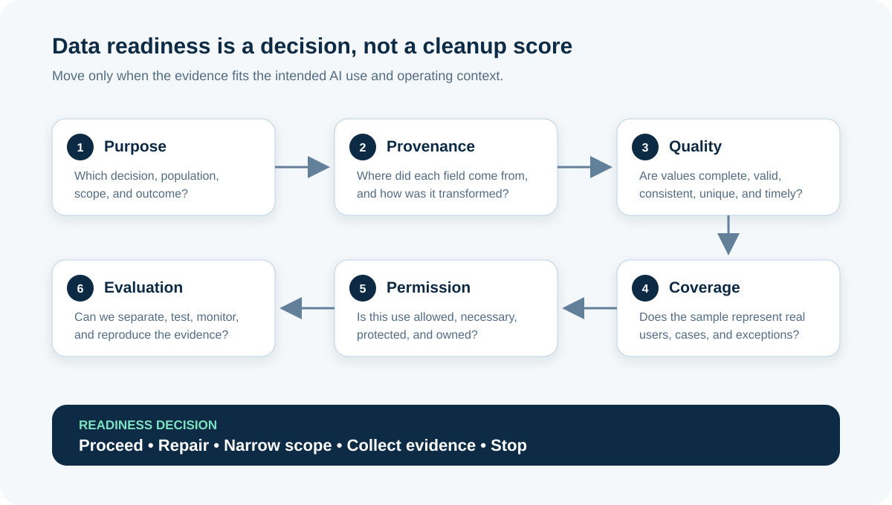

# Data Readiness for AI Projects

**Data readiness** means having evidence that data is suitable, permitted, understandable, and maintainable for a specific AI use. It does not mean that a spreadsheet has no blanks or that the organization owns a large database.

For a Business Analyst (BA), readiness is a business decision. You connect the proposed decision to the data that represents it, reveal how that data was created, define acceptable quality, and make gaps visible before a model turns them into costly behavior.

This tutorial continues the illustrative online-store scenario. The preferred opportunity is an assistant that suggests a return reason and support queue; an employee confirms or corrects every suggestion. The roles, fields, volumes, thresholds, and policies below are teaching assumptions.

## 1. Start with the intended decision, not the available dataset

The store has five years of return tickets, so the project team says, “We have plenty of training data.” That statement proves availability, not fitness.

First write a narrow **data purpose statement**:

> For English-language return requests for one product category, use approved ticket information to suggest one reason and one support queue. A trained employee confirms or corrects the suggestion. The system must not approve refunds, accuse customers of fraud, or send messages automatically.

This statement sets the context against which data must be assessed.

| Purpose question | Illustrative answer | Why the BA records it |
|---|---|---|
| What output is needed? | Suggested `return_reason` and `queue` | Defines the labels and acceptance tests |
| Who uses it? | One trained support team | Defines users and workflow evidence |
| Which cases are in scope? | English text, one product category | Defines population and boundaries |
| Which cases are excluded? | Suspected fraud, accessibility complaints, damaged-data cases | Prevents unsafe generalization |
| What is the human role? | Confirm or correct every suggestion | Defines review data and fallback |
| What outcome matters? | Faster routing without more harmful errors | Connects quality to business value |

**BA action:** keep the purpose statement versioned. If the team later adds languages, products, customer-facing replies, or automated action, reassess readiness; the old answer no longer covers the new use.

## 2. Create a data-needs map

Translate the workflow into the minimum data needed. Separate information available **before** the suggestion from information created **after** the decision.

- A **feature** is an input that may help the system make a suggestion, such as request text or product category.
- A **label** is the expected answer in supervised learning, such as the confirmed return reason.
- **Ground truth** is the best available reference used to judge an output. It is evidence, not automatically perfect truth.
- A **proxy** is a convenient measure standing in for something harder to observe. Proxies need explicit justification.

| Data element | Role | Source | Available at decision time? | Important question |
|---|---|---|---|---|
| `request_text` | Feature | Web form and email intake | Yes | Was unrelated sensitive text entered? |
| `product_category` | Feature | Order catalogue | Yes | Which category version was used? |
| `order_status` | Feature | Order service | Yes | Is the timestamp aligned with ticket creation? |
| `agent_selected_reason` | Candidate label | Support tool | After review | Did the agent correct it or accept a default? |
| `final_queue` | Candidate label | Routing history | After handling | Does it represent the correct queue or merely the first queue? |
| `resolution_time` | Outcome measure | Case system | After closure | Does it include customer waiting time? |

Two common traps appear here:

1. **Target leakage:** a field created after the decision is accidentally used as an input. A model may look excellent in testing but cannot use that clue in real operation.
2. **Weak proxy:** “first queue assigned” is treated as the correct label even when tickets are frequently rerouted.

**BA question:** “Could this value exist, in this form, at the moment the live workflow needs the suggestion?”

## 3. Trace provenance and transformations

**Data provenance** is the recorded history of where data came from and what happened to it. It lets the team interpret values and reproduce an assessment.

Create a simple lineage for every important element:

`Customer form → intake service → case record → agent edits → routing log → analytics extract`

For each step, capture:

| Lineage detail | Return example |
|---|---|
| Origin and owner | Customer request; Digital Support owns intake definitions |
| Collection purpose | Open and route a return-support case |
| Time and version | Created timestamp, policy version, form version |
| Transformation | HTML removed; category codes mapped; duplicate events collapsed |
| Human intervention | Agent may replace the default reason and add notes |
| Known limitation | Email tickets lack two structured form fields |
| Refresh and retention | Daily extract; retention decision is still open |

Do not accept “from the data warehouse” as provenance. The warehouse is a location; it does not explain the original collection, meanings, corrections, or missing population.

## 4. Profile quality with rules tied to the use case

Data quality is **fit for purpose**. A generic “95% quality score” hides which defect matters and where it occurs. Define rules at field, record, and relationship level.

| Dimension | BA question | Example rule | Example evidence |
|---|---|---|---|
| **Completeness** | Are required values present? | `request_text` is present for every included ticket | Missing rate by intake channel |
| **Validity** | Does the value follow the allowed format or domain? | `queue` belongs to the approved queue list for that date | Invalid values and rule version |
| **Consistency** | Do systems and fields agree? | Product category maps consistently across order and case systems | Mismatch rate by source |
| **Uniqueness** | Are events or cases duplicated? | One canonical ticket ID per request | Duplicate clusters and cause |
| **Timeliness** | Is the value current enough for this decision? | Policy and queue mappings match the ticket date | Age and stale-mapping rate |
| **Accuracy** | Does the value reflect the real event? | Confirmed reason agrees with reviewed case evidence | Reviewed sample and reviewer guidance |

Percentages need denominators and segments. “Only 4% missing” may hide that 45% of email tickets are missing the same field. Record the period, query, population, exclusions, owner, and calculation so another person can reproduce the result.

### A small profile before a large build

For an early assessment, the BA can coordinate a representative sample review rather than request a complete data-cleaning programme immediately. The illustrative findings are:

| Finding | Status | Meaning for the opportunity |
|---|---|---|
| Request text exists for 98% of scoped web tickets | Green | Enough to continue investigating web tickets |
| Email text contains signatures and order details in inconsistent formats | Amber | Create filtering rules or exclude email from the first pilot |
| 17% of tickets were rerouted after the first queue assignment | Red for using first queue as label | Define a verified final-routing label |
| Queue codes changed after a reorganization | Amber | Map codes by effective date; do not merge blindly |

These numbers are illustrative. In a real assessment, link each number to its query or review record.

## 5. Test coverage and representativeness

A dataset can be large and still omit important conditions. **Representativeness** asks whether the data used for development and evaluation resembles the people, cases, environments, and periods where the system will operate.

Compare the intended population with the available sample across relevant slices:

- intake channel and language;
- product category and return reason;
- ordinary and rare exception paths;
- time periods before and after policy or process changes;
- user groups that may experience different error consequences;
- short, long, ambiguous, and noisy requests.

| Slice | Share in live scope | Share in proposed sample | Question |
|---|---:|---:|---|
| Web form | 70% | 94% | Will email performance be hidden? |
| Email | 30% | 6% | Exclude, collect, or sample more? |
| “Wrong item” cases | 8% | 2% | Are labels missing or is extraction biased? |
| Policy-change month | 9% | 23% | Will temporary behavior dominate? |

Equal percentages are not automatically the goal. The team needs enough relevant evidence to evaluate expected use and material harms. Where groups are small or errors have serious consequences, use domain expertise and targeted review instead of relying only on an overall average.

## 6. Validate labels and annotation rules

Historical actions are not automatically correct labels. They may preserve rushed work, old policy, defaults, inconsistent interpretation, or unequal treatment.

Create a **label specification**:

| Label field | Definition |
|---|---|
| Label name | `verified_return_reason` |
| Allowed values | Current controlled reason list plus `unclear` |
| Evidence used | Request, order facts available at intake, and approved policy |
| Who assigns it? | Trained reviewers who did not handle the original case when practical |
| Ambiguity rule | Use `unclear`; do not guess from customer identity or outcome |
| Escalation | Domain owner resolves repeated disagreements |
| Version | Label guide version and effective date stored with the record |

Ask two reviewers to label an overlapping sample. Investigate disagreement by reason and case type. Agreement is not proof of fairness or correctness, but disagreement can expose unclear definitions, missing evidence, or policy ambiguity.

**Common mistake:** deleting disputed cases to make the dataset look clean. Those cases may be exactly where the real workflow needs clarification or a human fallback.

## 7. Confirm permission, necessity, and protection

“We already have the data” does not mean “we may use it for this purpose.” Bring the data owner, privacy, security, legal, records, and relevant domain stakeholders into the review according to the organization’s obligations.

For each source, record:

- the approved purpose and proposed new use;
- the owner and access decision;
- whether personal, confidential, licensed, or third-party information exists;
- the minimum fields needed and fields that should be removed or transformed;
- access controls, storage location, transfer, retention, deletion, and incident handling;
- restrictions on vendors, model providers, reuse, or cross-border processing;
- how affected people can seek help or correction where appropriate.

Do not turn this into a legal conclusion by the BA. Your deliverable is a traceable set of questions, evidence, owners, approvals, restrictions, and unresolved decisions.

In the example, customer name and full address do not help suggest a return reason. Removing them reduces exposure. Free text still needs review because customers may type sensitive information that the form did not request.

## 8. Design evaluation data before development

The team needs evidence that is separate from the data used to fit or tune a model.

- **Training data** helps a model learn patterns.
- **Validation data** helps compare and tune candidate approaches.
- **Test data** is held back for a final, less-biased evaluation.
- **Pilot data** shows behavior in the real workflow under bounded conditions.

Records from the same customer conversation, duplicate ticket, or linked return should not leak across these sets. If policy and behavior change over time, a time-based split may be more realistic than a random split. The technical team designs the method; the BA validates that it matches the business timeline and operating conditions.

Define evaluation slices and fallback cases before results are visible. Otherwise, the team may keep changing the test until the preferred solution looks good.

## 9. Plan for change after launch

Ready today does not mean ready forever. New products, seasonal demand, policy revisions, channels, customer language, or support practices can change input patterns and label meanings. This is often called **data drift** or distribution change.

Create monitoring requirements:

| Monitor | Example trigger | Owner response |
|---|---|---|
| Missing and invalid values | Exceeds the approved limit for two daily loads | Data owner investigates pipeline and pauses affected scope |
| Slice coverage | A new product category exceeds the pilot boundary | Product owner decides whether to assess and add it |
| Label corrections | Override rate rises materially for one reason | Domain owner reviews guide, workflow, and model evidence |
| Source or policy version | Queue policy changes | Re-map labels and re-evaluate before continued use |
| Sensitive-data incidents | Prohibited field or text pattern detected | Follow incident process and stop affected processing |

Avoid universal numbers in a template. Thresholds must reflect the use, consequence of error, baseline, and organizational risk tolerance.

## 10. Completed Data Readiness Assessment

| Area | Evidence from the return-routing example | Status | Action and owner |
|---|---|---|---|
| Purpose and scope | English web tickets, one category, suggestion only | Green | Product owner controls scope changes |
| Provenance | Main lineage mapped; email transformations incomplete | Amber | Data steward documents email path |
| Input quality | Web text mostly present; channel differences exist | Amber | Analyst profiles by channel and month |
| Label quality | First queue is unreliable; verified final reason not available | Red | Domain lead creates label guide and reviews sample |
| Coverage | Web is overrepresented; rare cases underrepresented | Amber | Narrow pilot and collect targeted examples |
| Permission and minimization | Approval open; name and address unnecessary | Red gate | Privacy/data owners decide and remove fields |
| Evaluation | Candidate split proposed; linked-ticket leakage not tested | Amber | Data scientist tests grouping and time split |
| Monitoring | Draft measures exist; triggers and owners incomplete | Amber | Operations owner agrees thresholds and response |
| Decision | Not ready to build the full solution | **Repair and narrow** | Create verified labels, confirm permission, use web-only scope, then review again |

A red status is not a failed project. It prevents false confidence and tells the team what evidence is worth creating next.

## 11. Turn gaps into requirements and backlog items

“Clean the data” is not testable. Convert each gap into an owned outcome:

> **Data quality requirement:** For the approved web-ticket pilot population, every included record must contain a non-empty request text, a valid product category for the ticket date, and a reviewer-assigned reason using label guide v1. Records failing a rule are excluded and reported by rule and source.

Example remediation backlog:

| Item | Acceptance evidence | Owner | Decision unlocked |
|---|---|---|---|
| Publish label guide v1 | Approved definitions, examples, ambiguity route | Domain lead | Can reviewers create usable labels? |
| Review a stratified sample | Review log plus disagreement analysis | Domain reviewers | Are labels reliable enough to evaluate? |
| Confirm proposed data use | Recorded approval, restrictions, retention | Data and privacy owners | May the pilot process this data? |
| Test split integrity | No linked case crosses sets; period recorded | Data scientist | Is evaluation evidence defensible? |
| Reassess readiness | Updated assessment and go/no-go record | Product owner | Build, collect more, narrow, or stop? |

## 12. Common data-readiness mistakes

- **Counting rows instead of testing fitness:** volume does not prove relevance, diversity, or correctness.
- **Cleaning before defining the use:** the team may perfect fields the decision does not need.
- **Treating historical decisions as truth:** old behavior may contain errors and obsolete rules.
- **Using one overall quality percentage:** averages hide source, time, and population failures.
- **Removing difficult cases silently:** the evaluation stops representing the real workflow.
- **Ignoring unavailable-at-decision-time fields:** leakage creates unrealistic test performance.
- **Buying data without checking rights and lineage:** access does not prove permitted reuse or trustworthy meaning.
- **Assuming a vendor owns readiness:** the organization still owns its purpose, constraints, impacts, and decision.

## 13. Reusable Data Readiness Assessment

| Area | Evidence to collect | Status | Gap, action, owner, due date |
|---|---|---|---|
| Intended decision, users, and outcome | | | |
| In-scope and excluded population | | | |
| Required features, labels, and measures | | | |
| Source, provenance, and transformations | | | |
| Completeness, validity, consistency, uniqueness, timeliness, accuracy | | | |
| Coverage, exceptions, and affected groups | | | |
| Label definition and review process | | | |
| Permission, minimization, security, and retention | | | |
| Training, validation, test, and pilot separation | | | |
| Monitoring, thresholds, fallback, and change control | | | |
| Final recommendation and decision owner | | | |

Use **green** only when evidence is sufficient for the current stage, **amber** when a named investigation or control can close uncertainty, and **red** when the current plan must not proceed. Record the reason; color alone is not evidence.

## 14. Practice exercise

A bank is considering an AI assistant that suggests a category for written card-transaction enquiries. The available dataset contains case text, first category, final category, agent notes, customer segment, and resolution outcome.

1. Write a narrow data purpose statement and three explicit exclusions.
2. Classify each field as possible feature, label, outcome measure, sensitive field, or unavailable-at-decision-time risk.
3. Draft five measurable quality rules with populations and denominators.
4. Name four slices that need coverage checks and explain why.
5. Identify one possible leakage path and one weak proxy.
6. Recommend proceed, repair, narrow, collect, or stop—and name the evidence that would change your recommendation.

Do not invent legal permissions, fraud rules, accuracy targets, or customer-group impacts. Record them as decisions or evidence needs for the appropriate owners.

## Further reading

- [NIST AI RMF Core: Map and Measure](https://airc.nist.gov/airmf-resources/airmf/5-sec-core/)
- [NIST AI RMF Playbook: Govern](https://airc.nist.gov/airmf-resources/playbook/govern/)
- [NIST AI RMF Playbook: Measure](https://airc.nist.gov/airmf-resources/playbook/measure/)
- [Google Machine Learning Crash Course: Data characteristics](https://developers.google.com/machine-learning/crash-course/overfitting/data-characteristics)
- [Google ML Universal Guides: Data quality and interpretation](https://developers.google.com/machine-learning/guides/data-traps/quality)
- [IIBA: Ready to Get Data-Smart?](https://www.iiba.org/business-analysis-blogs/ready-to-get-data-smart-here-are-6-ways-to-use-data-effectively/)
