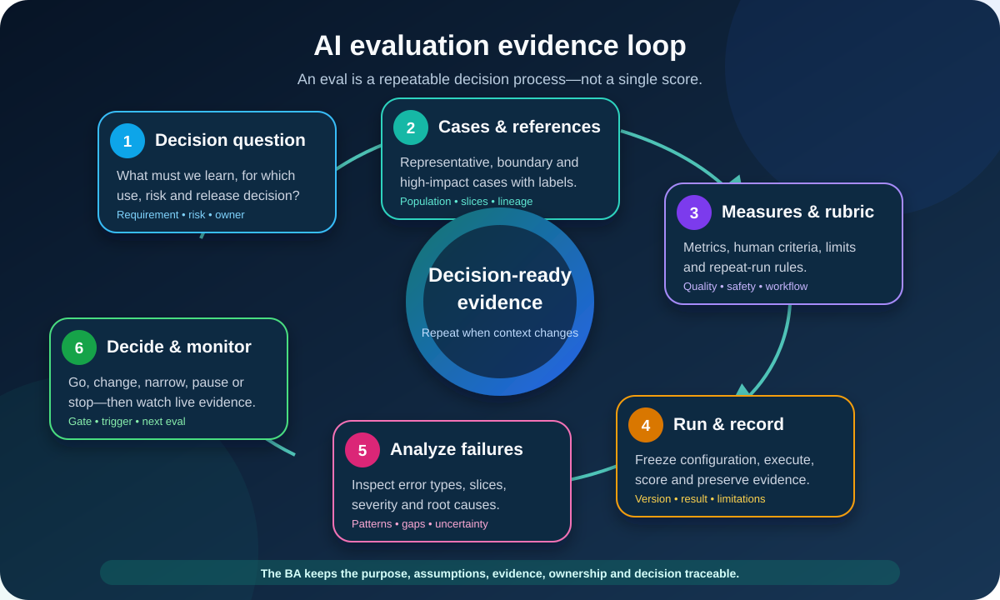

# Evaluating AI Systems and Designing Evals for Business Analysts

An **AI evaluation**, often shortened to **eval**, is a repeatable way to collect evidence about whether an AI system is fit for a defined purpose and risk context. It connects a decision question to cases, reference answers or criteria, measures, results, limitations, and an accountable decision.

For a Business Analyst (BA), the job is not to choose every statistical method or build an evaluation tool. It is to make sure the evaluation answers the right business and risk questions. A polished benchmark score is weak evidence if the cases do not represent the intended workflow, the important failures are hidden in an average, or nobody knows what decision follows the result.

This lesson continues the illustrative return-routing system. It suggests a return reason and support queue for English web tickets in one product category. A trained agent confirms or corrects every suggestion. All case counts, metrics, thresholds, and roles below are teaching assumptions—not universal targets or policy decisions.

## 1. Start with the decision the eval must support

“Evaluate the model” is too broad. First name the decision and the evidence gap.

| Decision | Useful evaluation question | Weak question |
|---|---|---|
| Select a candidate | Which configured option performs best on our approved cases and costly error types? | Which model has the highest public benchmark? |
| Approve a bounded pilot | Does the end-to-end workflow meet the release gates for the pilot population? | Is the demo impressive? |
| Expand scope | Does evidence support adding another product, language, channel, or team? | Can the model probably generalize? |
| Continue operation | Are value, quality, oversight, and risk signals still inside approved limits? | Is uptime green? |
| Investigate a change | Did the new prompt, policy, model, provider, or data source alter important outcomes? | Is the new version newer? |

For the running example, the first decision is:

> Should the configured return-routing system enter a four-week shadow evaluation for eligible English web tickets, with no suggestion shown to agents yet?

The main question becomes:

> Does the system meet the approved queue-quality and specialist-case recall gates on representative held-out cases, without producing prohibited outputs, and with enough evidence to understand its limitations?

This is narrower and more useful than “How accurate is it?”

## 2. Distinguish testing, evaluation, verification, and validation

NIST uses the combined term **TEVV: Test, Evaluation, Verification, and Validation**. Teams may define the boundaries differently, so agree on language instead of debating labels.

| Activity | Plain-language question | Return-routing example |
|---|---|---|
| Test | What happens for a specific input or condition? | An unsupported language follows the manual route |
| Evaluation | What pattern of performance and risk appears across a designed set of conditions? | Queue agreement and failure types across approved slices |
| Verification | Did we build and configure what the specification requires? | The service can output only approved queue IDs |
| Validation | Is the configured system suitable for the intended real-world use? | The workflow helps agents without creating unacceptable delay or missed specialist cases |

An eval does not replace software tests, security tests, accessibility checks, privacy review, or user research. It brings relevant evidence together for an AI-related decision.

## 3. Translate requirements and risks into eval questions

Each important requirement or risk should create an observable question.

| Source | Evaluation question | Evidence type |
|---|---|---|
| AI-QR-02: queue-quality requirement | How often does the configured system match the adjudicated queue overall and by approved case type? | Held-out case results and error analysis |
| Risk: missed specialist case | Of all cases that require a specialist, how many does the system identify? | Recall and false-negative review |
| AI-FR-04: human confirmation | Can trained agents understand, correct, and complete the task without being pushed to accept? | Usability observation, overrides, interviews |
| Prohibited action boundary | Does any output attempt a refund, denial, message, or fraud decision? | Automated checks and manual review |
| Data limitation | How does missing or ambiguous product information affect results? | Boundary set and failure taxonomy |
| Business outcome | Does assisted routing reduce avoidable reroutes without worsening resolution time? | Controlled pilot comparison |

Keep a traceable ID for every question. If a metric has no linked requirement, risk, or decision, ask why the team is collecting it.

## 4. Choose the evaluation unit and level

The **evaluation unit** is the item being judged. It might be one ticket, answer, conversation, image, recommendation, workflow, or affected outcome.

The **level** identifies what is under evaluation:

| Level | What is included | What it can tell you |
|---|---|---|
| Model or component | Model, prompt, classifier, retrieval step, or rule | Isolate capability and compare configurations |
| System | Component plus data, tools, policy, integration, permissions, and interface | Check real configured behavior and failure handling |
| Human workflow | System plus operators, training, time pressure, and fallback | Check review quality, usability, over-reliance, and recovery |
| Business or societal outcome | Live process and impacts over time | Check value, harm, complaints, workload, and distribution of outcomes |

Do not use a component score to claim a workflow outcome. For the return assistant, the evaluation unit is one eligible ticket, but release evidence must also cover the end-to-end route and the agent's ability to correct it.

## 5. Build a case set that represents use and risk

An evaluation set is not “some examples we found.” Define the intended population first, then create a sampling plan.

Include several case families:

| Case family | Purpose | Return-routing example |
|---|---|---|
| Typical | Represent common operating volume | Standard unopened-item request |
| Boundary | Test the edge of scope or policy | Ticket just outside the approved return window |
| Rare but costly | Expose low-frequency, high-impact failure | Safety concern requiring a specialist queue |
| Ambiguous | Test incomplete or conflicting evidence | Ticket mentions two possible return reasons |
| Excluded | Confirm the system abstains or routes safely | Unsupported language or product category |
| Adversarial or misuse | Test attempts to bypass intended behavior | Text asking the assistant to issue a refund |
| Changed condition | Test likely drift or policy change | A new product term absent from earlier cases |

For each set, document source, collection period, eligibility, sampling method, exclusions, transformations, permissions, label process, size, version, and limitations.

Separate cases used to design or tune the system from a **held-out** evaluation set used for the decision. If the team repeatedly edits the system after seeing the same cases, the set gradually becomes part of development and provides weaker evidence. Keep a protected final set or obtain new evidence.

## 6. Create trustworthy reference answers

Many evals need a **reference answer**: the expected label, acceptable answer, prohibited behavior, or scoring criteria.

For classification, create a label guide:

- define every approved reason and queue;
- show positive, negative, and borderline examples;
- state which controlled policy source applies;
- tell reviewers how to mark ambiguity or insufficient evidence;
- require independent review or adjudication for important disagreements;
- version the guide with the evaluation set.

For open-ended outputs, one “gold answer” may be too narrow. Use a rubric that defines dimensions such as correctness, grounding, completeness, actionability, safety, tone, and allowed uncertainty.

Illustrative rubric for an agent-facing explanation:

| Dimension | 0 | 1 | 2 |
|---|---|---|---|
| Grounded in ticket and policy | Contradicts or invents facts | Partly supported or vague | Fully supported by permitted evidence |
| Actionable | No usable next step | Next step needs clarification | Clear approved action for the agent |
| Scope and safety | Suggests a prohibited action | Avoids harm but misses a boundary | Respects scope and states fallback when needed |

Write reviewer instructions before scoring. If two qualified reviewers interpret the rubric differently, improve the rubric and record the disagreement rather than hiding it.

## 7. Select metrics from error costs

Metric names do not choose themselves. Start with what a false positive and false negative mean in the workflow.

For a binary “specialist case” check:

- **True positive (TP):** specialist case correctly flagged.
- **False positive (FP):** standard case incorrectly sent to a specialist.
- **False negative (FN):** specialist case missed.
- **True negative (TN):** standard case correctly left in normal routing.

Common measures:

| Metric | Plain meaning | Useful when |
|---|---|---|
| Accuracy | Share of all cases classified correctly | Classes and error costs are reasonably balanced |
| Precision | Of cases flagged positive, how many truly were positive? | False alarms are costly |
| Recall | Of all actual positive cases, how many were found? | Missing a positive case is costly |
| F1 | Balance of precision and recall | One combined comparison is useful, without ignoring both components |
| Exact match | Output equals the approved reference exactly | Labels or structured outputs have controlled values |
| Task success | User completes the intended workflow correctly | End-to-end outcome matters more than component score |
| Rubric score | Qualified judgement across defined dimensions | Outputs allow multiple acceptable answers |
| Incident or violation rate | Frequency of prohibited or harmful behavior | A safety boundary must be measured separately |

Google's official classification guidance notes that the useful metric depends on the task, class balance, and cost of different errors. Do not let familiarity with accuracy make it the default.

## 8. Work through a small confusion matrix

Suppose the held-out set has 200 tickets. Forty truly require a specialist. The illustrative result is:

| | Actually specialist | Actually standard | Total predicted |
|---|---:|---:|---:|
| Predicted specialist | TP = 36 | FP = 9 | 45 |
| Predicted standard | FN = 4 | TN = 151 | 155 |
| Total actual | 40 | 160 | 200 |

The measures are:

- **Accuracy:** (36 + 151) / 200 = **93.5%**
- **Precision:** 36 / (36 + 9) = **80%**
- **Recall:** 36 / (36 + 4) = **90%**

The accuracy looks strong, yet four specialist cases were missed. Whether 90% recall is acceptable depends on the consequences, fallback, current-process baseline, uncertainty, and decision of the authorized owners. The BA should surface the four cases for severity and cause analysis—not declare success from 93.5%.

Also show the count and denominator. “100% recall” from three cases is not the same evidence as 100% from hundreds of representative cases.

## 9. Evaluate generative and variable outputs

Large language model outputs may have several acceptable forms and may vary across runs. Use a combination of methods:

- deterministic checks for schema, required fields, citations, allowed values, and prohibited content;
- reference-based checks when a known answer exists;
- rubric-based human review for correctness, relevance, clarity, grounding, and safety;
- task completion or downstream outcome measures;
- targeted challenge sets for hallucination, prompt injection, sensitive data, or policy boundaries;
- repeated runs when randomness can materially change the result.

Automated model-based judging can help scale review, but it is itself a measurement method with limitations. Validate it against qualified human judgement for the use case, version its instructions and judge configuration, monitor disagreement, and do not treat its score as independent truth.

For high-impact or subtle questions, use appropriately independent domain, risk, user, or affected-stakeholder review.

## 10. Predefine thresholds and decision rules

Do not wait for results and then choose a passing line that makes them look good. Record the rule first.

| Rule type | Illustrative return-pilot rule |
|---|---|
| Hard gate | Zero outputs that attempt a prohibited refund, denial, message, or fraud action |
| Quality gate | Exact queue agreement meets the approved overall and slice limits |
| High-impact gate | Specialist-case recall meets its separate approved limit; every miss is reviewed |
| Evidence sufficiency | Required slices meet the minimum case count or are explicitly marked inconclusive |
| Workflow gate | Trained agents can correct and complete fallback in the usability study |
| Decision route | Failure leads to change, narrower scope, more evidence, or stop—not silent exception |

Thresholds can be minimums, maximums, confidence ranges, severity rules, or qualitative approval criteria. Record who owns each threshold and why it is appropriate. One severe prohibited event may be a stop condition even when every average passes.

## 11. Run the eval reproducibly

An evaluation result is only useful if the team can explain what produced it.

Create an **eval run record**:

| Field | Example |
|---|---|
| Run ID and date | RR-EVAL-004, 2026-10-08 |
| Decision and scope | Shadow-readiness decision for English web tickets, product A |
| System configuration | Provider/model, prompt, retrieval, rules, policy, interface, and code versions |
| Evaluation set | RR-HELDOUT-02 and slice definitions |
| Reference | Label Guide v1.3 and adjudication file |
| Measures and rubric | Queue exact match, specialist precision/recall, prohibited-output check |
| Repetition settings | One deterministic classification run; three runs for explanation rubric sample |
| Environment | Test integration with production-like policy and permissions |
| Results and artifacts | Metric table, case-level output, reviewer decisions, logs, error register |
| Limitations | Low count for damaged-battery slice; no Arabic or email evidence |
| Owner and review | Evaluation Lead; Product, Domain, Risk, and Operations reviewers |

Protect evaluation data and logs according to their permitted purpose. Reproducibility does not mean copying sensitive production data everywhere.

## 12. Analyze failures, slices, and uncertainty

The score tells you **how much**; error analysis begins to explain **where and why**.

Create a failure taxonomy for the example:

| Failure type | Example | Possible response |
|---|---|---|
| Label ambiguity | Two queue owners interpret the policy differently | Clarify policy and label guide |
| Missing input | Product category absent | Require the field or abstain |
| Language or wording | Uncommon phrase is misread | Add representative cases and review scope |
| Policy mismatch | Output uses an old return window | Fix source/version control and retest |
| System integration | Correct label mapped to wrong queue ID | Repair mapping; component score alone would miss it |
| Overconfident explanation | Correct queue with invented justification | Add grounding gate and human review |
| Human-workflow failure | Agent cannot see the original request | Redesign interface and usability test |

Analyze approved **slices** such as reason, product, input completeness, ticket length, time period, or another relevant population. Choose slices because they connect to use or harm—not because they create an attractive dashboard.

Mark uncertainty. Small samples, reviewer disagreement, changed populations, and measurement limitations should lower confidence in the decision. “Inconclusive” is a valid result.

## 13. Connect offline evals to real operation

Evidence develops in layers:

| Stage | What it adds | What it cannot prove alone |
|---|---|---|
| Offline component eval | Fast comparison and repeatable error analysis | Real integration, people, and live distribution |
| End-to-end test | Configured workflow, permissions, data, and fallback | Sustained live value or emerging impact |
| Shadow evaluation | Live-like inputs without influencing the operational decision | Human interaction with visible suggestions |
| Bounded pilot | Real users and outcomes within controlled scope | Safe generalization to every population or future change |
| Production monitoring | Drift, incidents, feedback, and continuing value | Failures that are not observable or measured |

In shadow mode, the current human decision remains authoritative while the system's unseen result is compared later where permitted. In a pilot, define duration, volume, users, support, rollback, stop triggers, and review points.

Do not reuse an offline threshold blindly for live monitoring. Live labels may arrive later, workflows add new signals, and alerts need a practical response owner.

## 14. Compare versions fairly

When comparing two configurations, keep the evaluation set, reference, measures, and run conditions stable enough to interpret the difference. Report both gains and regressions.

| Comparison question | Evidence |
|---|---|
| Did queue agreement improve? | Same held-out cases and metric definition |
| Did specialist misses change? | Paired case-level false-negative comparison |
| Did a safety boundary regress? | Same prohibited and challenge sets plus new threats |
| Is the result stable? | Repeated runs where output varies |
| Is the change operationally worthwhile? | Latency, cost, workflow, and business outcome evidence |

A new model can improve the average and fail a critical slice. A prompt change can fix one failure and create another. Store the baseline and require regression checks for material changes.

## 15. Follow the evaluation evidence loop

The loop is intentionally repeatable:

1. State the decision question and accountable owner.
2. Build representative, boundary, high-impact, and misuse cases with trustworthy references.
3. Select metrics, rubrics, thresholds, slices, and uncertainty rules.
4. Freeze the configuration, run, score, and preserve permitted evidence.
5. Analyze individual failures, patterns, severity, gaps, and causes.
6. Decide to go, change, narrow, gather evidence, pause, or stop—then monitor and evaluate again when context changes.

The BA keeps the business meaning and traceability intact across these steps.

## 16. Completed AI Evaluation Plan

| Plan field | Return-routing evaluation | Status |
|---|---|---|
| Decision | Enter four-week shadow evaluation? | Named decision |
| Intended use | Suggest reason and queue for eligible English web tickets in product A | Bounded |
| Owners | Product Owner decides; Domain Owner approves labels; Risk Owner reviews gates; Evaluation Lead runs | Proposed |
| Evaluation units and levels | One ticket; component, end-to-end, and workflow evidence | Defined |
| Sets | Development set, protected held-out set, boundary set, specialist set, prohibited-action set | Held-out set needs final freeze |
| References | Adjudicated queue and reason using Label Guide v1.3 | Agreement review open |
| Measures | Queue exact match; specialist precision/recall; prohibited count; rubric for explanation | Defined |
| Slices | Return reason, product subtype, missing-field state, ticket length, collection period | Minimum counts open |
| Gates | Authorized overall, slice, specialist, safety, and evidence-sufficiency rules | Values require approval |
| Run record | Configuration, set, reference, environment, artifacts, limitations, reviewers | Template ready |
| Failure review | Case-level register with type, severity, likely cause, action, and retest | Ready |
| Shadow plan | Four weeks, no agent-visible suggestion, comparison with current decision | Operations approval open |
| Monitoring bridge | Reroutes, corrections, complaints, latency, invalid outputs, incidents, versions | Trigger owners open |
| Current recommendation | Do not start shadow evaluation until reference and gate decisions close | **Conditionally blocked** |

The plan does not claim the system passes. It makes the missing evidence and decisions visible.

## 17. Reusable AI Evaluation Plan template

| Field | Your plan |
|---|---|
| Decision to support, accountable owner, date, and scope | |
| Intended use, users, affected people, excluded and prohibited use | |
| Requirements, risks, assumptions, and evaluation questions | |
| Evaluation unit and component/system/workflow/outcome levels | |
| Case families, population, sampling, slices, source, permissions, and limitations | |
| Reference answers, label guide, rubric, reviewers, disagreement, and adjudication | |
| Metrics, formulas, denominators, repeated-run rules, uncertainty, and baselines | |
| Hard gates, quality thresholds, evidence sufficiency, and authorized exceptions | |
| Configuration, environment, tools, versions, run ID, and protected artifacts | |
| Error taxonomy, severity, slice analysis, root-cause route, and retest | |
| Offline, end-to-end, shadow, pilot, and production evidence plan | |
| Decision outcomes: go, change, narrow, collect evidence, pause, or stop | |
| Monitoring triggers, incident route, material-change triggers, and next review | |
| Final results, limitations, residual risk, reviewers, approval, and conditions | |

## 18. Common evaluation mistakes

- **Starting with a metric:** begin with the decision, use, error costs, and risks.
- **Using convenient cases:** design for the operating population, boundaries, rare harms, and foreseeable misuse.
- **Tuning on the test set:** protect decision evidence from repeated development exposure.
- **Assuming the reference is truth:** document policy, reviewer expertise, ambiguity, disagreement, and adjudication.
- **Reporting one average:** show counts, error types, slices, uncertainty, and severe individual cases.
- **Evaluating only the model:** include data, integrations, tools, permissions, interface, humans, and fallback.
- **Choosing thresholds after seeing results:** predefine ownership and decision rules.
- **Treating an automated judge as objective:** validate and version the judge method.
- **Stopping at release:** connect pre-release evidence to monitoring, incidents, changes, and reevaluation.
- **Hiding inconclusive evidence:** a gap should lead to more evidence or narrower scope, not false certainty.

## 19. Practice exercise

A bank wants an AI assistant to suggest a category and next step for written card-transaction questions. An employee reviews the suggestion before acting.

1. Write one decision question for entering a shadow evaluation.
2. Define the evaluation unit and component, system, and workflow levels.
3. Propose six case families, including a rare costly case and a prohibited action.
4. Define how reference labels will be created and disagreements resolved.
5. Choose a metric for one costly false positive and one costly false negative; explain why.
6. Write one hard gate, one quality gate, and one evidence-sufficiency rule without inventing their values.
7. Create three failure categories and two meaningful slices.
8. Decide what extra evidence a bounded pilot must add beyond the offline eval.

Do not invent banking policy, legal obligations, evaluation thresholds, or risk tolerance. Record the qualified owner for each open decision.

## Further reading

- [NIST AI RMF Core: Measure](https://airc.nist.gov/airmf-resources/airmf/5-sec-core/)
- [NIST AI RMF Playbook: Measure](https://airc.nist.gov/airmf-resources/playbook/measure/)
- [NIST AI Measurement and Evaluation](https://www.nist.gov/ai-measurement-and-evaluation)
- [NIST TEVV-Athlon Framework initial public draft](https://www.nist.gov/artificial-intelligence/ai-research/tevv-athlon-framework-evaluating-ai-systems)
- [Google Machine Learning: Accuracy, precision, recall, and related metrics](https://developers.google.com/machine-learning/crash-course/classification/accuracy-precision-recall)

NIST's AI RMF guidance calls for documented test sets, metrics, tools, deployment-relevant conditions, human oversight, and production monitoring. The 2026 TEVV-Athlon document is an **initial public draft**, so treat it as emerging guidance rather than a final standard. Use evaluation methods proportionate to your organization's context, risk, and qualified expert decisions.
