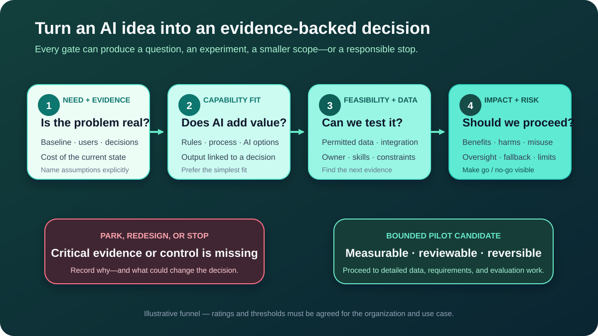

# Finding and Prioritizing AI Opportunities

An **AI opportunity** is a business problem or outcome where an AI capability might contribute useful value. It is not a tool request, a promised saving, or an approved solution.

For a Business Analyst (BA), the job is to turn enthusiasm into a decision supported by evidence. That means comparing alternatives, exposing uncertainty, checking who may benefit or be harmed, and recommending the smallest responsible next step.

This tutorial continues the illustrative online-store scenario. The store wants to improve product-return handling. All roles, ratings, and policies below are teaching assumptions, not facts about a real organization.

## 1. Rewrite the AI request as a need

A sponsor says: “We need an AI agent to automate returns.” If the team accepts that wording, it has selected a technology and solution shape before confirming the problem.

Separate four things:

| Element | Question | Illustrative return example |
|---|---|---|
| **Need** | What problem or opportunity exists? | Support spends avoidable time interpreting and routing return requests |
| **Outcome** | What should improve for whom? | Faster routing while preserving correct handling and customer access to help |
| **Capability option** | What kind of assistance might help? | Classify a return reason, draft a response, or propose a next step |
| **Solution option** | How could the capability be delivered? | Process change, fixed rules, configured product, custom model, or combined workflow |

A better initial statement is:

> We need to reduce avoidable return-triage effort while keeping uncertain and high-impact cases visible to authorized staff. We will compare process, rules, and AI-assisted options.

This keeps the need stable while allowing the solution to change as evidence improves.

**BA question:** What would still be worth improving if AI were unavailable?

## 2. Find the decision and measure the current state

AI produces an output, but value appears only when that output improves a decision or task. Map the current workflow before proposing the future one.

| Current step | Decision or task | Evidence to collect |
|---|---|---|
| Customer submits a request | Is the message complete enough to review? | Missing-information rate and common gaps |
| Support reads the message | Which return reason applies? | Handling time, correction patterns, and category definitions |
| Support checks order and policy | Is the request eligible, exceptional, or unclear? | Rule sources, exceptions, and escalation volume |
| Support routes the case | Which team or queue owns the next action? | Reroute rate, wait time, and queue ownership |
| Authorized role decides | Approve, reject, investigate, or ask for evidence? | Decision rights, error consequences, and complaint patterns |

Do not invent a business case from guesses. Label each item:

- **Confirmed fact:** supported by a reliable source or observation.
- **Estimate:** calculated using a stated method and assumptions.
- **Assumption:** plausible but not yet supported.
- **Open question:** evidence or a decision is still needed.

For example, “Support spends 40% of its time on routing” is not a fact until the team defines the activity, measurement period, sample, and source. A short time study may be the next useful step—not an AI prototype.

## 3. Create options before scoring them

Avoid comparing one detailed AI proposal with “do nothing.” Generate options at different levels of complexity.

| Option | What changes? | What must be true? |
|---|---|---|
| **Improve the form and guidance** | Ask structured questions and show clearer policy guidance | The main problem is missing or confusing information |
| **Apply fixed rules** | Route cases from confirmed order status and policy rules | Rules are stable, explicit, and cover enough cases |
| **AI-assisted classification** | Propose a reason and queue while Support confirms or corrects it | Representative labelled cases exist and manual fallback is workable |
| **Generative draft assistance** | Draft a response from approved case facts and policy sources | Sources can be retrieved safely and claims can be reviewed |
| **Autonomous action** | Execute steps such as creating or updating a case | Permissions, failure handling, oversight, and impact justify the autonomy |

Options can be combined. A structured form may remove avoidable ambiguity before a model sees the request. Fixed rules may enforce policy boundaries while AI handles variable language.

**Common mistake:** Treating the most technically ambitious option as the most valuable. Complexity creates cost and risk; it does not prove benefit.

## 4. Move each option through four evidence gates

Use the gates to decide what evidence is needed next. They are not a one-time checklist: revisit them when the context, data, policy, or system changes.

### Gate 1: Need and evidence

Confirm the current problem, affected users, baseline, decisions, constraints, and desired outcome. If the need is weak or unmeasured, investigate before selecting technology.

For the store, useful evidence could include sampled handling time, reroutes, missing-information causes, complaints, and interviews with customers and Support staff.

### Gate 2: Capability fit

Ask whether variation and uncertainty make an AI capability useful—or whether simpler rules, interface changes, training, or process repair would solve the need better.

The classifier may fit variable customer language. It should not replace a stable rule such as “an authorized role approves every refund above the confirmed limit.”

### Gate 3: Feasibility and data

Identify permitted data, quality, representativeness, integration, ownership, skills, cost, time, and evaluation ability. “The data exists” is not enough; it must be understandable, usable, and allowed for the proposed purpose.

If historical return labels are inconsistent, a small label review may be the next experiment. It is better to discover that before building a classifier.

### Gate 4: Impact and risk

Map likely benefits and harms for people, groups, the organization, and connected processes. Include foreseeable misuse and use beyond the intended scope. Define oversight, fallback, complaint, and stop conditions.

An autonomous refund action has a different impact from a suggested internal queue. The same technical accuracy does not make those opportunities equally safe or valuable.

NIST's AI Risk Management Framework uses its **Map** function to establish purpose, context, affected people, benefits, harms, scope, and initial go/no-go knowledge. That is close to the BA work needed before committing to an AI initiative.

## 5. Compare opportunities without hiding uncertainty

A single total score can create false confidence. Use a small evidence matrix and record the reason behind every rating.

This example uses:

- **Green:** sufficient evidence to continue at this stage.
- **Amber:** uncertainty needs a targeted investigation or control.
- **Red:** a critical issue blocks the current form of the option.

| Candidate | Need evidence | Expected value | Data / feasibility | Workflow fit | Impact / risk | Measurability | Decision |
|---|---|---|---|---|---|---|---|
| Improve form and guidance | Green | Amber | Green | Green | Green | Green | Test process change first |
| Suggest reason and queue | Green | Green | Amber | Green | Amber | Green | Candidate for bounded pilot after label review |
| Draft customer response | Green | Amber | Amber | Green | Amber | Green | Investigate approved sources and review effort |
| Automatically approve refunds | Amber | Green | Amber | Red | Red | Amber | Stop current scope; redesign authority boundary |

The ratings are illustrative. In a real workshop, each cell needs an evidence note, owner, and date. Do not average away a red privacy, safety, legal, or authority issue.

### Use hard gates where appropriate

An opportunity should not proceed in its current form when, for example:

- no accountable owner accepts the decision and its consequences;
- the proposed use of data is not permitted or cannot be justified;
- affected users have no usable route to correction or help;
- a high-impact action has no effective oversight, safe failure, or rollback;
- success and unacceptable harm cannot be evaluated;
- a simpler option already meets the need with materially lower risk and cost.

“Stop” is a valid analytical result. Record why, and what new evidence or redesign could change the decision.

## 6. Choose the smallest responsible pilot

A pilot is a controlled learning activity, not a quiet production launch. Narrow at least these dimensions:

| Dimension | Illustrative pilot boundary |
|---|---|
| Users | One trained Support team, not every employee or customer |
| Cases | English text for one product group; exclude suspected fraud and accessibility-related complaints |
| Output | Suggested reason and queue; no customer-facing message |
| Authority | Support accepts or corrects every suggestion |
| Data | Approved fields and a reviewed sample; no unnecessary sensitive text |
| Time | Fixed test period with named review dates |
| Exit | Disable suggestions and return to normal routing without losing the original case |

The exclusions are not permanent product decisions. They make the first test bounded. Record who may change the scope and what evidence is required.

## 7. Define value and guardrails together

Prioritization should compare expected benefit with effort, uncertainty, and harm—not value in isolation.

Use a balanced measure set:

| Measure type | Example question | Illustrative measure |
|---|---|---|
| **Business outcome** | Did the workflow improve? | Median triage time compared with baseline |
| **Output quality** | Was the suggestion useful? | Confirmed, corrected, and rerouted classifications by reason |
| **Customer impact** | Did people receive worse service? | Delay, complaint, and manual-help rates by relevant segment |
| **Risk guardrail** | Did an unacceptable event occur? | Refund, rejection, or fraud accusation triggered without authority: target zero |
| **Adoption and workload** | Did the tool move work rather than reduce it? | Review time and override reasons |
| **Cost** | Is the improvement worth operating? | Cost per evaluated request, including human review and support |

Define the source, calculation, owner, review frequency, and decision threshold later in the pilot plan. “Users liked it” or “the model was accurate” is not enough to prove business value.

## 8. Completed AI Opportunity Canvas

| Field | Completed return-triage example | Status |
|---|---|---|
| Need | Reduce avoidable manual interpretation and rerouting | Supported direction; baseline pending |
| Affected decision | Which reason and queue should Support use? | Confirmed workflow decision |
| Desired outcome | Faster routing without more harmful or incorrect handling | Proposed; measures need definition |
| Current evidence | Interviews show repeated manual reading; time and reroute data still needed | Mixed evidence |
| Options considered | Form improvement, fixed rules, classification assistance, response drafting, autonomous action | Initial option set |
| Preferred next option | Suggested reason and queue with human confirmation | Pilot candidate, not approved solution |
| Why AI may fit | Customer language varies and may contain patterns useful for classification | Hypothesis to test |
| Data evidence needed | Label consistency, language coverage, permission, missing fields, and affected groups | Investigation required |
| Intended users and scope | One trained Support team; selected product group and language | Proposed boundary |
| Prohibited scope | No automatic refund, rejection, accusation, or customer message | Proposed guardrail |
| Fallback | Normal manual triage using the original request | Feasible; confirm capacity |
| Value measures | Triage time, reroutes, correction rate, and review effort | Baseline and definitions pending |
| Harm measures | Delays, complaints, segment differences, and unauthorized actions | Owners and thresholds pending |
| Next evidence | Time study, label review, affected-user review, and process-only test | Recommended work |
| Decision | Investigate, then decide whether to run a bounded pilot | Current recommendation |

The canvas does not pretend to be a full business case. Its purpose is to make the next investment decision proportionate to the available evidence.

## 9. Facilitate an opportunity workshop

Run a focused session with the sponsor, process owner, frontline users, data or technical representatives, risk specialists, and affected-user perspectives appropriate to the context.

1. **Confirm the decision:** What must this session recommend—investigate, pilot, fund, park, or stop?
2. **Review evidence:** Separate observed facts, estimates, assumptions, and open questions.
3. **Map the current decision:** Show who acts, using what information, with what exceptions.
4. **Generate alternatives:** Include process and rule-based choices.
5. **Apply the four gates:** Record rationale, not just colours.
6. **Select the next evidence:** Choose the cheapest safe test that resolves an important uncertainty.
7. **Name ownership:** Record who gathers evidence and who makes the next go/no-go decision.

Do not invite affected people merely to approve a prepared solution. Their experience can change the problem framing, identify unequal impacts, or reveal that the proposed benefit is not valuable to them.

## 10. Common prioritization mistakes

- **Starting with the vendor or model:** The team optimizes a purchase instead of the outcome.
- **Counting theoretical hours saved as realized value:** Review, correction, integration, support, and incidents also consume effort.
- **Using one weighted score as truth:** A total hides evidence quality and critical blockers.
- **Treating data quantity as readiness:** Meaning, permission, coverage, and label quality matter.
- **Ignoring the non-AI baseline:** The team cannot tell whether AI added value beyond a process or rule change.
- **Selecting only easy cases:** A demo can look strong while excluding the real exceptions that drive cost or harm.
- **Calling a pilot low risk by default:** Real users, live decisions, and retained data can create real impact even at small scale.

## 11. Reusable AI Opportunity Canvas

| Field | Your notes |
|---|---|
| Business need and current evidence | |
| Affected decision, task, and owner | |
| Desired outcome and baseline | |
| Users and affected groups | |
| Process, rule, AI, and combined options | |
| Why an AI capability may or may not fit | |
| Required data and evidence gaps | |
| Feasibility, integration, skills, and cost | |
| Potential benefits and harms | |
| Intended, excluded, and prohibited uses | |
| Oversight, fallback, complaint, and stop conditions | |
| Value, quality, harm, adoption, and cost measures | |
| Recommended next evidence or pilot | |
| Decision owner and review date | |

## 12. Practice exercise

A bank receives many free-text questions about card charges. A sponsor proposes an AI assistant that will “resolve every dispute instantly.”

1. Rewrite the proposal as a neutral need and desired outcome.
2. Identify the affected decisions and people.
3. Create at least three options, including one non-AI option.
4. Rate each option Green, Amber, or Red across the four gates, with one sentence of evidence per rating.
5. Recommend investigate, pilot, park, redesign, or stop.
6. Define one hard guardrail and one reversible pilot boundary.

Do not invent fraud rules, dispute rights, accuracy, or savings. Record them as open evidence needs.

## Further reading

- [IIBA: Business Analysis for Artificial Intelligence](https://www.iiba.org/iiba-the-corner/business-analysis-for-artificial-intelligence/)
- [IIBA: The Business Analysis Standard](https://www.iiba.org/knowledgehub/the-business-analysis-standard/)
- [IIBA: Outcomes and Value Creation](https://www.iiba.org/knowledgehub/the-business-analysis-standard/2-understanding-business-analysis/2-5-outcomes-and-value-creation/)
- [NIST AI RMF Core: Map](https://airc.nist.gov/airmf-resources/airmf/5-sec-core/)
- [NIST AI RMF Playbook: Map](https://airc.nist.gov/airmf-resources/playbook/map/)
