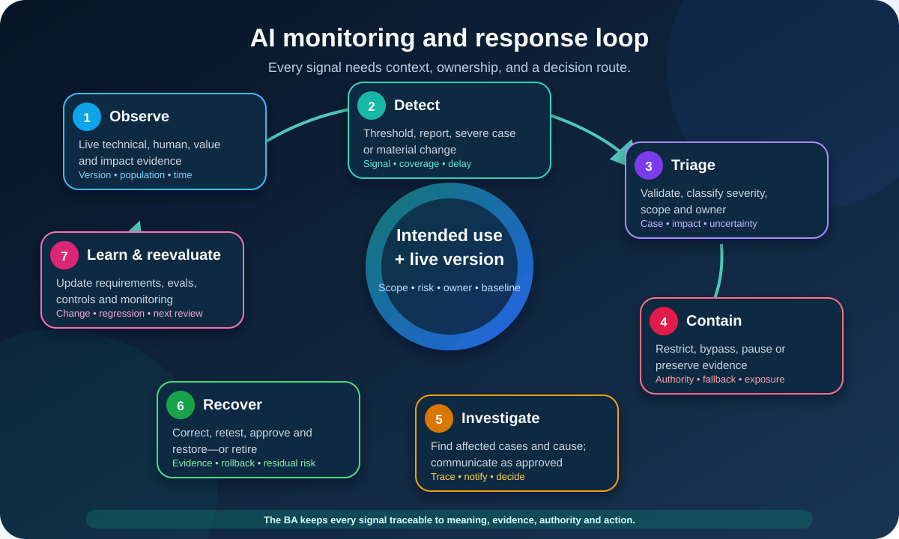

# Monitoring AI Systems, Drift, and Incidents for Business Analysts

**Post-deployment AI monitoring** is the repeatable collection and review of evidence after an AI system enters real operation. Its purpose is not to create the busiest dashboard. It is to detect when value, quality, risk, context, or system behavior needs a decision.

For a Business Analyst (BA), monitoring connects what the team promised before release to what actually happens in use. The BA helps define what matters, what evidence is available, what a change means, who responds, and when the organization should continue, investigate, restrict, pause, roll back, reevaluate, or retire the system.

This lesson continues the illustrative return-routing system from the evaluation lesson. It now runs in a bounded pilot for eligible English web tickets in one product category. The system suggests a return reason and support queue; a trained agent confirms or corrects it. It cannot issue refunds, deny requests, send messages, or make fraud decisions. All figures, thresholds, owners, and service rules below are teaching assumptions—not universal targets or organizational policy.

## 1. Start with the decisions, not the dashboard

A signal without a decision route becomes dashboard noise. Begin with the live decisions the organization expects to make.

| Decision | Monitoring question | Possible evidence |
|---|---|---|
| Continue the pilot | Is the system still useful and inside approved conditions? | Value, quality, risk, and workflow review |
| Investigate | Is a change real, important, and attributable? | Trend, cases, versions, slices, feedback |
| Restrict scope | Is one product, queue, case type, or user group failing? | Slice-level results and affected volume |
| Pause or bypass | Could continued use cause unacceptable impact? | Hard trigger, severe case, incident report |
| Roll back a change | Did a new configuration create a regression? | Before/after version evidence |
| Expand scope | Does live evidence support a defined extension? | Stable pilot results plus a new evaluation |
| Retire the system | Have value, supportability, or risk become unacceptable? | Sustained outcome, cost, incident, and alternative evidence |

For the pilot, the monitoring question is:

> Does assisted return routing continue to improve the approved workflow without missing important specialist cases, creating prohibited actions, hiding harm in a slice, or losing its business value?

## 2. Freeze the monitored baseline

Monitoring needs a reference point. Record what the deployed system is, not just its marketing name.

| Baseline field | Return-routing example |
|---|---|
| Intended use | Suggest reason and queue for eligible English web tickets in product A |
| Excluded use | Other languages, channels, products, or automated customer decisions |
| Version bundle | Provider/model, prompt, retrieval source, policy, rules, queue map, interface, and code versions |
| Population | Eligible tickets shown to trained pilot agents |
| Evaluation baseline | Approved held-out evaluation and known limitations |
| Human role | Agent confirms or corrects every suggestion |
| Fallback | Manual routing with entered work preserved |
| Decision owners | Product, Operations, Domain, Risk, Security, Privacy, and technical owners as applicable |

If the team cannot identify the version that produced an outcome, it may detect a problem but fail to explain or reproduce it. Treat configuration, provider, policy, data, and workflow changes as monitored events.

## 3. Monitor the system, workflow, and impact together

NIST AI 800-4, published in March 2026, organizes post-deployment monitoring into six categories. They are a useful coverage check, not a mandatory dashboard design.

| Monitoring category | BA question | Pilot example |
|---|---|---|
| Functionality | Does the system continue to work as intended? | Queue agreement, specialist misses, invalid outputs |
| Operational | Does the service remain dependable? | Availability, latency, timeouts, fallback completion |
| Human factors | What happens in the human–AI workflow? | Corrections, over-reliance, agent friction, feedback |
| Security | Is the system exposed to attack or misuse? | Prompt injection attempts, unauthorized access, suspicious tool calls |
| Compliance | Are applicable obligations and controls still met? | Required records, retention, approvals, complaint route |
| Large-scale impacts | Are broader downstream effects appearing? | Workload shifts, access effects, repeated impact patterns |

Monitoring only model accuracy misses integration failures and human behavior. Monitoring only uptime misses wrong outputs. Monitoring only complaints misses people who cannot or will not complain.

## 4. Build a signal portfolio

Use multiple evidence channels because every one has blind spots.

| Signal family | Examples | Limitation |
|---|---|---|
| Technical telemetry | Availability, latency, error type, invalid schema, fallback event | A healthy service can still give harmful advice |
| Input and data | Missing fields, language, length, new terms, source mix | Distribution change does not prove performance loss |
| Output and behavior | Queue, abstention, prohibited content, grounding, tool action | Some failures need human judgement |
| Quality labels | Confirmed queue, correction, later resolution, audited sample | Reliable labels may arrive late or cover only part of use |
| Workflow | Handling time, override, reroute, escalation, abandonment | User behavior can have several causes |
| Business value | Avoided reroutes, resolution time, workload, cost | A benefit average can hide harmful slices |
| Human feedback | Agent report, complaint, appeal, affected-person feedback | Reporting channels can be uneven or burdensome |
| Risk and incident | Near-miss, prohibited action, privacy/security event, severe harm | Rare events must not disappear inside rates |

Classify signals as **leading** or **lagging**. A spike in missing product fields may warn of future quality loss; confirmed specialist misses prove a failure after labels arrive. Use leading signals for early investigation, but do not present them as confirmed outcome harm.

## 5. Define drift precisely

**Drift** means a relevant pattern changed over time. It is not one mysterious number, and it does not automatically mean the model is wrong.

| Drift type | Return-routing example | BA response question |
|---|---|---|
| Input or population drift | More tickets use a new product term | Is the use still inside scope and represented in evaluation data? |
| Data-quality drift | Product category is missing more often | Did an upstream form or integration change? |
| Concept or policy drift | The valid return reason changed after a policy update | Are labels, rules, references, training, and tests still valid? |
| Output or behavior drift | Specialist suggestions fall after a provider update | Which version changed, and is performance affected? |
| Workflow drift | Agents start accepting suggestions faster with fewer checks | Is this expertise, time pressure, or over-reliance? |
| Outcome or impact drift | Reroutes fall overall but rise for one product subtype | Is value or harm shifting between slices? |

Drift detection compares distributions, rates, or patterns across a defined baseline and time window. It can indicate **change**, not automatically its cause, severity, or acceptability. Investigate with case-level evidence, context, and qualified owners.

## 6. Write a signal dictionary

Every important signal needs a shared definition.

| Field | Completed example |
|---|---|
| Signal ID | MON-Q-03 |
| Decision supported | Investigate or restrict a failing case type |
| Name | Confirmed specialist miss rate |
| Definition | Confirmed specialist cases routed outside the specialist queue ÷ all confirmed specialist cases |
| Population and exclusions | Eligible pilot tickets with adjudicated labels; unresolved cases excluded and counted separately |
| Source and lineage | Routing event joined to the adjudicated case table by permitted ticket ID |
| Window and cadence | Rolling approved window; reviewed at the approved cadence |
| Baseline | Pilot release evaluation plus current-process comparison |
| Slices | Product subtype, missing-field state, ticket length, collection period |
| Data delay | Adjudication normally arrives later than the routing event |
| Trigger | Value and minimum evidence count require authorized approval |
| Owner and route | Monitoring owner checks data; Domain owner reviews cases; Product/Risk owners decide action |
| Limitations | Does not measure unresolved or incorrectly adjudicated cases |

Record numerator, denominator, units, exclusions, minimum evidence, latency, expected range, and known blind spots. “Correction rate” is ambiguous until the team agrees what counts as a correction and which opportunities enter the denominator.

## 7. Separate a threshold from an action rule

An **alert threshold** says when to look. An **action rule** says what to do after considering evidence and severity.

| Rule | Illustrative form |
|---|---|
| Warning | Signal crosses the approved warning boundary with sufficient evidence → owner reviews data and cases |
| Investigation | Warning persists or combines with related signals → open a traceable investigation |
| Scope restriction | One approved slice crosses its action boundary → use manual routing for that slice |
| Immediate pause | Any confirmed prohibited action or severe incident → contain affected processing and invoke incident authority |
| Rollback | Regression is linked to a material version change and rollback is approved → restore the last approved bundle |
| Reevaluation | Population, policy, provider, prompt, tool, or workflow changes materially → run the defined evaluation before continuation or expansion |

Do not invent values because a dashboard requires a number. Use risk tolerance, evaluation evidence, baseline variation, business consequences, minimum sample sizes, and authorized owner decisions. Add hysteresis or a recovery rule where rapid switching would be harmful: the signal may need to remain inside the approved recovery range before normal operation resumes.

## 8. Handle delayed and missing truth

Live “ground truth” is often delayed, partial, or contested. A ticket can be corrected immediately, adjudicated days later, and reveal its outcome only after resolution.

Use layers:

1. **Immediate checks:** valid queue ID, prohibited action, timeout, fallback.
2. **Early proxies:** agent correction, confidence or abstention pattern, missing inputs.
3. **Delayed quality:** adjudicated reason and queue, confirmed specialist miss.
4. **Outcome evidence:** reroute, resolution time, complaint, downstream impact.
5. **Periodic sampled review:** qualified human review of cases not otherwise labeled.

Show freshness and coverage beside every result. A metric based on 42% labeled cases should not look like a complete population measure. Check whether the labeled cases differ from the unlabeled cases.

## 9. Make feedback, challenge, and override observable

Feedback is a monitoring channel, not a decorative button. Define:

- who can report a problem, correction, appeal, or near-miss;
- what information is collected and what sensitive data must not be entered;
- acknowledgement, triage, and response expectations;
- how linked versions and affected cases are found;
- how repeated themes change monitoring, training, design, or scope;
- how people can use fallback or challenge an outcome where applicable.

Do not reward a low complaint rate without checking access and burden. Silence can mean satisfaction, or it can mean the reporting route is hidden, unsafe, or ineffective.

## 10. Add controls for generative AI and agents

Variable outputs and tool-using systems need more than a single accuracy chart.

| Surface | Monitoring examples |
|---|---|
| Generated content | Unsupported claims, missing citations, unsafe content, sensitive-data exposure, refusal quality |
| Retrieval | Source freshness, missing document, wrong permission, citation–source mismatch |
| Tool use | Tool selected, parameters, authorization, side effect, confirmation, rollback |
| Agent sequence | Step trace, repeated loop, unexpected delegation, stop condition, human handoff |
| Variability | Repeated sampled evals under controlled settings and versioned judge methods |
| Cost and capacity | Tokens, tool calls, latency, queue time, provider limits |

Log enough to investigate within permitted privacy, security, and retention boundaries. More logging is not automatically better; unnecessary sensitive content creates a new risk.

## 11. Distinguish an issue, near-miss, and incident

Teams need one operational vocabulary.

| Term | Practical meaning | Example |
|---|---|---|
| Observation | A signal or report not yet assessed | Correction spike appears on the dashboard |
| Issue | Confirmed problem requiring normal remediation | Queue mapping is stale for a low-impact case type |
| Near-miss | Failure could have caused impact but was caught | Agent catches a prohibited refund suggestion before action |
| Incident | Event meets the organization's incident criteria | Unauthorized action, protected-data exposure, or severe repeated misrouting |

Severity is not just frequency. Consider actual and potential impact, people affected, reversibility, duration, scope, legal or contractual duties, exploitability, and continuing exposure. The authorized incident process—not the BA alone—determines classification and notification.

## 12. Design the response before the alert fires

A practical response loop is:

1. **Observe:** collect permitted live evidence with version and context.
2. **Detect:** identify a threshold, report, severe case, or material change.
3. **Triage:** validate the signal, assess severity and scope, and assign ownership.
4. **Contain:** restrict, bypass, pause, revoke access, or preserve evidence as authorized.
5. **Investigate and communicate:** identify affected cases and causes; use approved communication and notification routes.
6. **Recover:** correct, retest, approve, restore, compensate, or retire as appropriate.
7. **Learn and reevaluate:** update requirements, cases, controls, training, runbooks, and monitoring.

Prepare for a false alert and a missed alert. Record who can pause the system, who can approve restoration, what happens to in-progress work, and how manual capacity is protected.

## 13. Connect monitoring to change control

A material change can invalidate the baseline even when no alert fires.

| Change event | Minimum question |
|---|---|
| Provider or model update | Did capabilities, limitations, behavior, terms, or evidence change? |
| Prompt, rule, or retrieval change | Which requirements and regression cases must be rerun? |
| Policy or label change | Are historical comparisons still meaningful? |
| New user, language, product, or channel | Is this an approved extension requiring new evaluation? |
| Tool or permission change | Did the possible side effects or security boundary change? |
| Interface or workflow change | Did human review, fallback, or over-reliance risk change? |
| Repeated incident pattern | Is a local fix insufficient, requiring redesign or retirement? |

The change record should link the request, rationale, affected requirements and risks, evaluation evidence, approvals, deployment version, monitoring adjustments, rollback plan, and review date.

## 14. Monitor third-party dependencies

An organization can outsource a model or service, but not the need to manage its own use and impacts.

Track provider notices, version changes, availability, rate limits, data handling, security events, support response, subcontractors where relevant, and exit or continuity arrangements. Define what evidence the provider supplies and what your organization must measure independently.

If the provider changes a model without enough notice or case-level visibility, record that as a monitoring limitation and design a compensating control, such as a release gateway, canary scope, repeated evaluation, or manual fallback.

## 15. Turn learning into controlled improvement

Not every change should retrain the model. Root cause may sit in policy, labels, source data, integration, interface, training, staffing, incentives, or scope.

Use an improvement record:

| Field | Purpose |
|---|---|
| Evidence and affected cases | Show what happened and to whom |
| Root-cause confidence | Separate confirmed cause from hypothesis |
| Proposed treatment | Fix, control, training, narrower scope, or retirement |
| Expected benefit and new risk | Avoid moving harm elsewhere |
| Evaluation and approval | Define proof before release |
| Deployment and rollback | Make the change reversible where possible |
| Monitoring update | Add or revise signals, thresholds, slices, and review date |

Closing a ticket is not proof of improvement. Verify the treatment in evaluation and live evidence, then document residual risk.

## 16. Completed AI Monitoring and Incident Plan

| Plan field | Return-routing pilot | Status |
|---|---|---|
| Purpose and decision | Continue, investigate, restrict, pause, roll back, or retire the pilot | Defined |
| Scope and baseline | English web tickets, product A, named version bundle, human confirmation | Defined |
| Functionality | Queue quality, specialist misses, invalid/prohibited outputs, approved slices | Signal definitions drafted |
| Operations | Availability, latency, timeout, fallback completion | Connected to operations route |
| Human factors | Corrections, over-reliance sample, agent feedback, complaints | Review method open |
| Security/privacy | Injection attempts, unauthorized access/action, sensitive-data event | Specialist-owned route |
| Value | Reroutes, handling and resolution outcomes, workload, operating cost | Baseline confirmation open |
| Labels and review | Immediate checks, delayed adjudication, periodic sample | Sampling approval open |
| Triggers | Warning, investigation, slice restriction, hard pause, reevaluation | Values require authorization |
| Incident route | Detect, triage, contain, investigate, communicate, recover, learn | Existing process to be tested |
| Change control | Provider, model, prompt, policy, data, tool, interface, and scope events | Release gateway drafted |
| Third parties | Notices, versions, outages, data terms, evidence, continuity | Contract evidence open |
| Reporting | Weekly pilot review plus immediate severe-event route | Proposed |
| Current recommendation | Continue only after trigger values, sample review, and pause authority are approved and exercised | **Conditionally ready** |

The plan does not promise that monitoring will prevent every failure. It makes observable evidence, blind spots, authority, and response expectations explicit.

## 17. Reusable AI Monitoring and Incident Plan template

| Field | Your plan |
|---|---|
| Intended use, excluded use, population, affected people, and current version bundle | |
| Monitoring purpose and decisions supported | |
| Functionality, operational, human, security, compliance, and impact signals | |
| Signal ID, definition, formula, source, population, exclusions, slices, and limitations | |
| Baseline, window, cadence, data delay, coverage, and minimum evidence | |
| Warning, investigation, action, recovery, and hard-stop rules | |
| Feedback, complaint, appeal, override, and sampled-review routes | |
| Drift types and investigation method | |
| Incident criteria, severity, triage, containment, communication, recovery, and learning | |
| Pause, bypass, rollback, restoration, and retirement authority | |
| Material-change and reevaluation triggers | |
| Third-party evidence, notification, continuity, and exit controls | |
| Owners, escalation path, reporting audience, and review cadence | |
| Evidence retention, privacy, security, and access limits | |
| Improvement record, residual risk, approval, and next review date | |

## 18. Common monitoring mistakes

- **Building a dashboard before decisions:** define what each signal can trigger.
- **Monitoring only the model:** include integrations, people, workflow, value, and impacts.
- **Calling every change drift:** name the baseline, window, population, and changed pattern.
- **Treating drift as failure:** investigate whether quality or risk actually changed.
- **Using only proxies:** disclose the gap and obtain delayed or sampled outcome evidence.
- **Hiding small denominators:** show counts, coverage, uncertainty, and inconclusive slices.
- **Averaging away harm:** inspect meaningful slices and severe individual cases.
- **Alerting without authority:** name who investigates, pauses, rolls back, and restores.
- **Logging everything:** minimize and protect sensitive evidence.
- **Ignoring silent users:** combine telemetry with accessible feedback and field review.
- **Fixing without reevaluation:** every material treatment needs evidence and regression checks.
- **Assuming no incidents means safe:** reporting, detection, and classification can all fail.

## 19. Practice exercise

A bank has a bounded pilot in which an AI assistant suggests a category and next step for written card-transaction questions. An employee reviews every suggestion before acting.

1. Write three live decisions the monitoring plan must support.
2. Define one functionality, operational, human-factor, security, and value signal.
3. Choose one likely input, policy, behavior, workflow, and outcome drift.
4. Complete a signal dictionary for a missed high-priority case.
5. Separate its warning threshold from its action rule.
6. Explain how delayed labels and unlabeled cases will appear in reporting.
7. Define one issue, near-miss, and incident example.
8. Draft the triage, containment, pause, recovery, and restoration owners.
9. Name three material changes that require reevaluation.

Do not invent banking policy, legal duties, risk tolerances, notification deadlines, or threshold values. Record the qualified and authorized owner for each open decision.

## Further reading

- [NIST AI RMF Core: Measure and Manage](https://airc.nist.gov/airmf-resources/airmf/5-sec-core/)
- [NIST AI RMF Playbook: Manage](https://airc.nist.gov/airmf-resources/playbook/manage/)
- [NIST AI 800-4: Challenges to the Monitoring of Deployed AI Systems](https://doi.org/10.6028/NIST.AI.800-4)
- [NIST AI RMF Generative AI Profile](https://doi.org/10.6028/NIST.AI.600-1)
- [Google Cloud: Introduction to Vertex AI Model Monitoring](https://cloud.google.com/vertex-ai/docs/model-monitoring/overview)

NIST AI 800-4 explains that post-deployment monitoring methods and shared terminology remain a developing area. Use its categories as a coverage aid, not as proof that one universal monitoring design exists. Tailor methods, thresholds, response, and governance to the system's intended use, risk, available evidence, and applicable obligations.
