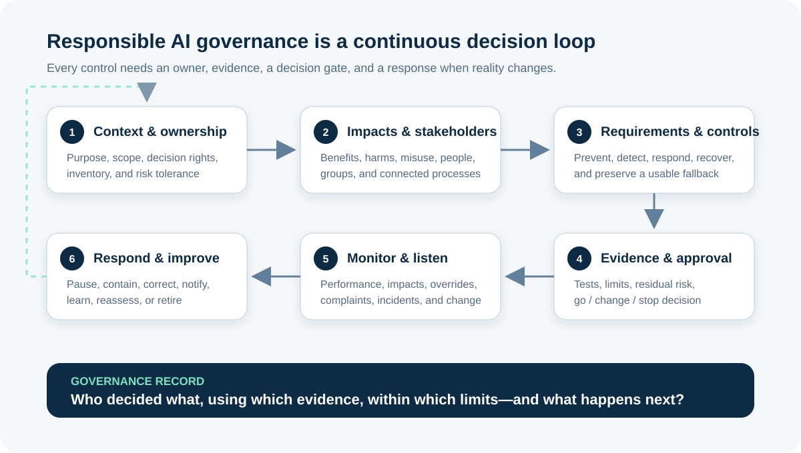

# Responsible AI, Risk, and Governance for Business Analysts

**Responsible AI** means designing, acquiring, using, and retiring AI in a way that pursues legitimate value while identifying, measuring, and managing impacts on people, organizations, and society. **AI governance** is the decision system that makes this work repeatable: roles, policies, controls, evidence, approvals, monitoring, escalation, and accountability.

For a Business Analyst (BA), the practical question is not “Is this AI ethical?” as a one-time yes-or-no judgement. It is: **Who may decide what, using which evidence, within which limits, and what happens when the system is wrong or the context changes?**

This tutorial continues the illustrative online-store scenario. The proposed pilot suggests a return reason and support queue for English web tickets in one product category. A trained employee confirms or corrects every suggestion. All roles, ratings, thresholds, and policies below are teaching assumptions, not facts or legal advice.

## 1. Turn principles into operating decisions

Words such as fairness, transparency, safety, privacy, and accountability are important, but they are not requirements by themselves. Separate five layers:

| Layer | Meaning | Return-routing example |
|---|---|---|
| **Principle** | A value or desired quality | People should not receive worse support because of irrelevant personal characteristics |
| **Policy** | An organizational rule or commitment | The pilot may suggest routing but may not approve or deny a return |
| **Requirement** | A testable condition for this use case | Every suggestion must show the proposed reason and allow correction before routing |
| **Control** | A measure that prevents, detects, responds to, or recovers from risk | Prohibited actions are unavailable; overrides and reasons are logged |
| **Evidence** | Proof used for a decision | Test results by case type, access review, override analysis, and signed approval record |

If a governance document says only “the system must be fair and explainable,” the delivery team cannot build or test it. The BA helps stakeholders define what information, behavior, result, and response would demonstrate the intent in this context.

## 2. Establish context, scope, and governance route

Risk depends on use. Suggesting an internal queue is not the same as rejecting a refund, accusing a customer of fraud, or making a decision about employment or credit.

Start with a short **AI system record**:

| Context field | Illustrative pilot answer |
|---|---|
| Business purpose | Reduce avoidable reading and rerouting of return tickets |
| AI role | Suggest one reason and one support queue |
| Human role | Review and confirm or correct every suggestion |
| Affected people | Customers, support staff, queue owners, operations teams |
| Included scope | English web tickets, one product category, one trained team |
| Excluded scope | Email, other languages, suspected fraud, automated replies, refund decisions |
| Data and supplier | Approved case fields; provider decision remains open |
| Decision owner | Return Operations Product Owner |
| Review route | Data, privacy, security, legal/compliance, accessibility, and domain review as applicable |

The BA does not decide which law applies. Record operating locations, user and data locations, sector, decision type, supplier roles, and affected groups so qualified owners can identify applicable obligations. Regulatory labels and risk tiers must not be guessed from a workshop score.

Also check whether the organization already has an AI inventory, acceptable-use policy, procurement route, risk classification, model approval process, or incident procedure. A project canvas should connect to organizational governance, not replace it.

## 3. Make accountability explicit

“A human is involved” does not establish accountability. Name who has authority, capability, time, and information to act.

| Governance decision | Accountable role in the example | Supporting roles | Evidence recorded |
|---|---|---|---|
| Approve purpose and pilot boundary | Product Owner | Support lead, BA, risk specialists | Scope and prohibited-use record |
| Approve data use | Data Owner | Privacy, security, legal/compliance | Sources, purpose, restrictions, retention |
| Accept label definitions | Domain Owner | Experienced agents, data team | Label guide and review results |
| Approve evaluation plan | Product and Risk Owners | Testing, domain, data science | Measures, slices, thresholds, limitations |
| Authorize pilot start | Named governance authority | All required reviewers | Decision record and residual risks |
| Pause operation | Operations lead and incident authority | Support, engineering, provider | Trigger, action, affected cases, notification |
| Approve scope change | Product Owner through governance route | Impacted owners | Change assessment and new evidence |

Distinguish useful responsibility terms:

- **Owner:** accountable for the decision and consequences.
- **Operator:** uses or supervises the system in the workflow.
- **Reviewer:** evaluates evidence with enough independence for the risk.
- **Provider:** supplies a model, service, data, or platform; it does not inherit every organizational responsibility.
- **Affected person:** experiences the outcome even if they never operate the tool.

Avoid a RACI table where every cell has five names and nobody can stop the system. For each critical decision, identify one accountable authority and a reachable delegate.

## 4. Map benefits, harms, and foreseeable misuse

An **impact** is a change experienced by a person, group, organization, process, or environment. Include benefits and harms, direct and indirect effects, and intended use and reasonably foreseeable misuse.

Work through the current process first. AI can introduce a new harm, amplify an existing one, or expose a problem that was already present.

| Stakeholder or asset | Intended benefit | Harm or failure path | Evidence needed |
|---|---|---|---|
| Customer | Faster route to the right team | Delay or repeated transfers after a wrong suggestion | End-to-end time, reroutes, complaints by relevant slice |
| Support agent | Less repetitive reading | Automation pressure causes uncritical acceptance | Override behavior, workload, interviews, observed review time |
| Queue owner | More consistent intake | One queue is flooded by systematic misclassification | Volume and error patterns by reason and period |
| Organization | Lower handling effort | Unauthorized action, privacy incident, vendor outage, reputational harm | Access logs, incident tests, fallback capacity, contract evidence |
| Data subjects | Minimum necessary use | Free text exposes unrelated sensitive information | Data review, filtering, access, retention, incident route |

Prompt the workshop with concrete failure modes:

- correct-looking output based on wrong or incomplete information;
- different error patterns for language, channel, product, or another relevant group;
- operators trusting suggestions too quickly or learning to work around them;
- use outside the approved purpose or by an untrained team;
- malicious, accidental, or unexpected input;
- unavailable provider, corrupted integration, or missing log;
- a policy change that makes labels and controls obsolete;
- no practical way for a customer or employee to challenge an outcome.

Do not force every risk into a single numeric score. Record **impact**, **likelihood or exposure**, **detectability**, **reversibility**, affected scale, evidence quality, and uncertainty. A low average score must not override a legal prohibition, a severe irreversible harm, or an organizational stop condition.

## 5. Translate trustworthy characteristics into BA questions

The NIST AI Risk Management Framework describes trustworthy-AI characteristics including valid and reliable, safe, secure and resilient, accountable and transparent, explainable and interpretable, privacy-enhanced, and fair with harmful bias managed. Treat them as connected questions, not independent badges.

| Characteristic | BA question for the return pilot |
|---|---|
| Valid and reliable | Does the suggestion perform sufficiently for the defined purpose and operating conditions? |
| Safe | Can the workflow fail without creating an unacceptable customer or operational outcome? |
| Secure and resilient | Who can access or manipulate inputs, outputs, configuration, and logs, and how does the service recover? |
| Accountable and transparent | Can we identify owners, decisions, limits, evidence, changes, and incidents? |
| Explainable and interpretable | Does the operator receive enough useful information to review the suggestion correctly? |
| Privacy-enhanced | Is the use permitted, minimized, protected, retained appropriately, and responsive to incidents? |
| Fair with harmful bias managed | Which differences in outcomes matter, how will they be evaluated, and what response follows? |

Trade-offs must be documented. Showing more case text may help human review but expose unnecessary information. A more complex model may improve one metric but make troubleshooting harder. The accountable owner decides within policy and risk tolerance using evidence—not the BA or model alone.

## 6. Design layered controls and meaningful human oversight

A **control** changes the likelihood or impact of a risk. Use layers so one failure does not automatically become harm.

| Control type | Purpose | Return-routing example |
|---|---|---|
| **Prevent** | Stop an unwanted action or exposure | No API permission to issue refunds; excluded cases routed manually |
| **Detect** | Find failure or change early | Monitor reroutes, overrides, missing fields, and prohibited-scope attempts |
| **Respond** | Contain and handle an event | Pause suggestions for an affected reason and notify the operations owner |
| **Recover** | Restore safe service and evidence | Use the original ticket and manual queue guide; preserve logs for review |
| **Correct** | Remove the cause and validate the change | Repair label rules, retrain or reconfigure, retest, and reapprove |

Human oversight is meaningful only if the person:

- knows that the output came from AI and what it is meant to do;
- sees the information needed to review it;
- has enough time and competence to disagree;
- can correct, reject, escalate, and use a safe alternative;
- is not measured in a way that punishes appropriate overrides;
- receives feedback when repeated corrections reveal a system problem.

In the pilot, a confirmation button alone is weak oversight. The interface should make the proposed reason and queue visible, allow correction, show approved guidance, preserve the original request, and record the final human action. Oversight effectiveness must be tested, not assumed.

## 7. Define transparency, notice, and challenge routes

Transparency is information appropriate to the audience and decision—not a large technical document that nobody can use.

| Audience | What they need to know |
|---|---|
| Support operator | Purpose, limits, excluded cases, review steps, known failure patterns, fallback, reporting route |
| Customer | Relevant notice of AI involvement where required or appropriate, what happens to the request, and how to seek help or correction |
| Governance reviewer | System record, suppliers, data, evaluations, limitations, residual risks, approvals, monitoring, incidents |
| Operations owner | Current scope, thresholds, alerts, capacity for fallback, change and retirement plan |

An explanation should help a person take the next action. “The model confidence was 0.84” may not tell an agent why a request belongs in a queue. “Suggested because the request mentions an unopened item and the order is within the approved window” may be more useful—but only if that statement is accurate, safe to show, and supported by the system.

Provide a practical challenge route. Record who receives a complaint or correction, response expectations, how linked records and decisions are found, and how repeated issues affect monitoring and change decisions.

## 8. Convert risks into testable requirements and evidence

Governance belongs in the requirements, backlog, acceptance criteria, test plan, operating procedure, and decision record.

| Risk | Requirement or control | Acceptance evidence | Owner |
|---|---|---|---|
| Suggestion triggers an unauthorized action | The pilot can only propose a reason and queue; it has no refund or messaging permission | Architecture review and permission test | Engineering owner |
| Employee accepts suggestions automatically | Every case requires explicit review; training covers limits and override practice | Usability session, training record, override scenarios | Support owner |
| One case type receives more harmful errors | Evaluation reports reroutes and corrections by approved reason and relevant slice | Versioned evaluation report and domain review | Product and risk owners |
| Customer cannot recover from wrong routing | Original request remains available and manual rerouting is always possible | End-to-end fallback test | Operations owner |
| Scope expands silently | Language, channel, product, and user team are configuration-controlled and logged | Change-control test and audit record | Product owner |

Example acceptance scenario:

> **Given** a ticket is outside the approved product category, **when** the pilot receives it, **then** it must not generate a routing suggestion, the original ticket must remain available to the agent, and the excluded-scope event must be counted for governance review.

Avoid requirements that merely say “comply with responsible AI principles.” Link every control to a named risk, method, evidence, owner, and response.

## 9. Govern vendors and third-party components

Buying a service changes who supplies evidence; it does not remove accountability for the deployed use.

Ask potential providers for information that matches the risk and role:

- intended uses, excluded uses, technical and operating limits;
- data sent, stored, reused, retained, deleted, and accessed;
- model or service changes, notification, version control, and rollback;
- evaluation methods and results relevant to your operating conditions;
- security controls, incident notification, availability, and recovery;
- subcontractors and other material dependencies;
- logging, export, audit support, and evidence preservation;
- intellectual-property and content restrictions;
- exit plan, data return or deletion, and continuity of the manual process.

Marketing claims and generic benchmark scores are not acceptance evidence. Test the configured end-to-end system in your context, including integrations, people, policy, and fallback.

## 10. Use evidence-based decision gates

A governance gate is a real decision, not a meeting that every project passes.

| Gate | Decision question | Possible outcome |
|---|---|---|
| Opportunity | Is the purpose legitimate, valuable, and preferable to simpler options? | Investigate, redesign, park, or stop |
| Data | Is the required data suitable and permitted for this bounded use? | Proceed, repair, narrow, collect, or stop |
| Pre-pilot | Do controls and evaluation evidence keep residual risk within the authorized tolerance? | Approve, conditionally approve, change, or stop |
| Pilot review | Did value and risk evidence support expansion? | Continue bounded use, expand through review, pause, or retire |
| Material change | Does a new model, supplier, purpose, population, data source, or authority change the assessment? | Retest, reapprove, restrict, or stop |

**Residual risk** is the risk remaining after controls. Record it with uncertainty and limitations. Acceptance must come from the authorized owner—not from an unanswered email, expired approval, or absence of reported incidents.

## 11. Monitor, respond, and retire

Pre-release testing cannot cover every live condition. Monitoring should combine technical measures, workflow outcomes, human feedback, complaints, and incident reports.

| Signal | Illustrative trigger | Required response |
|---|---|---|
| Unauthorized action or prohibited use | Any confirmed occurrence | Stop affected processing, contain, investigate, notify through incident route |
| Reroute or correction pattern | Exceeds approved limit for a reason or relevant slice | Narrow scope and review data, labels, workflow, and model |
| Human oversight failure | Review step skipped or operators cannot use fallback | Pause team access, fix workflow and training, revalidate |
| Provider or model change | Material version change or undocumented behavior shift | Hold rollout, compare evidence, rerun required tests |
| Complaint or harm report | Credible repeated issue or severe single event | Triage, preserve evidence, assist affected people, escalate |

An incident plan should state how to report, triage, contain, investigate, communicate, correct, recover, and learn. Preserve enough evidence to understand what happened without keeping data indefinitely “just in case.”

Retirement is part of governance. Decide who can end the use, how integrations and access are removed, what happens to data and logs, how open cases continue, and how stakeholders are informed.

## 12. Completed AI Risk and Governance Canvas

| Canvas area | Return-routing pilot | Status |
|---|---|---|
| Purpose and benefit | Suggest reason and queue to reduce avoidable routing effort | Confirmed for bounded pilot |
| People and processes affected | Customers, agents, queue owners, operations, data subjects | Initial map; validate through engagement |
| Intended and prohibited use | Suggestion with confirmation; no refund, message, fraud claim, or denial | Proposed hard boundary |
| Decision owner | Return Operations Product Owner | Named; delegate required |
| Required reviewers | Domain, data, privacy, security, legal/compliance, accessibility as applicable | Route to confirm |
| Priority impacts | Delay, repeated transfer, over-reliance, privacy exposure, queue overload, scope creep | Initial register |
| Controls | Permission boundary, exclusions, explicit review, correction, logging, fallback, alerts | Design needs test evidence |
| Transparency and challenge | Operator guide, appropriate customer help route, governance record | Content and ownership open |
| Pre-pilot evidence | Data readiness, slice tests, fallback and permission tests, usability, training | Incomplete |
| Residual risk decision | Authorized owner accepts, conditions, or rejects with limitations recorded | Not yet decided |
| Monitoring and incidents | Reroutes, overrides, scope attempts, complaints, changes; defined escalation | Thresholds and rota open |
| Change and retirement | Material-change review, manual continuity, access and data closure | Draft needed |
| Current recommendation | Do not start live pilot until permission, label, control, and oversight evidence is complete | **Conditional hold** |

Governance should preserve disagreement. If a reviewer objects, record the issue, evidence, decision, authority, conditions, and follow-up instead of erasing the concern from the final slide.

## 13. Facilitate a responsible-AI review

Include the product and process owners, frontline users, domain experts, data and technology roles, testing, relevant risk specialists, and perspectives of affected people appropriate to the context.

1. Confirm the decision the session must support.
2. Read the purpose, scope, exclusions, and prohibited actions aloud.
3. Map affected people and connected processes before scoring risk.
4. Describe benefits, harms, misuse, failures, and uncertainty.
5. Assign each priority risk an owner and layered controls.
6. Define acceptance evidence, residual-risk authority, and stop conditions.
7. Design monitoring, feedback, incident, change, and retirement routes.
8. Record open decisions, due dates, and the next governance gate.

Do not invite affected stakeholders only to approve a finished plan. Their experience may change the problem, reveal an impact, or show that a proposed explanation or appeal route is unusable.

## 14. Common governance mistakes

- **Treating governance as final approval:** risks and context change throughout the lifecycle.
- **Copying principles into requirements:** values need contextual behavior, measures, evidence, and owners.
- **Calling any click “human oversight”:** reviewers need information, authority, time, skill, and fallback.
- **Checking only model accuracy:** the workflow, people, interfaces, data, integrations, and provider also create risk.
- **Using an average to hide severe harm:** some thresholds and prohibitions are hard gates.
- **Letting the supplier define acceptable risk:** the deploying organization owns its use and impact decisions.
- **Monitoring only technical uptime:** complaints, corrections, workarounds, and group-level outcomes can reveal harm.
- **Having no safe exit:** an AI-dependent process may fail when the provider, model, data, or policy changes.

## 15. Reusable AI Risk and Governance Canvas

| Area | Your evidence and decision |
|---|---|
| Purpose, value, context, and system inventory ID | |
| Intended, excluded, prohibited, and foreseeable use | |
| Users, affected people, groups, and connected processes | |
| Accountable owner, operators, reviewers, providers, and stop authority | |
| Applicable policy and specialist legal/compliance decisions | |
| Benefits, harms, misuse, failure paths, and uncertainty | |
| Data, model, supplier, integration, and human-workflow dependencies | |
| Prevent, detect, respond, recover, and correct controls | |
| Human oversight, fallback, notice, explanation, and challenge route | |
| Measures, slices, tests, thresholds, limitations, and evidence location | |
| Residual risk, decision, approver, conditions, and expiry/review date | |
| Monitoring, feedback, complaint, incident, and escalation plan | |
| Material-change triggers and reassessment route | |
| Retirement, continuity, access removal, data, and communication plan | |

## 16. Practice exercise

A bank proposes an AI assistant that recommends a category and next step for written card-transaction enquiries. An employee sees the recommendation before acting.

1. Define the intended, excluded, and prohibited uses.
2. Identify four affected stakeholders and one benefit and harm for each.
3. Assign accountable owners for purpose, data, evaluation, live operation, incidents, and scope change.
4. Write one preventive, detective, response, and recovery control for a priority harm.
5. Write two acceptance scenarios that test meaningful human oversight and fallback.
6. Define a complaint route, a stop condition, and a material-change trigger.
7. Recommend go, conditional go, change, pause, or stop, and list the missing evidence.

Do not invent legal obligations, fraud policy, risk tolerance, performance thresholds, or rights. Route those questions to qualified owners and record the resulting decisions.

## Further reading

- [NIST AI Risk Management Framework Core](https://airc.nist.gov/airmf-resources/airmf/5-sec-core/)
- [NIST AI RMF Playbook](https://airc.nist.gov/airmf-resources/playbook/)
- [OECD AI Principles](https://oecd.ai/en/ai-principles)
- [OECD principle: Transparency and explainability](https://oecd.ai/en/dashboards/ai-principles/P7)
- [OECD principle: Accountability](https://oecd.ai/en/dashboards/ai-principles/P9)
- [European Commission: AI Act regulatory framework](https://digital-strategy.ec.europa.eu/en/policies/regulatory-framework-ai)
- [IIBA: AI Governance at the Crossroads](https://www.iiba.org/business-analysis-blogs/ai-governance-at-the-crossroads-why-business-analysis-is-essential-for-responsible-ai/)
