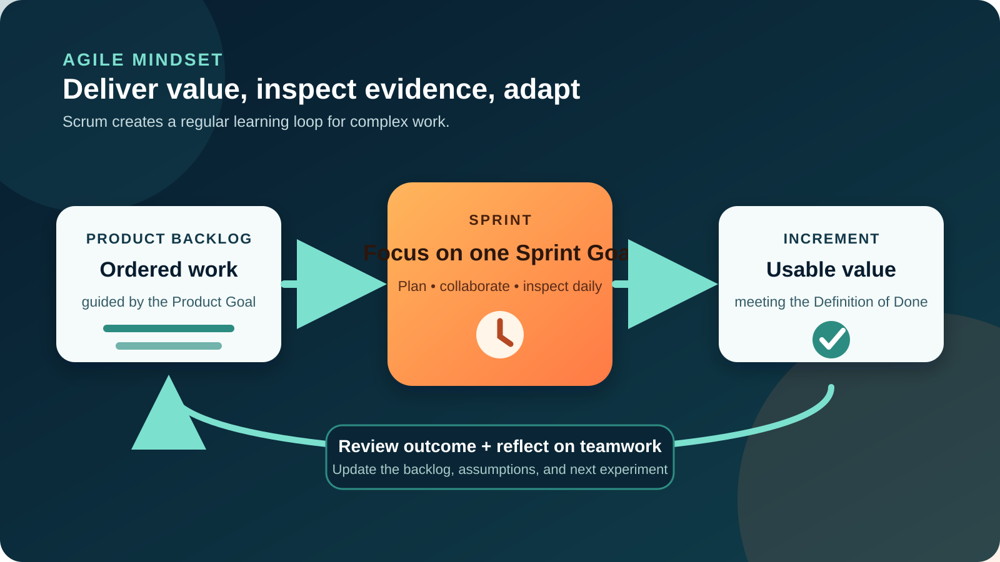

# Agile and Scrum for Business Analysts

## 1. Start with the difference: Agile is a mindset; Scrum is a framework

**Agile** describes a way of working that values people collaborating, useful outcomes, customer partnership, and responding to learning. The Agile Manifesto does not say that plans, processes, contracts, or documentation have no value. It says the items on the left are valued **more** when choices have to be made.

**Scrum** is one lightweight framework for applying an empirical approach to complex problems. The team makes important work and quality expectations visible, delivers a usable result in a short cycle, inspects evidence, and adapts.

For a **Business Analyst (BA)**, the practical change is important: analysis does not disappear, and requirements are not guessed once at the start. The BA helps the team make the next valuable decision with enough shared understanding, then updates that understanding when users, risks, or results teach the team something new.



**BA questions:** What outcome are we trying to improve? What evidence supports the next slice of work? What must remain flexible until we learn more?

## 2. Running example: improve online returns

Our teaching example is the same online-shopping product used across BAB. Customer-service data suggests that many shoppers contact support because they cannot start an eligible return themselves. The company wants to test a self-service return journey.

The following people, rules, dates, and targets are **illustrative assumptions**, not facts about a real retailer:

| Item | Teaching example |
|---|---|
| Product Goal | Reduce avoidable return-support contacts while keeping eligibility rules clear |
| Product Owner | Laila, accountable for maximizing product value and managing the Product Backlog |
| Scrum Team | Product Owner, Scrum Master, and Developers with design, engineering, testing, data, and analysis skills |
| Sprint length | Two weeks; Scrum permits Sprints of one month or less |
| First learning target | Let an eligible customer request a return and receive a reference number |
| Known exceptions | Return window expired, non-returnable item, partial order, courier unavailable, refund still pending |

The first mistake would be to write “Build a returns page” and treat the solution as understood. The BA instead frames the **problem**, the affected users, the current evidence, the business rules, and the uncertainties the team should test.

## 3. Understand the Scrum Team—and where BA work fits

The Scrum Guide defines three **accountabilities**, not job titles:

| Accountability | Accountable for | Useful BA collaboration |
|---|---|---|
| **Product Owner** | Maximizing product value and effective Product Backlog management | Clarify outcomes, stakeholder evidence, rules, ordering options, and decision rationale |
| **Scrum Master** | Establishing Scrum and improving the team's effectiveness | Surface analysis bottlenecks, facilitate discovery, and help make impediments visible |
| **Developers** | Creating a usable Increment each Sprint and meeting the Definition of Done | Collaborate on examples, data, validation, and any analysis needed to create the Increment |

“Business Analyst” is **not** a fourth required Scrum accountability. An organization might have a BA support the Product Owner, contribute within the cross-functional team, or hold another formal title. Do not use that title to create a handoff queue between “analysis” and “delivery.” Agree explicitly who makes product decisions, who does the analysis work, and how the people building the Increment join the conversation.

**Caution:** The BA can facilitate and recommend, but should not quietly replace the Product Owner's value decisions or tell Developers how much work they must select.

## 4. Connect the three artifacts to decisions

Scrum uses three artifacts. Each has a commitment that sharpens focus and transparency:

| Artifact | Commitment | Returns example | What the BA helps make visible |
|---|---|---|---|
| **Product Backlog** | Product Goal | Improve the return experience and reduce avoidable contacts | Outcomes, evidence, options, rules, dependencies, open questions |
| **Sprint Backlog** | Sprint Goal | Eligible customers can request a return without contacting support | Shared scope examples, risks, changed assumptions, and decision needs |
| **Increment** | Definition of Done | A usable return-request slice that meets agreed quality measures | Acceptance evidence, end-to-end behavior, data and reporting expectations |

The Product Backlog is an **ordered, emerging** list—not a frozen requirements document. Product Backlog refinement is ongoing work to break down and define items. Scrum does not prescribe user stories, a “Definition of Ready,” story points, or a specific board. A team may use them as complementary practices when they help.

**BA action:** Keep traceability lightweight but useful. Link a backlog item to its intended outcome, evidence, rules, and decisions instead of producing documents that nobody uses to make a choice.

## 5. Follow one Sprint as a learning cycle

The **Sprint** contains the other Scrum events. Each event creates a chance to inspect and adapt; it is not a status ceremony.

| Event | Purpose in Scrum | Returns example | BA contribution |
|---|---|---|---|
| **Sprint Planning** | Establish why the Sprint is valuable, what may be done, and how the work will be approached | Agree a Sprint Goal around initiating eligible returns | Bring evidence, rules, examples, dependencies, and unresolved decisions |
| **Daily Scrum** | Developers inspect progress toward the Sprint Goal and adapt their plan | A courier API constraint threatens the goal | Be available for rapid clarification; do not turn it into a BA status report |
| **Sprint Review** | Scrum Team and stakeholders inspect the outcome and decide future adaptations | Users understand eligibility but hesitate at the refund message | Capture evidence and changed priorities; help update the Product Backlog |
| **Sprint Retrospective** | Scrum Team plans ways to improve quality and effectiveness | Late policy answers caused rework | Improve the discovery/refinement approach, not just the product |

A two-week Sprint does **not** mean every question waits for a meeting. Analysis, refinement, stakeholder conversations, and testing can happen throughout the Sprint. The team protects the Sprint Goal while negotiating scope as it learns.

## 6. Build one refinement-ready backlog item

Start with the outcome, then add only the detail needed for a responsible conversation. Here is a completed BA artifact for the example.

### Completed backlog-item brief

| Field | Completed example |
|---|---|
| User / problem | A customer with an eligible delivered item currently contacts support to begin a return |
| Intended outcome | The customer can submit the request and receives a reference without support help |
| Evidence | Support-contact analysis indicates “how to return” is a recurring contact reason; volume must be confirmed |
| Proposed slice | One delivered item, standard return reason, home-country order, original payment method |
| Business rules | The item must be within the configured return window and not in a non-returnable category |
| Acceptance examples | Eligible item succeeds; expired window explains why; non-returnable item is blocked; duplicate submission is prevented |
| Data / reporting | Record order ID, item ID, reason, request time, eligibility result, and return reference; avoid exposing unnecessary personal data |
| Dependencies | Order status, product returnability, refund service, courier availability |
| Open decisions | Who owns eligibility policy? What happens when courier booking fails after the request is created? |
| Success signal | Completion rate and support-contact rate for eligible return attempts, with a baseline agreed before release |

### Turn rules into acceptance examples

Use concrete examples to expose gaps:

```text
Given an order item was delivered 10 days ago
And the item category is returnable
When the customer submits a valid return reason
Then a return request is created
And the customer sees a unique return reference
```

Now add the failure path:

```text
Given the return request is eligible
And courier booking is temporarily unavailable
When the customer confirms the request
Then the return request is saved once
And the customer is told what will happen next
And the failure is recorded for operational follow-up
```

These are examples, not the whole requirement. The team still needs usability, accessibility, security, analytics, legal, operational, and Definition of Done considerations that fit the product.

## 7. Read a board as a conversation aid, not as Scrum itself


*A real Scrum task board. Photo by Dr Ian Mitchell, sourced from [Wikimedia Commons](https://commons.wikimedia.org/wiki/File:Scrum_task_board_example.jpg), available under CC0 or CC BY-SA 2.5. The board is an optional practice, not a required Scrum artifact.*

A board can make work visible, but columns and cards do not prove that a team is Agile. When the BA reads the board, useful questions include:

- Which items support the Sprint Goal, and which are distracting from it?
- Is work waiting because a rule, stakeholder decision, test condition, or data definition is unclear?
- Are many items started while nothing reaches Done?
- Does “Done” mean coded, or does it mean a usable Increment meeting the Definition of Done?

The photograph shows one physical implementation. A digital board can work just as well. The team should choose a tool that improves transparency rather than forcing its process to match a template.

## 8. Use story points and velocity carefully

Some teams estimate backlog items with **story points**: a relative expression of effort, complexity, and uncertainty agreed by that team. They are not hours and cannot be compared reliably across teams. The Developers remain responsible for their plan and estimates; the BA contributes rule, dependency, and uncertainty context.

**Velocity** is the amount of estimated work a team completed in a Sprint. It can help that same team form a rough planning forecast when its context is stable. It is not a productivity score, a target to maximize, or evidence of customer value. Re-estimating work to raise velocity only changes the number.

In the returns example, an unknown courier contract may make a story relatively larger. The BA can reduce uncertainty by obtaining documentation and examples; the team may then split or revise the estimate. Forecast with a range and keep outcome measures—such as completed returns and support-contact rate—separate from delivery estimates.

## 9. Collaborate continuously, not through a requirements handoff


*Continuous collaboration keeps discovery, delivery, and validation connected instead of turning analysis into a one-time handoff.*

A useful BA rhythm for the returns example looks like this:

1. **Discover:** review support data and observe the current return journey with users and operations.
2. **Frame:** connect the problem to the Product Goal and make assumptions explicit.
3. **Refine together:** bring small slices, rules, examples, and open questions to the Product Owner and Developers.
4. **Support delivery:** answer questions quickly and update shared understanding when implementation reveals a constraint.
5. **Validate:** compare the Increment with examples and quality expectations, then examine user and operational evidence.
6. **Adapt:** update the backlog and the team's analysis approach after the Review and Retrospective.

This is often called **just enough, just in time** analysis. It does not mean “write nothing.” It means produce the smallest reliable artifact that supports the next decision, keep durable rules and rationale where people can find them, and avoid detailing distant work that is likely to change.

## 10. Handle change and exceptions without losing control

| Situation | Weak response | Better BA response |
|---|---|---|
| A stakeholder adds a new rule mid-Sprint | Promise it immediately or reject all change | Check impact on the Sprint Goal; collaborate with the Product Owner and Developers on scope and backlog adaptation |
| A story is unclear at Sprint Planning | Hide uncertainty behind a large document | State the unknown, show examples, and let Developers decide whether they understand enough to select it |
| The demo looks correct | Declare the outcome successful | Check Definition of Done, real usability, operational readiness, and post-release measures |
| Every request becomes urgent | Let priority follow seniority or noise | Return to Product Goal, evidence, cost of delay, dependencies, and the Product Owner's decision |
| The team completes many tickets but users still call support | Report output only | Compare the Increment with the intended customer and business outcome |

If new information would endanger the Sprint Goal, make it visible quickly. Scope may be clarified and renegotiated with the Product Owner as more is learned. Do not quietly lower quality or redefine Done to make a chart look healthy.

## 11. Reusable BA template

Copy this table for a backlog item before refinement:

| Field | Your notes |
|---|---|
| Product Goal connection |  |
| User / problem |  |
| Intended outcome |  |
| Evidence and confidence |  |
| Smallest useful slice |  |
| Business rules |  |
| Acceptance examples: success |  |
| Acceptance examples: exceptions |  |
| Data, reporting, and privacy |  |
| Dependencies |  |
| Assumptions and open decisions |  |
| Success signal and baseline |  |
| Decision owner / review date |  |

### Quick exercise

Extend the returns example for a **partial return of two items from one order**. Write:

1. one intended outcome;
2. two business rules;
3. one successful acceptance example;
4. two exception examples; and
5. one measure you would inspect after release.

Then identify what you would ask the Product Owner, Developers, operations, and a customer representative before the item is considered for a Sprint.

## Further reading

- [Manifesto for Agile Software Development](https://agilemanifesto.org/)
- [Principles behind the Agile Manifesto](https://agilemanifesto.org/principles)
- [The official 2020 Scrum Guide](https://scrumguides.org/scrum-guide.html)
- [Official Scrum Guide downloads, including Arabic](https://scrumguides.org/download)

*The product scenario, people, policies, targets, and measures in this tutorial are illustrative. Confirm them with the responsible stakeholders and evidence in a real project.*
