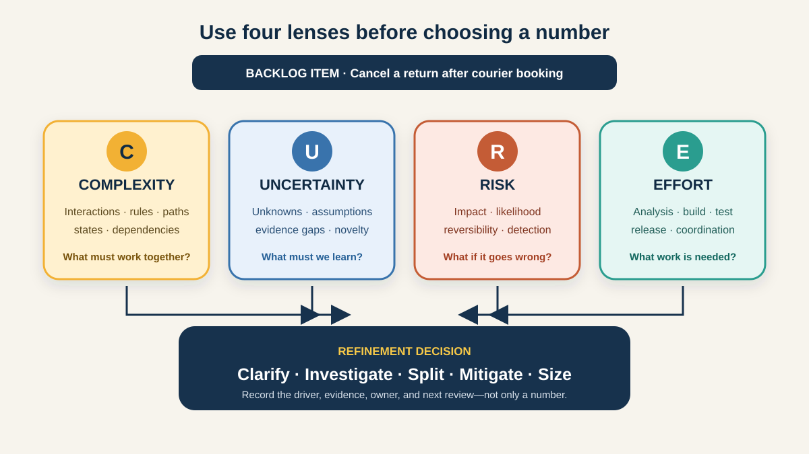

# The CURE Framework for Backlog Refinement

When a team says a backlog item is “big,” people may mean very different things. One person sees many interacting rules. Another lacks information. A third fears a costly failure. Someone else simply sees a lot of work. If those concerns are compressed into one number too early, the useful conversation disappears.

The **CURE framework** separates four lenses:

- **C — Complexity:** how many interacting parts, rules, paths, or dependencies must be understood;
- **U — Uncertainty:** what the team does not yet know or cannot confidently predict;
- **R — Risk:** what may happen if the change or delivery approach goes wrong; and
- **E — Effort:** how much work is expected to design, build, test, document, and release it.

CURE is a practitioner mnemonic used to improve refinement and estimation conversations. It is not an IIBA standard, a Scrum requirement, or a universal calculation. The official Scrum Guide allows details such as size to vary by domain and makes the people doing the work responsible for sizing. A Business Analyst (BA) contributes by making the need, rules, examples, evidence, assumptions, and consequences visible—not by assigning the team’s estimate.



This tutorial uses one illustrative online-shop item: **allow a customer to cancel a return after courier collection has been booked**. The policies, systems, ratings, and decisions are teaching assumptions rather than universal retail rules.

## 1. Start with four separate questions

The draft backlog item says:

> As a customer, I want to cancel my return so that I can keep the item.

Before voting on points or promising a date, ask four different questions:

| Lens | Core question | Return-cancellation signal |
|---|---|---|
| Complexity | How many interactions and paths must work together? | Return, courier, refund, inventory, notification, and audit states interact. |
| Uncertainty | What important information is missing or unreliable? | The team has not confirmed which courier statuses can still be cancelled. |
| Risk | What is the impact if the change behaves incorrectly? | A customer could receive a refund while keeping the item, or a courier could collect a cancelled return. |
| Effort | What work is likely to be required? | UI states, service changes, integration handling, tests, monitoring, support guidance, and rollout work. |

These dimensions influence one another but should not be treated as synonyms. Investigation may reduce uncertainty without changing the number of systems involved. A small code change may carry high financial risk. A large amount of repetitive work may require effort without being structurally complex.

**BA action:** capture one sentence and one piece of evidence for each lens. If the team can only say “it feels large,” the item is not ready for a useful decision.

## 2. Complexity: map interactions, not just task count

Complexity grows when behaviour depends on several rules, states, handoffs, roles, or systems. It is about the structure of the problem, not merely the length of a task list.

For the cancellation item, the BA maps a simplified state flow:

```text
Return requested
  → courier not booked: cancel locally
  → courier booked: request courier cancellation
      → accepted: cancel return and prevent refund
      → rejected / too late: keep return active and explain next step
      → timeout: preserve current state and retry or escalate safely
```

Useful complexity questions include:

- Which systems and teams own each state?
- Which business rules change by product, geography, payment method, or courier?
- Can events arrive twice or out of order?
- Which user, support, finance, and warehouse journeys are affected?
- What must remain consistent across the app, email, support screen, and reports?

The team rates complexity **Large** in this illustrative example because several state machines and ownership boundaries interact.

**Common mistake:** counting screens or acceptance criteria as complexity. Ten simple independent rules may be less complex than one rule that coordinates a refund, courier, and inventory state atomically.

## 3. Uncertainty: expose what is not known

Uncertainty is an evidence gap. It can come from an unclear policy, unfamiliar technology, incomplete data, an untested integration, changing scope, or knowledge concentrated in one person.

Create an uncertainty register instead of hiding unknowns in the estimate:

| Unknown | Why it matters | How to reduce it | Owner |
|---|---|---|---|
| Courier statuses that support cancellation | Determines available customer actions | Review contract and test sandbox responses | Integration lead |
| Whether refund authorization starts before pickup | Could create double compensation | Walk through current finance process and events | Finance SME |
| Support handling when courier cancellation times out | Affects recovery and customer message | Agree an operational fallback | Support lead |
| Volume of cancellation requests | Influences value and monitoring | Analyze return-event data | Product analyst |

The team rates uncertainty **Medium**: the gaps are material, but named people can answer them through a short investigation.

Uncertainty is not automatically risk. “We do not know whether the API supports cancellation” is uncertainty. “A failed cancellation may cause an incorrect refund” is a risk. The first needs learning; the second needs prevention, detection, response, or an explicit acceptance decision.

**BA action:** turn “we do not know” into a question, evidence source, owner, and deadline. A spike or experiment should have a learning outcome, not become an unbounded technical task.

## 4. Risk: make the consequence and response visible

Risk concerns possible events and their consequences. Explore business, customer, compliance, operational, security, data, and delivery risks—not only technical failure.

| Risk scenario | Impact | Prevent or reduce | Detect and respond |
|---|---|---|---|
| Refund continues after return cancellation | Financial loss and reconciliation work | Use one authoritative state and idempotent commands | Alert on cancelled return with refund event |
| Courier still collects the item | Customer harm and support contact | Show cancellation as pending until confirmed | Notify support when confirmation times out |
| Two cancellation requests arrive together | Duplicate calls and inconsistent status | Make operation safe to repeat | Record correlation ID and final state |
| Cancellation hides an already-started warehouse action | Lost inventory trace | Define the latest cancellable state | Audit event and exception queue |

The team rates risk **Large** because a wrong state can affect money, inventory, and customers and may be difficult to reverse.

A high-risk item is not necessarily low priority. It may be valuable and urgent, but it needs safeguards, a smaller release boundary, stronger evidence, or a deliberate decision by the appropriate owner.

**Common mistake:** increasing the estimate and calling the risk handled. Extra points do not prevent a duplicate refund. Record the control, owner, test evidence, monitoring, and recovery path.

## 5. Effort: let the delivery team size the work

Effort is the expected amount of work across the whole path to Done. It can include analysis, design, implementation, testing, accessibility, data changes, security review, documentation, training, deployment, monitoring, and coordination.

The BA helps reveal work that could otherwise be forgotten:

- messages for accepted, rejected, pending, and failed cancellation;
- Arabic and English content and layout;
- support and operations procedures;
- integration tests for duplicate, late, and timeout responses;
- audit, monitoring, analytics, and reconciliation;
- feature control, rollout, and rollback.

The people doing the work judge effort using their own context, skills, tools, Definition of Done, and current system. In this example they rate effort **Medium** after discussing the full delivery path.

Effort is not elapsed time. Waiting three days for a policy decision adds delay but little hands-on work; a one-day implementation by two specialists may still contain considerable effort. Do not convert a story point directly into hours unless the team has explicitly adopted and validated such a convention.

## 6. Facilitate the CURE conversation

A lightweight session can fit inside backlog refinement:

1. **Set context.** Restate the user outcome, scope boundary, current evidence, and open decisions.
2. **Define local anchors.** Agree what Small, Medium, and Large mean for each lens using examples from this team. Do not copy another team’s scale.
3. **Rate independently.** Developers, testing, design, operations, the PO, and the BA note a C/U/R/E profile before discussion.
4. **Reveal together.** Discuss the widest differences first. A disagreement is useful evidence that people hold different mental models.
5. **Name the driver.** Record why each dimension is not Small and what would change it.
6. **Choose an action.** Clarify, investigate, split, mitigate, size, defer, or reject. Do not automatically average the ratings.
7. **Revisit when evidence changes.** Re-rate after a spike, policy decision, split, or architecture change if the profile materially changes.

The BA facilitates clarity and records decisions. The PO connects the item to value and ordering. Delivery specialists explain technical paths and own sizing. Risk or domain owners decide matters within their authority.

## 7. Completed CURE refinement card

```text
Item: Cancel a return after courier booking
Outcome: Let customers correct a return decision without creating financial,
inventory, or support errors.

C — Complexity: LARGE
Evidence: Return, courier, refund, inventory, notification, and audit states interact.
Action: Draw the state model and split before/after courier booking.

U — Uncertainty: MEDIUM
Evidence: Supported courier cancellation statuses and timeout behaviour are unconfirmed.
Action: Time-box a sandbox investigation; integration lead owns the answer.

R — Risk: LARGE
Evidence: Duplicate refund or collection after cancellation could harm customer and business.
Action: Define authoritative state, idempotency, alerts, and manual recovery.

E — Effort: MEDIUM
Evidence: Changes span UI, service, integration tests, messages, monitoring, and support.
Action: Delivery team sizes after the split and uncertainty work.

Decision: NOT READY AS ONE ITEM
Split 1: Cancel before courier booking.
Discovery: Confirm courier cancellation contract and failure states.
Split 2: Cancel after booking with pending, rejected, timeout, and recovery behaviour.
```

After splitting, the first slice might become **C: Small, U: Small, R: Medium, E: Small**. The profile communicates why it is safer to start there; it does not claim mathematical precision.

## 8. Reusable CURE template

```text
Item and user / business outcome:
In scope / out of scope:
Evidence already available:

C — Complexity: Small / Medium / Large
Interactions, rules, paths, states, and dependencies:
Reason for rating:
Action to simplify:

U — Uncertainty: Small / Medium / Large
Unknowns and assumptions:
Evidence needed, source, owner, and due date:

R — Risk: Small / Medium / Large
Risk event, cause, and consequence:
Prevention, detection, response, and decision owner:

E — Effort: Small / Medium / Large
Work across analysis, design, build, test, release, and operation:
People doing the work who contributed to sizing:

Differences discussed:
Decision: clarify / investigate / split / mitigate / size / defer / reject
Follow-up owner and review date:
```

### Quick exercise

Apply CURE to this item: “Let a customer change the delivery address after payment.”

1. Identify one Complexity signal involving warehouse or courier state.
2. Write two Uncertainty questions and name their evidence sources.
3. Describe one fraud or misdelivery Risk and a control.
4. List the Effort beyond changing the address field.
5. Decide whether to clarify, investigate, split, mitigate, or size the item next.

## Further reading

- [Agile Ambition: What Is a Story Point—CURE the Debate](https://www.agileambition.com/Essays/What-Is-A-Story-Point)
- [Eric Biesterfeld: The CURE framework for breaking down tasks](https://www.ebiester.com/advice/2025/10/03/CURE-framework.html)
- [The official Scrum Guide: Product Backlog refinement and sizing](https://scrumguides.org/scrum-guide.html#product-backlog)

*CURE is a practitioner aid, not a mandated standard or a validated forecasting formula. The scenario, ratings, policies, systems, and controls are illustrative. Adapt the questions and scale to your team, domain, governance, and evidence.*
