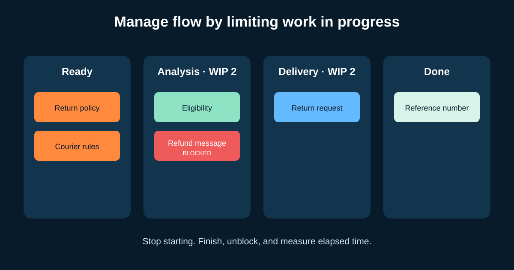

# Kanban for Business Analysts: Flow, WIP, and Cycle Time

Kanban is a strategy for optimizing the flow of value through a process. Teams visualize the real workflow, actively manage items, and improve the workflow using evidence. For a Business Analyst (BA), Kanban makes waiting rules, stakeholder decisions, analysis capacity, and blocked work visible.

It is not simply sticky notes on a board, and it does not require replacing Scrum. A Scrum Team can use Kanban practices inside Sprints; a support or operations team may use continuous flow.



## 1. Map the workflow that really exists

Our illustrative online-shop team receives return-journey changes. A first workflow is:

```text
Ready → Analysis → Delivery → Validation → Done
```

That is only useful after policies are explicit. For example:

| Boundary | Proposed policy |
|---|---|
| Ready → Analysis | Problem, requester, intended outcome, and decision owner are known |
| Analysis → Delivery | Rules, examples, dependencies, and open risks have been reviewed together |
| Delivery → Validation | Integrated behavior is available in the agreed environment |
| Validation → Done | Acceptance evidence recorded; release and operational actions identified |

These policies are illustrative. A policy should improve a decision, not become a secret gate owned by one role.

## 2. Limit work in progress (WIP)

**Work in progress (WIP)** is started work that has not finished. A **WIP limit** is an agreed maximum for a workflow state. If Analysis has a limit of two and already contains two items, the team should finish or unblock work before pulling another item.

Why this matters: five half-analyzed features create more switching, waiting, and stale assumptions than two items completed collaboratively. A limit exposes a capacity problem; it does not magically solve it.

When the refund-message item is blocked by a policy decision, the BA should:

1. mark it blocked and record the cause and start time;
2. contact the named decision owner with the specific decision needed;
3. help the team decide whether to swarm, split, or temporarily pull another item; and
4. review recurring blockage in the improvement conversation.

Do not raise a WIP limit just to make the board look compliant.

## 3. Pull work when there is capacity

In a **pull system**, downstream capacity signals that new work can enter. The returns team does not push ten “urgent” requests into Analysis. It orders the ready queue, then pulls the highest-value eligible item when capacity exists.

Useful BA questions:

- Does this item meet the entry policy, or will it immediately wait?
- Is a decision owner available?
- Can we split it into an independently valuable outcome?
- Is an expedite request truly exceptional, and what work will it delay?

## 4. Read the four basic flow measures

The 2025 Kanban Guide identifies four mandatory flow measures:

| Measure | Plain meaning | Example |
|---|---|---|
| **WIP** | Started items not finished | 5 open return items now |
| **Throughput** | Items finished per unit of time | 8 items completed in two weeks |
| **Work item age** | Elapsed time for one unfinished item | Refund-message item has been open 9 days |
| **Cycle time** | Elapsed time from start to finish for one completed item | Eligibility item took 6 days |

Agree exactly when the clock starts and stops. Comparing “commitment to production” with “development start to test complete” creates false conclusions.

Do not treat average cycle time as a promise. Look at the distribution and percentiles: if 85% of similar items finished within 12 days, the team can discuss a probabilistic expectation, not guarantee every item will.

## 5. Diagnose flow, not people

Suppose the board shows:

- analysis WIP stays at its limit;
- work item age rises before policy review;
- delivery is often idle waiting for examples; and
- throughput varies sharply.

The weak conclusion is “the BA is slow.” Better experiments include scheduling a policy-owner office hour, refining fewer items together, splitting discovery from delivery work visibly, or creating examples earlier.

Metrics should help improve the system. Never compare individual productivity by ticket count: items differ in size and complexity, and that pressure encourages artificial splitting and hidden work.

## 6. Scrum and Kanban can work together

| Scrum provides | Kanban can add |
|---|---|
| Product Goal and Sprint Goal | Visibility of flow toward the goals |
| Defined events and accountabilities | WIP limits and explicit pull policies |
| Sprint as a fixed feedback cycle | Cycle-time and work-age evidence inside the Sprint |
| Increment and Definition of Done | Flow focus until work genuinely meets Done |

Keep the Sprint Goal important. Do not use flow optimization to select unrelated work merely because it moves quickly.

## 7. A real board is only the start


*A physical Kanban board example. Photo by Dr Ian Mitchell, sourced from [Wikimedia Commons](https://commons.wikimedia.org/wiki/File:Kanban_board_example.jpg), available under CC0 or CC BY-SA 2.5.*

A digital board in Jira, Azure DevOps, Trello, or another tool is still only a representation. Check that hidden discovery, approvals, defects, and operational follow-up are visible enough to manage. Tool configuration should follow the workflow, not define it by accident.

## 8. Reusable flow review

```text
Service / value delivered:
Workflow states and start/finish points:
Entry and exit policy for each state:
WIP limit and reason for each active state:
Blocked-item policy and decision owner:
Classes of service, if any, and their rules:
Current WIP:
Recent throughput period:
Cycle-time distribution / percentile:
Oldest active items:
Observed bottleneck and evidence:
One improvement experiment, owner, and review date:
```

### Quick exercise

Analysis has a WIP limit of two. One item is blocked for nine days; one is active; an executive asks to start a third urgent item. Write the questions you would ask, the board update you would make, and one option that protects transparency.

## Further reading

- [The Kanban Guide](https://kanbanguides.org/)
- [The official Scrum Guide](https://scrumguides.org/scrum-guide.html)
- [Agile Manifesto principles](https://agilemanifesto.org/principles)

*The workflow, limits, measures, and policies are illustrative. Establish them with the people who perform and receive the work.*
