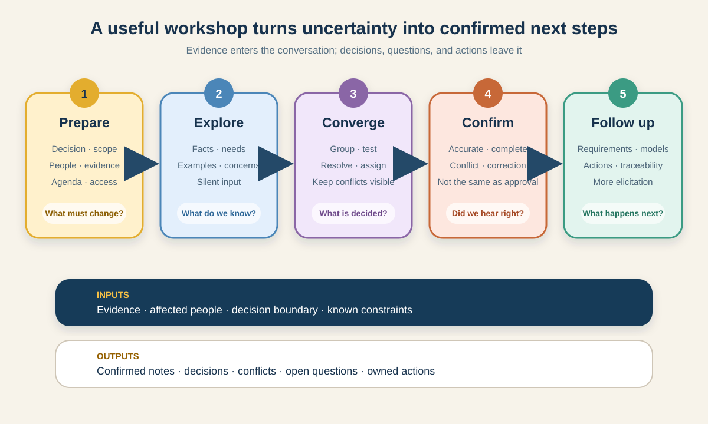

# Requirements Elicitation and Workshop Facilitation

Requirements elicitation is the work of drawing out, exploring, and receiving information from people and other sources. It is broader than asking stakeholders what they want. A Business Analyst (BA) also studies evidence, observes work, tests examples, exposes disagreements, and confirms what was understood.

The IIBA groups this work into preparing for elicitation, conducting it, confirming the results, communicating the information, and managing stakeholder collaboration. These activities are iterative—not a single “requirements gathering” meeting.

This tutorial shows how to choose an elicitation technique and facilitate a workshop that produces usable evidence, decisions, and open questions rather than a long set of untested notes.



## Running scenario: improve click-and-collect pickup

A grocery retailer is piloting click-and-collect in three stores. It wants customers to choose a pickup slot and allow another person to collect the order. Store operations, customer support, fraud and risk, product, and the delivery team hold different pieces of the answer.

The BA has been asked to facilitate a workshop that supports this decision:

> What rules, exceptions, and responsibilities must the first release cover for pickup slots and alternate collectors?

The company, roles, rules, timings, and decisions in this tutorial are **illustrative**. In a real initiative, verify them with the relevant stakeholders and organizational policies.

## 1. Define the elicitation outcome before choosing a meeting

Do not begin with “Let’s get everyone in a room.” Begin with the decision or uncertainty that needs attention.

| Planning question | Click-and-collect answer |
|---|---|
| Why are we eliciting? | Define a safe, workable first-release pickup policy |
| What must we learn? | Current workflow, identity checks, slot capacity, failure paths, decision ownership |
| What output is needed? | Agreed scope, candidate rules, exceptions, decisions, and open questions |
| Who will use it next? | Product owner, operations, delivery team, support, and risk owner |
| What is outside this activity? | Detailed screen design and rollout beyond the three pilot stores |

This boundary prevents the workshop from becoming a general discussion about the entire service. It also gives the facilitator a respectful way to park unrelated topics.

**BA action:** write one objective that begins with a decision verb: *define, compare, agree, identify,* or *validate*. “Discuss pickup” is not specific enough.

## 2. Choose the technique that fits the uncertainty

A workshop is useful when people need to build shared understanding, compare perspectives, or make connected decisions. It is not automatically the best first technique.

| Technique | Best used when | Scenario use | Limitation |
|---|---|---|---|
| Document analysis | Policies, reports, contracts, or previous requirements contain evidence | Review the current collection policy and support-contact reasons | Documents may describe the intended process, not actual work |
| Interview | One person has specialist, sensitive, or detailed knowledge | Interview the fraud lead about identity risks | Different interviews can produce conflicting accounts |
| Observation | Actual behavior, handoffs, or workarounds matter | Observe a busy pickup period at one pilot store | One observation may not represent every store or time |
| Survey | Input is needed from many people on bounded questions | Ask store colleagues which exceptions occur most often | Weak for exploring causes or unknown problems |
| Prototype or example | People react better to something concrete | Test a sample “alternate collector” journey | A polished example can narrow thinking too early |
| Workshop | Multiple roles must connect evidence and resolve dependencies | Agree the first-release flow, rules, and exception owners | Poor preparation can turn it into an expensive status meeting |

For this scenario, the BA first reviews the policy, observes pickup, and interviews the fraud lead. The workshop then uses that evidence to focus collaboration. This sequence is stronger than expecting participants to remember everything during one call.

**Caution:** do not invite a large group merely to make the outcome feel legitimate. Include people who contribute knowledge, make a decision, perform affected work, or must act on the result.

## 3. Prepare an elicitation activity plan

Preparation covers the scope, participants, technique, logistics, supporting material, and how results will be recorded and confirmed.

### Completed workshop plan

| Field | Illustrative plan |
|---|---|
| Objective | Agree the first-release pickup flow, candidate rules, and unresolved decisions |
| Decision owner | Product owner for release scope; risk owner for identity policy |
| Participants | BA/facilitator, store supervisor, pickup colleague, support lead, risk representative, product owner, engineer |
| Pre-read | One-page current flow, support themes, policy extract, and three exception examples |
| Duration | 90 minutes |
| Working method | Silent input, process walkthrough, example testing, rule review, decision check |
| Capture | Shared board plus an outcome log with IDs |
| Confirmation | Participants review the record within two working days; decision owners resolve named conflicts |
| Accessibility and logistics | Materials sent early, remote link tested, captions enabled, keyboard-accessible board alternative available |

### A practical 90-minute agenda

| Time | Activity | Intended result |
|---:|---|---|
| 0–10 min | Objective, scope, roles, and working agreements | Shared boundary |
| 10–25 min | Current-state walkthrough | Facts and pain points |
| 25–45 min | Future pickup journey | Candidate needs and handoffs |
| 45–65 min | Test four exceptions | Rules, gaps, and ownership |
| 65–80 min | Resolve or record decisions | Decisions and open conflicts |
| 80–90 min | Playback, actions, and confirmation method | Shared understanding of next steps |

Send the objective and preparation material early enough for people to review. Do not send a forty-page pack and call it pre-work.

## 4. Prepare questions that move from evidence to decisions

Good questions do not jump immediately to features. Move through a question ladder:

1. **Fact:** What happens today? What evidence supports that?
2. **Problem:** Where does the current outcome fail, and for whom?
3. **Need:** What outcome must improve?
4. **Rule:** What must always, sometimes, or never be true?
5. **Example:** What happens in this specific success or failure case?
6. **Decision:** Who can choose between the remaining options, and by when?

For the alternate-collector scenario, ask:

- What does store staff check today before releasing an order?
- Which part of that check is policy, and which part is a local workaround?
- What evidence would let staff trust an alternate collector?
- What happens when the name matches but the pickup code is missing?
- Can a customer change the collector after picking has started?
- Who owns the residual fraud risk and can approve the rule?

Avoid leading questions such as “Wouldn’t an SMS code solve this?” They smuggle a solution into the question. Ask about the required outcome and constraints before comparing options.

## 5. Facilitate the workshop from divergence to convergence

The facilitator owns the process, not every answer. Keep the content visible and move the group through two modes:

- **Divergence:** collect perspectives, evidence, examples, and concerns without judging them too early.
- **Convergence:** group related information, test it, identify conflicts, and seek a decision or named next step.

### Useful facilitation moves

**Open with a contract.** Restate the objective, decision authority, timebox, and working agreements. Ask whether a critical perspective is missing.

**Start with silent input.** Give everyone two or three minutes to write exceptions individually before discussion. This reduces anchoring on the first confident speaker.

**Use a shared model.** Walk through the pickup journey on screen. Attach questions and rules to the relevant step instead of creating an unrelated notes pile.

**Test concrete examples.** Use cases such as:

- customer arrives during the chosen slot;
- alternate collector has the code and valid identification;
- pickup code is correct but the name differs;
- customer changes the collector after the order is ready;
- the store is at capacity or the customer misses the slot.

**Play back neutrally.** Say, “I heard two different rules,” then state both. Do not turn the loudest view into agreement.

**Close each topic explicitly.** Mark it as a decision, candidate requirement, confirmed fact, conflict, open question, or parked item.

## 6. Manage difficult workshop dynamics

Facilitation is not avoiding disagreement. It is making disagreement useful and safe enough to examine.

| Situation | Facilitator response |
|---|---|
| One participant dominates | Thank them, summarize the point, then invite each affected role to add or challenge evidence |
| People stay silent | Use silent writing, a round-robin, chat, or anonymous input before open discussion |
| Two roles contradict each other | Record both statements, ask for source evidence, and name the decision owner |
| The group designs screens too early | Return to the user outcome, rule, and exception; park interface ideas for later design work |
| A decision owner is absent | Do not manufacture consensus; document options, impact, owner, and deadline |
| Remote participants are overlooked | Alternate voice and chat input, keep the board readable, and pause before closing a topic |
| Sensitive information appears | Stop unnecessary capture, follow the organization's privacy rules, and restrict the record appropriately |

“Everyone agreed” is not credible when several participants never had a practical way to contribute.

## 7. Capture elicitation results live

Workshop notes should separate evidence from interpretation. A useful capture structure is:

| Type | Meaning |
|---|---|
| Fact | A statement supported by an identified source |
| Need | An outcome a stakeholder or the business requires |
| Candidate rule or requirement | A statement still requiring analysis and validation |
| Example or exception | A concrete case that tests understanding |
| Decision | A choice made by the authorized owner |
| Open question | Missing or conflicting information |
| Action | Named owner and due date for follow-up |

### Completed outcome log

| ID | Type | Workshop result | Source or owner | Status |
|---|---|---|---|---|
| FACT-01 | Fact | Staff currently use an order reference and a name during pickup | Pilot-store walkthrough | Confirmed for Store A only |
| NEED-01 | Need | Staff need a quick way to identify an authorized collector without calling support | Store supervisor and support lead | Confirmed |
| RULE-01 | Candidate rule | The customer must name the alternate collector before pickup | Risk representative | Needs policy validation |
| EX-01 | Exception | Collector has the pickup code but identification is expired | Workshop group | Decision required |
| DEC-01 | Decision | First release supports one alternate collector per order | Product owner | Decided in session |
| OPEN-01 | Open question | Can the collector be changed after the order is marked ready? | Risk owner | Due 6 Oct |
| ACT-01 | Action | Compare identity options and document fraud impact | BA + risk owner | Due 6 Oct |

These are results of elicitation, not automatically approved requirements. The BA still analyzes wording, dependencies, feasibility, priority, and traceability.

## 8. Confirm the results—do not confuse confirmation with approval

**Confirmation** checks that the captured information accurately reflects what participants meant and does not contain obvious omissions, conflicts, or ambiguity. **Approval** is a governance decision by an authorized person. They may happen at different times.

After the workshop:

1. clean the record without hiding disagreements;
2. compare it with the policy, observation notes, and other sources;
3. highlight changes, conflicts, and questions rather than burying them;
4. send the right level of detail to each reviewer;
5. ask for a specific response by a specific date; and
6. preserve the confirmed version and decision history.

Use clear response states:

| State | Meaning |
|---|---|
| Confirmed | “This accurately represents my input.” |
| Correction requested | The record misstates the participant's input |
| Conflict remains | Sources or stakeholders still disagree |
| Not confirmed | The right reviewer has not responded or lacks evidence |

No response is not agreement. Follow the organization's escalation and approval rules rather than silently marking the record confirmed.

## 9. Turn confirmed results into connected requirements work

Once confirmed, transform the information into the smallest useful set of artifacts:

- update the current and future process;
- write and classify requirements and business rules;
- connect exceptions to acceptance examples;
- record assumptions, risks, dependencies, and decisions;
- trace each important item to its source and validation method; and
- schedule additional elicitation where gaps remain.

For example, `RULE-01` may become a business rule, `EX-01` may become an acceptance example, and `OPEN-01` remains visibly unresolved. Do not make an open question disappear by rewriting it as a confident requirement.

## 10. Reusable elicitation and workshop template

```text
Activity title:
Decision or uncertainty to address:
Objective and expected outputs:
In scope / out of scope:
Known evidence and source links:
Technique(s) selected and why:
Participants, roles, and decision authority:
Pre-work and supporting materials:
Date, duration, location / remote link:
Accessibility, privacy, and recording considerations:

Agenda and timeboxes:
Working agreements:
Questions and examples to test:
Capture method and facilitator roles:

Results:
- Confirmed facts:
- Stakeholder and business needs:
- Candidate rules / requirements:
- Examples and exceptions:
- Decisions and decision owners:
- Conflicts and open questions:
- Actions, owners, and due dates:

Confirmation audience and deadline:
Response status and corrections:
Links to updated requirements and models:
```

## Common mistakes checklist

- [ ] The activity has a decision-focused objective, not only a topic.
- [ ] The selected technique fits the uncertainty and audience.
- [ ] Evidence and pre-work are proportionate and accessible.
- [ ] Participants know who contributes, who decides, and who facilitates.
- [ ] The agenda includes exceptions, not only the happy path.
- [ ] Quieter and remote participants have a usable contribution channel.
- [ ] Facts, assumptions, candidate requirements, decisions, and questions are separated.
- [ ] Conflicts retain their sources and owners.
- [ ] Results have a confirmation method and deadline.
- [ ] Confirmation is not misrepresented as formal approval.

## Practice exercise

Extend the click-and-collect pilot so a customer can **miss a pickup slot and rebook once**. Prepare a 45-minute workshop plan with:

1. one decision-focused objective;
2. the five essential participants and one decision owner;
3. three pieces of pre-work;
4. four success or failure examples;
5. one method for balanced participation; and
6. a confirmation deadline and response states.

Then write one fact, one candidate rule, one exception, and one open question without presenting any of them as more certain than the evidence allows.

## Further reading

- [IIBA: Elicitation and Collaboration](https://www.iiba.org/knowledgehub/the-business-analysis-standard/5-applying-business-analysis-tasks/5-3-business-analysis-knowledge-areas/elicitation-and-collaboration/)
- [IIBA: Conduct Elicitation](https://www.iiba.org/knowledgehub/business-analysis-body-of-knowledge-babok-guide/4-elicitation-and-collaboration/4.2-conduct-elicitation)
- [IIBA: Elicitation and Collaboration task cards](https://www.iiba.org/contentassets/a861c801c0df4d96bb57eb21f726ac34/all-task-cards-elicitation-and-collaboration.pdf)

*The scenario and its roles, timings, rules, evidence, and decisions are illustrative. Adapt the techniques, privacy controls, approval route, and records to your organization.*
