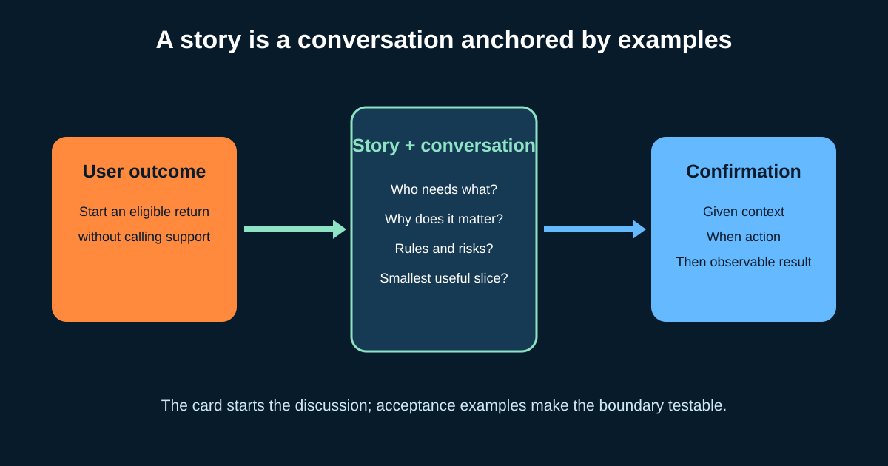

# User Stories and Acceptance Criteria with Given/When/Then

A **user story** is a short reminder to discuss a user need—not a miniature contract containing everything developers need. Its value comes from the **card, conversation, and confirmation** around it.

For a Business Analyst (BA) or Product Owner (PO), the goal is to connect a user outcome to business value, uncover rules and exceptions with the team, and leave observable examples that can guide design and testing.



## 1. Start from the user outcome

Our illustrative online shop wants eligible customers to start a return without contacting support.

```text
As a customer with a delivered item,
I want to request an eligible return online,
so that I can receive next steps without contacting support.
```

The familiar format is useful, but grammar is not quality. Check:

- Is “customer with a delivered item” a meaningful role or context?
- Is the need expressed without committing to a button, database, or implementation?
- Is the benefit specific enough to explain why the item matters?
- Does the story connect to a product outcome and evidence?

“As a system, I want a database table” is usually a technical task, not a user story. Technical work can be essential; label it honestly and link it to the outcome it enables.

## 2. Use the card to start a conversation

Bring the PO, Developers, testing, design, operations, and relevant policy experts into refinement. Ask:

| Area | Returns question |
|---|---|
| Scope | One item or several? Guest orders? International orders? |
| Rules | Which categories and return windows apply? Who owns the rule? |
| Data | Which order, item, reason, timestamp, and eligibility result are recorded? |
| Integration | What happens if courier or refund service is unavailable? |
| Quality | Accessibility, security, response time, audit, localization? |
| Outcome | Which completion and support-contact measures will change? |

Record confirmed rules separately from assumptions and open decisions. Acceptance criteria should not hide unresolved product policy.

## 3. Write acceptance criteria as boundaries

Acceptance criteria describe conditions the solution must satisfy. They can be a checklist or examples. **Given/When/Then** is valuable when context, action, and observable result matter:

```gherkin
Scenario: Eligible item creates one return request
  Given order item "I1" was delivered 10 days ago
  And its category is returnable
  And no return request exists for item "I1"
  When the customer confirms the return reason
  Then one return request is created for item "I1"
  And the customer sees a unique return reference
```

- **Given** establishes relevant context, not every database detail.
- **When** identifies the event or action.
- **Then** states an observable outcome, not an internal method.

Use concrete values when they expose a boundary. “10 days” is useful only if the example also states the illustrative window or points to the maintained policy.

## 4. Add exceptions before implementation exposes them

```gherkin
Scenario: Return window has expired
  Given the configured return window is 30 days
  And the item was delivered 31 days ago
  When the customer tries to start a return
  Then no return request is created
  And the customer sees the applicable reason and support route
```

```gherkin
Scenario: Repeated confirmation does not create a duplicate
  Given a return request already exists for item "I1"
  When the customer confirms the same return again
  Then no second request is created
  And the existing return reference is shown
```

Cover permission, missing data, empty states, limits, retries, duplicate actions, downstream failure, and recovery where relevant. Do not write dozens of low-value examples; focus on business risk and boundaries.

## 5. Keep stories small without losing value

The original story may still be too large. Split by a meaningful dimension:

| Split | First slice | Later slice |
|---|---|---|
| Business rule | Standard returnable categories | Exceptions requiring review |
| Workflow | Create request and reference | Courier scheduling |
| Data variation | One item | Several items from one order |
| Channel or geography | Domestic web orders | International and app orders |

Avoid horizontal technical slices such as “database first, UI later” if no slice produces testable user behavior. Sometimes enabling work must precede the feature; make that dependency visible.

Use the **INVEST** heuristic as a conversation: Independent enough, Negotiable, Valuable, Estimable, Small, and Testable. It is a diagnostic, not a pass/fail bureaucracy.

## 6. Separate acceptance from Definition of Done

| Acceptance criteria | Definition of Done |
|---|---|
| Specific to one item | Shared quality expectations for every Increment |
| “Expired item shows a policy reason” | Code reviewed, tests pass, accessibility checks completed, monitoring ready |
| Helps confirm scope and behavior | Helps confirm releasable quality |

Passing the examples does not replace security, performance, accessibility, data, and operational checks. Conversely, a technically “Done” feature may still fail the intended business outcome after release.

## 7. Completed story brief

```text
Title: Start an eligible single-item return
Outcome link: Reduce avoidable return-support contacts
Story: As a customer with a delivered item, I want to request an eligible
return online, so that I can receive next steps without contacting support.
In scope: One domestic delivered item, standard reason, original payment method
Out of scope: Exchanges, damaged-item review, international orders
Rules source: Return policy owner; version/date recorded
Acceptance examples: Eligible, expired, non-returnable, duplicate, courier failure
Data / quality: Audit eligibility result; protect personal data; accessible errors
Dependencies: Order status, returnability, courier, refund service
Open decision: Save request before or after courier booking?
Measure: Completion and support-contact rate, compared with agreed baseline
```

### Reusable template

```text
Title and outcome link:
As a [role/context], I want [capability], so that [value].
In scope / out of scope:
Confirmed business rules and source:
Given/When/Then success examples:
Given/When/Then boundary and failure examples:
Data, quality, accessibility, security, and reporting needs:
Dependencies:
Assumptions and open decisions:
Measure and baseline:
Reviewers and decision owner:
```

### Quick exercise

Write a story for a customer returning **two of three items**. Add one success example, one expired-item example, and one duplicate-confirmation example. Then identify what should be split from the first release.

## Further reading

- [Agile Alliance: User Stories](https://agilealliance.org/glossary/user-stories/)
- [Cucumber: Gherkin reference](https://cucumber.io/docs/gherkin/reference/)
- [The official Scrum Guide](https://scrumguides.org/scrum-guide.html)

*All policies, dates, roles, and measures in the example are illustrative. Confirm them with responsible stakeholders.*
