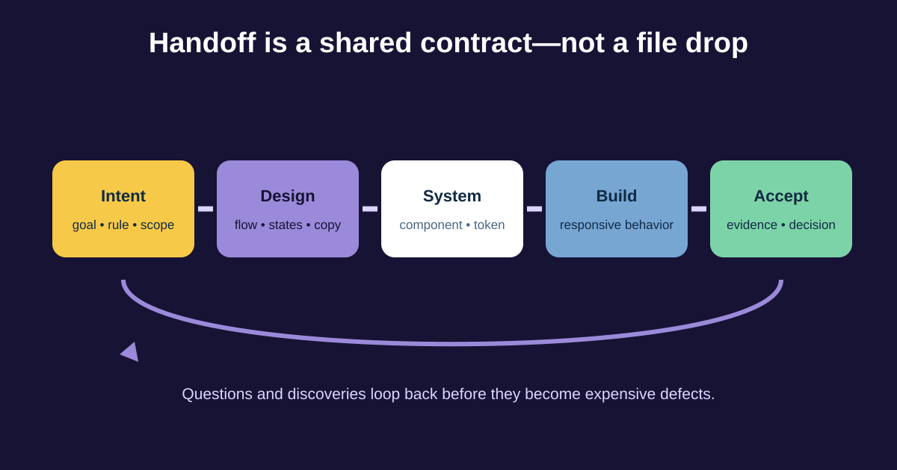

# Design-to-Development Handoff for Business Analysts

Handoff is not the moment a designer sends a link and engineering starts copying pixels. It is an ongoing conversation that connects validated intent, behaviour, reusable system choices, constraints, implementation discoveries, and acceptance evidence.

For our return journey, the BA helps ensure that eligibility rules, content meaning, loading and failure behaviour, analytics, and operational recovery survive the move from prototype to production.



## 1. Know the handoff vocabulary

- **Design specification:** details needed to understand intended layout, content, behaviour, assets, and responsive rules.
- **Redline:** a visual annotation of measurements such as spacing and size. Modern tools often expose these values through inspection rather than separate redline files.
- **Component:** a reusable interface element with documented purpose and variants.
- **Design token:** a named design value or decision—such as colour, spacing, typography, radius, or motion—that can map across design and code.
- **Asset:** an icon, image, illustration, font, or file required by the experience.

Tokens create a shared vocabulary: `space-300` communicates a system decision better than “12 pixels here,” if the team’s design and code systems actually use that token. Do not invent token mappings in a requirement; confirm them with design and engineering.

## 2. Separate the decision layers

| Layer | Return example | Typical lead, with collaboration |
|---|---|---|
| Product outcome | Eligible customers complete self-service returns confidently | Product owner / BA |
| Business rule | Eligibility source and policy reason | Policy owner / BA |
| Experience behaviour | Preserve choices after courier timeout | Design / BA / engineering |
| Design-system use | Alert, Button, Status, spacing and colour tokens | Design-system team |
| Implementation | State management, API retry, caching, component code | Engineering |
| Acceptance evidence | Scenario tests, accessibility checks, analytics, usability evidence | Whole team |

The BA should challenge an implementation detail when it changes business behaviour, risk, scope, or acceptance. Otherwise, keep the requirement outcome-focused and let specialists choose the mechanism.

## 3. Build a traceable handoff package

A useful package can include:

1. user goal, scope, and evidence;
2. linked flow and version or review date;
3. business rules and content source;
4. state matrix and responsive behaviour;
5. component and token references;
6. data, permissions, integrations, analytics, privacy, and accessibility expectations;
7. acceptance examples and known exclusions; and
8. open decisions with owners and dates.

### Completed handoff slice

| Item | Return example | Source / owner |
|---|---|---|
| Flow | Order details → reason → pickup → confirmation | Figma flow RET-v3 / design |
| Rule | Item must be delivered and within approved window | Policy rule RET-ELIG-01 / policy |
| Content | Show specific ineligibility reason and support route | Content table / product content |
| Component | Design-system Alert with error and info variants | Component library / design system |
| State | On courier timeout, preserve request and selected pickup | State matrix / product + engineering |
| Analytics | Start, eligibility result, submit, booking failure, completion | Tracking plan / analytics |
| Acceptance | No duplicate request; status announced; Arabic RTL verified | Scenario set / team |

Links alone are fragile. Include stable IDs or names so a requirement remains understandable when frames move.

## 4. Run a readiness conversation

Ask design:

- Which flow and component states are approved, exploratory, or intentionally excluded?
- What changes at narrow widths, with long content, and in Arabic?
- Which patterns come from the design system?

Ask engineering:

- Which data and error states can the services actually provide?
- What happens on delay, repeat submission, partial success, and refresh?
- Are any proposed components or tokens unavailable in code?

Ask QA, accessibility, analytics, operations, and content owners what evidence and instrumentation they need. Record answers in the maintained source rather than meeting notes only.

## 5. Handle gaps and change without blame

When implementation reveals that a courier API cannot confirm booking immediately, do not silently approximate the approved success state. Reopen the product decision: pending status, customer message, operational ownership, notification, timeout, and measurement.

Use lightweight change control:

```text
Discovery: Courier response can remain pending for 90 seconds.
Affected intent: Customer must know whether the return exists and avoid duplicates.
Options: wait; save pending request; manual support fallback.
Decision: Save pending request, show reference, notify when booking resolves.
Owners: Product + operations + engineering.
Artifacts updated: state matrix, prototype, acceptance examples, tracking plan.
```

A screenshot annotated with measurements cannot resolve missing business behaviour.

## 6. Reusable handoff-readiness checklist

```text
User outcome, evidence, and scope:
Design flow link, version, and review date:
Rules and content sources:
All relevant states and recovery:
Responsive, localization, and accessibility behaviour:
Components, variants, tokens, and assets:
Data, permissions, APIs, privacy, and analytics:
Acceptance examples and non-functional expectations:
Known exclusions and implementation freedoms:
Open decisions, owners, due dates:
Discovery / change process:
Final evidence and acceptance owner:
```

### Quick exercise

Engineering reports that the return API may succeed after the UI times out. Write the decision record: user risk, duplicate protection, pending state, recovery, analytics event, operational owner, and acceptance evidence.

## Further reading

- [Figma: Guide to developer handoff](https://www.figma.com/best-practices/guide-to-developer-handoff/)
- [Design Tokens Community Group: Format Module](https://www.designtokens.org/tr/drafts/format/)
- [W3C WAI: Involving Users in Evaluating Web Accessibility](https://www.w3.org/WAI/test-evaluate/involving-users/)

*Tool capabilities and team responsibilities vary. Agree on the maintained sources, owners, and review process for your organisation.*
