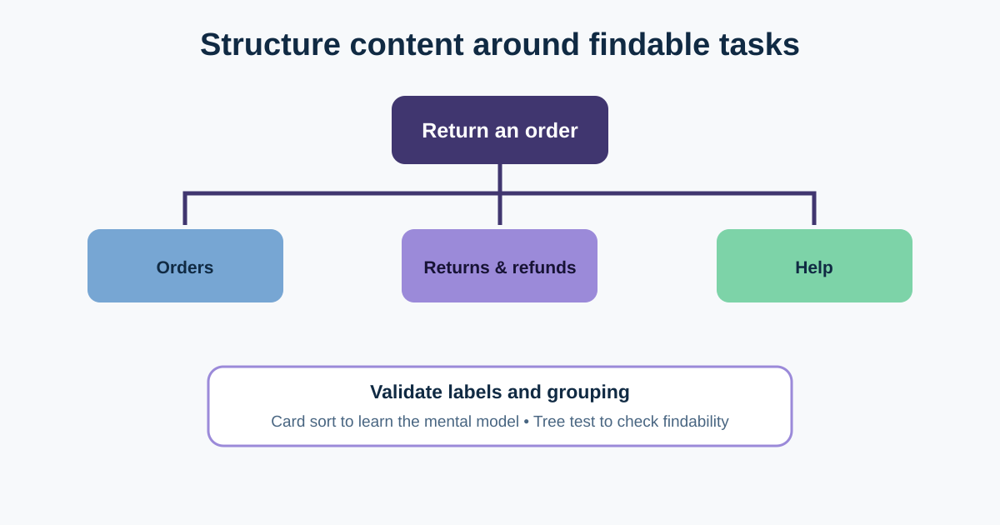

# Information Architecture and Card Sorting

Information architecture (IA) is how information and functionality are organised, labelled, connected, and made findable. A site map is one output, but the real goal is to help people predict where something lives and what a label means.

In our return journey, customers look in Help, Order details, email, and account navigation. The BA can connect policy ownership and product requirements to a structure that reflects user tasks rather than internal departments.



## 1. Start with tasks and a content inventory

List the content and actions that already exist before designing navigation. For returns, the inventory may include policy eligibility, order history, item details, return action, pickup options, request status, refund timing, and support escalation.

Add useful metadata:

| Item | User task | Current owner | Risk / issue |
|---|---|---|---|
| Return policy | Decide whether an item can return | Policy | Duplicated in Help and checkout terms |
| Return item action | Begin a request | Product | Visible only after opening one order |
| Return status | Understand the next step | Operations | Status labels differ from email |
| Refund timing | Know when money arrives | Finance | Range depends on payment method |

Remove outdated duplicates only after confirming ownership, regulatory retention, search traffic, and dependent links.

## 2. Model the hierarchy in the user’s language

A simple proposed structure might be:

```text
Account
├─ Orders
│  └─ Order details
│     ├─ Return item
│     └─ Track return
├─ Returns & refunds
│  ├─ Eligibility and policy
│  ├─ Return status
│  └─ Refund timing
└─ Help
   └─ Contact support
```

This is a hypothesis, not a validated answer. “Reverse logistics” may match an internal team but not a customer’s language. “My returns” may be clear only after someone has started a return. Test the labels in realistic contexts.

## 3. Use card sorting to learn grouping expectations

In a **card sort**, participants group labelled content cards. The method helps reveal users’ mental models.

- **Open sort:** participants create and name groups. Use it while exploring structure and vocabulary.
- **Closed sort:** participants place cards into defined categories. Use it to evaluate an existing or constrained structure.
- **Hybrid sort:** categories are provided, but participants may add groups. Use it when some structure is fixed and uncertainty remains.

Example cards: Return an item, Check eligibility, Track a return, Refund timing, Change pickup, Contact support, Download label, Report damaged item.

Write neutral card labels. If the label already reveals the category—“Returns: refund timing”—the exercise cannot test where people expect it.

Card sorting suggests grouping; it does not prove that people can navigate a complete interface. Participant selection, card set, category limits, and analysis choices affect the result.

## 4. Validate the proposed tree

Use **tree testing** to present the text hierarchy without visual design. Give a task such as: “Your courier has not arrived. Where would you look to change the pickup?” Record first choice, final destination, success, time, and route.

Investigate patterns:

- Do participants split between Orders and Returns & refunds?
- Does “Help” attract people because the product previously trained them to use it?
- Do Arabic and English labels create equivalent expectations?
- Does success change for first-time versus repeat returners?

Do not move an item based on one failed attempt. Review the task wording, participant fit, and competing routes. Sometimes two entry points with one maintained source are appropriate.

## 5. Connect IA to requirements and governance

The BA records more than a tree:

| Decision | Example |
|---|---|
| Canonical content owner | Policy owns eligibility rules; product consumes a maintained summary |
| Navigation entry points | Order details and Returns & refunds both lead to the same flow |
| Search terms | “return,” “send back,” “refund,” plus validated Arabic terms |
| Permissions | Only the authenticated customer sees order-specific actions |
| Empty state | No returns yet: explain eligibility and link to orders |
| Analytics | Track entry point, task success proxy, dead ends, and support escalation |

URL structure, search indexing, localization, and content lifecycle may create technical or governance constraints. Make them explicit rather than treating the site map as the complete requirement.

## 6. Reusable IA decision sheet

```text
User task and evidence:
Content / action inventory:
Current labels and locations:
Proposed hierarchy:
Canonical owner and update process:
Open / closed / hybrid card sort, and why:
Participant groups:
Cards and categories:
Tree-test tasks:
Success and problem signals:
Language / localization questions:
Accessibility, permissions, search, and analytics needs:
Decision, owner, date, and evidence:
```

### Quick exercise

Place “Download return label,” “Change pickup,” and “Refund timing” in the proposed tree. Write one card-sort question and one tree-test task that could challenge your choice. Include an alternative route rather than assuming there can be only one.

## Further reading

- [Nielsen Norman Group: Information Architecture Study Guide](https://www.nngroup.com/articles/ia-study-guide/)
- [Nielsen Norman Group: Card Sorting—Uncover Users’ Mental Models](https://www.nngroup.com/articles/card-sorting-definition/)
- [Nielsen Norman Group: Tree Testing](https://www.nngroup.com/articles/tree-testing/)

*The proposed hierarchy is illustrative. Validate it with representative users, content owners, search evidence, and technical constraints.*
