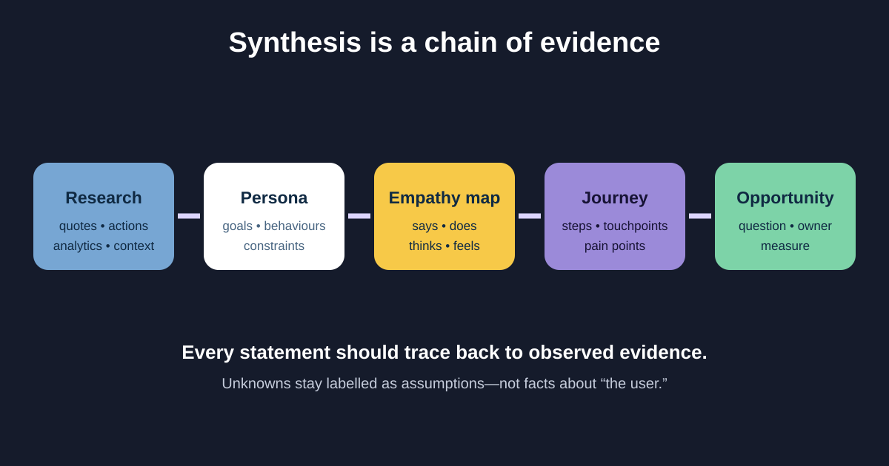

# Personas, Empathy Maps, and Customer Journeys

Personas, empathy maps, and journey maps are synthesis tools: they help a team make sense of research and decide what to investigate or improve. They are not substitutes for evidence, and they become dangerous when invented details are presented as facts about users.

We will synthesize the illustrative return research from the previous lesson. Customers want to know whether an item can be returned, complete the request, and understand what happens next—even when a courier cannot be booked.



## 1. Choose the artifact from the question

| Artifact | Main question | Useful contents |
|---|---|---|
| Persona | Which meaningful behaviour patterns and goals are we designing for? | Goals, behaviours, context, constraints, evidence sources |
| Empathy map | What did one user group say, do, think, and feel in this situation? | Direct observations, quotes, inferred thoughts clearly labelled |
| Journey map | How does the experience unfold over time and across channels? | Stages, actions, touchpoints, questions, pain points, evidence, opportunities |

Do not create all three by default. If the decision is about a handoff between support and courier operations, a journey or service blueprint may be more useful than a polished persona poster.

## 2. Build personas from patterns, not imagination

A useful persona represents a recurring behaviour pattern relevant to the product decision. Age, job, photo, and favourite brand are unnecessary unless they affect the task.

### Evidence-backed persona fragment

```text
Behaviour group: First-time self-service returners
Goal: Know whether the item is eligible and finish without calling support
Observed behaviours: Opens Help before Order details; compares policy wording;
  takes a screenshot of the reference number
Context: Often on mobile, sometimes while repacking the item
Constraints: May not remember the order number; may use larger text
Evidence: Sessions P02, P04, P06; support theme RTN-HELP; mobile funnel
Assumptions to test: Prefers courier pickup over drop-off
```

Do not use a persona to average away important differences. If screen-reader users encounter a distinct navigation barrier, record and address it directly.

## 3. Use empathy maps carefully

An empathy map commonly groups **Says, Does, Thinks, and Feels**. “Says” and “Does” can come from observation. “Thinks” and “Feels” are interpretations unless the participant expressed them, so label the source.

| Area | Return example | Evidence status |
|---|---|---|
| Says | “I only want to know if it can go back.” | Direct quote from P04 |
| Does | Opens Help, then searches the order email | Observed in P02 and P04 |
| Thinks | May believe Help owns the return process | Interpretation to test |
| Feels | Says they are unsure after seeing “request received” | Self-reported |

The map should expose gaps, not decorate a workshop wall. Add source IDs and unresolved questions.

## 4. Map the end-to-end customer journey

A journey map starts before the interface and may continue after it. For returns, the customer notices a problem, checks policy, finds the order, submits a request, hands over the parcel, waits for inspection, and receives a refund.

### Completed journey slice

| Stage | Customer action | Touchpoint | Pain point / evidence | Opportunity | Owner |
|---|---|---|---|---|---|
| Decide | Checks whether item is returnable | Help, policy, order | Terms differ across pages | Use one policy source and plain-language summary | Policy + content |
| Start | Finds delivered order | App order history | Some users search email first | Deep-link from delivery email; test discoverability | Product |
| Submit | Selects reason and pickup | Return flow | Courier error loses confidence | Preserve request and explain recovery | Product + integration |
| Track | Looks for status | App, email | “Received” is ambiguous | Name the current stage and expected next update | Operations + product |
| Refund | Confirms money arrived | App, bank | Timing differs by payment method | Show an evidence-based range and escalation route | Finance + support |

The “opportunity” is not automatically a feature. Turn it into a question—“How might we preserve confidence during courier failure?”—then explore options.

## 5. Keep scope, emotion, and ownership honest

- Define the journey’s start and end. A map of “the whole customer lifecycle” is usually too broad to act on.
- Use an emotion line only when it reflects evidence, not workshop guesses.
- Show frontstage and backstage actors when handoffs cause the pain; a service blueprint may be the next artifact.
- Distinguish current-state evidence from a future-state proposal.
- Date the map and state the population. Journeys change as policy and channels change.

## 6. Reusable synthesis template

```text
Decision this synthesis supports:
User group / behaviour pattern:
Research sources and dates:
Confirmed goals, behaviours, context, constraints:
Quotes and observation IDs:
Assumptions and contradictory evidence:

Journey scope: starts when… / ends when…
Stage:
User goal and action:
Touchpoint / channel:
Question or emotion, with source:
Pain point, with source:
Backstage dependency / owner:
Opportunity question:
Measure or validation method:
Open decision and owner:
```

### Quick exercise

Extend the journey with a “courier never arrived” stage. Add the customer goal, evidence you would need, frontstage response, backstage owner, one opportunity question, and one measure. Keep any invented detail labelled as an assumption.

## Further reading

- [Nielsen Norman Group: Personas Make Users Memorable for Product Team Members](https://www.nngroup.com/articles/persona/)
- [Nielsen Norman Group: Empathy Mapping](https://www.nngroup.com/articles/empathy-mapping/)
- [Nielsen Norman Group: Journey Mapping 101](https://www.nngroup.com/articles/journey-mapping-101/)

*All participants, observations, support tags, and journey facts in this teaching example are illustrative.*
