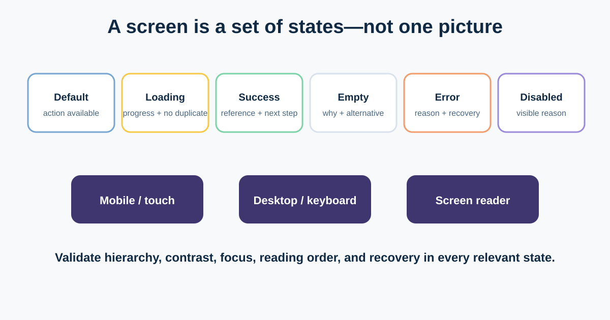
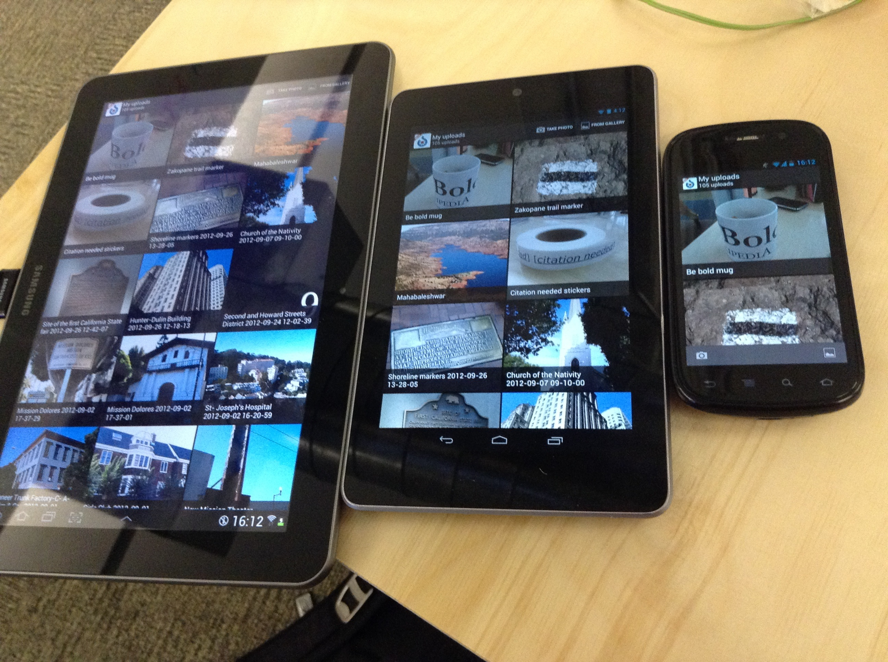

# UI, Interaction States, Responsive Design, and Accessibility

A static happy-path screen hides much of the product requirement. Real interfaces wait, fail, become empty, adapt to different viewports and inputs, and must communicate through more than colour or pointer hover.

This lesson turns the online shop’s return screen into a state matrix a designer, engineer, tester, and Business Analyst can review together. It introduces visual hierarchy and common patterns only to the depth needed for precise product decisions.



## 1. Review visual hierarchy from the task

**Visual hierarchy** helps people notice and understand information in a useful order. It uses position, size, contrast, spacing, alignment, grouping, and typography—not size alone.

For the return confirmation, the intended reading order might be:

1. item and eligibility result;
2. refundable amount and method;
3. pickup choice and instructions;
4. primary Confirm return action; and
5. policy details and support as secondary paths.

Ask whether the visual order matches the decision. Large promotional content should not compete with a consequential return confirmation. Consistent spacing and alignment reveal groups; inconsistent spacing can imply relationships that do not exist. A typography scale should distinguish headings, body text, labels, and supporting text without using tiny copy for important conditions.

## 2. Name UI patterns so the team can discuss trade-offs

| Pattern | Useful when | Return-flow caution |
|---|---|---|
| Modal dialog | A focused decision interrupts the current context | Must manage focus, close behaviour, and small screens; do not hide a long workflow inside it |
| Tooltip | Brief supplementary explanation | Cannot hold essential instructions; hover is not available to everyone |
| Inline validation | A field can be corrected in context | Explain the problem and recovery; do not rely on red alone |
| Empty state | A list or result has no content | Distinguish “no returns yet” from failed loading or no eligible items |
| Pagination | Stable chunks and known position matter | Preserve filters and position; clarify total if known |
| Infinite scroll | Continuous browsing has value | Can harm position, footer access, sharing, and keyboard navigation |
| Toast / status message | Briefly confirms a completed action | Important results should persist and be announced to assistive technology |

Pattern names create shared vocabulary, not automatic answers. Choose from task, content, risk, platform conventions, and evidence.

## 3. Specify the state matrix

For each important component or screen, consider:

- **Default:** what is ready and what action is primary?
- **Hover:** supplementary pointer feedback; never the only way to reveal essential content.
- **Focus:** a visible indicator and logical keyboard order.
- **Active / pressed / selected:** what is happening now?
- **Disabled:** why is it unavailable, and can the user learn how to proceed?
- **Loading:** what remains stable, what progress is announced, and how are repeats prevented?
- **Success:** what changed, what reference exists, and what comes next?
- **Empty:** is there no data, no eligible result, or no permission?
- **Error:** what happened, what was preserved, and how can the user recover?

### Completed return-state matrix

| State | Visible behaviour | Data / rule | Accessibility and recovery |
|---|---|---|---|
| Default | Eligible item and Confirm action | Latest approved eligibility result | Clear heading and action name |
| Loading | Button unavailable; “Submitting return…” | Prevent or safely handle duplicate requests | Programmatically announced status; focus stays stable |
| Success | Reference, pickup details, Track return | One auditable request exists | Focus or announcement reaches confirmation |
| Empty | “No eligible delivered items” plus policy and orders link | Distinguish no orders from ineligible orders | Explanation is text, not icon alone |
| Error | Request saved; courier booking failed; Retry and support | Preserve request ID and selected option | Error summary links to affected area; reason and next step |
| Disabled | Confirm unavailable until pickup selected | Rule is visible near control | Do not depend on disabled control for explanation |

## 4. Define responsive behaviour, not just breakpoints



*A responsive interface displayed across devices. Photo by Tfinc, sourced from [Wikimedia Commons](https://commons.wikimedia.org/wiki/File:Responsive_design_-_Commons_Android_app.jpg), licensed under CC BY-SA 3.0.*

Responsive design adapts content and interaction to available space and device capabilities. Requirements should describe priority and behaviour rather than dictate arbitrary pixels.

For the return flow:

- keep the item, eligibility reason, amount, and primary action together;
- stack the summary before the form on narrow screens;
- avoid horizontal scrolling for ordinary content;
- ensure dialogs become usable full-screen patterns when space is limited;
- support zoom, text resize, portrait/landscape, touch and keyboard; and
- confirm Arabic right-to-left reading order and directional icons.

Ask the design and engineering team where layout changes meaningfully, then test around those transitions and with long content—not only named devices.

## 5. Treat accessibility as product quality

The Web Content Accessibility Guidelines (WCAG) 2.2 organise guidance under four principles: **Perceivable, Operable, Understandable, and Robust**. A BA can turn them into early questions:

- Does every meaningful non-text item have an appropriate text alternative?
- Can every action be completed with a keyboard, with visible focus and no trap?
- Is information available without relying only on colour, position, shape, sound, hover, or gesture?
- Are labels, instructions, errors, and status changes clear and programmatically connected?
- Does text and essential UI have sufficient contrast under the applicable criterion?
- Can the flow reflow and tolerate text resizing without lost content or function?
- Are authentication, time limits, dragging, and repeated entry handled accessibly?

Automated checks help find some failures; they cannot prove conformance or usability. Use code review, assistive-technology checks, keyboard testing, content review, and testing with disabled people where appropriate. Confirm the required WCAG version, conformance level, platform, and legal or organisational obligations rather than writing “must be accessible” as an untestable sentence.

## 6. Reusable state and accessibility checklist

```text
User, task, and context:
Component / screen:
Default, hover, focus, active, selected, disabled:
Loading, success, empty, error, offline, timeout:
What data and choices are preserved in failure?
Recovery and escalation:
Desktop, mobile, zoom, orientation, long text, RTL:
Keyboard order and visible focus:
Screen-reader name, role, value, status, and error behaviour:
Text alternatives and non-colour cues:
Contrast and text-resize criteria:
Applicable WCAG version / level and policy owner:
Manual, automated, and user-validation evidence:
Open decisions and owners:
```

### Quick exercise

Specify the state after the customer presses Confirm on a slow connection, then the courier service times out. Write visible behaviour, preserved data, keyboard focus, screen-reader announcement, retry protection, and the operational fallback.

## Further reading

- [W3C: WCAG 2.2](https://www.w3.org/TR/WCAG22/)
- [W3C WAI: WCAG 2 at a Glance](https://www.w3.org/WAI/standards-guidelines/wcag/glance/)
- [W3C WAI: Accessibility Principles](https://www.w3.org/WAI/fundamentals/accessibility-principles/)

*This introduction is not a legal or conformance assessment. Confirm the applicable standard and obligations with qualified accessibility, legal, design, engineering, and testing specialists.*
