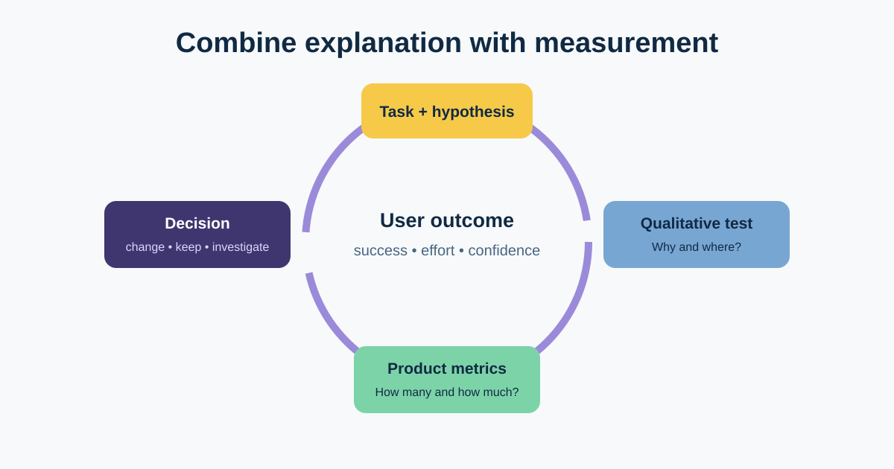
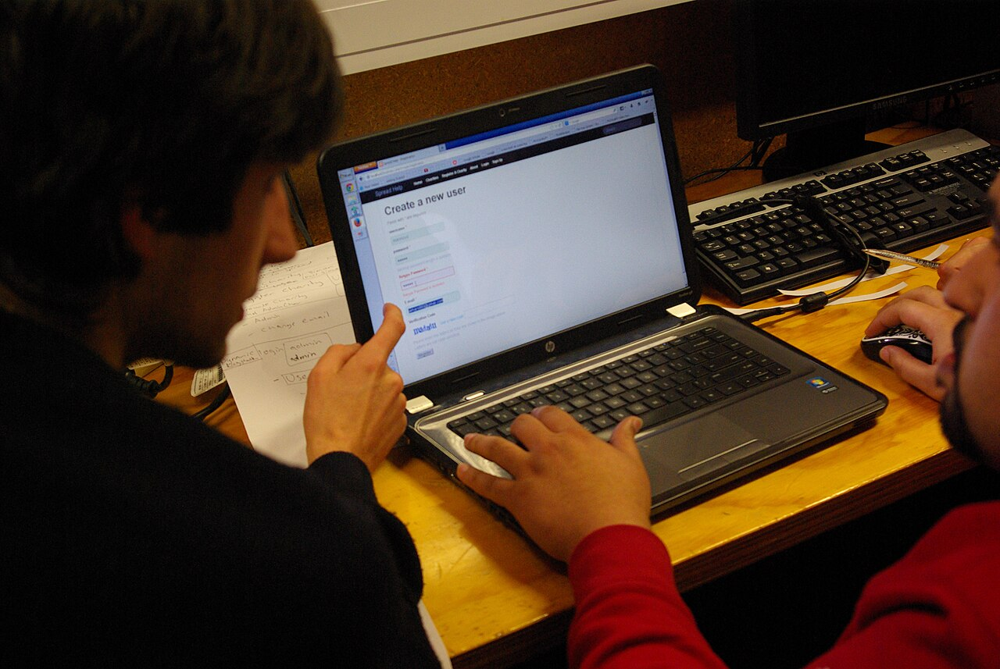

# Usability Testing and UX Metrics

Usability testing observes representative people attempting realistic tasks with a design or product. It reveals where the experience breaks and why. Product analytics then helps the team understand scale and monitor outcomes in the live journey.

For the return flow, we will test whether customers can find an eligible item, understand the result, submit once, and recover from courier failure. We will then connect findings to a funnel and product measures without pretending one metric explains the whole experience.



## 1. Define the test around tasks and decisions

Write realistic tasks without revealing the interface label:

> You received order 1842 yesterday, but one shirt is the wrong size. Find out whether you can send it back and begin the process. Stop when you believe the request exists.

Avoid “Click Return item and select courier,” which tests instruction-following rather than findability. Define success, partial success, critical errors, and what decision the session can influence.

| Test element | Returns example |
|---|---|
| Participants | Recent online shoppers matching relevant devices and access needs |
| Starting state | Signed-in test account with one eligible and one ineligible item |
| Tasks | Find eligibility; start return; explain confirmation; recover from courier failure |
| Observe | Route, words, hesitation, errors, recovery, confidence—not opinions alone |
| Decisions | Navigation label, reason copy, pending state, retry route |
| Exclusions | Refund speed and real courier performance are simulated |

## 2. Facilitate a think-aloud session



*A researcher and participant try a website. Photo by Samuel Mann, sourced from [Wikimedia Commons](https://commons.wikimedia.org/wiki/File:Project_User_Experience_Testing_(9719939867).jpg), licensed under CC BY 2.0.*

In a **think-aloud** study, ask participants to say what they are trying, noticing, and expecting. Explain that the product—not the participant—is being tested.

Use neutral prompts:

- “What are you looking for now?”
- “What do you expect will happen?”
- “Please keep telling me what you are thinking.”
- “What does this message mean to you?”

Do not teach the interface, defend the design, or ask leading questions. If a participant is completely stuck, record where and why before helping so the session can continue. Pilot the script to catch broken accounts, ambiguous tasks, and unrealistic data.

Obtain appropriate consent for observation and recording, minimise personal data, and provide accessible participation options.

## 3. Understand the “five users” guideline

Five participants is a practical starting point often used for an **iterative qualitative usability study with one reasonably similar user group**. It is not a universal law and does not make a result statistically representative.

Use more or separate rounds when:

- there are meaningfully different user groups, tasks, devices, languages, or access needs;
- the design is mature and remaining problems may be less common;
- the team needs quantitative estimates, benchmarks, or comparisons; or
- a safety, financial, legal, or high-impact decision requires stronger evidence.

Small iterative rounds can be valuable: test, fix important issues, and test again with new participants. For card sorting, quantitative usability, surveys, and experiments, sample planning follows different logic.

## 4. Analyse observations without counting theatre

Create an observation log by participant and task. Distinguish:

- **critical error:** prevents task completion or creates unacceptable harm;
- **difficulty:** delay, wrong route, repeated attempt, or assistance;
- **positive evidence:** correct understanding or efficient recovery; and
- **quote / explanation:** participant language that helps interpret behaviour.

“Three of five participants failed” describes this small study; it is not proof that exactly 60% of customers will fail. Use recurrence to prioritise investigation, then consider severity, business risk, and other evidence.

### Completed finding

| Field | Example |
|---|---|
| Observation | P01, P03, and P05 stopped after “Request received” and did not know courier booking had failed |
| Evidence | Session clips and notes; prototype did not show a persistent pending state |
| Impact | Customer may wait without action or submit again |
| Recommendation | Separate request creation from pickup-booking status; show reference and next update |
| Validate | Revised qualitative round; integration checks; monitor repeats and support contacts |

## 5. Build a product funnel with meaningful definitions

An illustrative return funnel could be:

```text
Eligible order viewed
→ Return journey started
→ Eligibility result understood
→ Request submitted
→ Pickup booked or pending path accepted
→ Return completed
→ Refund completed
```

For every event define actor, trigger, timestamp, identifiers, exclusions, deduplication, consent, retention, and owner. A funnel drop-off may be expected—for example, the customer learns the item is ineligible—or harmful. Pair events with outcome and qualitative evidence.

## 6. Connect UX measures to product outcomes

Use a balanced measurement plan:

| Layer | Illustrative measure | Caution |
|---|---|---|
| Task usability | Completion without help, critical errors, time, confidence | Quantitative claims need an appropriate study design and sample |
| Behaviour | Start-to-submit and submit-to-complete conversion | Define eligibility and duplicate sessions |
| User outcome | Customer understands status and next step | Combine behaviour with targeted survey or research |
| Business outcome | Fewer avoidable return-support contacts | Control for policy, season, and channel changes |
| Guardrails | Duplicate requests, complaints, inaccessible errors, operational exceptions | Never optimise conversion by hiding valid exits or risks |

The HEART framework—Happiness, Engagement, Adoption, Retention, and Task success—can help generate measures, but not every category belongs in every feature. Start with a product goal, identify a user signal, then define a metric.

Heatmaps can show aggregate pointer, tap, or scroll patterns depending on the tool. They do not reveal intent, comprehension, emotion, or causation. Treat them as one diagnostic input and review privacy and consent.

## 7. Reusable usability and measurement plan

```text
Decision and hypothesis:
User groups and recruitment criteria:
Prototype / build and known limitations:
Task scenarios and starting data:
Success, partial success, critical error, and stop rules:
Think-aloud prompts and post-task questions:
Consent, recording, privacy, compensation, accessibility:
Observation log and severity approach:
Session count rationale and limits:
Findings, evidence links, owners, and decisions:

Product goal and user signal:
Funnel events and exact definitions:
UX and product outcome measures:
Guardrails:
Segments and exclusions:
Baseline, review period, and decision threshold:
Instrumentation owner and data-quality checks:
Follow-up qualitative or quantitative research:
```

### Quick exercise

Write a think-aloud task for the courier-timeout scenario without naming the Retry control. Then define two observations, one funnel event, one outcome metric, and two guardrails that would show whether the revised pending state is safer.

## Further reading

- [Nielsen Norman Group: Usability Testing 101](https://www.nngroup.com/articles/usability-testing-101/)
- [Nielsen Norman Group: How Many Test Users in a Usability Study?](https://www.nngroup.com/articles/how-many-test-users/)
- [Google Research: HEART—Measuring the User Experience on a Large Scale](https://research.google/pubs/measuring-the-user-experience-on-a-large-scale-user-centered-metrics-for-web-applications/)

*Participant numbers, findings, events, and measures in this lesson are illustrative. Select methods and sample sizes from the decision, risk, population, and analysis needed.*
