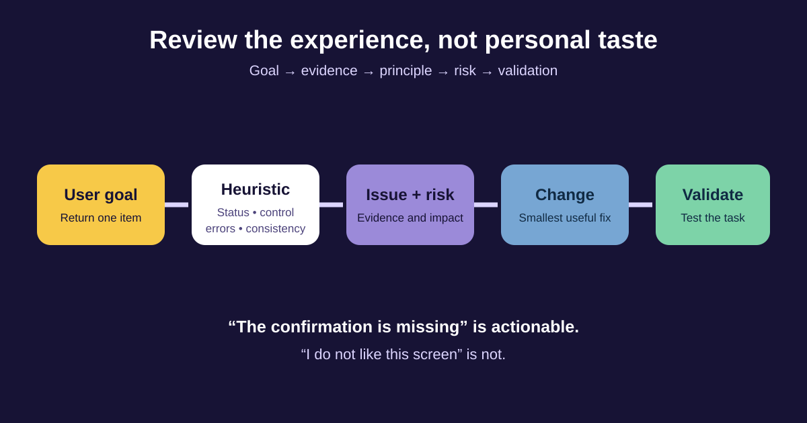

# UX Principles for Business Analysts

User experience (UX) is the whole experience a person has while trying to reach a goal—not just how a screen looks. A Business Analyst (BA) does not need to become a visual designer, but does need a reliable way to ask whether a proposed experience is understandable, efficient, recoverable, and inclusive.

This lesson uses an illustrative change to the BAB online shop: customers should be able to return one eligible item without contacting support. We will replace “I like it” feedback with observations the team can investigate and validate.



## 1. Start with the user’s goal

**User-centered design** keeps the user’s goal, context, capabilities, and evidence visible while the team makes decisions. It does not mean accepting every request or ignoring business constraints. It means testing whether the solution helps the intended users achieve a worthwhile outcome.

For the return journey, compare these framings:

| Convenience-first framing | User-centered framing |
|---|---|
| “Put the policy in a PDF because it already exists.” | “Help the customer know whether this item is eligible and what happens next.” |
| “Require all fields because operations might need them.” | “Ask only for information needed at this step; explain why sensitive data is required.” |
| “Hide the return action to reduce requests.” | “Make eligibility and alternatives clear while protecting the policy.” |

The BA asks: **Whose goal is this, in what context, and what evidence says the current experience fails?** Business outcomes still matter, but they should be connected to a genuine user outcome.

## 2. Treat cognitive load as a requirement risk

**Cognitive load** is the mental effort needed to understand information, remember details, compare choices, and decide what to do. “Fewer clicks” is not a universal rule: one crowded screen can be harder than three clear steps. Reduce unnecessary decisions, memory demands, repeated entry, and unfamiliar language.

In the return flow, the customer should not need to remember the order date, search a policy document, or calculate the deadline. The interface can show the eligible item, deadline, expected refund method, and next step. A confirmation step may add one click but prevent an expensive accidental return.

Useful BA questions include:

- What must the user remember from an earlier screen or channel?
- Which choices are relevant now, and which can wait?
- Does the interface use the customer’s words or internal status codes?
- Is repeated information prefilled safely, with a way to correct it?

## 3. Use Nielsen’s ten heuristics as review vocabulary

Jakob Nielsen’s heuristics are broad principles, not pass/fail regulations. Use them to locate risks and frame questions.

| Heuristic | Returns example | BA review question |
|---|---|---|
| Visibility of system status | Show that the request is being submitted | What feedback appears during delay? |
| Match with the real world | Say “Refund to your card,” not `PAYMENT_REVERSAL` | Will the user understand the words and order? |
| User control and freedom | Allow Back before final confirmation | Can an accidental action be cancelled or reversed? |
| Consistency and standards | Use the same “Return item” label everywhere | Are identical actions named and placed consistently? |
| Error prevention | Block duplicate submission while loading | Can the design prevent a costly mistake? |
| Recognition rather than recall | Display eligible orders instead of asking for an ID | What information is the user forced to remember? |
| Flexibility and efficiency | Let experienced users reuse a pickup address | Can frequent users finish faster without confusing beginners? |
| Aesthetic and minimalist design | Show policy details only when relevant | Is competing information hiding the primary decision? |
| Recognize, diagnose, recover from errors | Explain courier failure and offer retry/support | Does the message say what happened and what to do? |
| Help and documentation | Link concise return guidance in context | Is help searchable, specific, and close to the task? |

One issue can involve several heuristics. Do not inflate the count; record the clearest principle and the user impact.

## 4. Write feedback that a team can act on

Use this structure:

```text
Observation: What is present or missing?
Evidence or principle: What supports the concern?
User/business impact: What could happen?
Question or recommendation: What decision is needed?
Validation: What evidence would confirm the change?
```

### Completed review item

| Field | Example |
|---|---|
| Observation | After Confirm, the button remains active and no progress message appears |
| Principle | Visibility of system status; error prevention |
| Impact | A customer may submit twice and create duplicate operational work |
| Severity | High if duplicate requests can be created; confirm with logs and service behavior |
| Recommendation | Disable repeat submission, announce progress, and make the API idempotent |
| Validation | Keyboard and screen-reader check, slow-network test, duplicate-click integration test |

Severity is a team decision based on frequency, impact, recovery, and business risk—not the reviewer’s confidence.

## 5. Avoid common review mistakes

- Do not use heuristics as personal laws. A deliberate exception may be valid when evidence supports it.
- Do not jump from an observation to a redesign before confirming the cause.
- Do not evaluate only the happy path. Include loading, empty, error, disabled, and recovery states.
- Do not treat a heuristic review as user research. Experts can find likely problems; representative users show how the experience works in context.
- Do not use “fewer choices” to remove information people need for an informed or safe decision.

## 6. Reusable heuristic-review scorecard

```text
Journey and user goal:
User group and context:
Screen / state reviewed:
Observation:
Relevant heuristic:
Evidence already available:
Potential user and business impact:
Severity: low / medium / high, with reason
Recommendation or open question:
Owner of the decision:
Validation method:
Status and decision date:
```

### Quick exercise

Review an “item is not eligible” screen. Write one observation about the explanation, one about recovery, and one about consistency. For each, name the heuristic, possible impact, and evidence needed before changing the design.

## Further reading

- [Nielsen Norman Group: 10 Usability Heuristics for User Interface Design](https://www.nngroup.com/articles/ten-usability-heuristics/)
- [Nielsen Norman Group: How to Conduct a Heuristic Evaluation](https://www.nngroup.com/articles/how-to-conduct-a-heuristic-evaluation/)
- [ISO: Human-centred design for interactive systems (ISO 9241-210)](https://www.iso.org/standard/77520.html)

*The return policy, risks, and proposed controls are illustrative. Confirm actual rules, technical behavior, user evidence, and organizational accessibility obligations.*
