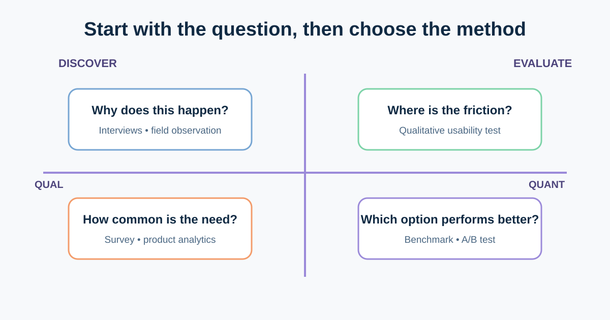
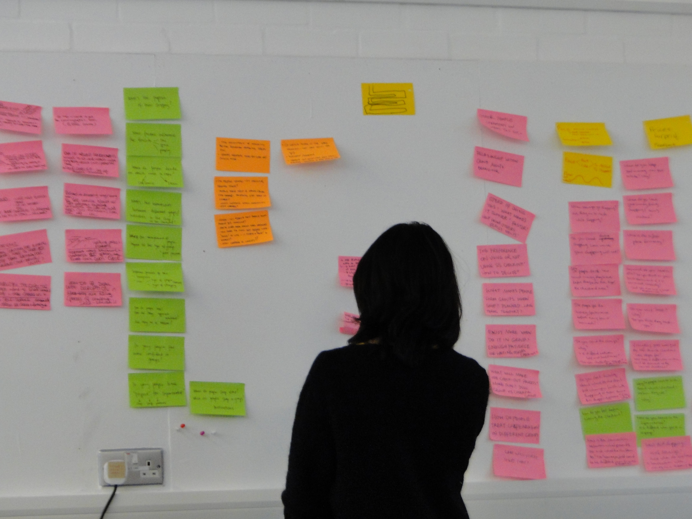

# UX Research and Evidence for Business Analysts

UX research reduces uncertainty about people, tasks, and product behaviour. It is not a ceremonial set of interviews before a team builds its preferred idea. A useful study starts with a decision, gathers evidence from appropriate participants, and makes its limits visible.

Our online shop sees many support contacts about returns. The team assumes customers cannot find the return action, but analytics alone cannot confirm why. We will plan research that can separate a navigation problem from policy confusion, missing orders, or technical failure.



## 1. Convert the solution request into a research question

“Should we add a large Return button?” starts with a solution. Better questions expose the uncertainty:

- What are customers trying to accomplish when they contact support?
- Where do they expect to find return eligibility and actions?
- Which step fails most often, for which customer group and device?
- Do customers understand the reason when an item is ineligible?

A research question should influence a real choice. Record the decision owner and what the team will do with different possible findings.

| Field | Returns example |
|---|---|
| Decision | Where and how should self-service returns begin? |
| Current evidence | Support tags show “return help”; funnel shows exits from Order details |
| Unknown | Cannot find the action, cannot understand eligibility, or cannot complete it? |
| Population | Customers with a delivered order in the last 45 days |
| Decision owner | Product owner with customer-service and policy input |

The dates, policy, and sample in this lesson are illustrative.

## 2. Know what qualitative and quantitative evidence can answer

**Qualitative research** explores why and how. Interviews, contextual inquiry, and moderated usability tests reveal behaviours, language, strategies, and breakdowns. A small sample can expose important patterns, but it does not estimate how common each pattern is across the whole customer base.

**Quantitative research** measures how many, how much, or how performance changes. Analytics, surveys, experiments, and quantitative usability benchmarks need clear definitions and enough observations. A drop-off identifies a location; it rarely explains the cause by itself.

| Question | Useful method | Limitation to state |
|---|---|---|
| Why do customers contact support? | Interview plus support-ticket review | Recall and ticket categorisation may be incomplete |
| Where do users hesitate in a proposed flow? | Moderated think-aloud usability test | Findings depend on tasks and participant fit |
| How many eligible customers start a return? | Instrumented funnel | Tracking does not prove intent or cause |
| Which of two labels improves completion? | Controlled A/B test | Requires traffic, guardrails, and a meaningful outcome |

Use mixed evidence when the decision warrants it: analytics can locate a problem, interviews can explain context, and a usability test can evaluate a proposed response.

## 3. Recruit for the behaviour, not a vague demographic

Recruit people who resemble the relevant users and context. For the return study, useful criteria might include recent delivery, mobile or desktop use, first-time and repeat returners, and people who use assistive technology. Do not recruit only colleagues who know the product vocabulary.

Protect participants:

- explain purpose, recording, storage, and withdrawal;
- collect the minimum personal data needed;
- use safe test accounts rather than real order or payment data;
- provide a clear contact and compensation process; and
- follow the organisation’s research, privacy, and consent rules.

If one user group has substantially different tasks or access needs, plan it explicitly rather than hiding the difference inside one average persona.

## 4. Capture observations before interpretation



*Research notes being synthesised with an affinity diagram. Photo by Kalsau, sourced from [Wikimedia Commons](https://commons.wikimedia.org/wiki/File:DesignEthnographyStudioLifeAnalysis2.jpg), licensed under CC BY 2.0.*

Separate three layers:

1. **Observation:** “Participant opened Help before Order details.”
2. **Interpretation:** “They may expect returns to be a support topic.”
3. **Decision or next question:** “Test a Returns link in both locations; check whether duplication confuses navigation.”

Quotes are evidence of what one person said, not proof of a universal need. Cluster observations across sessions, keep contradictory evidence, and trace every theme back to source notes.

## 5. Use a research plan that fits the decision

### Completed plan

| Plan item | Example |
|---|---|
| Research question | How do customers find and interpret self-service return eligibility? |
| Method | 6 moderated qualitative sessions plus funnel and support-tag review |
| Participants | Recent delivered-order customers; mix of device, experience, and access needs |
| Tasks | Find eligibility, explain the result, begin one eligible return, recover from courier failure |
| Evidence captured | Route taken, words used, errors, recovery, confidence; no real payment data |
| Analysis | Observation log, themes with source counts, contradictions, severity hypotheses |
| Decision | Navigation label/location and explanations to prototype next |
| Limitation | Small qualitative sample; prevalence requires product data or a larger study |

## 6. Avoid predictable research failures

- Leading questions such as “Was the new button easy?” invite agreement. Ask the participant to perform a realistic task.
- Personas written before research turn assumptions into fictional certainty.
- Heatmaps show pointer or scroll activity, not attention, comprehension, or motivation.
- A/B tests optimise only the chosen metric; add guardrails for errors, complaints, accessibility, and downstream operations.
- Research is not approval theatre. Report evidence that challenges the proposed feature.

## 7. Reusable UX research plan

```text
Decision and owner:
Research question:
Known evidence:
Assumptions to test:
Method and why it fits:
Target participants and exclusions:
Tasks / prompts:
Consent, privacy, and accessibility needs:
Data to capture:
Analysis method:
Decision thresholds or possible responses:
Limitations:
Timeline and reviewers:
```

### Quick exercise

The return funnel loses 35% of sessions on the eligibility screen. Write two competing explanations, one qualitative method and one quantitative check for each, and the decision each result would change. Treat the 35% as an illustrative figure, not a benchmark.

## Further reading

- [Nielsen Norman Group: When to Use Which UX Research Methods](https://www.nngroup.com/articles/which-ux-research-methods/)
- [Nielsen Norman Group: Quantitative vs. Qualitative Usability Testing](https://www.nngroup.com/articles/quant-vs-qual/)
- [UK Government Service Manual: Planning user research](https://www.gov.uk/service-manual/user-research/plan-user-research-for-your-service)

*Confirm consent, privacy, retention, recruitment, and research-governance requirements with the responsible teams in your organisation.*
