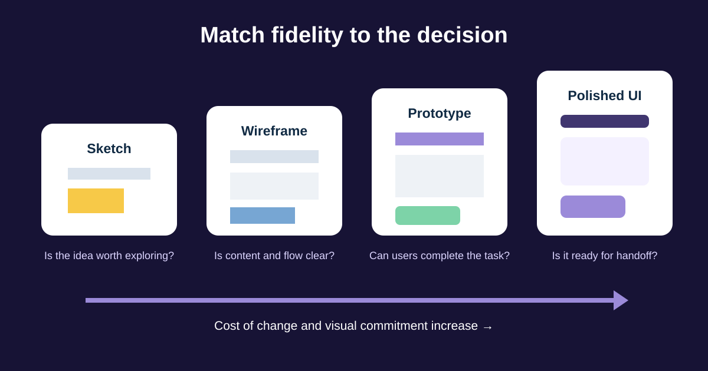

# Reading Wireframes, Prototypes, Figma, and Design Systems

Design artifacts answer different questions at different levels of detail. A Business Analyst should know what is ready to review, what remains a hypothesis, and how to connect feedback to requirements and user evidence.

We will review a return flow from rough structure to clickable prototype. The goal is not to learn visual-design production; it is to review the customer journey, rules, content, states, and decisions at the right time.



## 1. Match fidelity to the decision

| Artifact | Useful for | Do not assume |
|---|---|---|
| Sketch | Exploring alternatives and scope cheaply | Exact layout, content, or feasibility |
| Low-fidelity wireframe | Content hierarchy, actions, navigation, major states | Final typography, colour, spacing, or micro-interactions |
| High-fidelity mockup | Visual hierarchy, realistic content, components, responsive intent | Every interaction works or has been user-tested |
| Clickable prototype | Flow, transitions, comprehension, early usability testing | Production data, performance, security, or complete accessibility |


*A paper wireframe used to explore layout. Photo by Fernando Mafra, sourced from [Wikimedia Commons](https://commons.wikimedia.org/wiki/File:Wireframe_(5019534612).jpg), licensed under CC BY-SA 2.0.*

High fidelity can create false confidence. Ask what decision the artifact supports and which behaviours are simulated or missing.

## 2. Read the basic Figma structure

Figma terminology changes over time, so use the current file and official help as the source of truth. The concepts a BA commonly encounters are:

- **Page:** a workspace section inside a file, often used for flows or work stages.
- **Frame:** a container representing a screen, region, or component boundary.
- **Layer:** text, shape, image, or nested object inside a frame.
- **Component:** a reusable design object such as a button or alert.
- **Instance:** a connected use of a component, with permitted overrides.
- **Variant / property:** a controlled option such as size, state, or icon.
- **Prototype flow:** connected frames and interactions starting from a defined point.

When a designer points to the design system, they are showing the shared components, styles, tokens, usage rules, and documentation intended to keep products consistent. A new one-off button may be a deliberate exception—or accidental duplication. Ask which.

## 3. Follow the prototype as a task

Do not click randomly. Start from a named scenario:

```text
User: Customer with one eligible delivered item
Goal: Request courier pickup and receive a reference
Starting point: Order details
Expected end: Return created; next step and status visible
Exception to inspect: Courier booking unavailable
```

Record each frame, action, decision, and state. Check Back behaviour, repeated clicks, cancellation, validation, focus movement, and whether the prototype includes realistic data and long Arabic content.

A prototype connection proves that a demonstration can move between frames. It does not prove that business rules, backend behaviour, analytics, or accessibility are implemented.

## 4. Comment with context and one decision per thread

A useful comment includes location, scenario, evidence or requirement, impact, and a question:

> Return confirmation / mobile: after courier failure, the prototype returns to the reason screen and loses the pickup choice. Requirement RET-07 says the request should be preserved. Should this state show the saved request and retry route? Please link the agreed recovery behaviour.

Avoid comments such as “Make this pop,” “Move the button left,” or “This feels confusing” unless you explain the observed issue. Mentioning a possible solution is fine, but keep it separate from the problem and outcome.

Close the loop by recording the decision in the maintained requirement or decision log; a resolved comment is not always durable documentation.

## 5. Review design-system use without policing pixels

Check:

- Is this an approved component or a new pattern needing review?
- Are default, hover, focus, active, loading, disabled, success, and error variants defined where relevant?
- Does content fit component limits in English and Arabic?
- Are spacing, colour, typography, and icon values linked to named tokens rather than unexplained one-offs?
- Does the component documentation cover when not to use it?

The BA owns clarity of outcome, rules, content meaning, exceptions, traceability, and acceptance. The designer owns design craft; engineering owns implementation choices. These boundaries overlap through collaboration rather than a one-way approval gate.

## 6. Completed prototype-review checklist

| Area | Return-flow check | Result |
|---|---|---|
| Scope | One eligible item; exchange and multi-item returns excluded | Confirmed |
| Main flow | Order → item → reason → pickup → confirmation | Present |
| Rules | Eligibility reason matches policy source | Owner review needed |
| States | Loading and courier error included | Duplicate-submit state missing |
| Content | Refund wording uses customer language | Arabic long-text check open |
| Accessibility | Keyboard order and announced status | Must validate in implementation |
| System | Existing Alert and Button components used | Confirmed |
| Evidence | Prototype test task and participant criteria | Planned |

## 7. Reusable design-review template

```text
Flow / frame link and version:
User, goal, and starting state:
Requirement / rule / evidence:
Main path reviewed:
Alternative and failure paths:
Missing or unclear states:
Content and localization questions:
Accessibility and responsive questions:
Design-system component / token questions:
Analytics and acceptance evidence:
Comment: observation → impact → question
Decision, owner, date, and maintained source:
```

### Quick exercise

Review a prototype that shows success but no loading or error state. Write three comments: one about duplicate submission, one about recovery, and one about keyboard or screen-reader feedback. Keep each comment tied to one decision.

## Further reading

- [Figma: Guide to prototyping](https://help.figma.com/hc/en-us/articles/360040314193-Guide-to-prototyping-in-Figma)
- [Figma: Components, styles, and shared library best practices](https://www.figma.com/best-practices/components-styles-and-shared-libraries/)
- [W3C WAI: Designing for Web Accessibility](https://www.w3.org/WAI/tips/designing/)

*Figma permissions and features vary by plan and may change. Confirm current product behaviour in Figma’s official documentation.*
