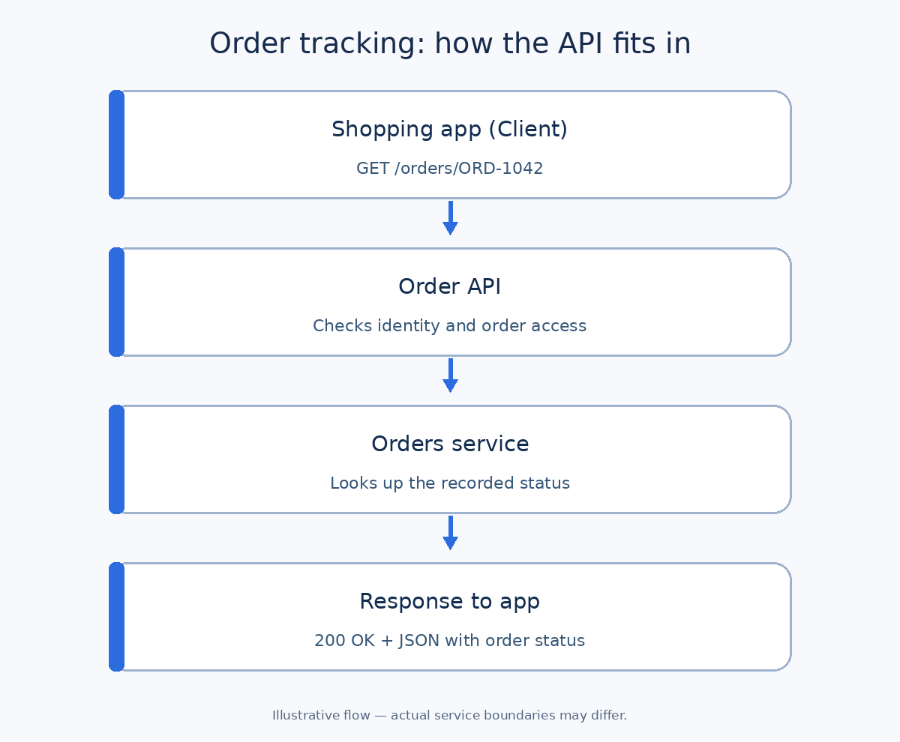

# APIs: A Practical Tutorial for Business Analysts

An **application programming interface (API)** is an agreed way for one piece of software to ask another for data or an action. When a shopping app shows an order's delivery status, it may ask an order system through an API instead of reading that system's database directly.

For a business analyst (BA), the important question is: **What must the two systems agree on so the customer gets the right result, including when something goes wrong?** You do not need to write the API to answer it.

## The basic idea

Many web APIs use **HTTP**, in which a **client** sends a request to a **server**, and the server returns a response. An API is a broader concept; not every API uses HTTP. This tutorial focuses on an illustrative HTTP API.

| Term | Plain meaning | In our example |
| --- | --- | --- |
| Endpoint | An address for a capability | `/orders/{orderId}` |
| Method | The requested kind of action | `GET` reads an order |
| Request | What the client sends | “Show order `ORD-1042`” |
| Parameter | A value supplied in the request | `orderId = ORD-1042` |
| Header | Request or response metadata | `Authorization` carries a credential |
| Body | The main data sent or returned | JSON with the order status |
| Status code | A numeric summary of the result | `200` means the request succeeded |
| API contract | The documented agreement between systems | Inputs, outputs, errors, rules, and access |

**JSON** (JavaScript Object Notation) is a common text format for structured data. In a JSON object, a field such as `"status": "SHIPPED"` pairs a name with a value. The HTTP status code `200` describes the *request outcome*; `"SHIPPED"` describes the *business state of the order*. Do not confuse the two.

## Practical example: tracking an online order

**Illustrative project:** A retailer's app lets a signed-in customer view the status of their own order. An order service stores that status. The IDs, statuses, and rules below are teaching assumptions; a real team must confirm them.



1. The app asks the API for order `ORD-1042`.
2. The API checks who is asking and whether they can see this order.
3. The order service supplies the latest recorded status.
4. The API sends a response the app can show to the customer.

### Read a request and response

```http
GET /orders/ORD-1042 HTTP/1.1
Authorization: Bearer <access-token>
Accept: application/json
```

`GET` asks to read; `/orders/ORD-1042` identifies the order. The token is a placeholder, not a real credential. In this example the customer is already signed in.

```http
HTTP/1.1 200 OK
Content-Type: application/json

{
  "orderId": "ORD-1042",
  "status": "SHIPPED",
  "lastUpdatedAt": "2026-09-24T10:30:00Z",
  "estimatedDeliveryDate": "2026-09-27"
}
```

The `Z` denotes UTC time. The app might display **“Shipped”** and **“Estimated delivery: 27 September”**. The team must decide which timezone and date format the customer sees, and whether an estimate may be absent.

### Other outcomes to define

| Situation | Illustrative HTTP result | What the app should do |
| --- | --- | --- |
| The customer's order is found | `200 OK` | Show status and update time. |
| No valid sign-in credential | `401 Unauthorized` | Ask the customer to sign in again. |
| Signed-in user lacks access | `403 Forbidden` | Do not reveal order details. |
| Order cannot be found | `404 Not Found` | Show a helpful message; let the user return to orders. |
| Service temporarily fails | `503 Service Unavailable` | Explain that tracking is unavailable; offer retry. |

These are **proposed** behaviors. Some teams return `404` for an inaccessible order to avoid confirming its existence. Agree on that policy with security and engineering, then document it consistently. A `200` response also does not prove the order data is fresh; decide what “latest” means.

## Where the BA adds value

The BA turns a customer need into a testable agreement. For this flow, confirm:

1. **Business goal:** Which customer question does tracking answer? Is status alone enough?
2. **Source and meaning:** Which system owns the status? What do `PLACED`, `PACKED`, `SHIPPED`, and `DELIVERED` mean? Are transitions allowed to move backward?
3. **Access:** Can customers see only their orders? Can support staff view orders for a customer, and under what controls? Authentication checks identity; authorization checks permission.
4. **Data and privacy:** Which fields are needed on the screen? Should address or payment data be excluded from this response?
5. **Exceptions:** What happens for a canceled order, unknown ID, delayed update, outage, or missing estimate?
6. **Experience and operations:** What should the customer see, how quickly should changes appear, and who investigates mismatches?

### A small requirements artifact

| Item | Proposed requirement for `GET /orders/{orderId}` |
| --- | --- |
| Actor and trigger | Signed-in customer opens an order's tracking screen. |
| Input | `orderId` from the selected order; valid access credential. |
| Business rule | Return details only if the order belongs to that customer. |
| Success | Return ID, status, update time, and optional delivery estimate. |
| Error behavior | Agree on `401`, `403`/`404`, and temporary-failure responses. |
| Open decisions | Status vocabulary; data freshness target; timezone; access-denial policy. |

**Example acceptance criteria:** Given a signed-in customer viewing their own shipped order, when the app requests that order, then it shows `SHIPPED` and the last update time. Given a customer requests another person's order, then the response reveals no order details. These criteria still need real test data and agreement on the access-denial code.

## Reading API documentation without coding

An **OpenAPI description** can list paths, methods, parameters, request bodies, responses, and security rules. For this example, find `GET /orders/{orderId}`, then check the path parameter, success response schema, error responses, and required security. A reference page describes the proposed or implemented interface; confirm which version and environment it describes before treating it as approved behavior.

`GET` commonly reads data, `POST` commonly submits data for processing or creation, `PUT` commonly replaces a resource, `PATCH` changes part of it, and `DELETE` removes one. The exact business effect belongs in the API contract; a method name alone is insufficient.

### Common mistakes

- Writing only the happy path and leaving access, missing data, and outages undefined.
- Treating a field name as a business definition: `status` still needs an agreed vocabulary.
- Assuming a successful HTTP response means the business process is complete.
- Copying a real access token, customer record, or payment detail into a tutorial or ticket.
- Assuming a backend field should automatically be visible to every user.

## Reusable BA checklist

Copy this for each important API operation:

```text
Business outcome:
Actor and trigger:
API operation (method + path):
Owner / source of truth:
Input fields and validation:
Output fields and business meanings:
Authentication and authorization:
Success and error scenarios:
Freshness / performance expectation:
Customer-facing behavior:
Open questions and decision owner:
Acceptance criteria and test examples:
```

**Quick exercise:** The order is `DELIVERED`, but the app still displays `SHIPPED`. List three questions you would ask. Possible answers: Which system owns the status? When did that system record `DELIVERED`? Is there caching or a delayed sync between the order service and app? Then decide which evidence would settle each question.

## Further reading

- [MDN: Overview of HTTP](https://developer.mozilla.org/en-US/docs/Web/HTTP/Guides/Overview)
- [MDN: HTTP request methods](https://developer.mozilla.org/en-US/docs/Web/HTTP/Reference/Methods) and [status codes](https://developer.mozilla.org/en-US/docs/Web/HTTP/Reference/Status)
- [OpenAPI Specification](https://swagger.io/specification/)
- [OWASP API Security Top 10](https://owasp.org/www-project-api-security/)
